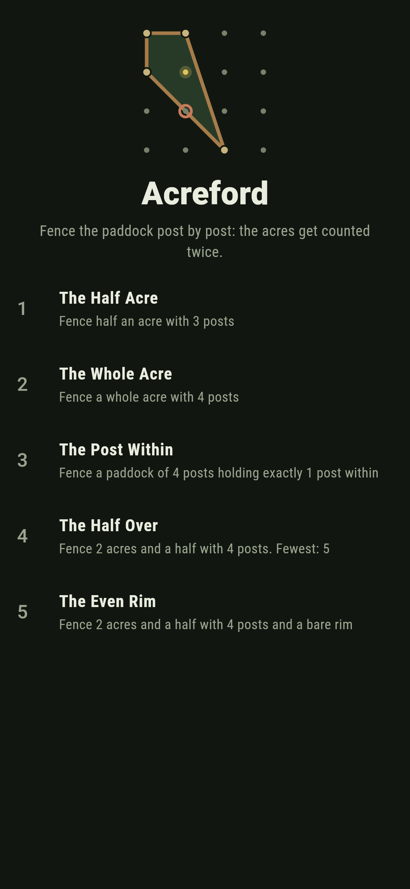
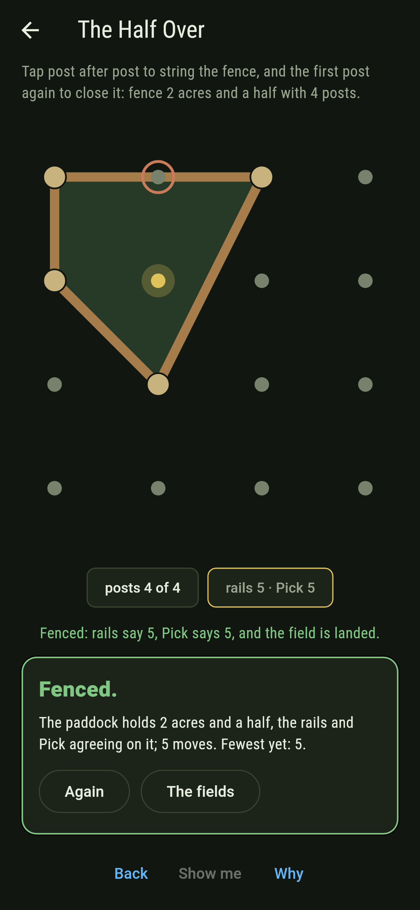
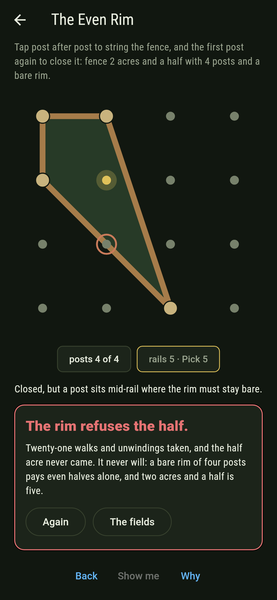
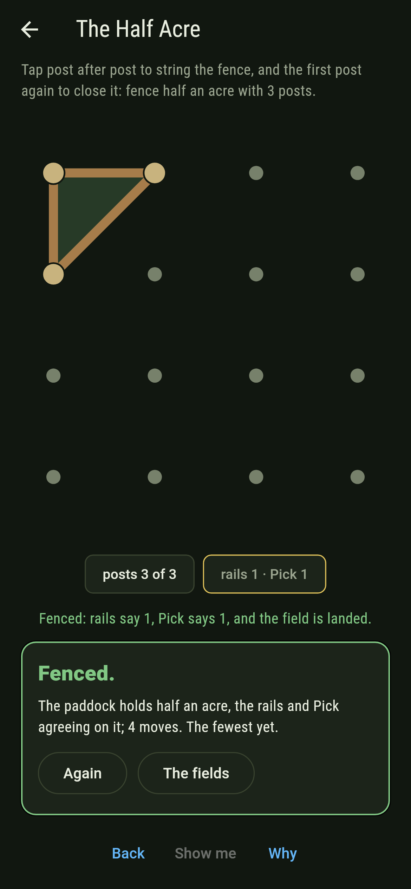
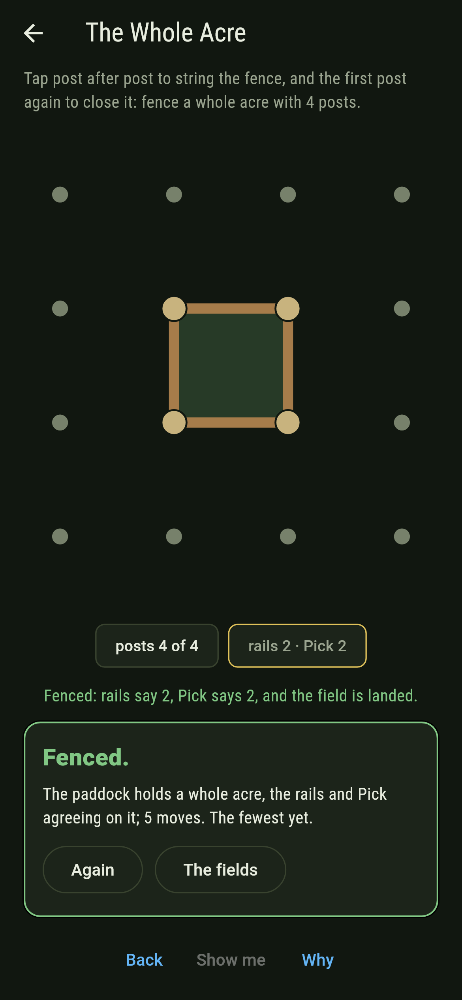
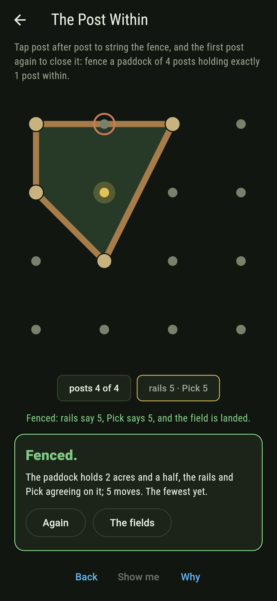
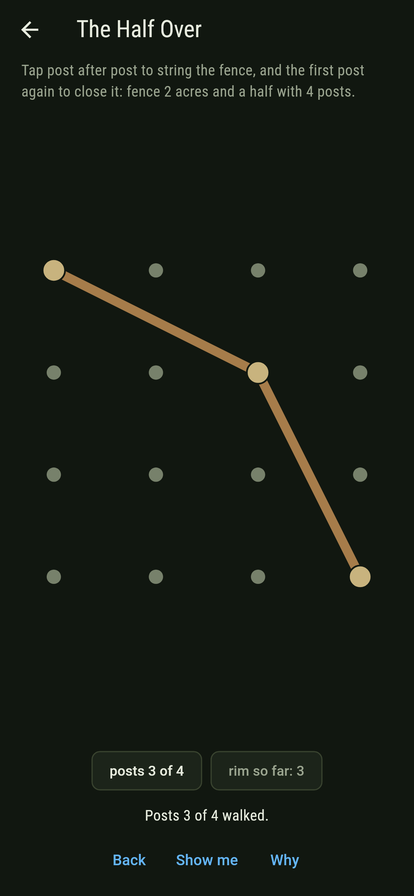
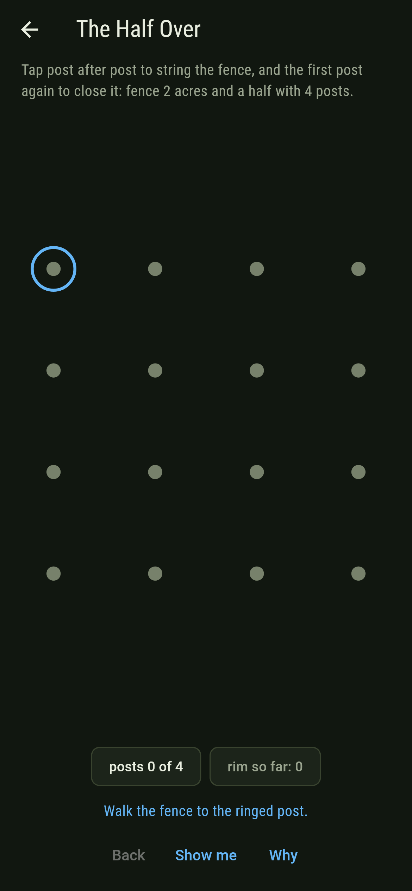
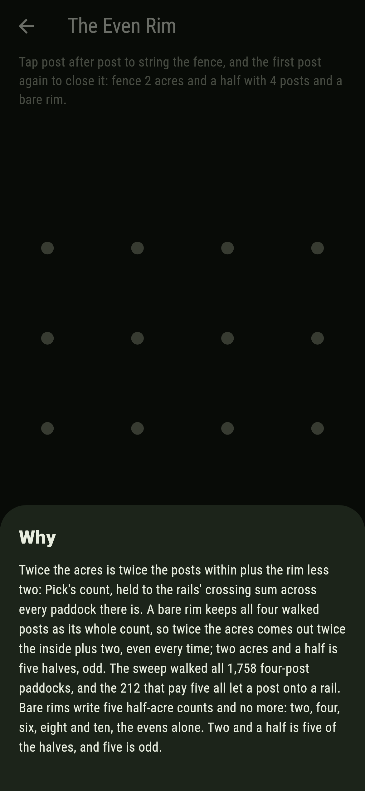

# Acreford


Posts on a four-by-four field, a fence walked post to post and
closed. The acres inside get counted twice: once by the rails
alone, their crossing sum walked rail by rail, and once by
Pick's 1899 reckoning, twice the posts within plus the rim less
two. Two acres and a half from four posts always drops a post
onto a rail, and the reason is one line of arithmetic.

## The fields

1. **The Half Acre** - fence half an acre with 3 posts
2. **The Whole Acre** - fence a whole acre with 4 posts
3. **The Post Within** - fence a paddock of 4 posts holding exactly 1 post within
4. **The Half Over** - fence 2 acres and a half with 4 posts
5. **The Even Rim** - fence 2 acres and a half with 4 posts and a bare rim

The Half Acre is the least any paddock holds, and only three
posts can hold so little. The Whole Acre always comes bare,
Pick leaving no room for a post inside or on a rail. The Post
Within makes the acres read the rim exactly. The Half Over
drops a post onto a rail every one of its 212 ways, and The
Even Rim asks for the same half acre without that post: labeled
hopeless on its tile, and the why hands over the arithmetic.

## Two voices

The game never asserts what it has not computed, and it computes
everything at least twice:

* **The rails** sum their own crossings as the fence walks,
  wall to wall, and the chip under the field speaks it the
  moment the paddock closes.
* **Pick's count** reads the posts instead: the gold ones held
  within twice over, plus the rim, walked corners and caught
  mid-rail posts both, less two. The sweep walks all 516
  three-post and 1,758 four-post paddocks and the two counts
  agree on every one.

`tool/check_acres.dart` runs both, holds the bare-rim and
mid-rail facts besides, and refuses the bake on any
disagreement.

## The checker's ledger

What `dart run tool/check_acres.dart` printed for the build
this README shipped with, word for word:

```
every paddock of the field walked, 516 of three posts and 1,758 of four: the rails' crossing sum and Pick's post count agree on every one, a bare rim of four posts writes two, four, six, eight or ten half-acres and nothing else, and all 212 fences of two acres and a half let a post onto a rail

 1 The Half Acre      fence half an acre with 3 posts: 124 paddocks of the sweep land it
 2 The Whole Acre     fence a whole acre with 4 posts: 225 paddocks of the sweep land it
 3 The Post Within    fence a paddock of 4 posts holding exactly 1 post within: 456 paddocks of the sweep land it
 4 The Half Over      fence 2 acres and a half with 4 posts: 212 paddocks of the sweep land it
 5 The Even Rim       fence 2 acres and a half with 4 posts and a bare rim: none of the 1,758, and Pick said so first
```

## Screenshots

| The fieldland | The half over | The even rim admitted |
| --- | --- | --- |
|  |  |  |

| The half acre | The whole acre | The post within | Mid-walk | Show me | The why |
| --- | --- | --- | --- | --- | --- |
|  |  |  |  |  |  |

Screenshots are drawn by `test/showcase_test.dart` at real phone
sizes with the app's own painter, then copied into `docs/` as
they came out; every post in them was tapped, so nothing
pictured is a paddock the game could not reach. The logo and
every launcher icon come out of `test/mark_test.dart` the same
way: the mark is the half over itself, one post held gold and
one caught on the rail.

## Building

```
flutter test          # 54 tests, the sweep among them
dart run tool/check_acres.dart
flutter build apk     # or: flutter build ios
```
