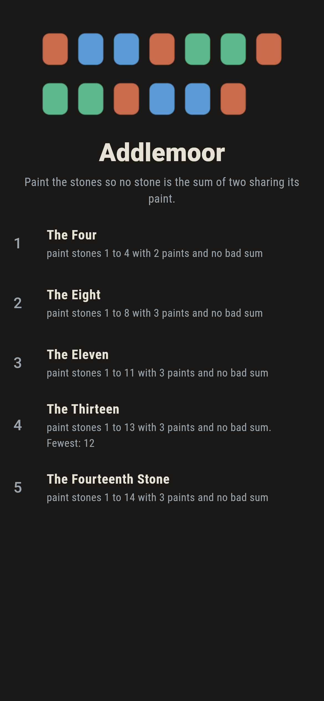
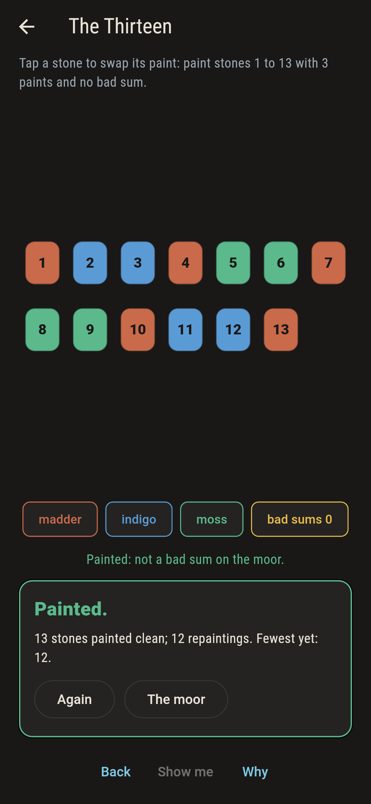
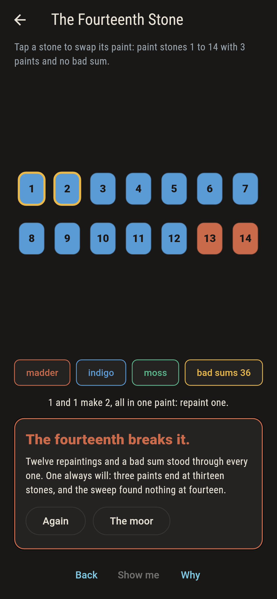
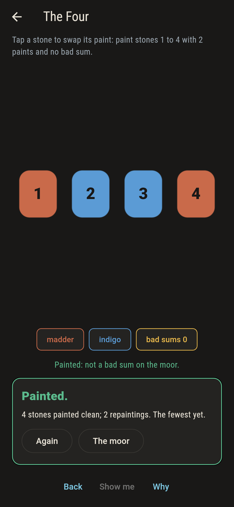
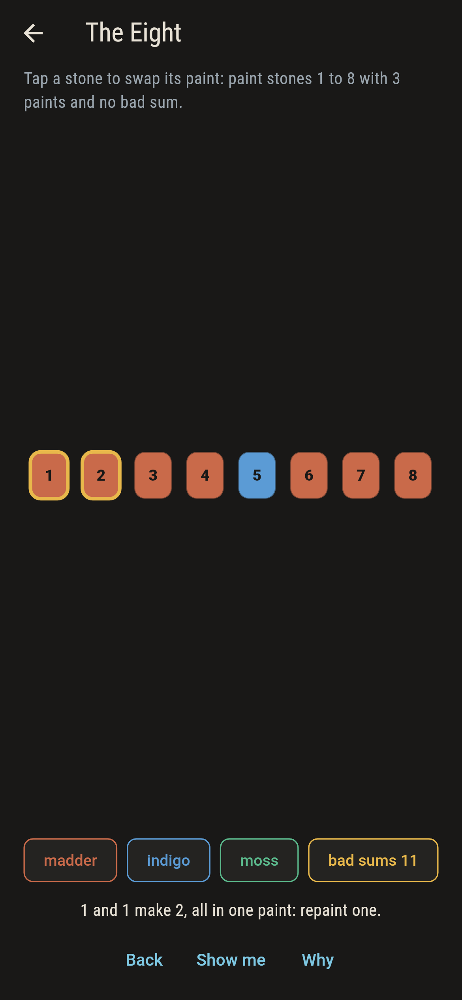
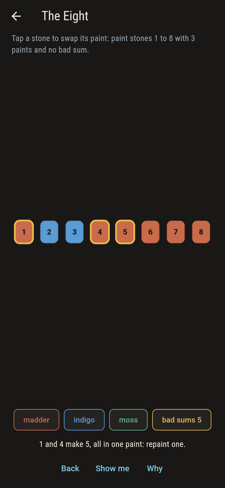
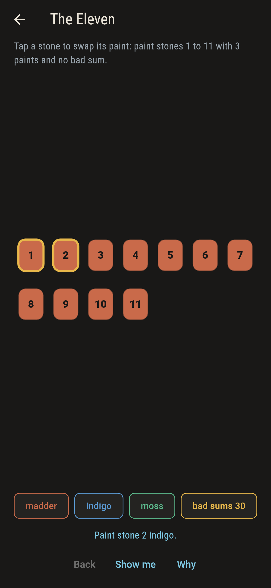
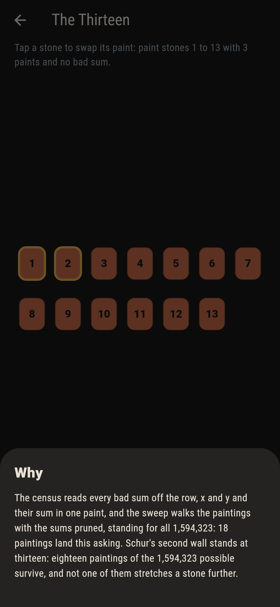

# Addlemoor


Numbered stones on a moor, each painted madder, indigo or moss,
and one rule: no stone may be the sum of two stones sharing its
paint, the same stone counted twice allowed. That is Schur's
problem, and the walls stand exactly where he left them: two
paints die at the fifth stone, three at the fourteenth, and the
counts at the walls are exact.

## The moors

1. **The Four** - paint stones 1 to 4 with 2 paints and no bad sum
2. **The Eight** - paint stones 1 to 8 with 3 paints and no bad sum
3. **The Eleven** - paint stones 1 to 11 with 3 paints and no bad sum
4. **The Thirteen** - paint stones 1 to 13 with 3 paints and no bad sum
5. **The Fourteenth Stone** - paint stones 1 to 14 with 3 paints and no bad sum

The field thins as the row grows: 288 clean paintings at eight
stones, 186 at eleven, 18 at thirteen, none at fourteen. The two
clean fours are each other's swap, and not one of the eighteen
clean thirteens takes a fourteenth stone in any paint: the wall
is not just there, it is sheer.

## Two voices

The game never asserts what it has not computed, and it computes
everything twice:

* **The census** reads every bad sum off the row, x and y and
  their sum in one paint, and rings the first one gold.
* **The sweep** walks the paintings with the bad sums pruned as
  it goes, standing for every painting there is, 16 to
  4,782,969 by moor, and counts the survivors.

`tool/check_moors.dart` runs both, checks the walls from both
sides, and refuses the bake on any disagreement.

## The checker's ledger

What `dart run tool/check_moors.dart` printed for the build this
README shipped with, word for word:

```
every painting walked with the bad sums pruned: two paints carry four stones exactly two ways and die at five, three paints thin from 288 at eight to 186 at eleven to 18 at thirteen and to nothing at fourteen, and not one of the eighteen thirteens takes a fourteenth stone in any paint

 1 The Four             paint stones 1 to 4 with 2 paints and no bad sum: 2 paintings of the sweep land it
 2 The Eight            paint stones 1 to 8 with 3 paints and no bad sum: 288 paintings of the sweep land it
 3 The Eleven           paint stones 1 to 11 with 3 paints and no bad sum: 186 paintings of the sweep land it
 4 The Thirteen         paint stones 1 to 13 with 3 paints and no bad sum: 18 paintings of the sweep land it
 5 The Fourteenth Stone paint stones 1 to 14 with 3 paints and no bad sum: none, which is Schur's wall standing where he left it
```

## Screenshots

| The moorland | The thirteen painted | The fourteenth admitted |
| --- | --- | --- |
|  |  |  |

| The four | A bad sum ringed | Mid-painting | Show me | The why |
| --- | --- | --- | --- | --- |
|  |  |  |  |  |

Screenshots are drawn by `test/showcase_test.dart` at real phone
sizes with the app's own painter, then copied into `docs/` as
they came out; every stone in them was repainted by taps, so
nothing pictured is a moor the game could not reach. The logo and
every launcher icon come out of `test/mark_test.dart` the same
way: the mark is one of the eighteen thirteens.

## Building

```
flutter test          # 43 tests, the sweep among them
dart run tool/check_moors.dart
flutter build apk     # or: flutter build ios
```
