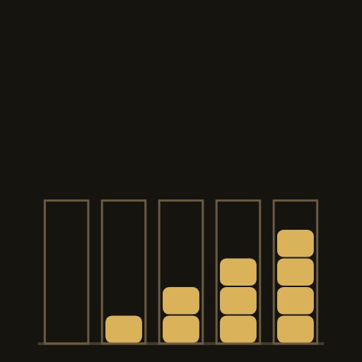
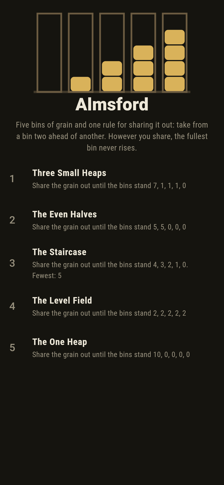
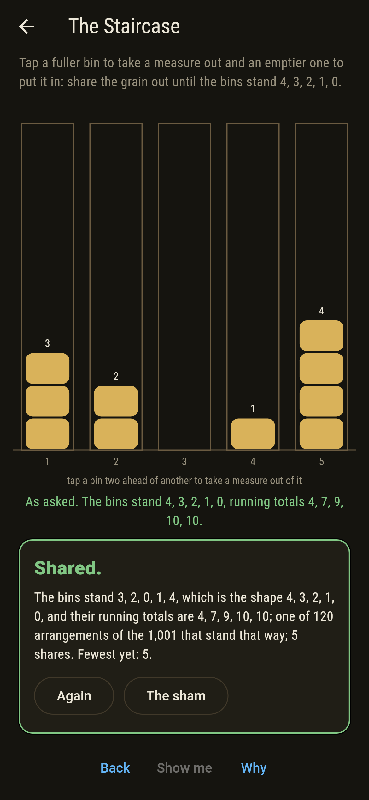
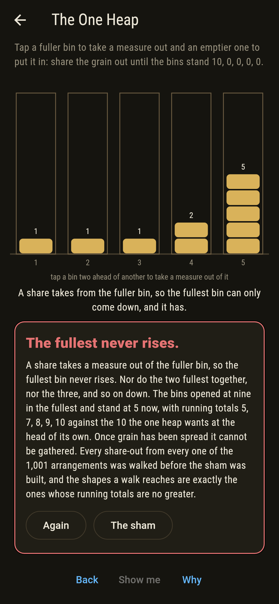
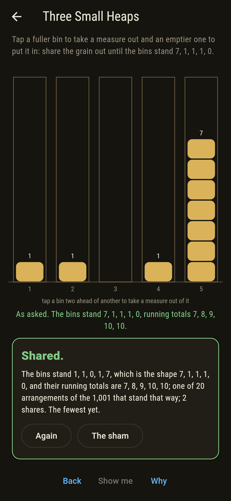
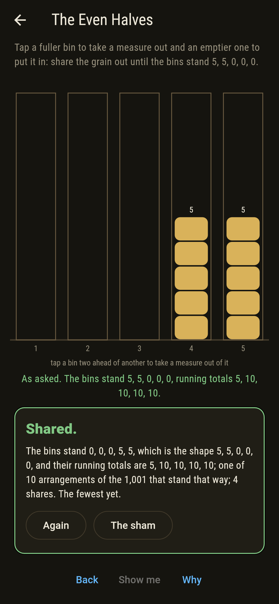
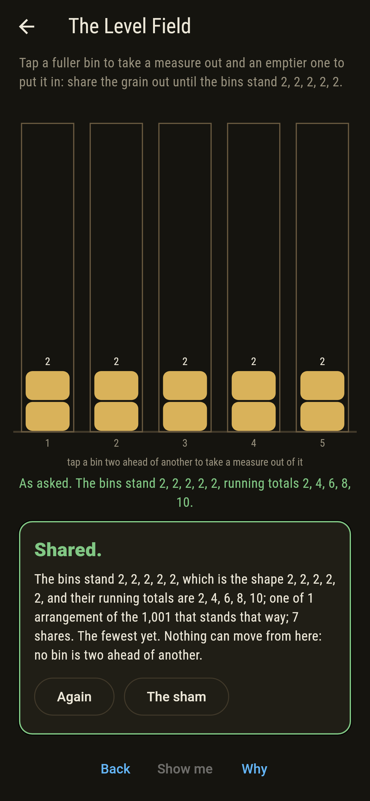
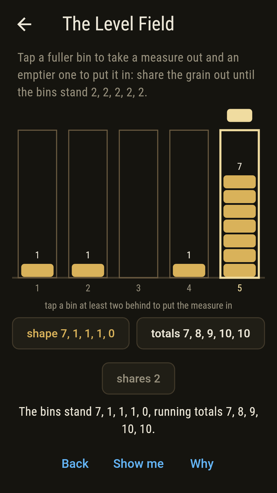
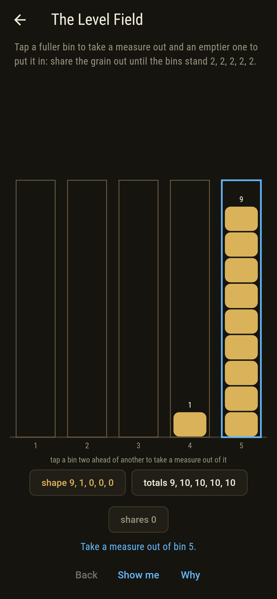
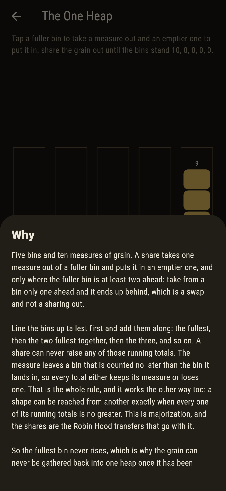

# Almsford



Five bins at the almshouse and ten measures of grain between them. A
share takes one measure out of a fuller bin and puts it in an emptier
one, and only where the fuller bin is at least two ahead: take from a
bin only one ahead and it ends up behind, which is a swap and not a
sharing out. Tap a bin to lift a measure and another to put it down.

Line the bins up tallest first and add them along, the fullest, then
the two fullest together, then the three, and so on. A share can never
raise any of those running totals, and that is the whole of what a
share-out can do.

## The asks

1. **Three Small Heaps** - share the grain out until the bins stand 7, 1, 1, 1, 0
2. **The Even Halves** - share the grain out until the bins stand 5, 5, 0, 0, 0
3. **The Staircase** - share the grain out until the bins stand 4, 3, 2, 1, 0
4. **The Level Field** - share the grain out until the bins stand 2, 2, 2, 2, 2
5. **The One Heap** - share the grain out until the bins stand 10, 0, 0, 0, 0

The go opens with nine measures in one bin and one in another. Two
shares reach the three small heaps, four the even halves, five the
staircase and seven the level field, which is as far as any shape lies.
The staircase is the commonest of them, 120 of the 1,001 arrangements,
since all five heights differ and every ordering of the bins counts;
the level field is the rarest, one arrangement, and once the grain is
standing that way nothing can move at all. The One Heap is labeled
hopeless on its tile, and the card at the end of the ask says why on a
finger.

## Why the fullest bin never rises

A share takes a measure out of the fuller bin. So the fullest bin can
only come down or stay. The same goes for the two fullest together, and
the three, and every running total down the line: the measure leaves a
bin counted no later than the bin it lands in, so each total either
keeps its measure or loses one.

That is majorization, and the shares are the Robin Hood transfers that
go with it. It works the other way too, which is the part worth having:
a shape can be reached from another exactly when every one of its
running totals is no greater. So the level field, whose totals are as
small as they can be, can always be reached and never left, and the one
heap, whose totals are as large as they can be, can be reached from
nothing but itself.

## Two voices

The game never asserts what it has not computed, and it computes
everything at least twice:

* **The walk** starts from an arrangement and makes every share there
  is, over and over, until no new arrangement turns up. It moves grain
  and counts nothing.
* **The running totals** move no grain at all. They sort the two shapes,
  add them along, and compare.

The two are set against each other on all 1,001 arrangements the grain
can stand in and all 30 shapes, and they agree on every pair.

`tool/check_shares.dart` runs the lot and refuses the bake on any
disagreement.

## The checker's ledger

What `dart run tool/check_shares.dart` printed for the build this
README shipped with, word for word:

```
every arrangement of the 10 measures over the 5 bins taken, 1,001 of them standing in 30 shapes, and from each one every share-out walked in full: a share never raises the fullest bin, nor the two fullest together, nor the three, and so on down, on any share of any walk; and the shapes a walk reaches are exactly the shapes whose running totals are no greater, checked on all 30,030 pairs of an arrangement and a shape, the walk moving grain and the totals moving none; the level field, two in every bin, is under every shape there is, so a share-out always reaches it, and it is the one arrangement of the 1,001 where nothing can move at all, no bin being two ahead of another; the one heap is over every shape, so nothing but itself reaches it: from the opening 29 of the 30 shapes can be reached and the one heap is the shape that cannot

 1 Three Small Heaps share the grain out until the bins stand 7, 1, 1, 1, 0: 20 of the 1,001 arrangements stand that way, the fewest in 2 shares
 2 The Even Halves   share the grain out until the bins stand 5, 5, 0, 0, 0: 10 of the 1,001 arrangements stand that way, the fewest in 4 shares
 3 The Staircase     share the grain out until the bins stand 4, 3, 2, 1, 0: 120 of the 1,001 arrangements stand that way, the fewest in 5 shares
 4 The Level Field   share the grain out until the bins stand 2, 2, 2, 2, 2: 1 of the 1,001 arrangements stands that way, the fewest in 7 shares
 5 The One Heap      share the grain out until the bins stand 10, 0, 0, 0, 0: none of the walks reach it, and the running totals say why
```

## Screenshots

| The sham | The staircase | The one heap |
| --- | --- | --- |
|  |  |  |

| Three small heaps | The even halves | The level field | Midway, on the small phone | Show me | The why |
| --- | --- | --- | --- | --- | --- |
|  |  |  |  |  |  |

Screenshots are drawn by `test/showcase_test.dart` at real phone sizes
with the app's own painter, then copied into `docs/` as they came out;
every measure in them was moved by a tap on a bin, so nothing pictured
is an arrangement the game could not reach. The logo and every launcher
icon come out of `test/mark_test.dart` the same way: the mark is the
staircase, 0, 1, 2, 3, 4.

## Building

```
flutter test          # 53 tests, the sweep among them
dart run tool/check_shares.dart
flutter build apk     # or: flutter build ios
```
