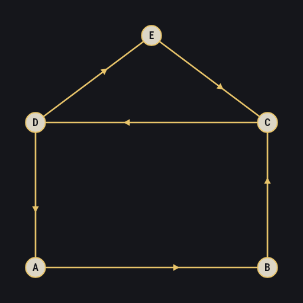
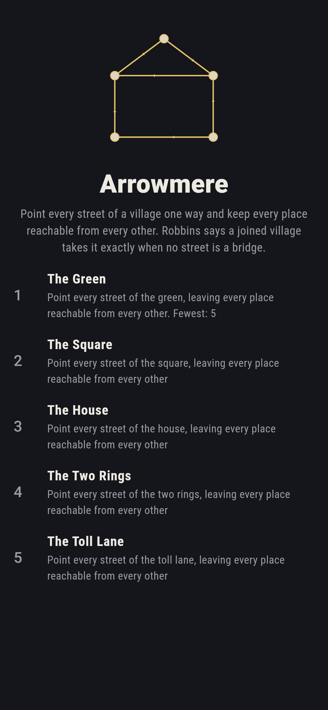
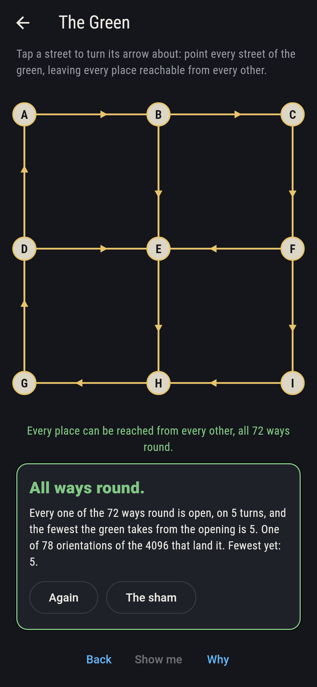
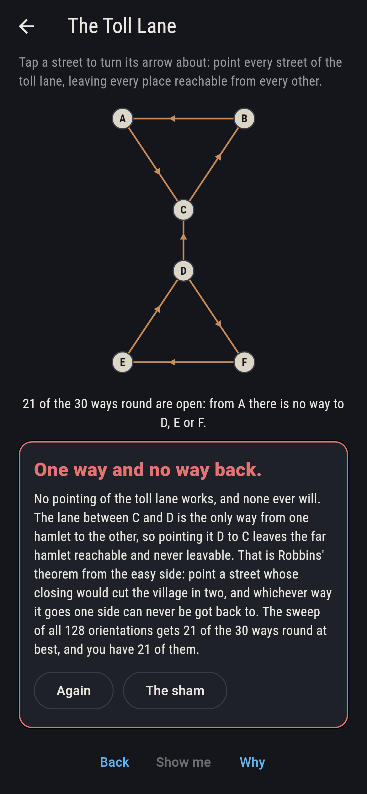
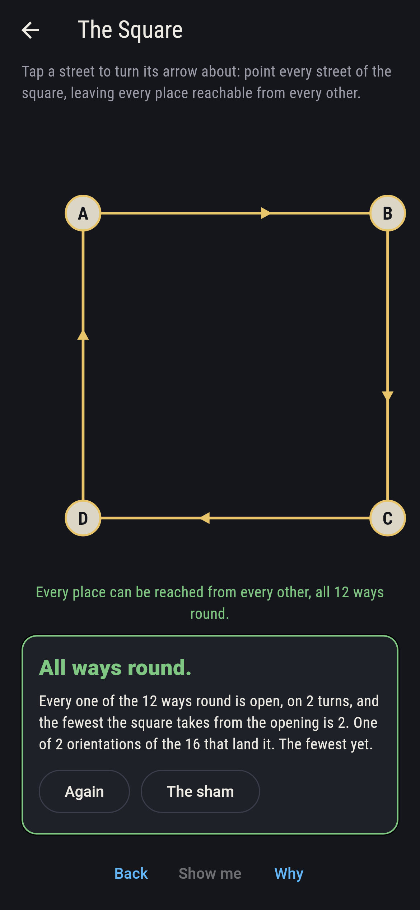
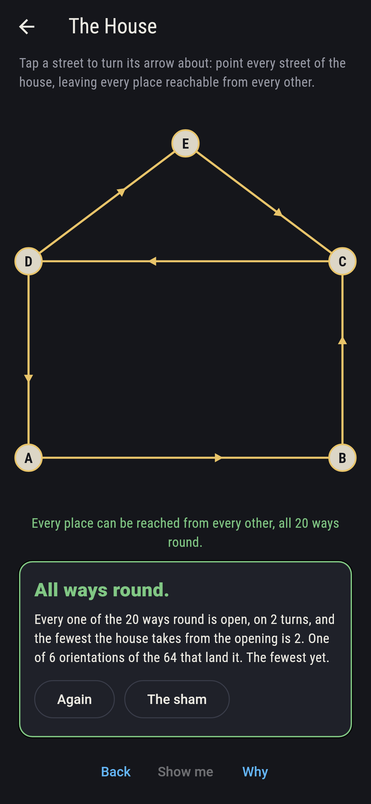
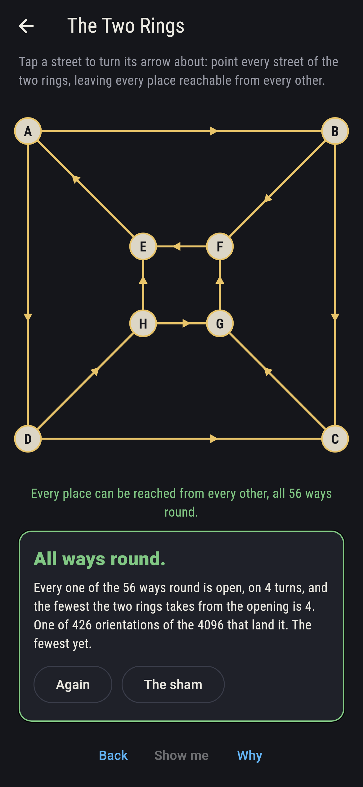
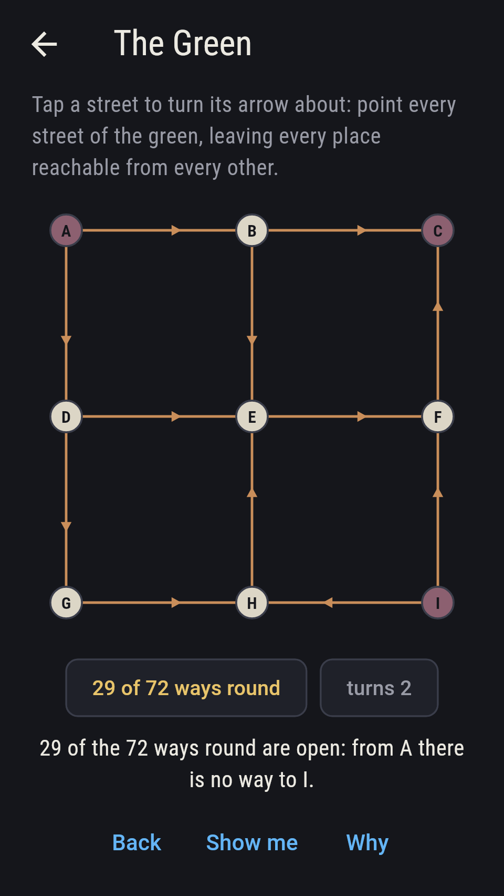
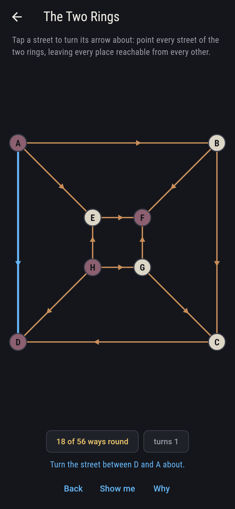
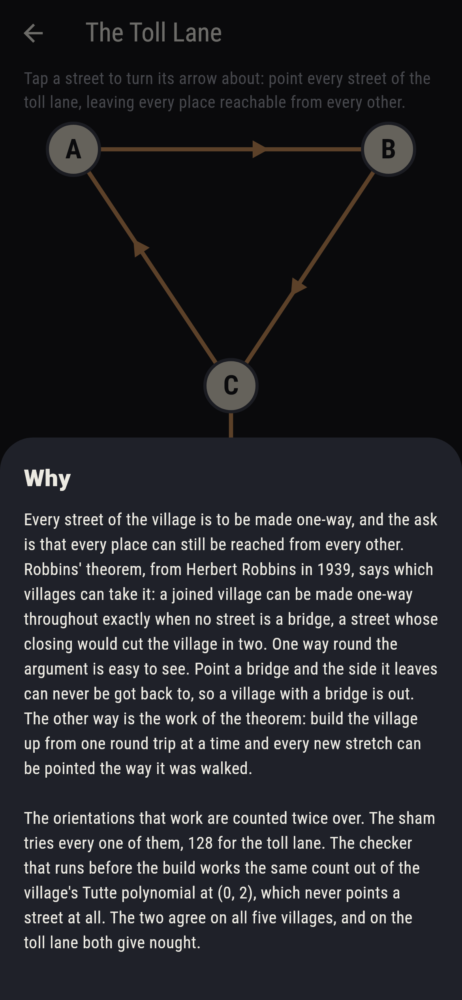

# Arrowmere



A village of places joined by streets, and every street to be made
one-way. Tap a street and its arrow turns about; the ask is that every
place can still be reached from every other once all the arrows are
set. Some villages take it and some cannot, and Robbins' theorem, from
Herbert Robbins in 1939, says exactly which: a joined village can be
made one-way throughout exactly when no street is a bridge, a street
whose
closing would cut the village in two. One side of that is plain to
see. Point a bridge and the side it leaves can never be got back to.
The other side is the work of the theorem. Robbins wrote it up in A
Theorem on Graphs, with an Application to a Problem of Traffic
Control, American Mathematical Monthly 46, 1939, pages 281 to 283. The
game holds five villages, from a square of four places to a green of
nine, and every street of each of them is pointed every way it can be
pointed, 8,400 orientations, with the ones that work counted twice
over before the game is built.

## The asks

1. **The Green** - point every street of the green, leaving every place reachable from every other
2. **The Square** - the same of the square
3. **The House** - the same of the house
4. **The Two Rings** - the same of the two rings
5. **The Toll Lane** - the same of the toll lane

The green is nine places in three rows with twelve streets between
them, and 78 of its 4,096 orientations work. The square is the plainest
case: only two of its sixteen work, the two that send you round and
round, and every other leaves a place you can enter and never leave or
leave and never enter. The house is a square with a roof, two rounds
sharing a street, and six of its 64 work: three ways run between C and
D, the street they share, the roof through E, and the far side of the
square through B and A, each running one way from end to end, and of
those eight the two that send all three the same way leave a place
that can be reached but never left. The two
rings are the graph of a cube, an outer ring of four places and an
inner one with four streets between them, and 426 of its 4,096 work,
more than any other village here. The Toll Lane never turns gold on the
board, since the gold comes only when every place can be reached from
every other: two hamlets of three places each, joined by one lane.
Point that lane whichever way you like and the far hamlet can be
reached and never left, so the nine pairs of places across the lane
can be got between one way only, and 21 of the thirty ordered pairs is
the most any orientation gets. The sham admits it once turns have
landed on three different orientations that get that far, or after
fourteen turns.

## Two voices

Every number the game says out loud was worked out here rather than
guessed. Most of them the game works out as you play; the count of
orientations that work is written into `lib/ways/levels.dart` and held
to the sweep by the tests and by `tool/check_ways.dart`, which works
it out two ways:

* **The walk** points the streets and tries. For each of the 8,400
  orientations it follows the arrows out of every place in turn and
  counts the ordered pairs it can get between; the orientation works
  when all of them are open. On every one that works every street lies
  on a round trip, since every place can be got to from every other,
  and the checker spells that out street by street.
* **The polynomial** never points a street. It deletes and contracts
  one street at a time, the way the Tutte polynomial is built, with 0
  and 2 already put in for x and y, so the polynomial itself is never
  formed and what falls out is its value at (0, 2): the count of
  orientations that leave every street on a round trip. In a joined
  village those are exactly the orientations the walk counts, so the
  two voices count one set of orientations by two roads. They agree on
  all five villages and on rings of every length from three to eight,
  and on the toll lane both give nought. A bridge puts a factor of x
  into the polynomial, so a village with one gives nought at (0, 2);
  that a joined village without one never does is Robbins' theorem.

The bridges are found twice as well, once by closing each street in
turn and asking whether the village falls apart, and once by the
depth-first walk that keeps the earliest place each branch can climb
back to. They agree on all five villages, and only the toll lane has
one.

`tool/check_ways.dart` runs the lot and refuses the bake on any
disagreement.

## The checker's ledger

What `dart run tool/check_ways.dart` printed for the build this README
shipped with, word for word:

```
every way of pointing every street of all five villages tried, 8,400 orientations in all, and the ones that leave every place reachable from every other counted twice, once by walking the arrows out of each place in turn and once by the village's Tutte polynomial at (0, 2), which never points a street: the two agree on all five, 78 of the green's 4,096, 2 of the square's 16, 6 of the house's 64, 426 of the two rings' 4,096, none of the toll lane's 128; on every working orientation every street lies on a round trip, so what is left by one street can be come back to by others; the toll lane is the only village with a bridge, the lane C to D, found both by closing each street in turn and by the depth-first walk that keeps the earliest place a branch can climb back to, and 21 of its 30 ordered pairs is the most any orientation gets, the nine across the lane going one way only; a ring of any length from three to eight works two ways and no more, by both counts; The Green opens 5 turns from the nearest answer, The Square opens 2 turns from the nearest answer, The House opens 2 turns from the nearest answer, The Two Rings opens 4 turns from the nearest answer, and the pointer takes each of them in that many, never more

 1 The Green     point every street of the green, leaving every place reachable from every other: 78 of the 4,096 orientations land it, the fewest 5 turns from the opening
 2 The Square    point every street of the square, leaving every place reachable from every other: 2 of the 16 orientations land it, the fewest 2 turns from the opening
 3 The House     point every street of the house, leaving every place reachable from every other: 6 of the 64 orientations land it, the fewest 2 turns from the opening
 4 The Two Rings point every street of the two rings, leaving every place reachable from every other: 426 of the 4,096 orientations land it, the fewest 4 turns from the opening
 5 The Toll Lane point every street of the toll lane, leaving every place reachable from every other: none of the 128, its lane being a bridge
```

## Screenshots

| The sham | The green, all ways round | The toll lane admitted |
| --- | --- | --- |
|  |  |  |

| The square | The house | The two rings | Midway, on the small phone | Show me | The why |
| --- | --- | --- | --- | --- | --- |
|  |  |  |  |  |  |

Screenshots are drawn by `test/showcase_test.dart` at real phone sizes
with the app's own painter, then copied into `docs/` as they came out;
every arrow on a board in them was turned by a tap on that street, and
the mark on the title shot is the house drawn as the village lists it,
so no village pictured is pointed a way the game could not point it. The
logo and every launcher icon come out of `test/mark_test.dart`, drawn
by the same painter: the mark is the house pointed the way the village
lists it, one of the six orientations that leave every place reachable
from every other.

## Building

```
flutter test          # 42 tests, the sweeps among them
dart run tool/check_ways.dart
flutter build apk     # or: flutter build ios
```
