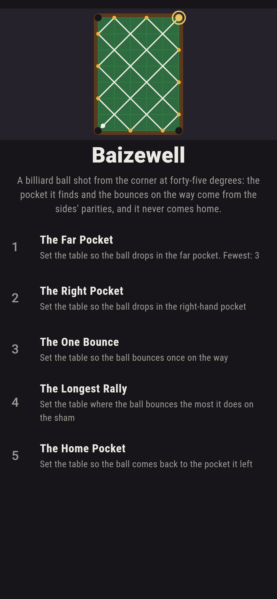
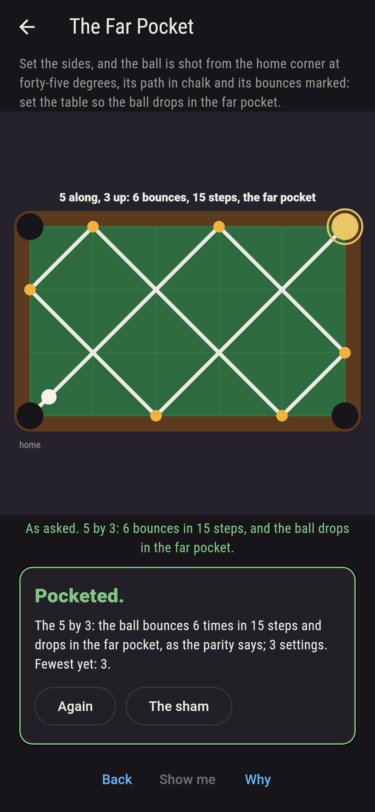
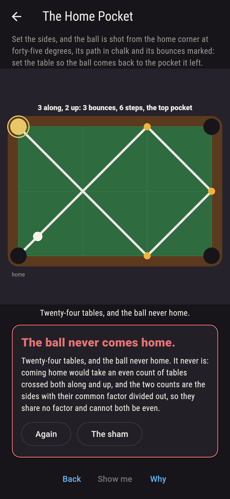
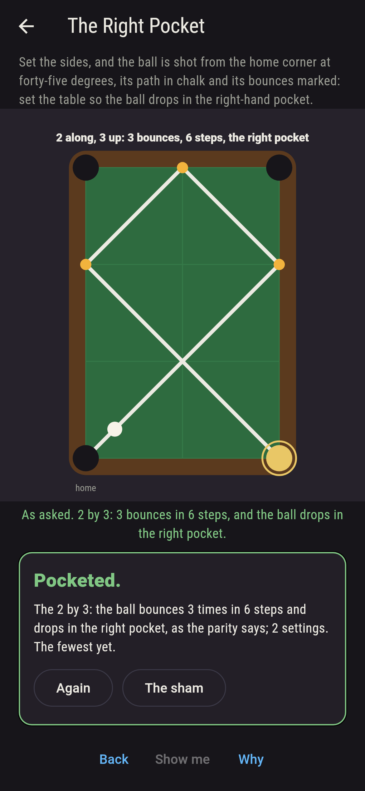
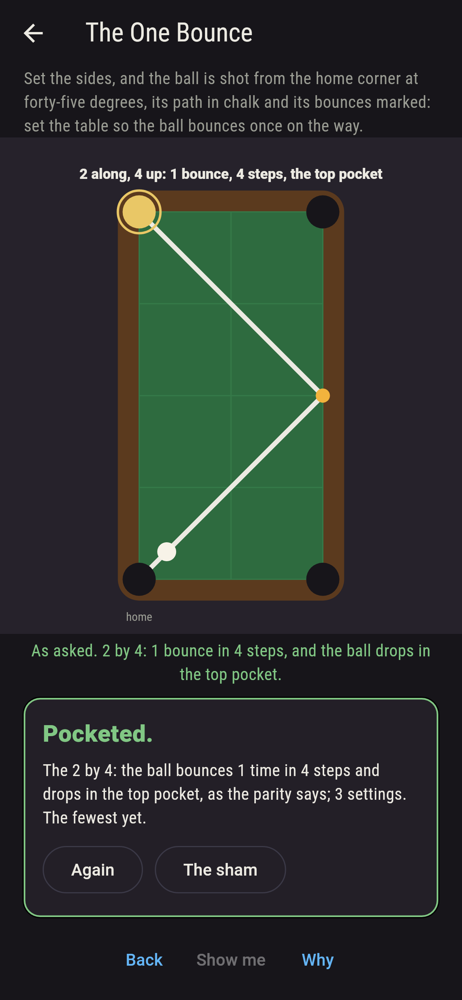
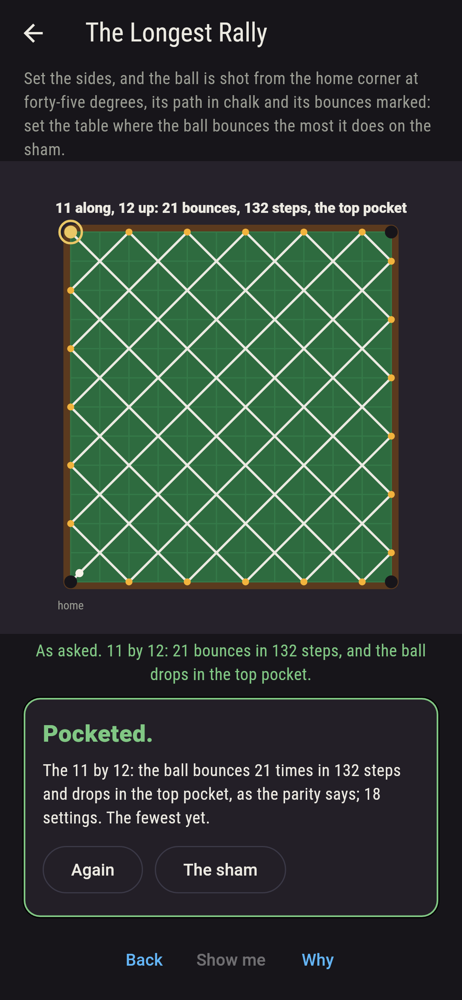
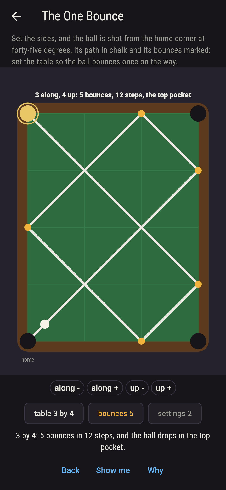
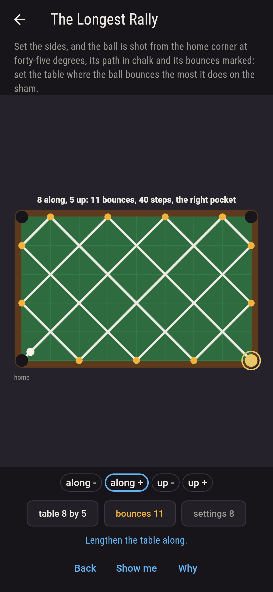
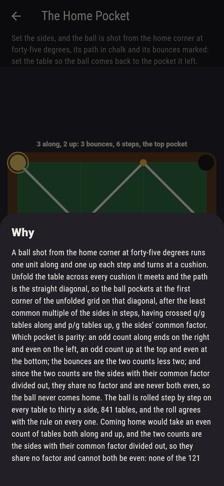

# Baizewell


A billiard ball shot from the home corner of a p by q table at
forty-five degrees. It runs one unit along and one up each step,
turns at a cushion, and drops in the first pocket it reaches; set
the sides, two to twelve, and the path is drawn in chalk with the
bounces marked. Unfold the table across every cushion the ball
meets and the path is the straight diagonal, so the ball pockets
at the first corner of the unfolded grid on that diagonal, after
the least common multiple of the sides in steps, having crossed
q/g tables along and p/g up, g the sides' common factor. Which
pocket is parity: an odd count along ends on the right and even
on the left, an odd count up at the top and even at the bottom;
the bounces are the two counts less two; and since the two counts
are the sides with their common factor divided out, they share no
factor and are never both even, so the ball never comes home. The
ball is rolled step by step on every table to thirty a side, 841
tables, and the roll agrees with the rule on every one.

## The tables

1. **The Far Pocket** - set the table so the ball drops in the far pocket
2. **The Right Pocket** - set the table so the ball drops in the right-hand pocket
3. **The One Bounce** - set the table so the ball bounces once on the way
4. **The Longest Rally** - set the table where the ball bounces the most it does on the sham
5. **The Home Pocket** - set the table so the ball comes back to the pocket it left

Of the sham's 121 tables 39 pocket far, both counts odd, the
eleven squares among them running straight; 41 pocket right and 41
top; ten bounce once, one side twice the other; the eleven by
twelve and the twelve by eleven bounce 21 times in 132 steps, the
most; the two by three bounces three times in six steps, the two by
four once in four, and the five by seven ten times in thirty-five.
The Home Pocket is labeled hopeless on its tile, and the parity is
the why.

## Two voices

The game never asserts what it has not computed, and it computes
everything at least twice:

* **The roll** moves the ball a unit at a time on every table of
  two to thirty a side, turns it at each cushion, counts its
  bounces and steps and reads the pocket it drops in; every path on
  the sham is that roll's.
* **The rule** rolls nothing: the pocket by the parities of q/g and
  p/g, the bounces by their sum less two, the steps by the least
  common multiple; it agrees with the roll on all 841 tables, and
  it says the ball never comes home, since the two counts, the
  sides with their common factor divided out, share no factor and
  are never both even, which is checked on every table too.

`tool/check_tables.dart` runs the lot and refuses the bake on any
disagreement.

## The checker's ledger

What `dart run tool/check_tables.dart` printed for the build this
README shipped with, word for word:

```
the ball rolled step by step from the home corner on every table of two to thirty a side, 841 tables, and held to the unfolding: it pockets after the least common multiple of the sides in steps, having crossed q/g tables along and p/g up, g the sides' common factor, and lands right when the count along is odd and left when even, top when the count up is odd and bottom when even, with bounces one less than each count together, the roll and the rule agreeing on all 841; the two counts share no factor, so both are never even, and the ball never comes home; on the sham's 121 tables of two to twelve a side 39 pocket far, 41 right, 41 top and none home, the eleven squares run straight, the two by three bounces 3 times in 6 steps, the two by four once in 4, the five by seven 10 times in 35, and the eleven by twelve and twelve by eleven 21 times in 132, the most

 1 The Far Pocket     set the table so the ball drops in the far pocket: 39 of the 121 tables land it
 2 The Right Pocket   set the table so the ball drops in the right-hand pocket: 41 of the 121 tables land it
 3 The One Bounce     set the table so the ball bounces once on the way: 10 of the 121 tables land it
 4 The Longest Rally  set the table where the ball bounces the most it does on the sham: 2 of the 121 tables land it
 5 The Home Pocket    set the table so the ball comes back to the pocket it left: none of the 121, and the parity said so first
```

## Screenshots

| The sham | The far pocket | The home pocket admitted |
| --- | --- | --- |
|  |  |  |

| The right pocket | The one bounce | The longest rally | Mid-setting | Show me | The why |
| --- | --- | --- | --- | --- | --- |
|  |  |  |  |  |  |

Screenshots are drawn by `test/showcase_test.dart` at real phone
sizes with the app's own painter, then copied into `docs/` as they
came out; every side in them was set by a press, so nothing
pictured is a table the game could not reach. The logo and every
launcher icon come out of `test/mark_test.dart` the same way: the
mark is the five by seven, ten bounces to the far pocket.

## Building

```
flutter test          # 47 tests, the roll among them
dart run tool/check_tables.dart
flutter build apk     # or: flutter build ios
```
