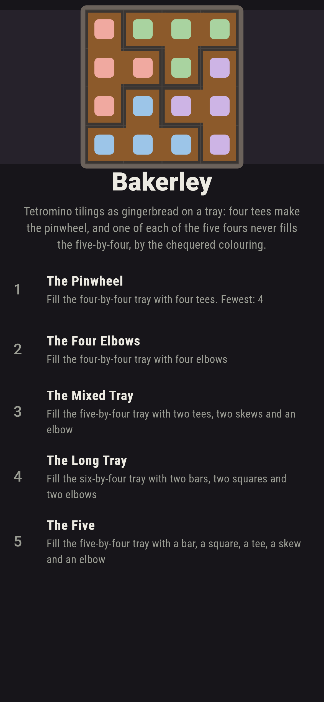
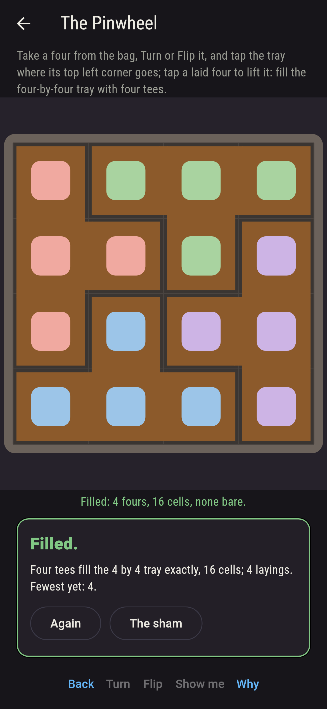
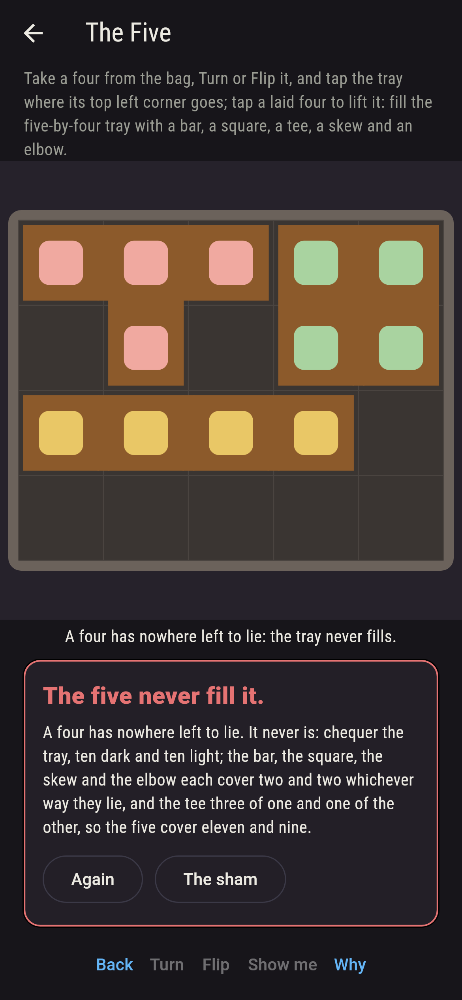
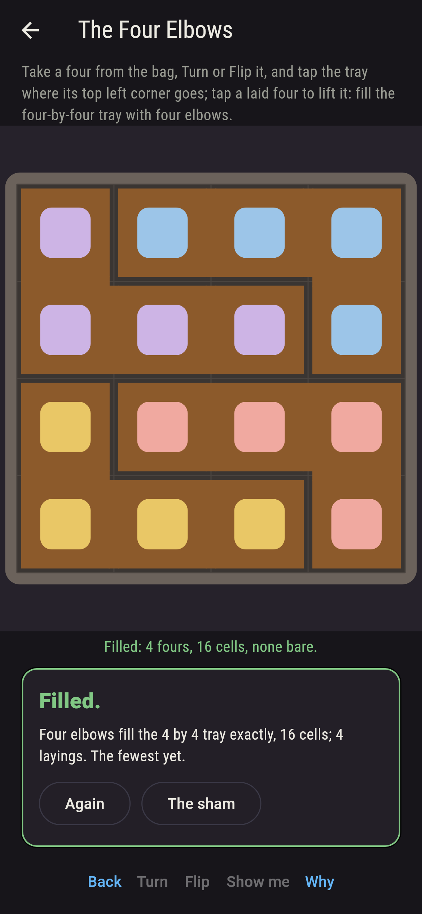
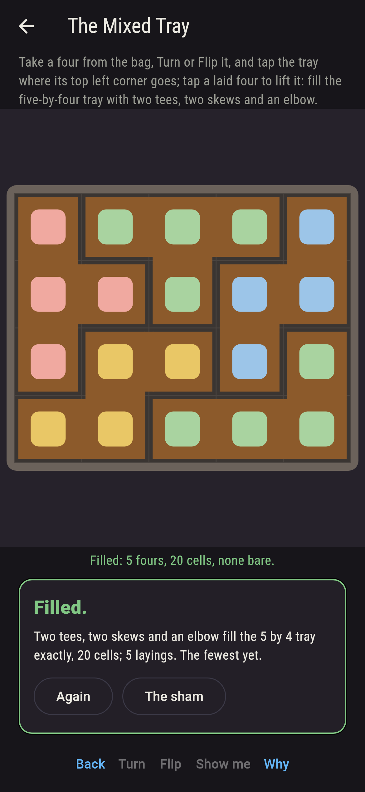
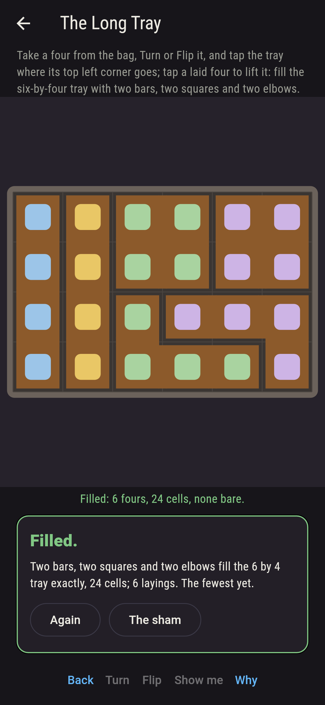
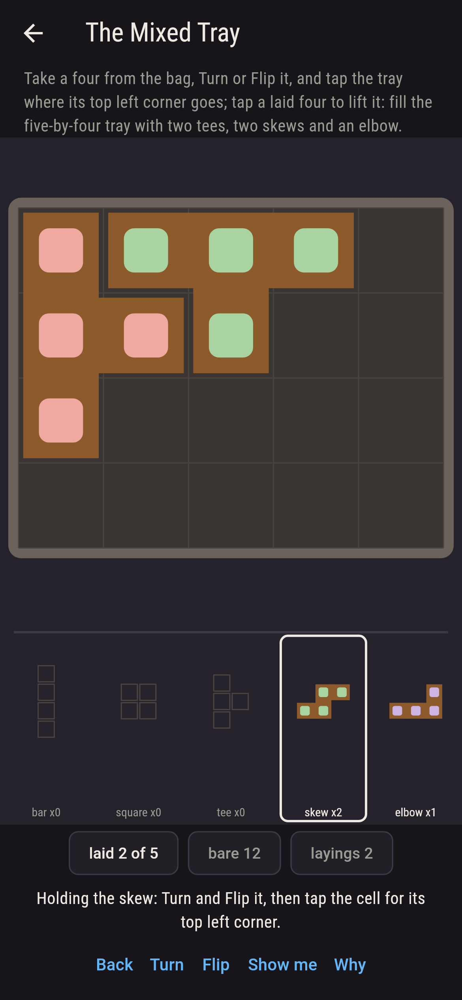
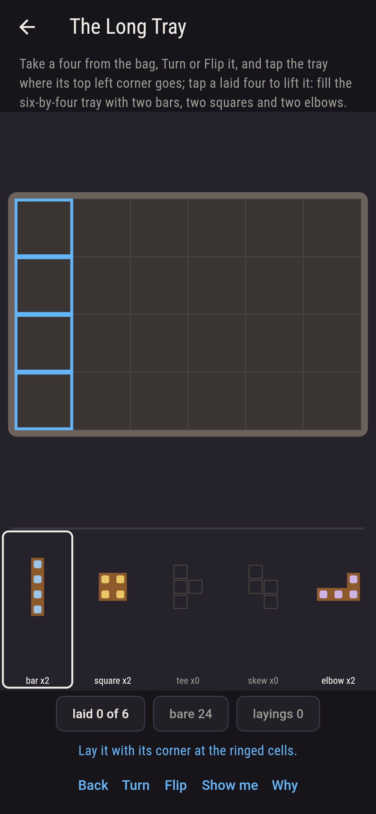
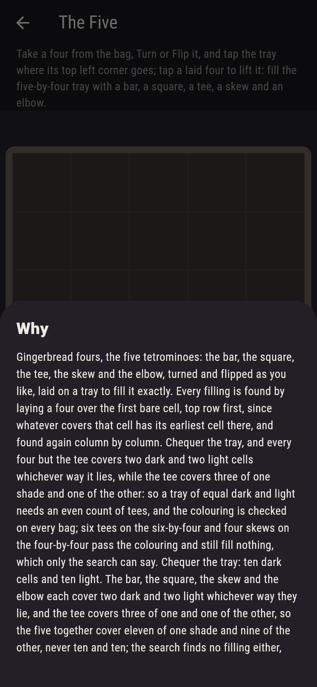

# Bakerley


Gingerbread fours on a baking tray: the five tetrominoes, the bar,
the square, the tee, the skew and the elbow, to be turned and
flipped and laid so the tray fills exactly. Take a four from the
bag, Turn or Flip it, and tap the tray where its top left corner
goes; tap a laid four to lift it. Every filling of every tray is
found by laying a four over the first bare cell, top row first,
since whatever covers that cell has its earliest cell there, and
found again column by column: four tees fill the four-by-four two
ways, the pinwheel and its mirror. Chequer the tray, and every four
but the tee covers two dark and two light cells whichever way it
lies, while the tee covers three of one shade and one of the other,
so a tray of equal dark and light needs an even count of tees, and
one of each of the five fours never fills the five-by-four, eleven
and nine against ten and ten. Six tees pass the colouring on the
six-by-four and four skews on the four-by-four, and still fill
nothing, which only the search can say.

## The trays

1. **The Pinwheel** - fill the four-by-four tray with four tees
2. **The Four Elbows** - fill the four-by-four tray with four elbows
3. **The Mixed Tray** - fill the five-by-four tray with two tees, two skews and an elbow
4. **The Long Tray** - fill the six-by-four tray with two bars, two squares and two elbows
5. **The Five** - fill the five-by-four tray with a bar, a square, a tee, a skew and an elbow

Four tees fill the four-by-four two ways and four elbows ten; two
tees, two skews and an elbow fill the five-by-four twelve ways, the
two tees covering three dark and one light and one dark and three
light between them; two bars, two squares and two elbows fill the
six-by-four ninety-two ways; eight tees fill the eight-by-four six
ways. The Five is labeled hopeless on its tile, and the colouring
is the why.

## Two voices

The game never asserts what it has not computed, and it computes
everything at least twice:

* **The search** lays a four over the first bare cell, top row
  first, every kind every way it turns and flips, the bar two ways,
  the square one, the tee four, the skew four, the elbow eight, and
  finds every filling once; then it does it all again column by
  column, and the two agree, tray by tray. Every count on the sham
  is the search's.
* **The colouring** searches nothing: it chequers the tray and adds
  up the shades each four can cover, two and two for all but the
  tee and three and one for the tee, and says which bags can come
  out even; it forbids the five on the five-by-four, allows every
  tray the search fills, and allows six tees on the six-by-four and
  four skews on the four-by-four that the search finds fill nothing.

`tool/check_trays.dart` runs the lot and refuses the bake on any
disagreement.

## The checker's ledger

What `dart run tool/check_trays.dart` printed for the build this
README shipped with, word for word:

```
every filling of every tray found by laying a four over the first bare cell, top row first, and found again column by column, the fours turned and flipped every way, the bar 2 ways, the square 1, the tee 4, the skew 4 and the elbow 8: four tees fill the four-by-four 2 ways, four elbows 10, two tees, two skews and an elbow fill the five-by-four 12 ways, two bars, two squares and two elbows fill the six-by-four 92; the tray chequered, the bar, the square, the skew and the elbow cover two dark and two light whichever way they lie and the tee three of one and one of the other, so one of each of the five covers eleven and nine on a tray of ten and ten, and the search finds no filling of the five-by-four by one of each; six tees fill no six-by-four and four skews no four-by-four, though the colouring allows both, and eight tees fill the eight-by-four 6 ways

 1 The Pinwheel     fill the four-by-four tray with four tees: 2 fillings do it
 2 The Four Elbows  fill the four-by-four tray with four elbows: 10 fillings do it
 3 The Mixed Tray   fill the five-by-four tray with two tees, two skews and an elbow: 12 fillings do it
 4 The Long Tray    fill the six-by-four tray with two bars, two squares and two elbows: 92 fillings do it
 5 The Five         fill the five-by-four tray with a bar, a square, a tee, a skew and an elbow: none, and the colouring said so first
```

## Screenshots

| The sham | The pinwheel | The five admitted |
| --- | --- | --- |
|  |  |  |

| The four elbows | The mixed tray | The long tray | Mid-filling | Show me | The why |
| --- | --- | --- | --- | --- | --- |
|  |  |  |  |  |  |

Screenshots are drawn by `test/showcase_test.dart` at real phone
sizes with the app's own painter, then copied into `docs/` as they
came out; every four in them was laid by a tap, so nothing pictured
is a tray the game could not reach. The logo and every launcher
icon come out of `test/mark_test.dart` the same way: the mark is
the pinwheel, four tees on the four-by-four.

## Building

```
flutter test          # 48 tests, the search among them
dart run tool/check_trays.dart
flutter build apk     # or: flutter build ios
```
