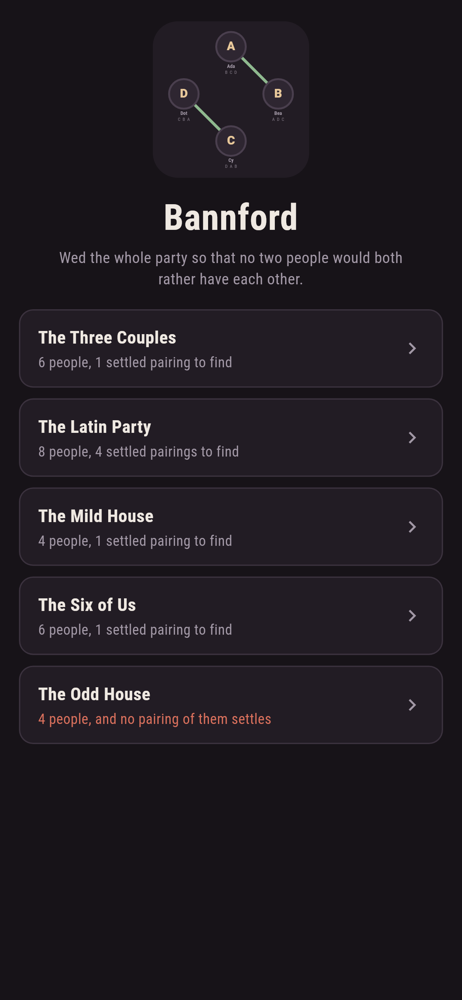
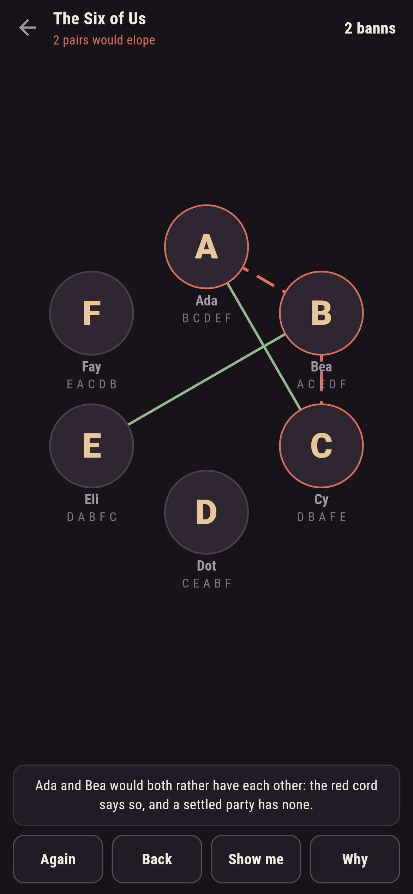
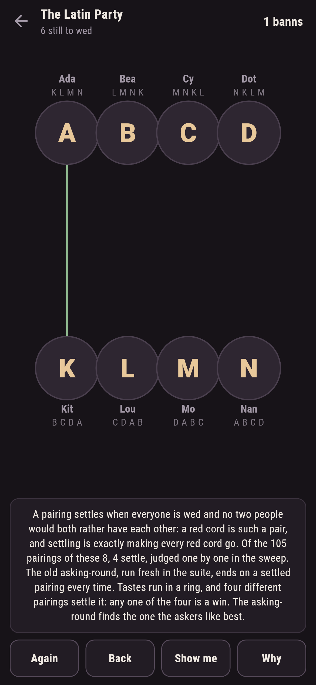
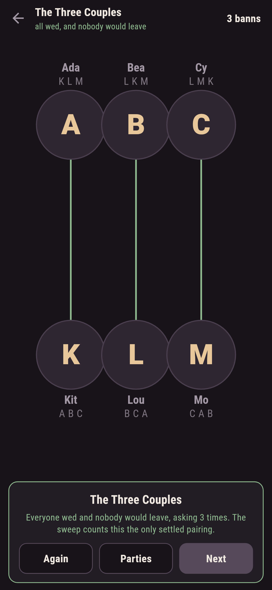
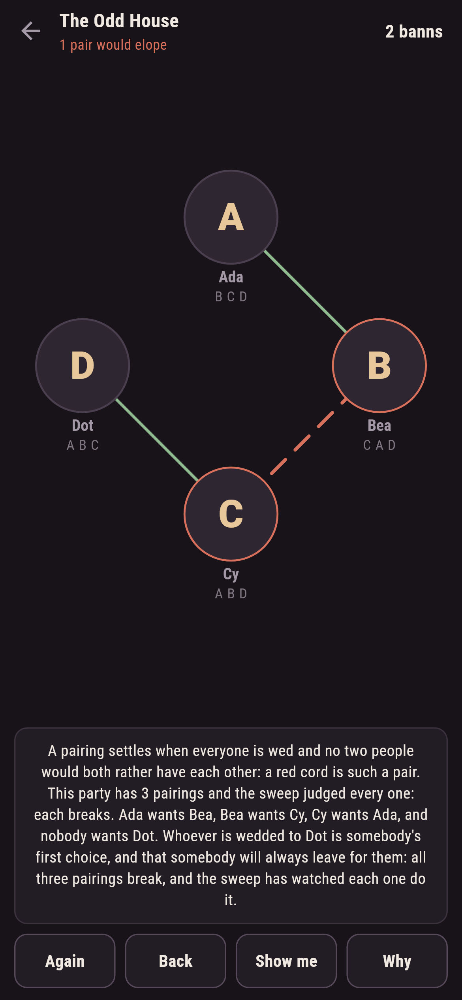
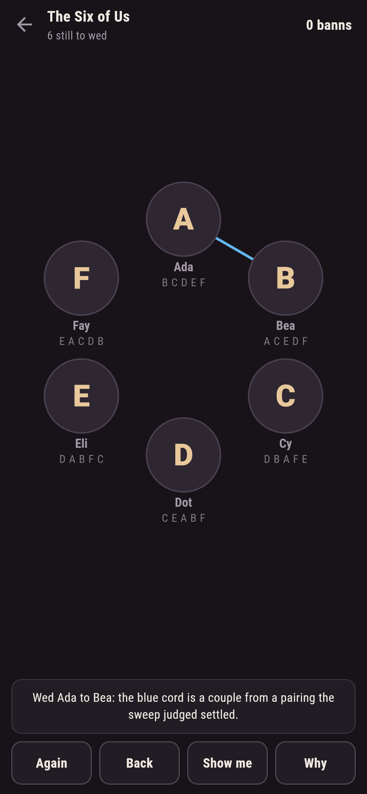

# Bannford

A matchmaking puzzle for phones, in Flutter, for Android and iOS.

A party of people, each with a list of who they would have, best
first. Tap two to wed them. A settled party has everyone wed and no
two people who would both rather have each other; such a pair is an
eloping pair, and the game strings a red cord between them the moment
their weddings make one. This is stable matching played by hand, and
the game's parties carry the theory's two famous faces: two-sided
parties always settle, and one-sided ones sometimes cannot.

| | | | |
|---|---|---|---|
|  |  |  |  |

## Two ways of knowing

The suite knows each party two ways that share nothing. A sweep lists
every pairing of the whole party and judges each against every pair of
people, knowing nothing of asking; the old asking-round, where one
side proposes and the other keeps the best offer so far, runs move by
move and knows nothing of sweeping. On every two-sided party the round
ends on a pairing the sweep judged settled, and every written count
below is the sweep's own.

```
$ make parties
 1 The Three Couples 6 people  1 of 15 pairings settle  (asking-round agrees)
 2 The Latin Party   8 people  4 of 105 pairings settle  (asking-round agrees)
 3 The Mild House    4 people  1 of 3 pairings settle
 4 The Six of Us     6 people  1 of 15 pairings settle
 5 The Odd House     4 people  none of 3 pairings settles

the odd house breaks all three ways, each time by the one wedded to Dot running off with whoever puts them first
```

## The odd house

Two-sided parties always settle; one-sided ones need not, and the
smallest way it fails ships as a level in the house tradition of maps
nobody can win. Ada wants Bea, Bea wants Cy, Cy wants Ada, and nobody
wants Dot: whoever is wedded to Dot is somebody's first choice, and
that somebody will always leave for them. The checker watches all
three pairings break by exactly that pair, and in the game every
arrangement you wed shows its red cord the moment it stands.



## The red cords

Nothing about stability is folklore here. The eloping pairs are
computed live after every wedding: red dashed cords between the pairs,
red rims on the people, the count in the ledger, and the words under
the hall naming the first pair by name. **Show me** strings a blue
cord from a pairing the sweep judged settled, and **Why** counts the
pairings and the settled ones for the party in front of you.



## Building

```
make deps      # fetch packages
make check     # analyze + every test
make parties   # sweep every pairing of every party and print the ledger
make shots     # render the screenshots and redraw the icons
make apk       # Android release build
make ios       # iOS release build (unsigned)
```

The logo and every app icon are drawn by the game's own painter in
`test/mark_test.dart`. There is no image in this repository that was not
produced by code in it.

## How it is put together

```
lib/banns/rules.dart      rankings, eloping pairs, the sweep, the
                          asking-round
lib/banns/party.dart      a party: names, rankings, its numbers
lib/banns/parties.dart    the five parties that ship
lib/banns/play.dart       a party being wed: weddings, partings,
                          take-back
lib/ui/                   the painter, the screens, the mark
tool/check_parties.dart   the sweeps and the ledger above
```

The tests rank and prefer by hand, sweep every pairing of every party,
run the asking-round against the sweep on the two-sided ones, watch
the odd house break all three ways by its named pair, settle every
winnable party by following the game's own pointer, and hold the
pictures against the real widget tree. If any of that drifts,
`make check` goes red before anything leaves the machine.
