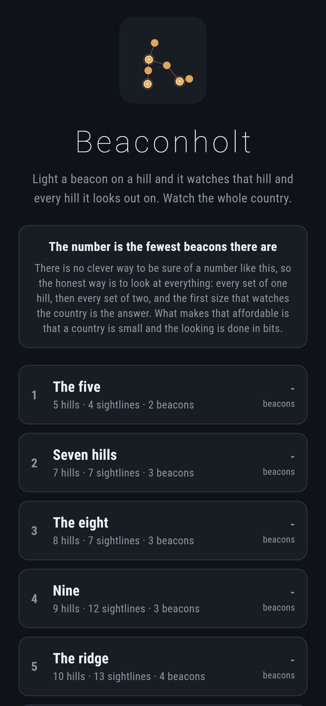
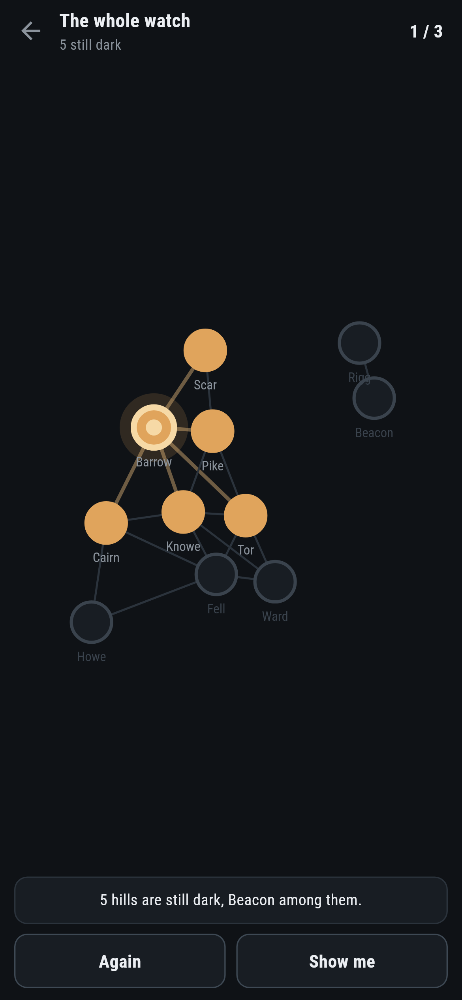
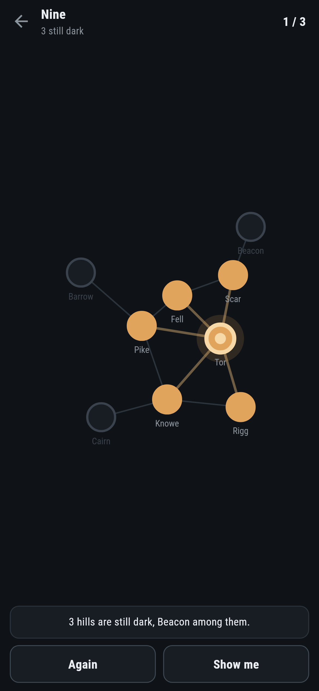
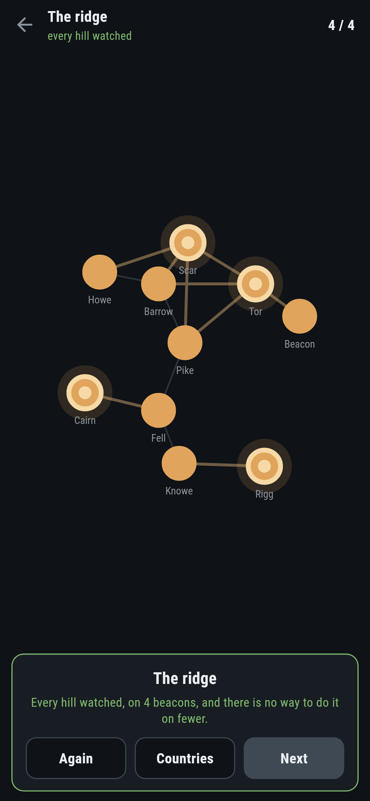

# Beaconholt

A watching puzzle for phones, in Flutter, for Android and iOS.

Light a beacon on a hill and it watches that hill and every hill it looks out
on. Watch the whole country. The number on each one is the fewest beacons it
can possibly be done with.

| | | | |
|---|---|---|---|
|  |  |  |  |

## The obvious way is not the answer

Light the hill that watches the most, then the hill that adds the most of
what is left, and so on. It is the first thing anybody tries and it is a
perfectly good way to get a country watched. It is not the fewest, and on
every country here it takes at least one beacon more:

```
$ make countries
 1 The five          5 hills  4 sightlines  fewest 2  greed gets 2 (GREED IS ENOUGH)  15 sets tried  at [0, 3]
 2 Seven hills       7 hills  7 sightlines  fewest 3  greed gets 4  152 sets tried  at [1, 2, 3]
 3 The eight         8 hills  7 sightlines  fewest 3  greed gets 4  228 sets tried  at [1, 2, 6]
 4 Nine              9 hills  12 sightlines  fewest 3  greed gets 4  532 sets tried  at [2, 4, 8]
 5 The ridge         10 hills  13 sightlines  fewest 4  greed gets 5  165 sets tried  at [0, 1, 4, 7]
 6 The whole watch   11 hills  19 sightlines  fewest 3  greed gets 4  416 sets tried  at [1, 2, 4]
```

A test insists on that for every country but the first, which is there to show
what a beacon does. `make find` is what turned them up: it scatters hills,
joins the ones near each other, and throws away every country where lighting
the best hill each time happens to be the answer. Most of them are.

## There is no clever way, so it looks at everything

Every set of one hill, then every set of two, and the first size that watches
the whole country is the answer. The fact that nothing smaller was found is
what makes it the fewest, and there is no argument that would let it skip a
size.

What keeps that affordable is that a country is small and the looking is done
in bits: the hills a beacon watches are a number, what a set of beacons
watches is those numbers or-ed together, and the country is watched when that
equals every hill.

`test/watch_test.dart` says the same thing the long way round on a hundred
countries made up at random. For each one it takes the answer the search
found and then tries every set one smaller, and none of them ever works:

```dart
expect(anySmaller, isFalse, reason: '${watch.fewest - 1} beacons would have done');
```

## What the game says


How many hills are still dark, and one of them by name. There is nothing to
work out to say that: a beacon watches its own hill and the hills it sees, so
what is dark is what no beacon can see.

**Show me** names a hill that has a beacon on it in one of the smallest sets.
It is worked out from the country rather than from what is already up, so it
is always a hill in some answer of that size.

## Running it

```
make deps       # flutter pub get
make test       # everything
make analyze
make shots      # render the screens into build/showcase, redraw the logo and icons
make countries  # the fewest beacons on each country, against the obvious way
make find       # scatter hills and keep the countries where the obvious way fails
make apk        # release APK
make ios        # release iOS build, unsigned
```

## Tests

`flutter test` runs the country (what a beacon watches, and when the whole of
it is lit), the search (one beacon where one hill sees everything, one each
where no hill sees another, and a hundred random countries where every set
one smaller than the answer is tried and fails), every shipped country (the
number it says, that the obvious way needs more, and that no hill is on its
own), and the lighting (a beacon watching what it sees, tapping it out again,
finishing, and being told how many too many).

Then the game through the screen: tapping a hill, tapping it again, the
message naming a hill nothing can see, **Again**, **Show me** naming a hill
that is in an answer, and every country watched on the fewest there are.

Screenshots come from `test/showcase_test.dart`, and every beacon in them was
lit by tapping a hill. `test/mark_test.dart` draws the logo, the launcher
icons at every density Android asks for and every size the iOS icon set asks
for; there is no image in this repository that was not produced by it.
