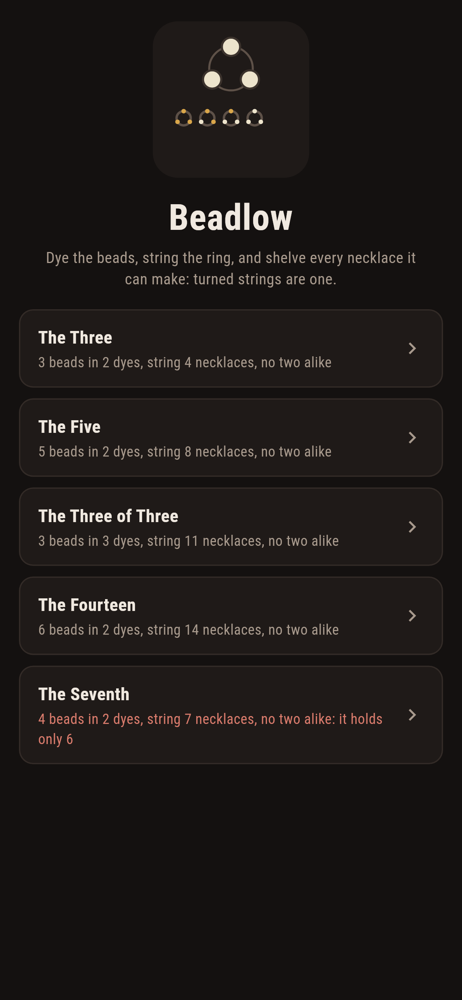
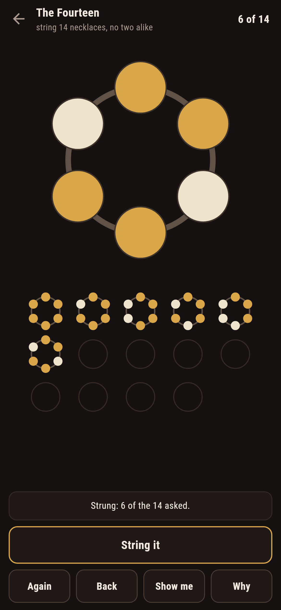
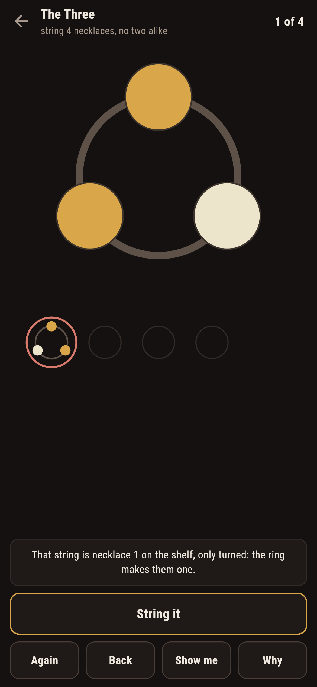
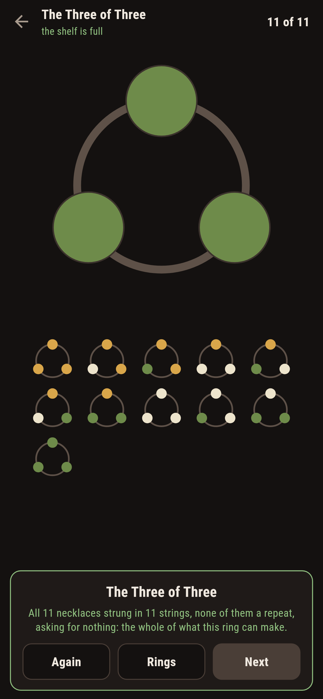
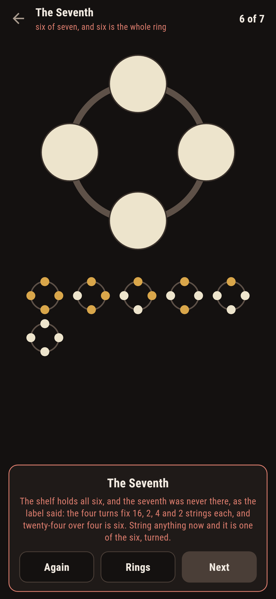
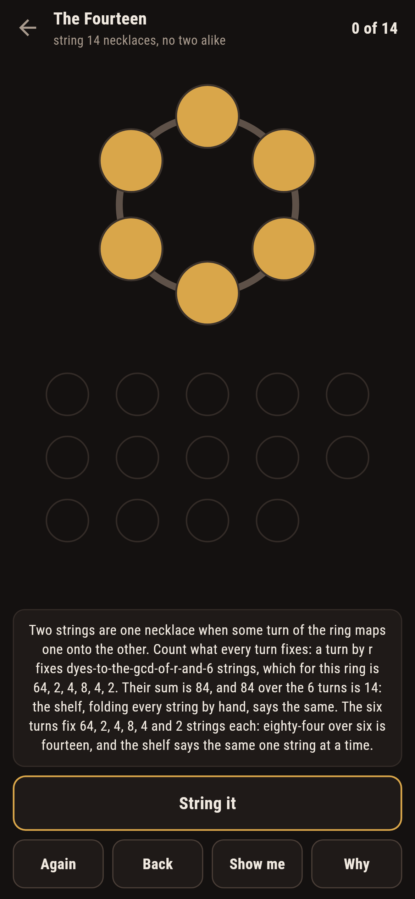

# Beadlow

A collecting puzzle for phones, in Flutter, for Android and iOS.

A ring of beads on the stall table, a few dyes, and a shelf to fill:
dye the beads, string the ring, and shelve every necklace it can
make. Two strings are one necklace when some turn of the ring maps
one onto the other, and the stall knows a turned repeat the moment
it is strung, naming the shelf necklace it folds into. This is
Burnside's counting worked at a bead stall, and the shelf always
fills at exactly the number the counting promised.

| | | | |
|---|---|---|---|
|  |  |  |  |

## Two ways of knowing

The suite knows every ring two ways that share nothing. The counting
never strings a bead: a turn by r beads fixes exactly
dyes-to-the-gcd-of-r-and-n strings, and the necklaces are those
fixed counts summed over the n turns and divided by n. The shelf
enumerates every string there is and folds them by turning, knowing
nothing of gcds. Bead for bead they agree on every ring that ships,
and every written count below is both voices at once.

```
$ make rings
every ring counted two ways that share nothing: what each turn fixes, summed and divided by the turns, against the shelf of every string folded by turning: bead for bead they agree on every ring that ships

 1 The Three           3 beads, 2 dyes  string 4 necklaces, no two alike: the ring holds exactly 4
 2 The Five            5 beads, 2 dyes  string 8 necklaces, no two alike: the ring holds exactly 8
 3 The Three of Three  3 beads, 3 dyes  string 11 necklaces, no two alike: the ring holds exactly 11
 4 The Fourteen        6 beads, 2 dyes  string 14 necklaces, no two alike: the ring holds exactly 14
 5 The Seventh         4 beads, 2 dyes  string 7 necklaces, no two alike: the ring holds only 6, and a seventh was never there
```

## The seventh

One ring ships labelled hopeless in the house tradition of maps
nobody can win: seven necklaces asked of four beads in two dyes. The
four turns fix 16, 2, 4 and 2 strings each, twenty-four over four is
six, and six is the whole of what the ring can make. The game lets
you fill the shelf, watches the seventh never come, and when a
string is committed past the full shelf it writes the futility down
rather than let anyone grind at it.



## The shelf that knows a turn

Nothing about the folding is folklore here. Every committed string
is put to its smallest turning before it is shelved, a repeat is
named by the shelf necklace it turns into, red-rimmed where it
already sits, and **Why** counts what every turn fixes, spelled out
term by term for the ring in front of you. **Show me** ghosts a
necklace the shelf still lacks straight onto the beads.



## Building

```
make deps      # fetch packages
make check     # analyze + every test
make rings     # hold the counting against the shelf
make shots     # render the screenshots and redraw the icons
make apk       # Android release build
make ios       # iOS release build (unsigned)
```

The logo and every app icon are drawn by the game's own painter in
`test/mark_test.dart`. There is no image in this repository that was not
produced by code in it.

## How it is put together

```
lib/bead/rules.dart      the counting, the smallest turning, the
                         shelf of every string
lib/bead/ring.dart       a ring: its beads, its dyes, its asking
lib/bead/rings.dart      the five rings that ship
lib/bead/play.dart       a stall in progress: dyes, strings,
                         take-back
lib/ui/                  the painter, the screens, the mark
tool/check_rings.dart    the countings and the ledger above
```

The tests count what each turn fixes by hand, fold strings to their
smallest turnings, hold the counting against the shelf on every
ring, fill every winnable shelf by following the game's own pointer,
watch a turned repeat get named on the shelf, watch the seventh jam
a full shelf of six, and hold the pictures against the real widget
tree. If any of that drifts, `make check` goes red before anything
leaves the machine.
