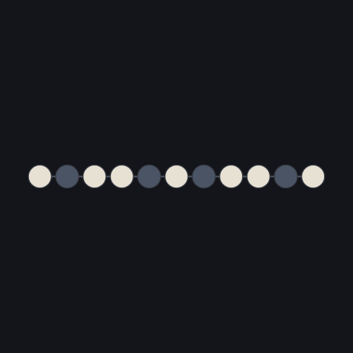
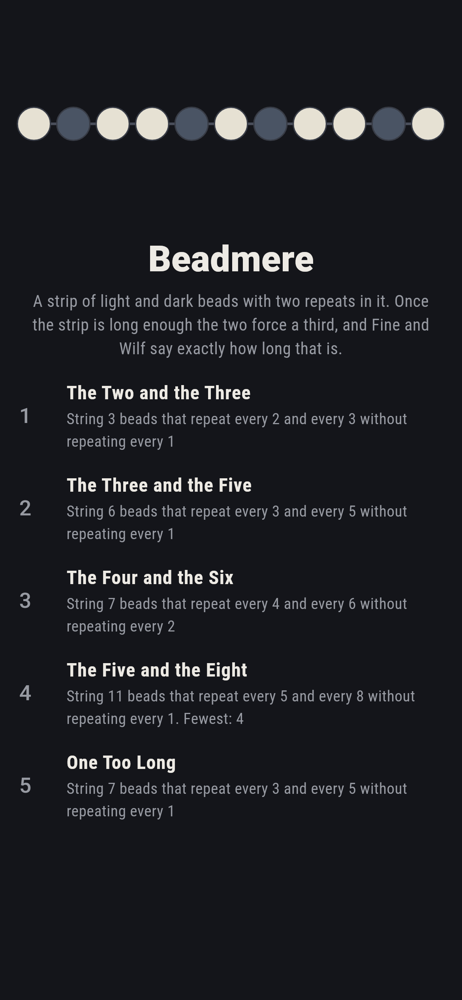
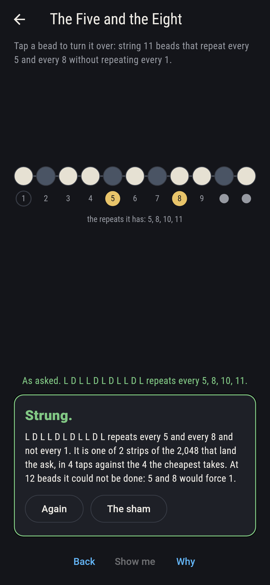
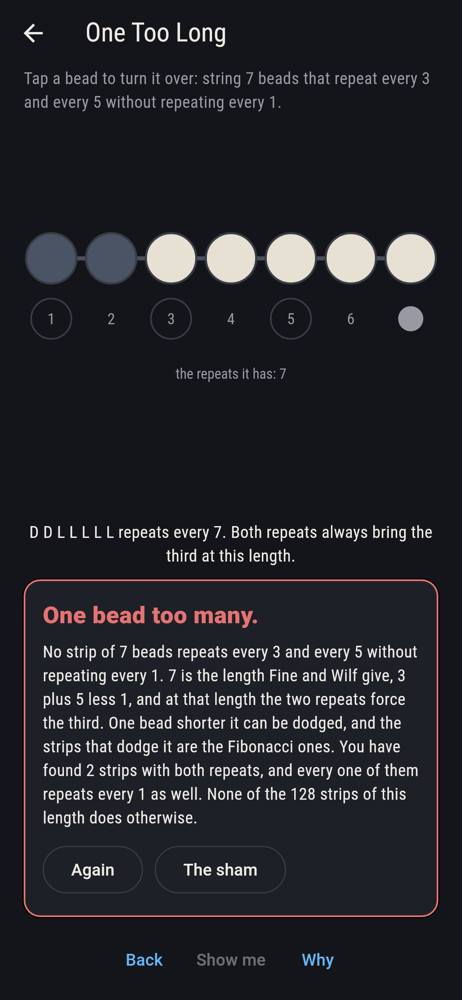
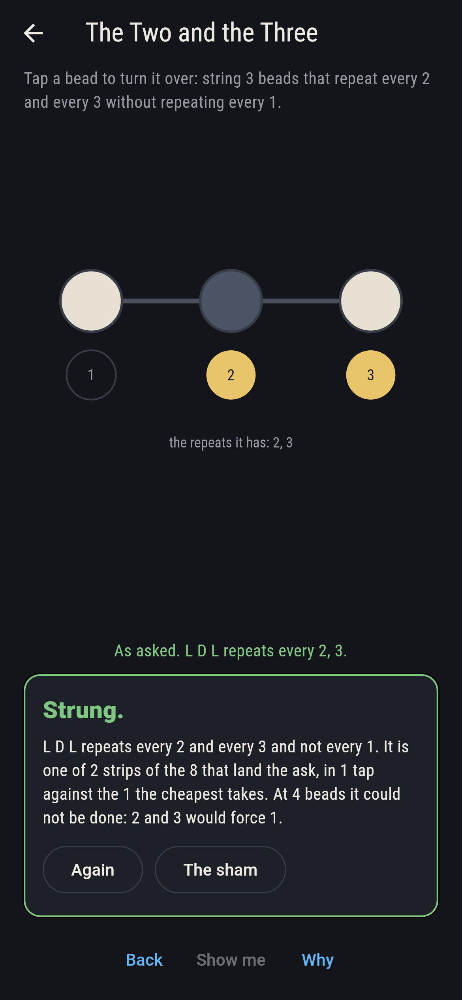
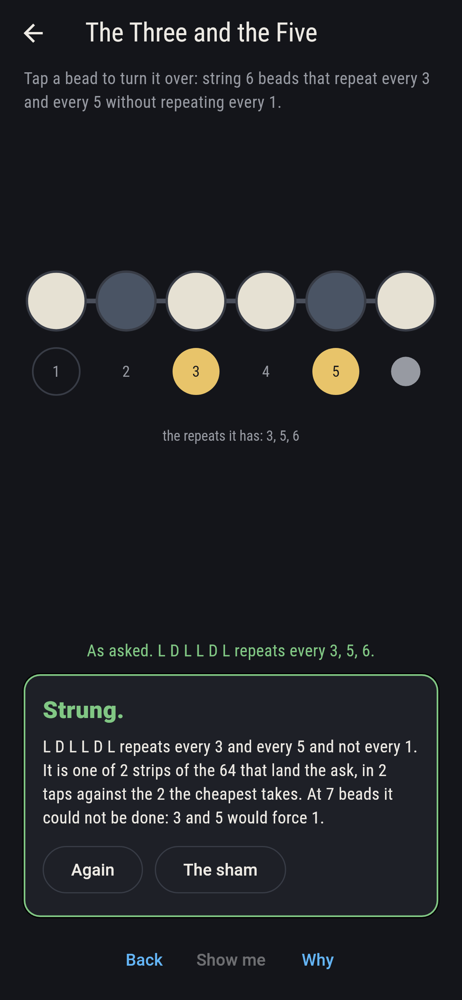
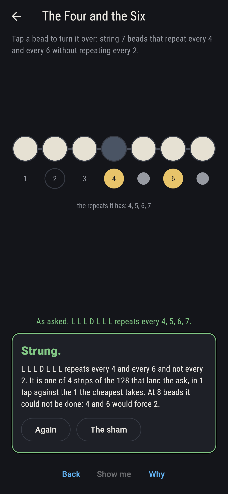
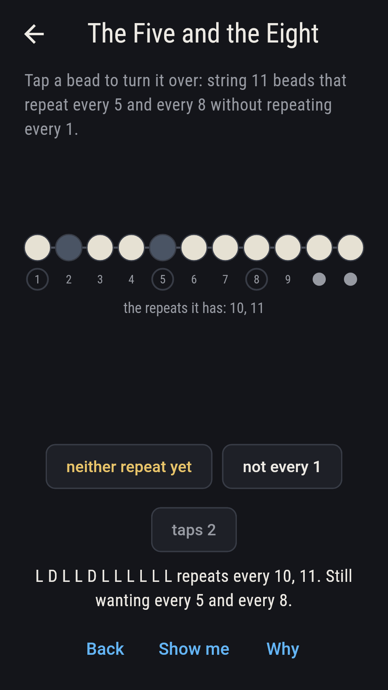
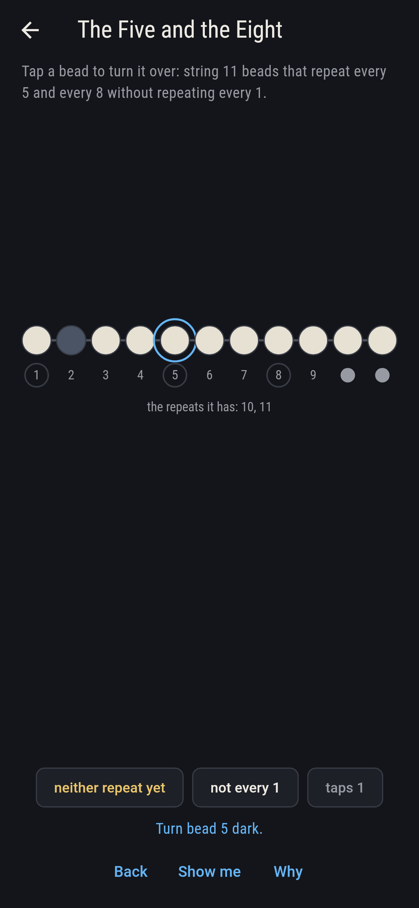
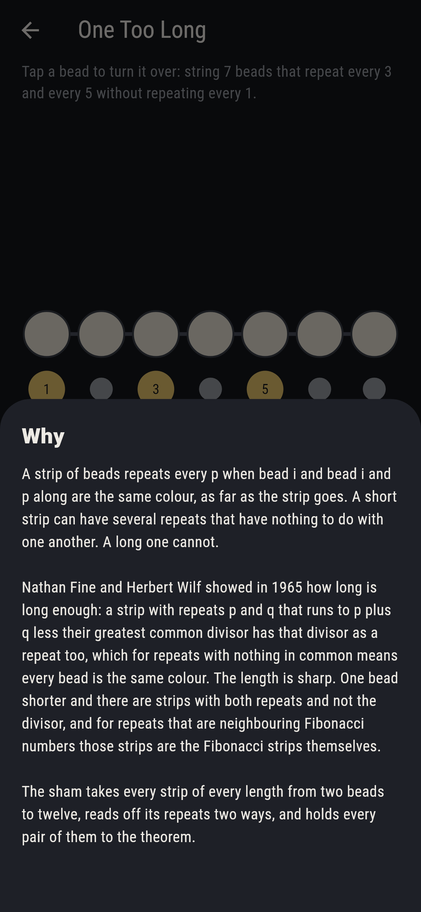

# Beadmere



A strip of beads, each light or dark. The strip repeats every p when
bead i and the bead p along are the same colour, as far as the strip
goes. A short strip can carry several repeats that have nothing to do
with one another; a long one cannot. Nathan Fine and Herbert Wilf gave
the length in 1965: a strip with repeats p and q that runs to p plus q
less their greatest common divisor has that divisor as a repeat too,
which for repeats with nothing in common means every bead the same
colour. The length is sharp. One bead shorter and there are strips
with both repeats and not the divisor, and for repeats that are
neighbouring Fibonacci numbers those strips are the Fibonacci strips.

## The asks

1. **The Two and the Three** - string 3 beads that repeat every 2 and every 3 without repeating every 1
2. **The Three and the Five** - string 6 beads that repeat every 3 and every 5 without repeating every 1
3. **The Four and the Six** - string 7 beads that repeat every 4 and every 6 without repeating every 2
4. **The Five and the Eight** - string 11 beads that repeat every 5 and every 8 without repeating every 1
5. **One Too Long** - string 7 beads that repeat every 3 and every 5 without repeating every 1

Two and three force a repeat of one at four beads, so three is the
longest strip that dodges it, and two of the eight strings do. Three
and five force it at seven, and at six there are two: light dark light
light dark light and its opposite. Four and six share a divisor of
two, so their length is eight rather than ten, and at seven four
strips dodge the repeat of two. Five and eight are Fibonacci numbers,
and the strip of eleven that has both repeats without a repeat of one
is as long as such a strip gets for those two: one bead short of the
twelve at which they would force it. One Too Long asks for the same
three and five at seven beads, which is the bound itself, and none of
the 128 strips of that length manages it: with both repeats every bead
comes out the same colour, and then the strip repeats every one as
well.

## Two voices

Every number the game says out loud was worked out here rather than
guessed, and every repeat is read two ways:

* **Bead by bead.** Each bead is compared with the one p along, all
  the way down the strip. That is what the board lights as you turn
  beads over.
* **Head against tail.** The same repeat read as a border: the strip
  repeats every p when its first beads and its last beads agree over
  the overlap, which never compares a single pair i and i plus p.

The two agree on every strip of every length from two beads to twelve
and on every repeat, 8,188 strips in all. The checker then takes every
pair of repeats a strip has, 11,260 of them, and holds each to Fine
and Wilf: where the strip is long enough the divisor is a repeat too,
every time, and where it is one bead short it need not be.

`tool/check_strips.dart` runs the lot and refuses the bake on any
disagreement.

## The checker's ledger

What `dart run tool/check_strips.dart` printed for the build this
README shipped with, word for word:

```
every strip of beads from 2 to 12 taken, 8,188 strips, and every repeat read twice, once by matching each bead with the one p along and once by matching the strip's head against its tail, which never looks at a single bead pair: the two agree on every strip and every repeat; 11,260 pairs of repeats came up in all, and on the 744 of them where the strip runs to p plus q less their greatest common divisor, the divisor is a repeat too, every time, which is Fine and Wilf; on the 10,242 pairs where the strip is shorter, it need not be; one bead short of the bound the strips that dodge it are these: 2 and 3 give D L D, 2 and 5 give D L D L D, 2 and 7 give D L D L D L D, 2 and 9 give D L D L D L D L D, 2 and 11 give D L D L D L D L D L D, 3 and 4 give D D L D D

 1 The Two and the Three  string 3 beads that repeat every 2 and every 3 without repeating every 1: 2 of the 8 strips land it, the cheapest in 1 tap
 2 The Three and the Five string 6 beads that repeat every 3 and every 5 without repeating every 1: 2 of the 64 strips land it, the cheapest in 2 taps
 3 The Four and the Six   string 7 beads that repeat every 4 and every 6 without repeating every 2: 4 of the 128 strips land it, the cheapest in 1 tap
 4 The Five and the Eight string 11 beads that repeat every 5 and every 8 without repeating every 1: 2 of the 2,048 strips land it, the cheapest in 4 taps
 5 One Too Long           string 7 beads that repeat every 3 and every 5 without repeating every 1: none of the 128, since 7 beads is the bound itself
```

## Screenshots

| The sham | The five and the eight | One too long |
| --- | --- | --- |
|  |  |  |

| The two and the three | The three and the five | The four and the six | Part strung, on the small phone | Show me | The why |
| --- | --- | --- | --- | --- | --- |
|  |  |  |  |  |  |

Screenshots are drawn by `test/showcase_test.dart` at real phone sizes
with the app's own painter, then copied into `docs/` as they came out.
On the board shots every bead was turned by a tap on that bead, so no
strip pictured is one the game could not string. The logo and every
launcher icon come out of `test/mark_test.dart`, drawn by the same
painter: the mark is the strip of eleven that repeats every five and
every eight and not every one, and it stands there with no taps behind
it.

## Building

```
flutter test          # 39 tests, the sweep among them
dart run tool/check_strips.dart
flutter build apk     # or: flutter build ios
```
