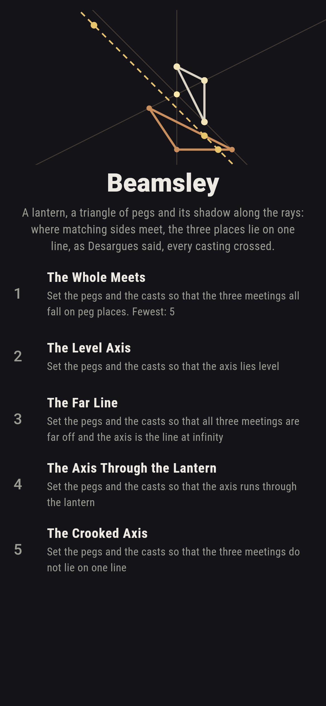
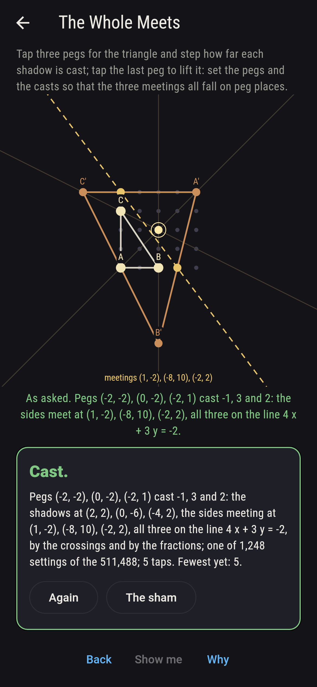
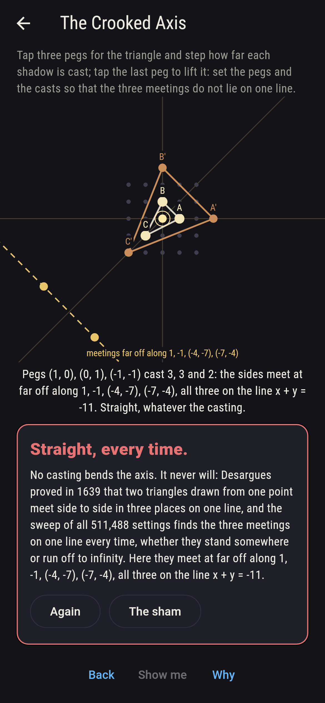
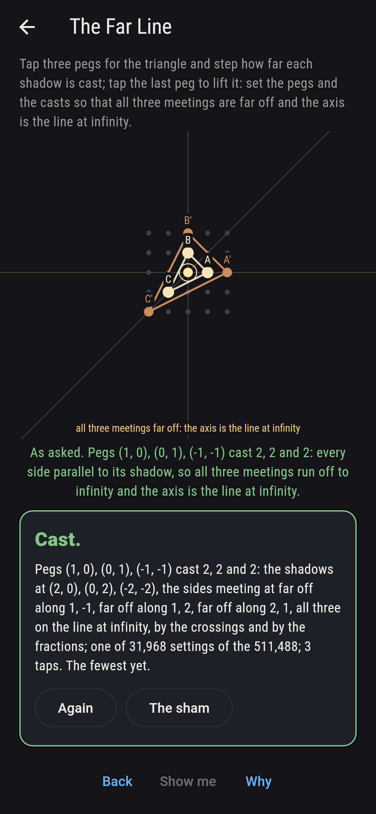
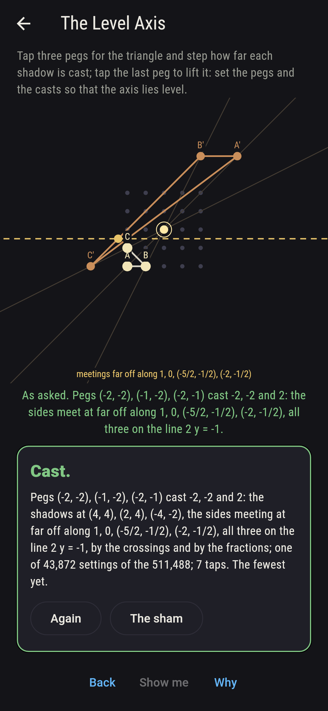
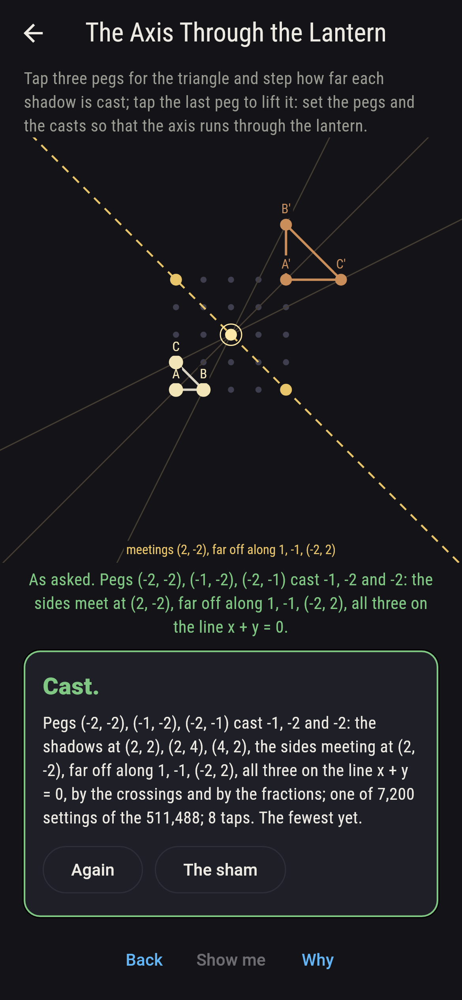
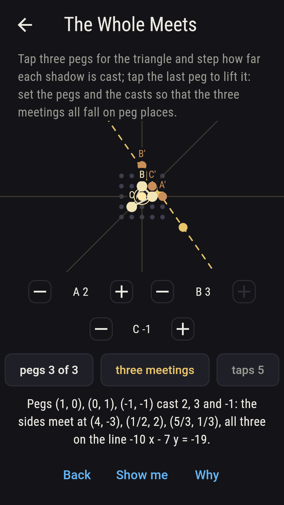
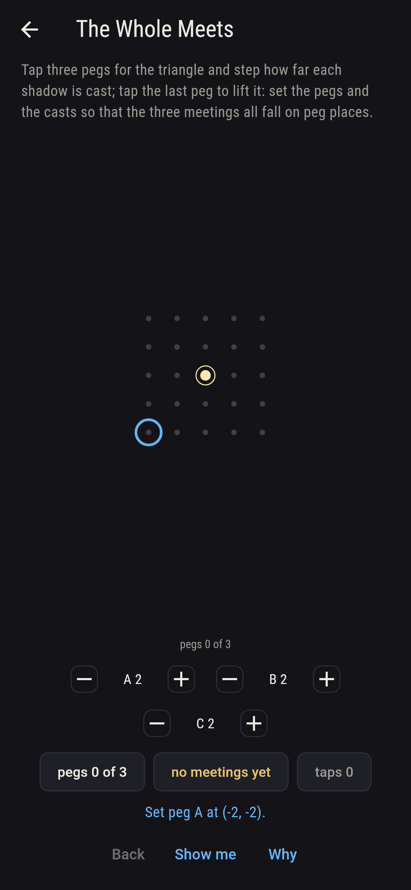
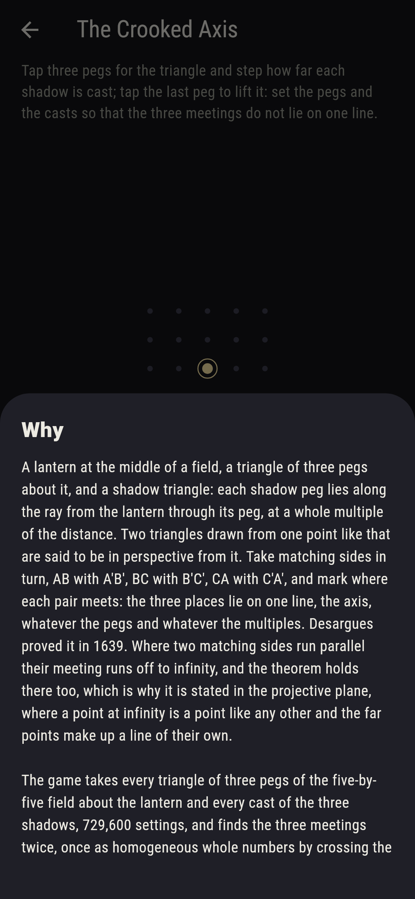

# Beamsley


A lantern at the middle of a field, a triangle of three pegs about
it, and a shadow triangle: each shadow peg lies along the ray from
the lantern through its peg, at a whole multiple of the distance.
Two triangles drawn from one point like that are in perspective from
it. Take matching sides in turn, AB with A'B', BC with B'C', CA with
C'A', and mark where each pair meets: the three places lie on one
line, the axis, whatever the pegs and whatever the multiples.
Desargues proved it in 1639. Where two matching sides run parallel
their meeting runs off to infinity, and the theorem holds there too,
which is why it is stated in the projective plane, where a point at
infinity is a point like any other and the far points make a line of
their own. Tap three pegs and step how far each shadow is cast. The
game takes every triangle of the field and every casting, 511,488
settings, and finds the three meetings twice, once as homogeneous
whole numbers by crossing the side-lines and once by solving the two
lines as plain fractions; the two agree on all of them, and the
three meetings lie on one line every time.

## The asks

1. **The Whole Meets** - set the pegs and the casts so that the three meetings all fall on peg places
2. **The Level Axis** - set the pegs and the casts so that the axis lies level
3. **The Far Line** - set the pegs and the casts so that all three meetings are far off and the axis is the line at infinity
4. **The Axis Through the Lantern** - set the pegs and the casts so that the axis runs through the lantern
5. **The Crooked Axis** - set the pegs and the casts so that the three meetings do not lie on one line

The meetings are fractions as a rule, so all three landing on peg
places is rare: 1,248 settings of the 511,488, the first with the
pegs (-2, -2), (0, -2) and (-2, 1) cast -1, 3 and 2. The axis lies
level on 43,872 settings and upright on as many, since turning the
field a quarter turn turns the axis with it. When the three casts
are equal the shadow triangle is the triangle blown up about the
lantern, every side parallel to its own, so all three meetings run
off to infinity and the axis is the line at infinity: 31,968
settings, four castings for each of the 7,992 triangles. Exactly two
casts equal leaves one meeting far off, 287,712 settings, no two
equal leaves none, 191,808, and two far off with one at hand never
happens. The axis runs through the lantern itself on 7,200 settings.
Triangles with two pegs on one ray are left out, 3,408 of them: that
side and its shadow lie along one line and have no single meeting.
The Crooked Axis is labeled hopeless on its tile: Desargues said so
first, and the sweep finds the three meetings on one line every
time; the sham admits it after three settings have shown their axis,
or after twenty-four taps.

## Two voices

The game never asserts what it has not computed, and it computes
everything at least twice:

* **The crossings** work in homogeneous whole numbers: a side is the
  cross of its two ends, a meeting is the cross of two sides, and
  three points lie on a line when their determinant is nought. A
  meeting with a nought last part is a point at infinity, which the
  arithmetic handles like any other. Every count on the sham is that
  crossing's, and every meeting is checked to lie on both the sides
  that made it and on the axis.
* **The fractions** know nothing of infinity: each pair of sides is
  written as two equations and solved, which gives a plain fraction
  for each coordinate, or nothing at all when the two run parallel.
  It agrees with the crossings on all 511,488 settings, nothing
  exactly where the crossing says the meeting is far off.

`tool/check_shadows.dart` runs the lot and refuses the bake on any
disagreement.

## The checker's ledger

What `dart run tool/check_shadows.dart` printed for the build this
README shipped with, word for word:

```
every triangle of three pegs of the field about the lantern taken, 7,992 of them, with every cast of the three shadows, four apiece, 511,488 settings, and the three meetings of matching sides found twice, once as homogeneous whole numbers by crossing the side-lines and once by solving the two lines as plain fractions, the two agreeing on all 511,488: every meeting lies on both the sides that made it, the three lie on one line on every setting, and every meeting lies on that line; the three never fall together; the casts are equal on 31,968 settings and those are exactly the 31,968 where all three meetings run off to infinity and the axis is the line at infinity, exactly two equal leaves one meeting far off, 287,712 settings, none equal leaves none, 191,808, and two meetings far off with one at hand never happens; the three meetings all fall on peg places on 1,248 settings, the axis lies level on 43,872 and upright on as many, and runs through the lantern on 7,200; the pegs (1, 0), (0, 1) and (-1, -1) cast 2, 3 and -1 meet at (4, -3), (1/2, 2) and (5/3, 1/3)

 1 The Whole Meets              set the pegs and the casts so that the three meetings all fall on peg places: 1,248 of the 511,488 settings land it
 2 The Level Axis               set the pegs and the casts so that the axis lies level: 43,872 of the 511,488 settings land it
 3 The Far Line                 set the pegs and the casts so that all three meetings are far off and the axis is the line at infinity: 31,968 of the 511,488 settings land it
 4 The Axis Through the Lantern set the pegs and the casts so that the axis runs through the lantern: 7,200 of the 511,488 settings land it
 5 The Crooked Axis             set the pegs and the casts so that the three meetings do not lie on one line: none of the 511,488, and Desargues said so first
```

## Screenshots

| The sham | The whole meets | The crooked axis admitted |
| --- | --- | --- |
|  |  |  |

| The far line | The level axis | The axis through the lantern | Midway, on the small phone | Show me | The why |
| --- | --- | --- | --- | --- | --- |
|  |  |  |  |  |  |

Screenshots are drawn by `test/showcase_test.dart` at real phone
sizes with the app's own painter, then copied into `docs/` as they
came out; every peg in them was set by a tap and every cast stepped
on its dial, so nothing pictured is a setting the game could not
reach. The logo and every launcher icon come out of
`test/mark_test.dart` the same way: the mark is the pegs (2, -2),
(0, 2) and (2, 1) cast 2, -2 and -1, whose sides meet at (3, -4),
(-6, 5) and (2, -3), three peg places on one line.

## Building

```
flutter test          # 45 tests, the sweep among them
dart run tool/check_shadows.dart
flutter build apk     # or: flutter build ios
```
