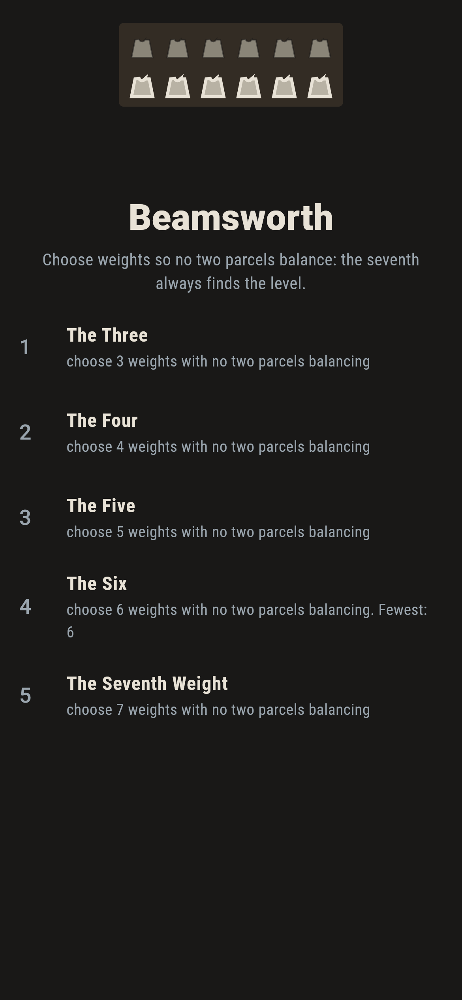
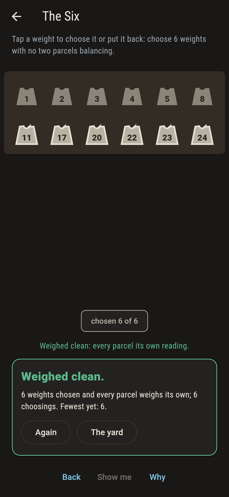
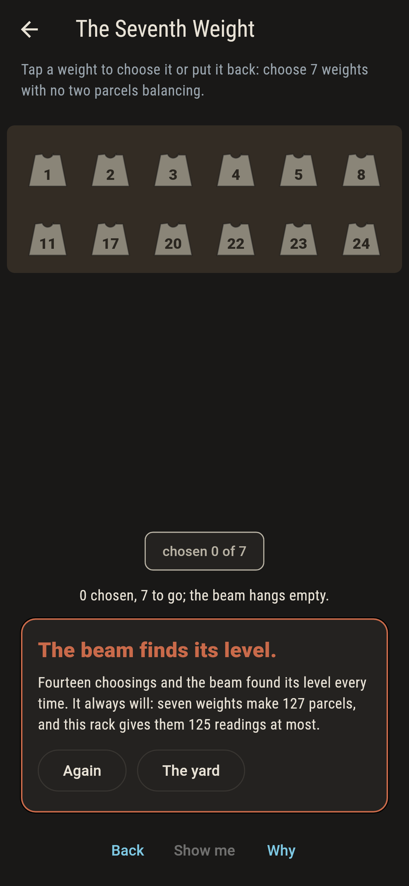
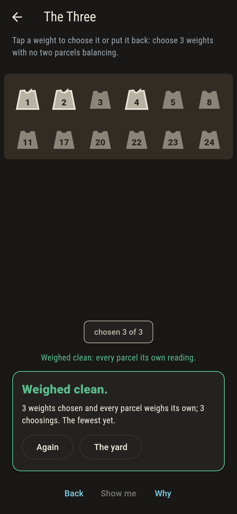
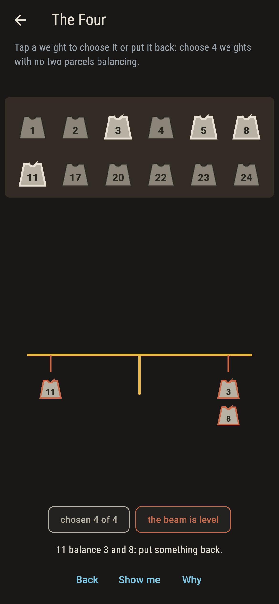
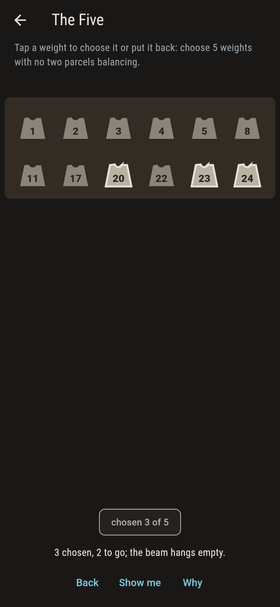
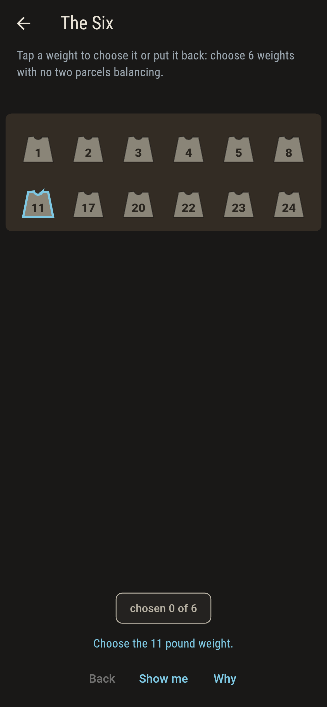
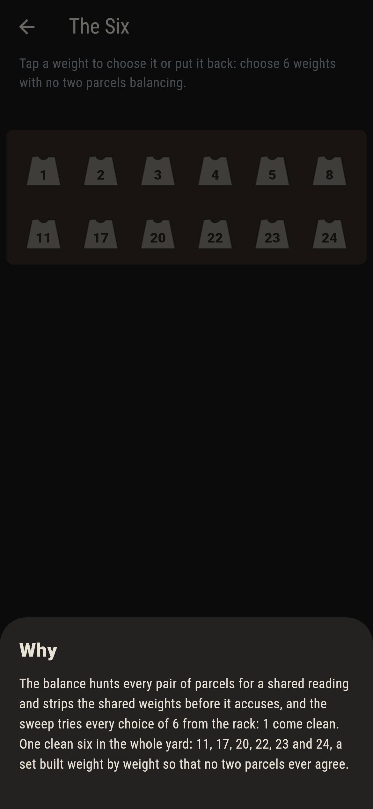

# Beamsworth


Twelve weights on a rack, a balance beam below, and one rule:
choose weights so that no two parcels of them balance, which is
the same as every parcel weighing its own. The yard holds
exactly one clean choice of six, built weight by weight, and no
clean seven exists by counting alone: seven weights make 127
parcels, and no seven here weigh past 125 together.

## The worths

1. **The Three** - choose 3 weights with no two parcels balancing
2. **The Four** - choose 4 weights with no two parcels balancing
3. **The Five** - choose 5 weights with no two parcels balancing
4. **The Six** - choose 6 weights with no two parcels balancing
5. **The Seventh Weight** - choose 7 weights with no two parcels balancing

The clean counts run 206, 331, 142, 1, none. The one clean six
is 11, 17, 20, 22, 23 and 24. The Seventh asks for what the
crate counting forbids: 127 parcels cannot take 125 readings
without two sharing one, and when they share, the beam hangs
level and shows you both sides.

## Two voices

The game never asserts what it has not computed, and it computes
everything at least twice:

* **The balance** sums every parcel of the chosen weights,
  finds the first shared reading, strips the shared weights,
  and hangs the two sides on the beam.
* **The sweep** tries every choice from the rack, threes to
  sevens, and counts the clean; the checker also weighs every
  accusation and finds both sides true.

`tool/check_beams.dart` runs the lot, crate counting included,
and refuses the bake on any disagreement.

## The checker's ledger

What `dart run tool/check_beams.dart` printed for the build this
README shipped with, word for word:

```
every choice from the rack swept, threes to sevens: the clean counts run 206, 331, 142, 1 and none, the one clean six is 11, 17, 20, 22, 23 and 24, every reported balance weighs true on both sides, and seven weights carry 127 parcels into 125 readings at most

 1 The Three          choose 3 weights with no two parcels balancing: 206 choices of the sweep land it
 2 The Four           choose 4 weights with no two parcels balancing: 331 choices of the sweep land it
 3 The Five           choose 5 weights with no two parcels balancing: 142 choices of the sweep land it
 4 The Six            choose 6 weights with no two parcels balancing: 1 choice of the sweep lands it
 5 The Seventh Weight choose 7 weights with no two parcels balancing: none of the 792, and the crate counting said so first
```

## Screenshots

| The yard | The six weighed clean | The seventh admitted |
| --- | --- | --- |
|  |  |  |

| A clean three | The beam level | Mid-choosing | Show me | The why |
| --- | --- | --- | --- | --- |
|  |  |  |  |  |

Screenshots are drawn by `test/showcase_test.dart` at real phone
sizes with the app's own painter, then copied into `docs/` as
they came out; every weight in them was chosen by taps, so
nothing pictured is a yard the game could not reach. The logo
and every launcher icon come out of `test/mark_test.dart` the
same way: the mark is the one clean six.

## Building

```
flutter test          # 45 tests, the sweep among them
dart run tool/check_beams.dart
flutter build apk     # or: flutter build ios
```
