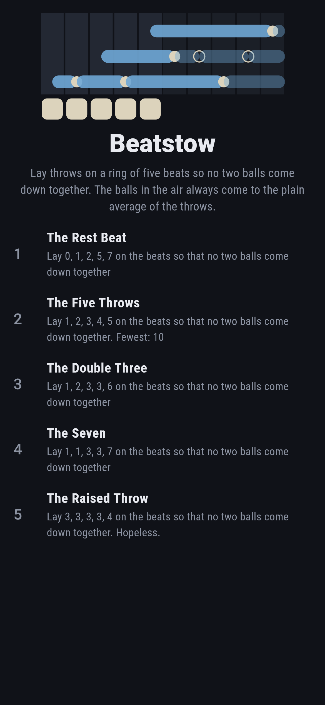
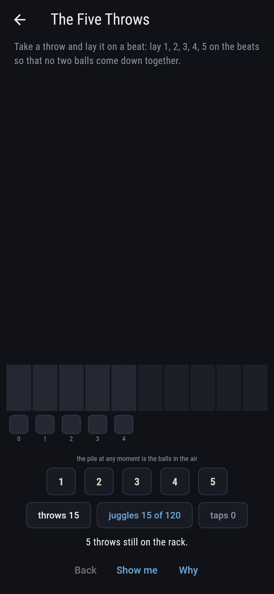
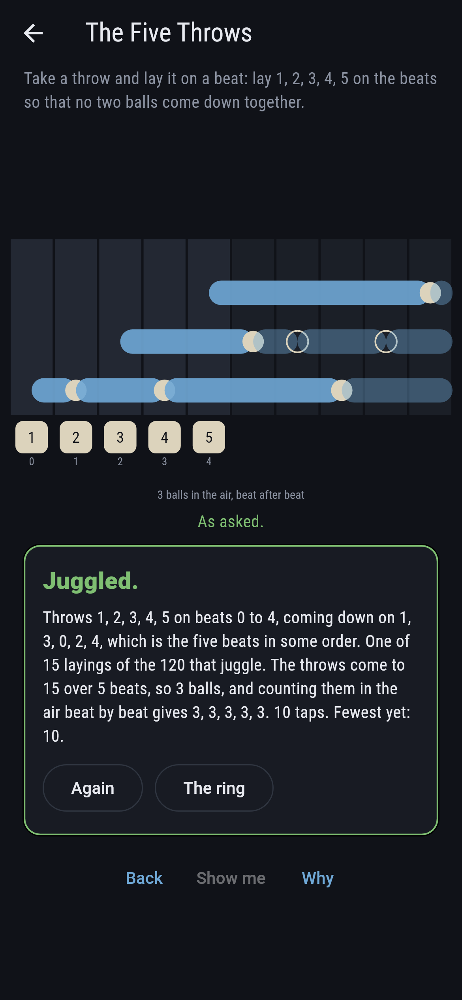
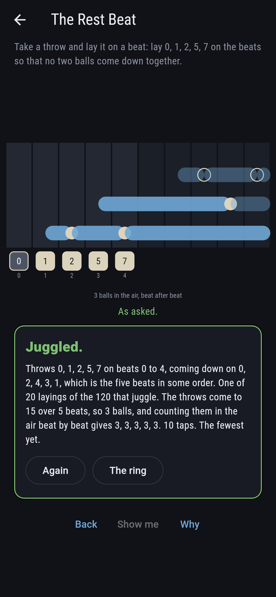
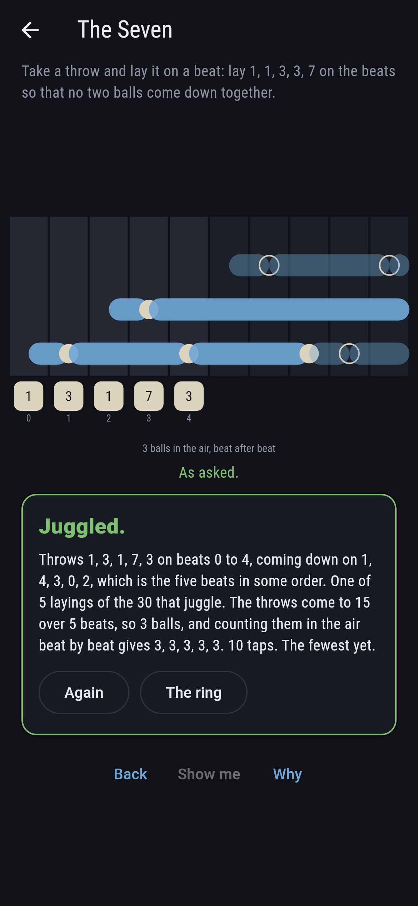
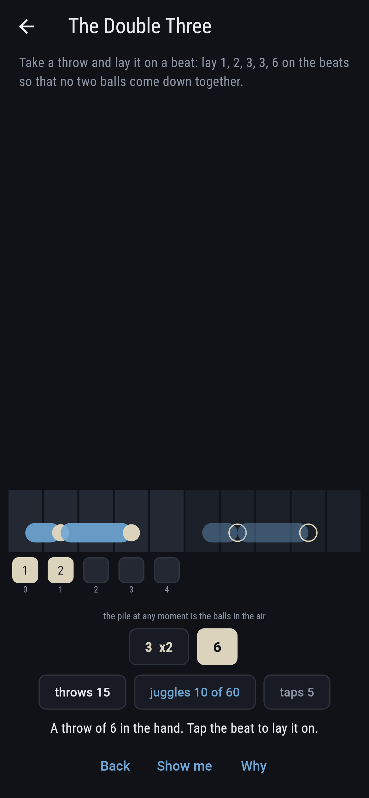
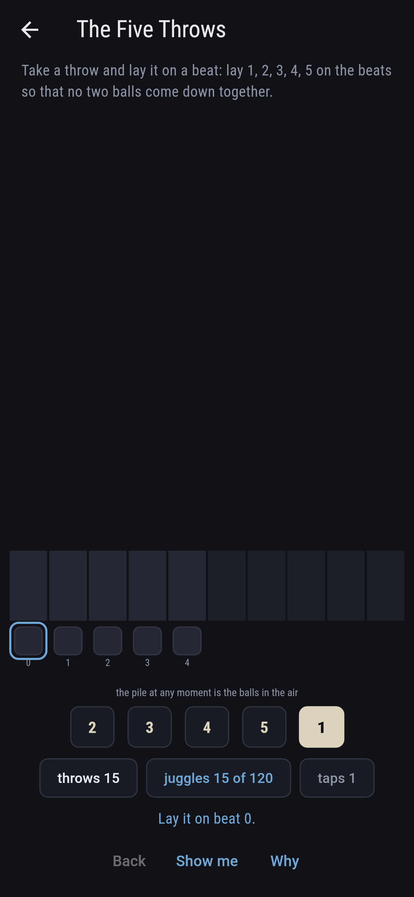
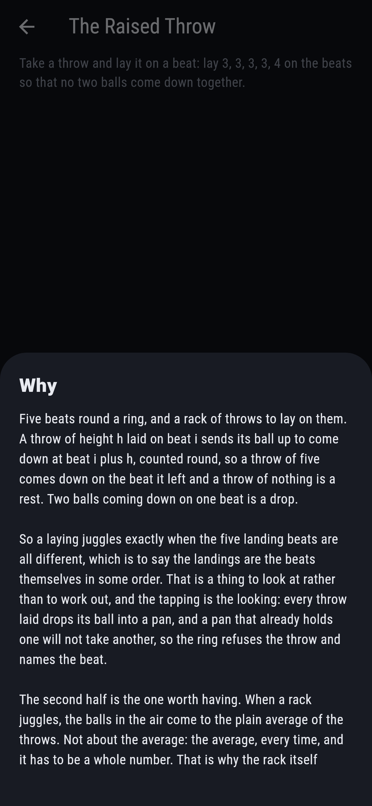
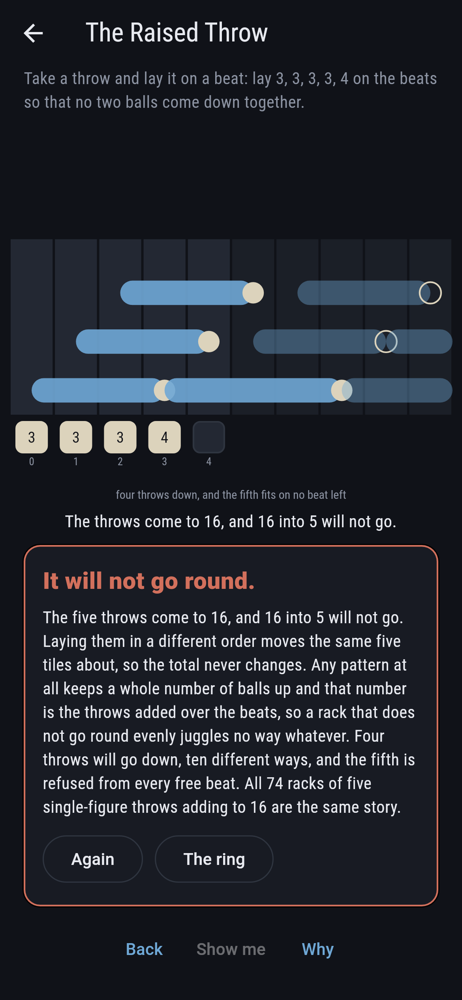

# Beatstow


A ring of five beats and a rack of five throws to lay on them. A
throw of height h laid on beat i sends its ball up to come down at
beat i plus h, counted round the ring, so a throw of five comes down
on the beat it left and a throw of nothing is a rest. Two balls
coming down on one beat is a drop. So a laying juggles exactly when
the five landing beats are all different, which is to say the
landings are the beats themselves in some order. The half worth
having is the other one: when a rack juggles, the balls in the air
come to the plain average of the throws. Not about the average, the
average, every time, and it has to be a whole number. That is why
the rack settles the matter before a single throw is laid. Add the
throws up, and if the total does not go round the beats evenly, no
arrangement of them juggles at all. Every rack of five single-figure
throws is walked before the bake, 2,002 of them, and every laying of
every one, 100,000 layings, with three voices agreeing on all of
them.

## The asks

1. **The Rest Beat** - lay 0, 1, 2, 5, 7 on the beats so that no two balls come down together
2. **The Five Throws** - lay 1, 2, 3, 4, 5 on the beats so that no two balls come down together
3. **The Double Three** - lay 1, 2, 3, 3, 6 on the beats so that no two balls come down together
4. **The Seven** - lay 1, 1, 3, 3, 7 on the beats so that no two balls come down together
5. **The Raised Throw** - lay 3, 3, 3, 3, 4 on the beats so that no two balls come down together

The first four racks all add to 15, which is three balls on five
beats, and they juggle 20, 15, 10 and 5 ways out of 120, 120, 60 and
30 layings. Those four counts are five times four, three, two and
one, because turning a laying round the ring gives another laying
that juggles, so the ways always come in fives. What the ladder
counts, then, is rhythms: four of them, then three, then two, then
one. Twenty is the most any rack of three balls on five beats
reaches, and only two racks reach it. The fifth rack adds to 16, and
16 into 5 will not go. It is labeled hopeless on its tile, and the
arithmetic is the why: rearranging moves the same five tiles about,
so the total never changes, and the total has to be the balls times
the beats. Four throws will go down, ten different ways, and the
fifth is refused from every free beat.

## Three voices

The game never asserts what it has not computed, and it computes
everything at least twice:

* **The landings** take each laying and ask whether the five beats
  the balls come down on are all different. Every count on the tile
  and the card is this one's.
* **The watching** knows nothing of landings and nothing of averages.
  It runs the pattern out and counts the balls still in the air after
  each beat. On a laying that juggles that count holds steady and
  comes to the average; on one that drops it wobbles. So it decides
  the same question by looking at something else entirely, and it
  hands back the ball count for free.
* **The closed form** lays nothing out at all. The patterns of n
  beats keeping b balls number b plus one raised to the n, less b
  raised to the n. It is held against a sweep that puts no cap on the
  throws, which is where it is true: 1, 31, 211 and 781 for none, one,
  two and three balls on five beats.

`tool/check_beats.dart` runs the lot and refuses the bake on any
disagreement. It also holds the rack's own arithmetic to the sweep: a
rack juggles some way exactly when its total goes round the beats
evenly, 402 racks of the 2,002 doing both and 1,600 doing neither,
with no rack doing one and not the other.

Threadwick in this collection is the nearest board: nails round a
hoop and a thread that skips the same count every time, coming home
when the skip and the nail count share nothing. That is this game
with every throw the same height. Letting the throws differ beat by
beat turns a question about common factors into a question about
whether five landings are all different, and brings the average with
it. Roostwick, two games back, shares the shape of the ask, everything
in a place of its own with the ways falling to zero.

## The checker's ledger

What `dart run tool/check_beats.dart` printed for the build this
README shipped with, word for word:

```
every rack of 5 throws from nothing to nine taken, 2,002 of them, and every different way of laying each on the beats, 100,000 layings in all: 3,840 juggle, meaning no two balls come down together; each laying was read two ways, once by taking the landing beats and asking whether they are all different, and once by watching the pattern run and counting the balls still in the air after each beat, which knows nothing of landings: the two agreed 100,000 times out of 100,000; on every laying that juggles the balls in the air held steady beat by beat and came to the throws added up over the beats, the plain average, every time; the rack settles the matter before a throw is laid, since a rack juggles some way exactly when its total goes round the beats evenly: 402 racks of the 2,002 do both and 1,600 do neither, with no rack doing one and not the other; the ways a rack can be laid come to 0, 1, 5, 10, 15 or 20 and nothing else, since turning a laying round the ring gives another, and the count of 1 belongs to the racks whose five throws are all the same; a third voice lays nothing out at all and counts the patterns of five beats keeping b balls as b plus one raised to the five, less b raised to the five, and it agrees with a sweep that puts no cap on the throws; all 74 racks of five single-figure throws adding to 16 juggle no way whatever, and on the one the last ask ships, four throws will go down 10 different ways and the fifth is refused from every free beat every time

 1 The Rest Beat    lay 0, 1, 2, 5, 7 on the beats so that no two balls come down together: 20 of its 120 layings juggle, 10 taps for a clean run
 2 The Five Throws  lay 1, 2, 3, 4, 5 on the beats so that no two balls come down together: 15 of its 120 layings juggle, 10 taps for a clean run
 3 The Double Three lay 1, 2, 3, 3, 6 on the beats so that no two balls come down together: 10 of its 60 layings juggle, 10 taps for a clean run
 4 The Seven        lay 1, 1, 3, 3, 7 on the beats so that no two balls come down together: 5 of its 30 layings juggle, 10 taps for a clean run
 5 The Raised Throw lay 3, 3, 3, 3, 4 on the beats so that no two balls come down together: none of its 5, and the throws added up said so first
```

## Screenshots

| The ring | An ask as it opens | The five throws |
| --- | --- | --- |
|  |  |  |

| The rest beat | The seven | A throw in the hand | Show me | The why | It will not go round |
| --- | --- | --- | --- | --- | --- |
|  |  |  |  |  |  |

The chart runs two periods across so that a flight can be drawn
straight out from the beat it left to the beat it comes down on. The
first five columns are the ring itself; the five after are the same
pattern coming round again, drawn dim. The height of the pile at any
moment is the balls in the air, which is why a laying that juggles
draws a level pile.

Screenshots are drawn by `test/showcase_test.dart` at real phone
sizes with the app's own painter, then copied into `docs/` as they
came out; every throw in them was laid by taking it off the rack and
tapping a beat, so nothing pictured is a laying the game could not
reach. The logo and every launcher icon come out of
`test/mark_test.dart` the same way: the mark is 1, 2, 3, 4, 5 laid so
they juggle, three balls in the air.

## Building

```
flutter test          # 60 tests, the three voices among them
dart run tool/check_beats.dart
flutter build apk     # or: flutter build ios
```
