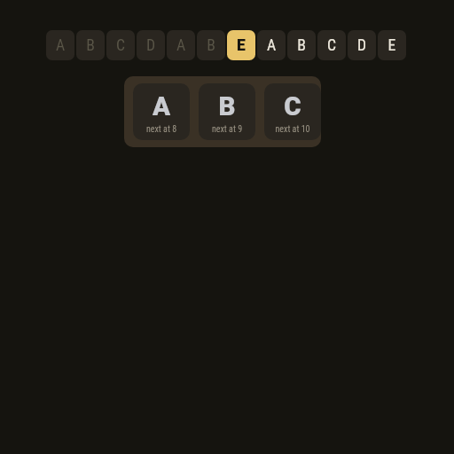
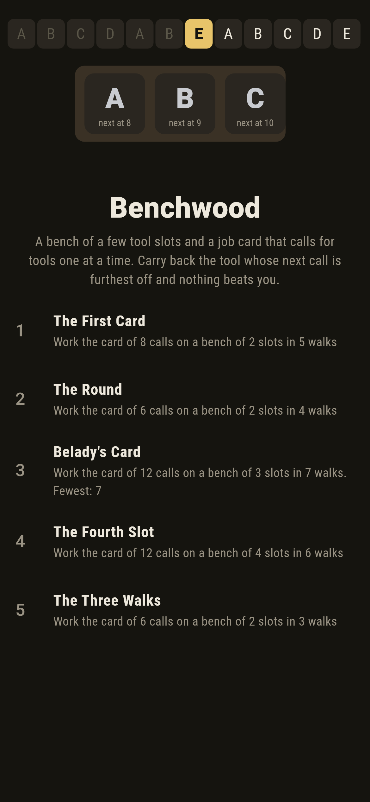
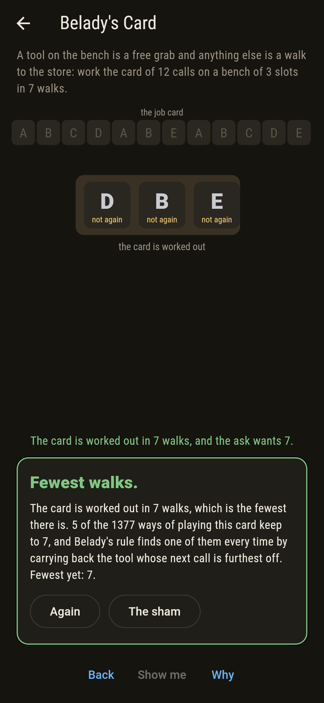
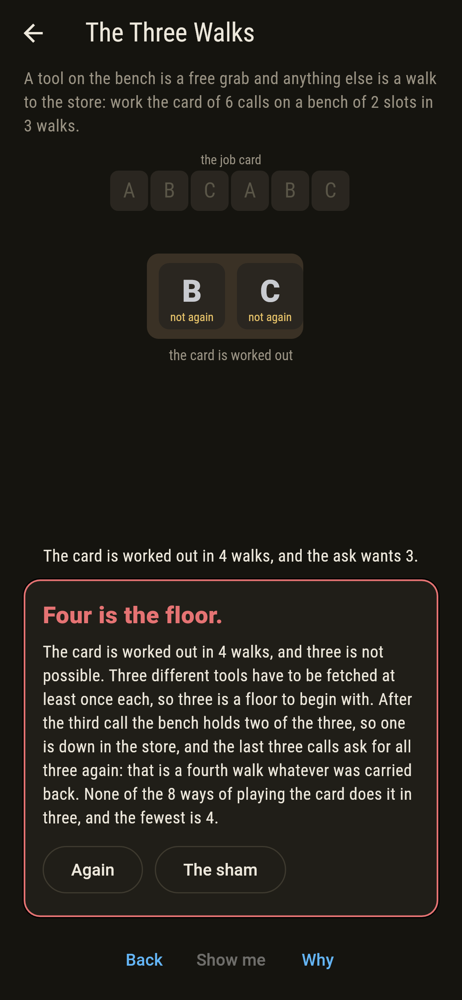
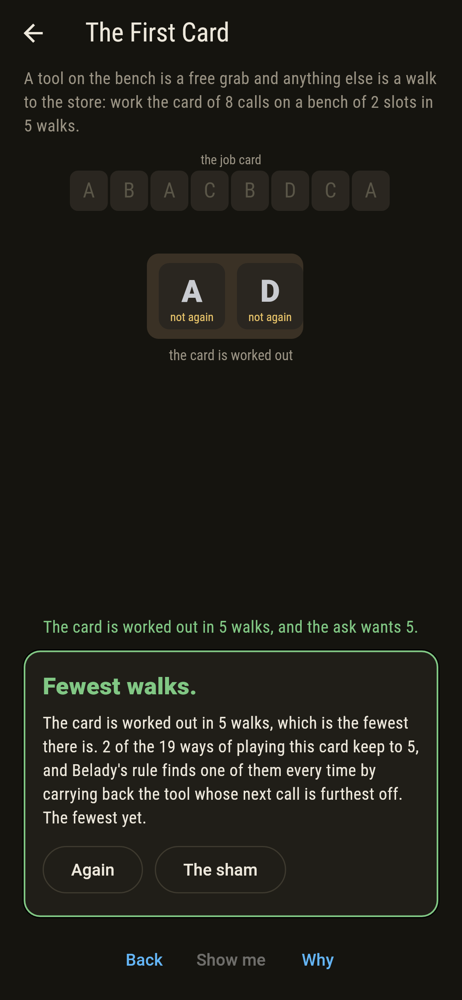
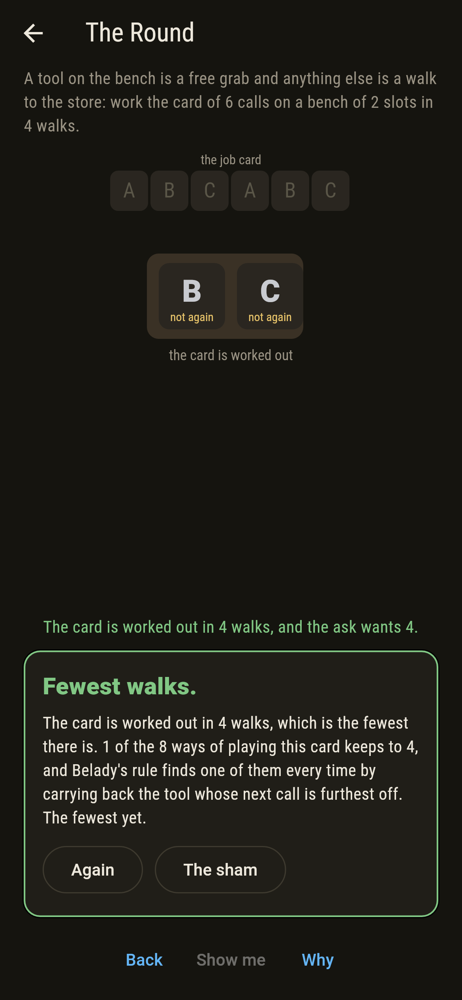
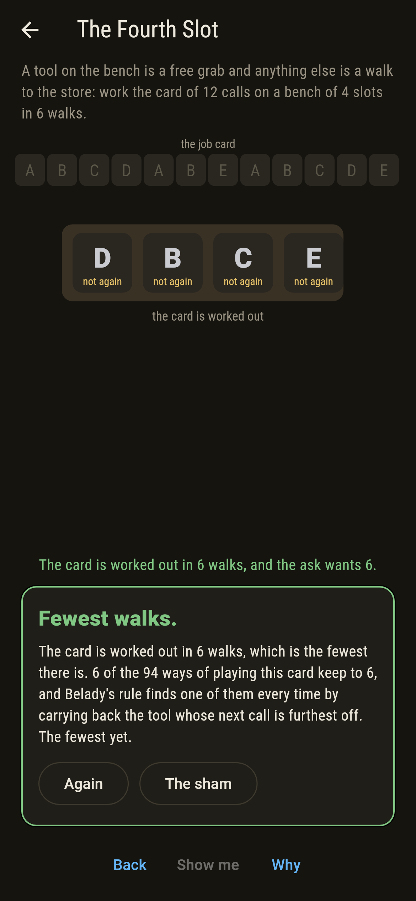
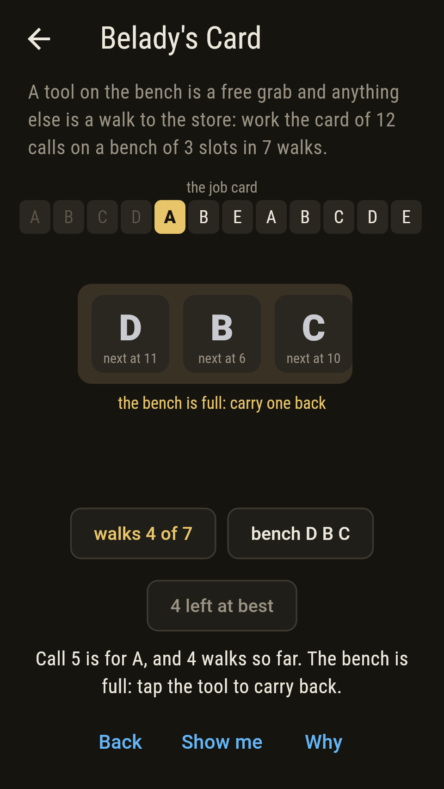
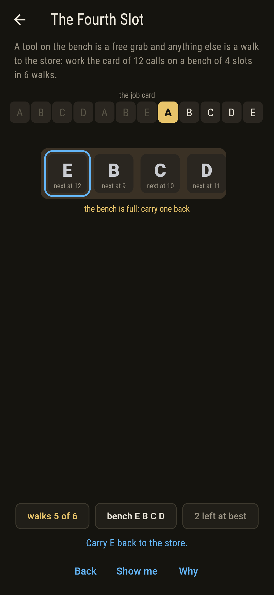
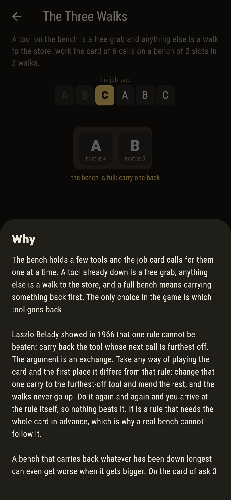

# Benchwood



A joiner's bench with a few tool slots, a store down the yard, and a
job card that calls for tools one at a time. A tool already on the
bench is a free grab. Anything else is a walk to the store, and if the
bench is full something has to be carried back first. That carry is
the only choice in the whole game. Laszlo Belady showed in 1966 that
one rule cannot be beaten: carry back the tool whose next call is
furthest off. The argument is an exchange. Take any way of working the
card and the first place it differs from that rule, change that one
carry to the furthest-off tool and mend the rest, and the walks never
go up; do it again and again and you arrive at the rule itself. It is
a rule that needs the whole card in advance, which is why a real bench
cannot follow it. The screen writes over each tool the call it is
wanted for next, so the rule is something to see rather than something
to be told.

## The asks

1. **The First Card** - work the card of 8 calls on a bench of 2 slots in 5 walks
2. **The Round** - work the card of 6 calls on a bench of 2 slots in 4 walks
3. **Belady's Card** - work the card of 12 calls on a bench of 3 slots in 7 walks
4. **The Fourth Slot** - work the same card on a bench of 4 slots in 6 walks
5. **The Three Walks** - work the card of 6 calls on a bench of 2 slots in 3 walks

The Round is three tools called round and round, A B C A B C, on a
bench of two. Four walks is the fewest, and exactly one of the eight
ways of working the card manages it: carry back B when C is called,
since A comes round sooner, and then A when B is called, since A is
not called again at all. Carrying back whatever has been down longest
takes six there, a walk for every call. Belady's Card is the one the
1969 paper used, A B C D A B E A B C D E: seven walks on three slots
and six on four by the rule, and nine and then ten by carrying back
the oldest, which is the anomaly the paper is about. A bigger bench,
more walking. The Three Walks is hopeless, and the reason fits on a
finger: three different tools have to be fetched at least once each,
so three is a floor to begin with, and after the third call the bench
holds two of the three, so the last three calls ask for one that is
down in the store. That is a fourth walk whatever was carried back.

## Two voices

Every number the game says out loud was worked out here rather than
guessed, and every card is worked two ways:

* **Belady's rule** walks the card once, carrying back the tool whose
  next call is furthest off. It is a count of walks and nothing else,
  and it is what the pointer follows as you play.
* **Every eviction** is the other. It goes over the card from every
  standing the bench can be in, tries each tool in turn as the one
  carried back, and keeps the fewest walks that follow. It knows
  nothing of the rule and takes no account of what is called next.

The checker runs both over every job card of ten calls on at most four
tools, with the tools named in the order they are first called so that
renaming them makes no new cards, at every bench from one slot to
four. That is 43,947 cards and 175,788 workings, and the two counts
agree on all of them. It also checks that a bigger bench never costs
Belady's rule a walk, and sweeps the longer cards, all 2,079,475 of
twelve calls on at most five tools, for the rule that carries back the
oldest tool: it wants more walks on a bigger bench on exactly one of
them, and that one is Belady's own card.

`tool/check_walks.dart` runs the lot and refuses the bake on any
disagreement.

## The checker's ledger

What `dart run tool/check_walks.dart` printed for the build this README
shipped with, word for word:

```
every job card of 10 calls on at most 4 tools taken, the tools named in the order they are first called so that renaming them makes no new cards, 43,947 cards in all, and each one worked at every bench from one slot to 4, 175,788 workings: the walks Belady's rule takes, carrying back the tool whose next call is furthest off, and the fewest walks any way of choosing can manage, found by trying every eviction from every standing, agree on every one of them; carrying back whatever has been down longest never beats the rule and is worse on 47,720 of the workings, level with it on 128,068; over the longer cards, every one of the 2,079,475 of twelve calls on at most 5 tools, it wants more walks on a bench one slot bigger on exactly 1 of them, the card A B C D A B E A B C D E going from 3 slots to 4, while Belady's rule never once does; on that card the rule takes seven walks on three slots and six on four, as more room ought to give, where carrying back the oldest takes nine and then ten; the asks are counted over every way their cards can be played out: 19 ways for The First Card, 2 of them keeping to 5, 8 ways for The Round, 1 of them keeping to 4, 1,377 ways for Belady's Card, 5 of them keeping to 7, 94 ways for The Fourth Slot, 6 of them keeping to 6, 8 ways for The Three Walks, 0 of them keeping to 3

 1 The First Card  work the card of 8 calls on a bench of 2 slots in 5 walks: 2 of the 19 ways of playing it keep to 5 walks, and that is the fewest there is
 2 The Round       work the card of 6 calls on a bench of 2 slots in 4 walks: 1 of the 8 ways of playing it keeps to 4 walks, and that is the fewest there is
 3 Belady's Card   work the card of 12 calls on a bench of 3 slots in 7 walks: 5 of the 1,377 ways of playing it keep to 7 walks, and that is the fewest there is
 4 The Fourth Slot work the card of 12 calls on a bench of 4 slots in 6 walks: 6 of the 94 ways of playing it keep to 6 walks, and that is the fewest there is
 5 The Three Walks work the card of 6 calls on a bench of 2 slots in 3 walks: none of the 8 ways, since 4 is the floor
```

## Screenshots

| The sham | Belady's card | The three walks |
| --- | --- | --- |
|  |  |  |

| The first card | The round | The fourth slot | A bench waiting, on the small phone | Show me | The why |
| --- | --- | --- | --- | --- | --- |
|  |  |  |  |  |  |

Screenshots are drawn by `test/showcase_test.dart` at real phone sizes
with the app's own painter, then copied into `docs/` as they came out.
On the board shots every carry was made by a tap on the tool, so no
standing pictured is one the game could not reach. The logo and every
launcher icon come out of `test/mark_test.dart`, drawn by the same
painter: the mark is Belady's card two carries in, which is the mark
standing rather than a run of taps.

## Building

```
flutter test          # 44 tests, the sweep among them
dart run tool/check_walks.dart
flutter build apk     # or: flutter build ios
```
