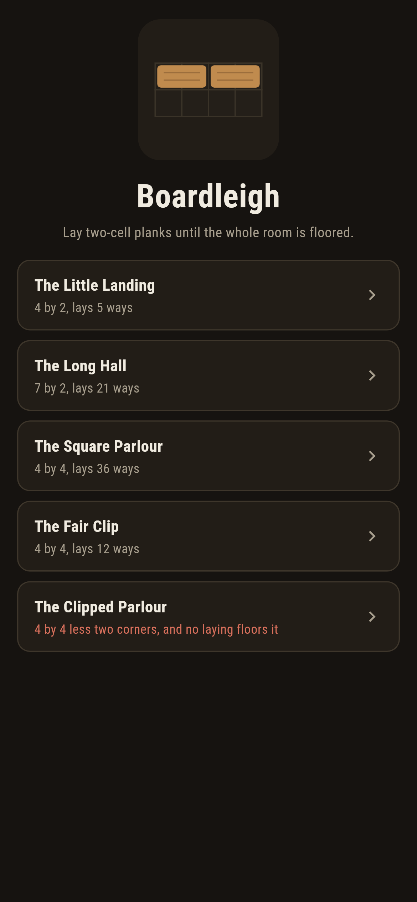
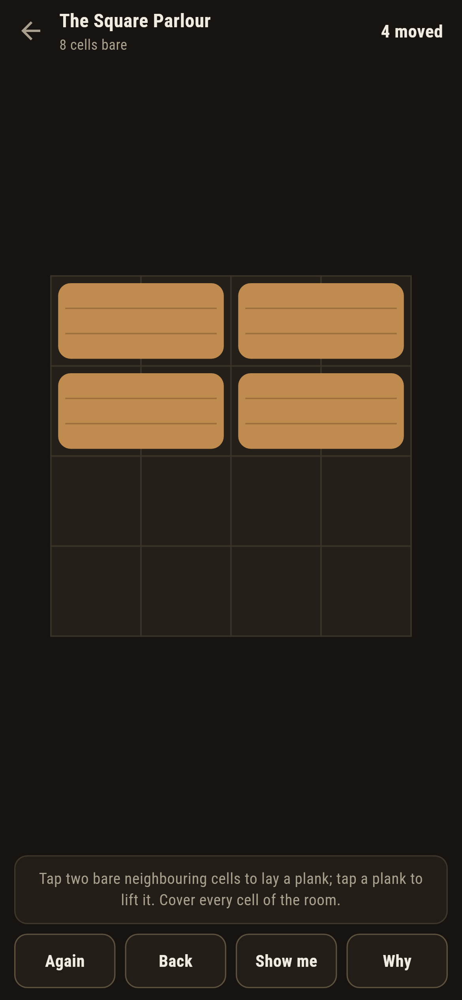
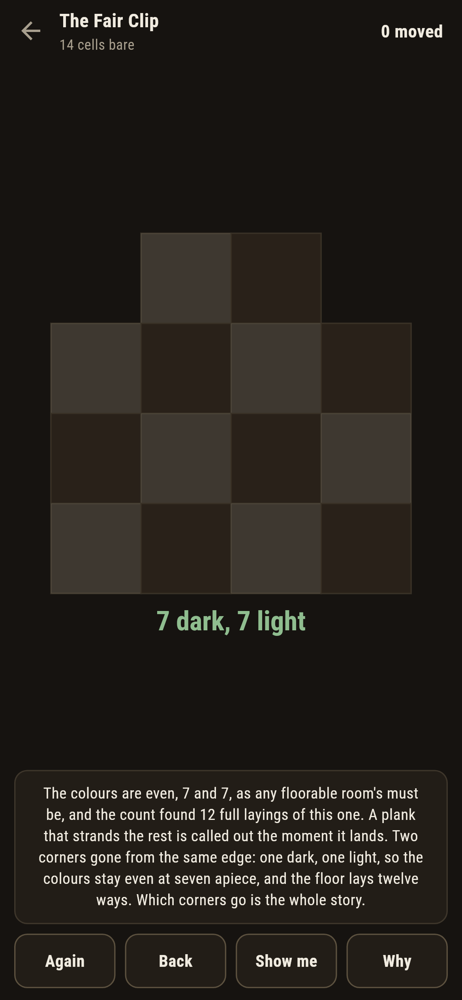
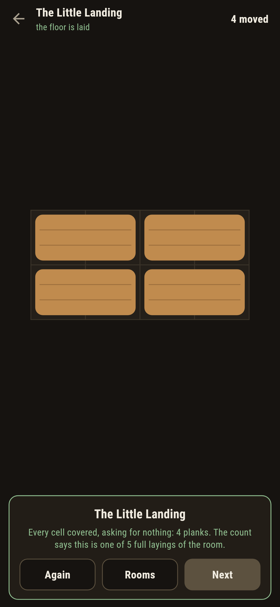
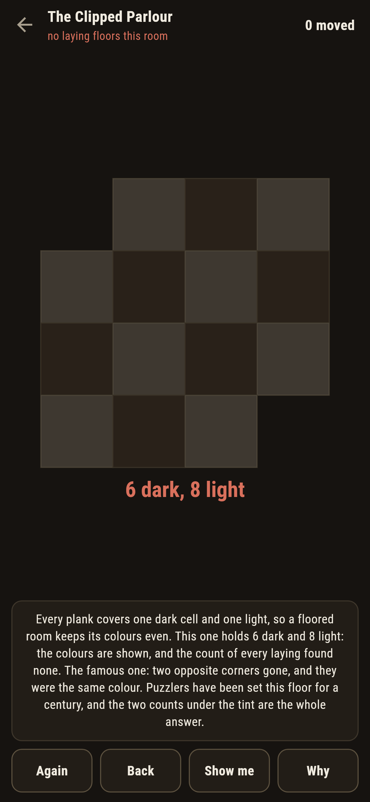
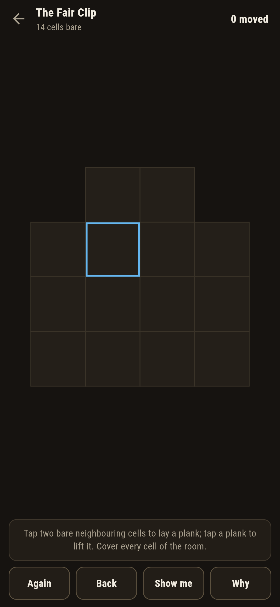

# Boardleigh

A floor-planking puzzle for phones, in Flutter, for Android and iOS.

A bare room and a stack of two-cell planks. Lay them side by side or
one atop the other until every cell is covered, nothing overlapping,
nothing over the edge. Domino tilings, laid by hand, with the
counting that owns them in plain view.

| | | | |
|---|---|---|---|
|  |  |  |  |

## Two ways of knowing

The count tries every laying of a room outright: the square parlour
lays 36 ways, the strips run 1, 2, 3, 5, 8, 13, 21, 34, and on the
strips the staircase rule stands as a second voice, each count the
two before it added, met at every length. The checker refuses the
bake if the count and the rule ever part.

```
$ make rooms
two-board strips count 1, 2, 3, 5, 8, 13, 21, 34: each the two before it added, as the staircase rule says

 1 The Little Landing  8 cells  lays 5 ways, colours 4 and 4
 2 The Long Hall       14 cells  lays 21 ways, colours 7 and 7
 3 The Square Parlour  16 cells  lays 36 ways, colours 8 and 8
 4 The Fair Clip       14 cells  lays 12 ways, colours 7 and 7
 5 The Clipped Parlour 14 cells  never lays: colours 6 and 8
```

## The clipped parlour

The famous one: a parlour with two opposite corners gone, and they
were the same colour. Every plank covers one dark cell and one
light, so a floored room keeps its colours even; this one holds six
of one and eight of the other, and the count of every laying agrees:
none. It ships labelled, in the house tradition of maps nobody can
win, and **Why** tints the two colours and counts them in front of
you. The Fair Clip stands beside it, the same parlour with two
corners of different colours gone, flooring twelve ways: which
corners go is the whole story.



## The live floor

A plank that strands what is left, leaving a remainder no laying
covers, is called out the moment it lands, with **Back** waiting: the
same count that owns the room runs live on the remainder. **Show me**
points at a plank a full laying of the rest runs through.



## Building

```
make deps    # fetch packages
make check   # analyze + every test
make rooms   # count every laying of every room, print the ledger
make shots   # render the screenshots and redraw the icons
make apk     # Android release build
make ios     # iOS release build (unsigned)
```

The logo and every app icon are drawn by the game's own painter in
`test/mark_test.dart`. There is no image in this repository that was not
produced by code in it.

## How it is put together

```
lib/floor/rules.dart    the counting, the colours, the live remainder
lib/floor/room.dart     a room: cells, its count
lib/floor/rooms.dart    the five rooms that ship
lib/floor/play.dart     a floor being laid: planks, lifts, take-back
lib/ui/                 the painter, the screens, the mark
tool/check_rooms.dart   the counts, the staircase, the ledger above
```

The tests hold the counts to the book numbers, meet the staircase
rule along the strips, watch the clipped parlour die both ways and
the fair clip live, find a stranding plank by search and watch the
live check catch it, floor every winnable room by following the
game's own plank, and hold the pictures against the real widget
tree. If any of that drifts, `make check` goes red before anything
leaves the machine.
