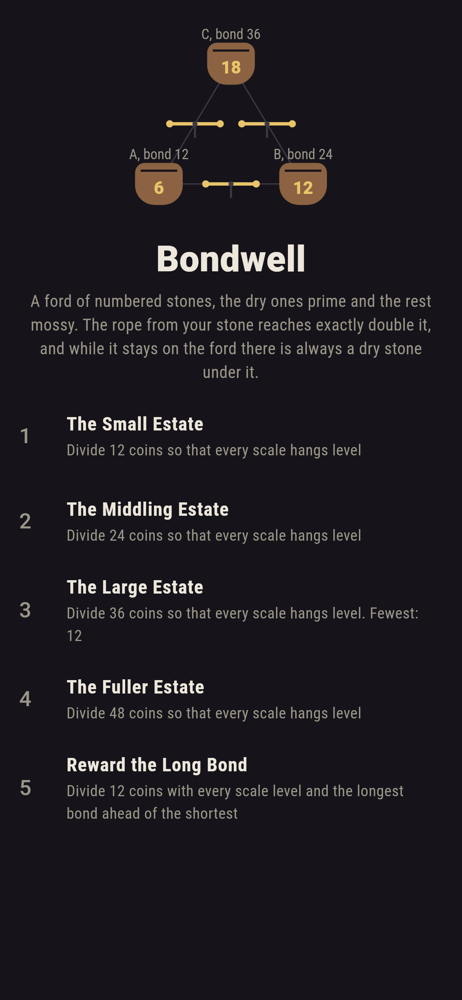
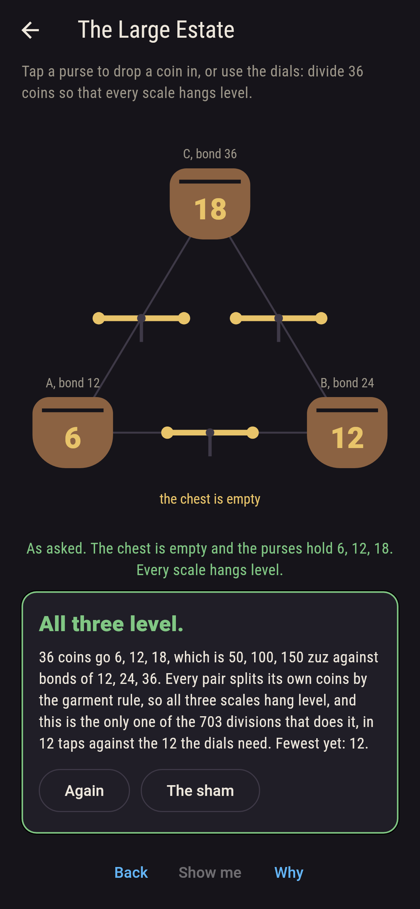
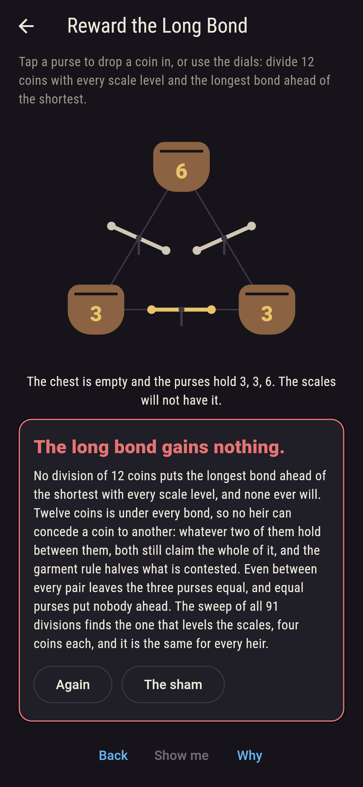
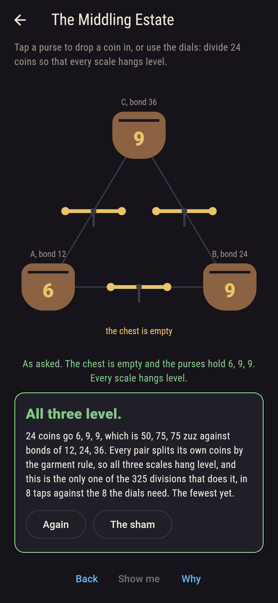
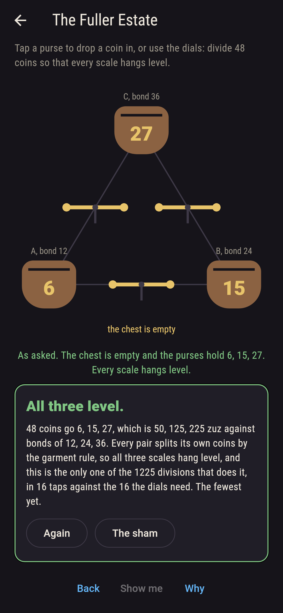
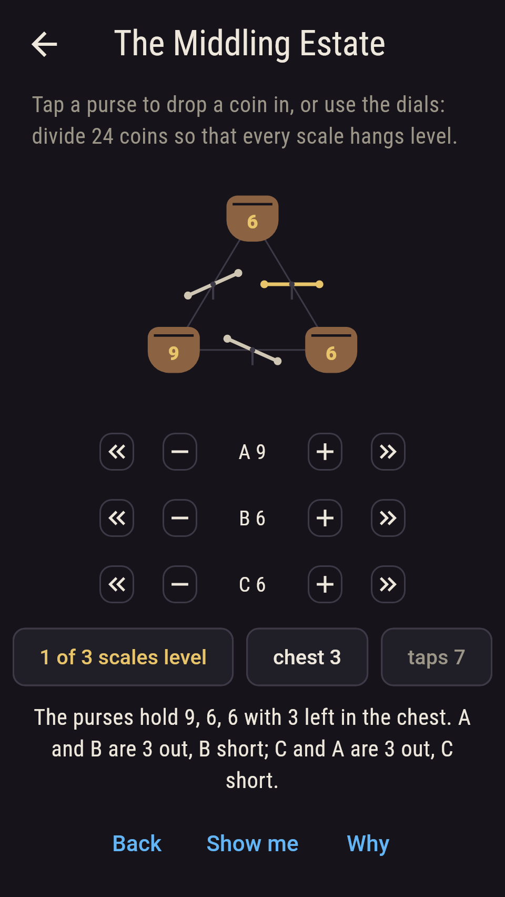
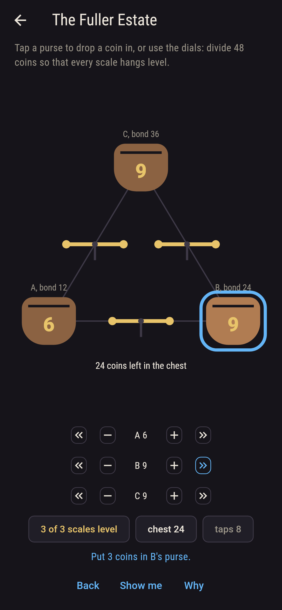
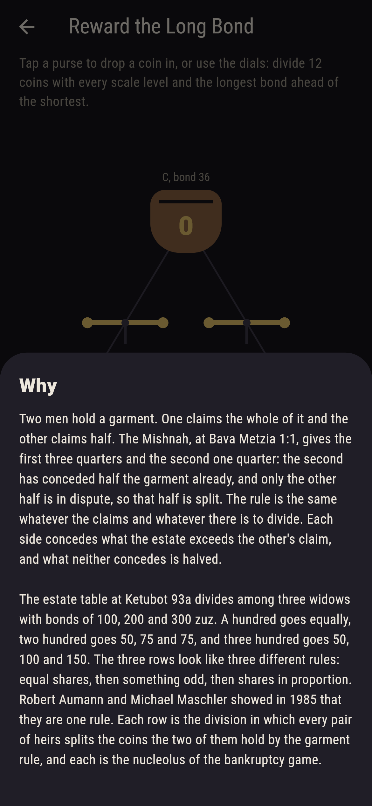

# Bondwell


Three heirs hold bonds against an estate that cannot cover them, and
the coins have to be divided. The Mishnah's rule for a contested
garment, at Bava Metzia 1:1, is this: each side concedes whatever the
estate exceeds the other's claim, and what neither concedes is halved.
Two men hold a garment, one claiming all of it and the other half; the
second has conceded half already, so only the other half is in
dispute, and it goes three quarters and one quarter. The estate table
at Ketubot 93a divides among three widows with bonds of 100, 200 and
300 zuz: a hundred goes equally, two hundred goes 50, 75 and 75, and
three hundred goes 50, 100 and 150. The three rows look like three
different rules. Robert Aumann and Michael Maschler showed in 1985
that they are one: each row is the division in which every pair of
heirs splits the coins the two of them hold by the garment rule, and
each is the nucleolus of the bankruptcy game. Here the bonds are 12,
24 and 36 coins, which is the same table at twenty-five zuz to three
coins, and a scale hangs between each pair of purses. Level all three
at once.

## The asks

1. **The Small Estate** - divide 12 coins so that every scale hangs level
2. **The Middling Estate** - divide 24 coins so that every scale hangs level
3. **The Large Estate** - divide 36 coins so that every scale hangs level
4. **The Fuller Estate** - divide 48 coins so that every scale hangs level
5. **Reward the Long Bond** - divide 12 coins with every scale level and the longest bond ahead of the shortest

Twelve coins, the Talmud's hundred zuz, goes four coins each: with so
little on the table nobody can concede anything, every pair splits
dead even, and even between every pair leaves the purses equal.
Twenty-four goes 6, 9 and 9, which is 50, 75 and 75 zuz: the short
bond is now small enough that the other two concede nothing to it and
it takes a quarter, while the long pair still splits evenly. Thirty-six
goes 6, 12 and 18, the one row where the shares run in proportion to
the bonds. Forty-eight is past the halfway mark of the 72 the bonds
come to, and the rule turns over: below half the claims the shares are
levelled from the bottom, above it the losses are, so the short bond
gets no more than it did before while the other two take the rest.
Each of those estates has exactly one division that levels all three
scales, out of 91, 325, 703 and 1,225. Reward the Long Bond is
hopeless, and the reason is countable on fingers: twelve coins is
under every bond, so no heir can concede a coin, every pair splits
even, and equal purses put nobody ahead. The sham admits it once three
full divisions have been tried with the long bond ahead, or after
twenty taps.

## Two voices

Every number the game says out loud was worked out here rather than
guessed, and the garment rule is worked out two ways:

* **The Mishnah's recipe** is the first: each claimant concedes what
  the estate passes the other's claim, and the rest is halved. It is
  what the scales are tilted by, pair by pair, as you play.
* **The half-claims rule** is the second, and it never mentions a
  concession. While the estate is under half the claims it levels the
  awards from the bottom against half of each claim; above that it
  levels the losses the same way. It is the rule Aumann and Maschler
  read the table with, and the checker runs it against the recipe on
  every garment of claims up to a hundred a side, 1,020,000 of them.
  The smallest of those are checked a third way, against the nucleolus
  found by trying every split and keeping the one whose worst-off
  coalition is least badly off.

The three purses are checked the same way round. For every estate from
nothing up to the 72 the bonds come to, every division of it is tried
against the three scales, and the one that levels all three is
compared with what the half-claims rule gives, which never looks at a
pair at all. All the arithmetic is kept in twelfths of a coin: the
garment rule halves, and the half-claims rule can divide a remainder
by two or by three, so twelfths hold every share exactly and nothing
is ever a decimal.

`tool/check_purses.dart` runs the lot and refuses the bake on any
disagreement.

## The checker's ledger

What `dart run tool/check_purses.dart` printed for the build this
README shipped with, word for word:

```
every garment there is taken, claims of one coin to 100 on both sides and every estate from nothing up to the two claims together, 1,020,000 in all, and each one split twice, once by the Mishnah's recipe of conceding what the estate passes the other claim and halving the rest, and once by the half-claims rule Aumann and Maschler read the table with, which never mentions a concession: the two agree on every one, 507,500 of the splits landing on a half coin and none of them on anything finer, and on the 640 smallest the nucleolus found the long way, by trying every split and keeping the one whose worst-off coalition is least badly off, agrees as well; the garment of the Mishnah itself, one claiming the whole and one the half, goes three quarters and one quarter; then every division of every estate from nothing to the 72 coins the bonds come to, 67,525 divisions in all, with a scale between each pair of purses: of the 73 estates, 37 leave shares that land on whole coins and each of those hangs all three scales level on exactly one division, the one the half-claims rule gives, while the other 36 fall between coins and no division of them levels anything; the Talmud's own rows come out of it at twenty-five zuz to three coins: 12 coins go 4, 4, 4, which is 33 1/3, 33 1/3, 33 1/3 zuz; 24 coins go 6, 9, 9, which is 50, 75, 75 zuz; 36 coins go 6, 12, 18, which is 50, 100, 150 zuz; and with twelve coins on the table, under every bond, no heir can concede anything, so every pair splits even and the three purses come out equal, which is why no division of that estate puts the longest bond ahead of the shortest

 1 The Small Estate     divide 12 coins so that every scale hangs level: 1 of the 91 divisions lands it, in 6 taps
 2 The Middling Estate  divide 24 coins so that every scale hangs level: 1 of the 325 divisions lands it, in 8 taps
 3 The Large Estate     divide 36 coins so that every scale hangs level: 1 of the 703 divisions lands it, in 12 taps
 4 The Fuller Estate    divide 48 coins so that every scale hangs level: 1 of the 1,225 divisions lands it, in 16 taps
 5 Reward the Long Bond divide 12 coins with every scale level and the longest bond ahead of the shortest: none of the 91, and twelve coins under every bond say why
```

## Screenshots

| The sham | The large estate | Reward the long bond |
| --- | --- | --- |
|  |  |  |

| The small estate | The middling estate | The fuller estate | A scale out of true, on the small phone | Show me | The why |
| --- | --- | --- | --- | --- | --- |
|  |  |  |  |  |  |

Screenshots are drawn by `test/showcase_test.dart` at real phone sizes
with the app's own painter, then copied into `docs/` as they came out;
every coin in them was put in its purse by a tap, so no division
pictured is one the game could not reach. The logo and every launcher
icon come out of `test/mark_test.dart`, drawn by the same painter: the
mark is the Talmud's three hundred zuz row, 6, 12 and 18 coins, with
all three scales level.

## Building

```
flutter test          # 43 tests, the sweeps among them
dart run tool/check_purses.dart
flutter build apk     # or: flutter build ios
```
