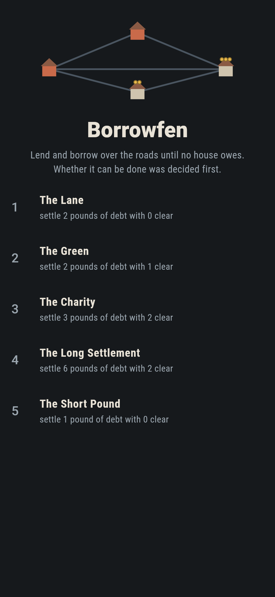
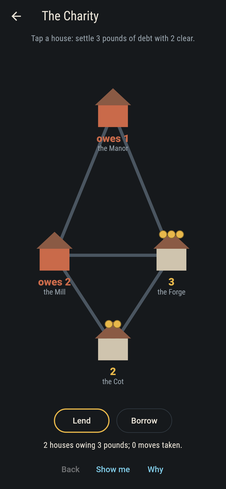
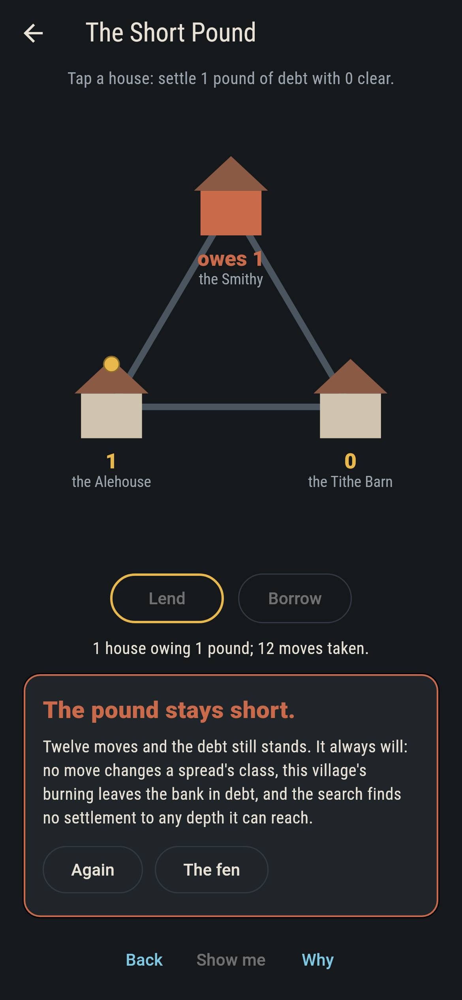
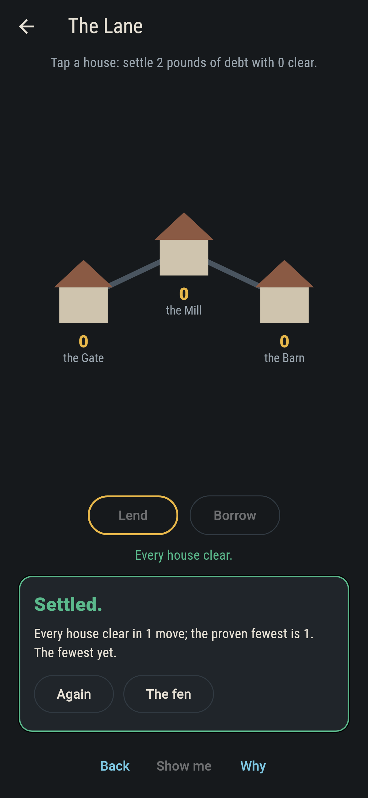
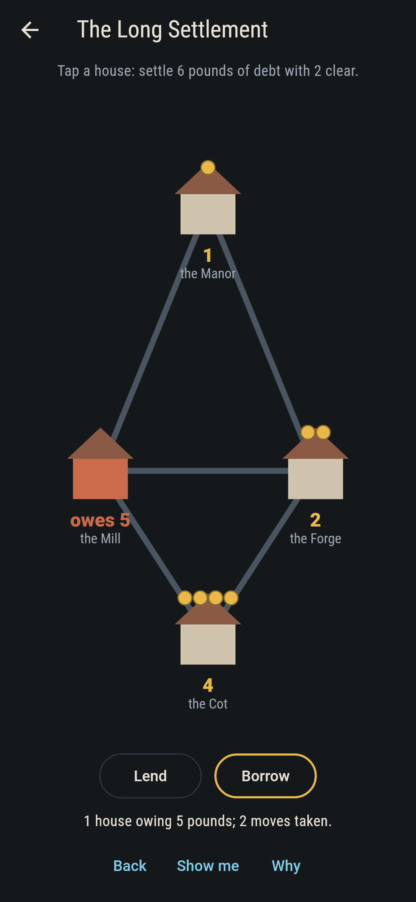
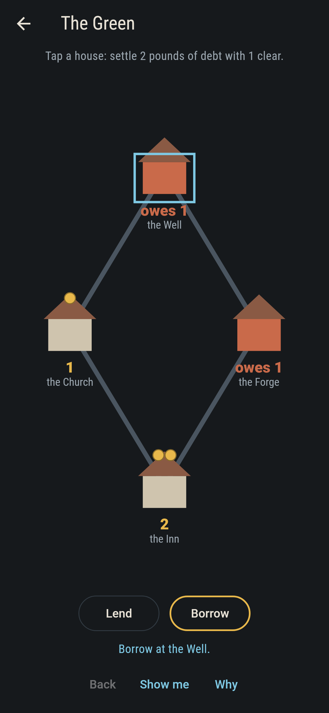
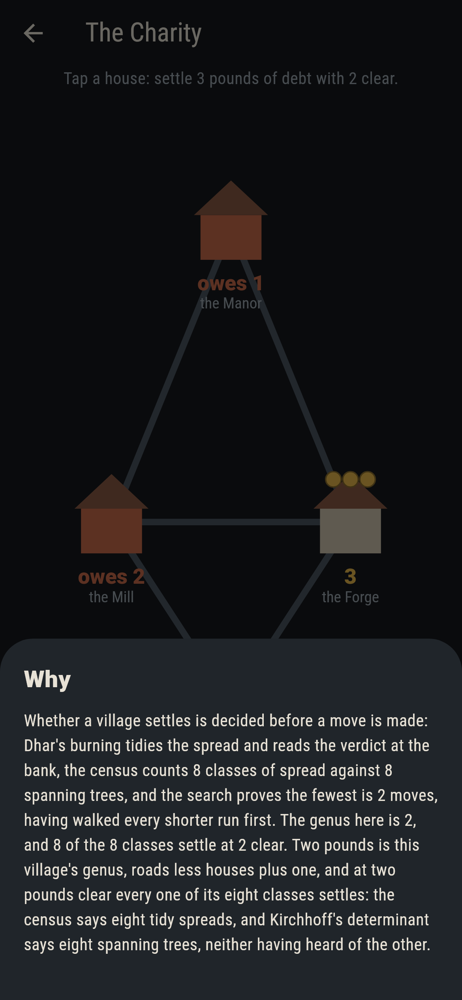

# Borrowfen


A village is houses joined by roads, and some houses owe. Tap a
house to make it lend a pound down every road it has, or turn the
tap around and it borrows one up each. The village settles when no
house is in debt. Whether that can be done at all was decided
before you moved, and the game will say so to your face.

## The villages

1. **The Lane** - settle 2 pounds of debt with 0 clear
2. **The Green** - settle 2 pounds of debt with 1 clear
3. **The Charity** - settle 3 pounds of debt with 2 clear
4. **The Long Settlement** - settle 6 pounds of debt with 2 clear
5. **The Short Pound** - settle 1 pound of debt with 0 clear

The Charity opens at its village's genus, roads less houses plus
one, and at that total every class of spread settles: that is the
whole point of it. The Long Settlement takes six moves and not one
fewer, the search having walked every shorter run first. The Short
Pound cannot be settled at all: one pound of debt, one pound of
coin, and no run of moves, however long, gets the village clear.

## Three voices

The game never asserts what it has not computed, and it computes
everything at least twice:

* **The burning.** Dhar's burning algorithm reduces any spread to
  its one tidy form and reads the verdict off the bank: out of
  debt and the village settles, in debt and it never will, because
  no lending or borrowing moves a spread out of its class.
* **The census.** The tidy spreads of each village are enumerated
  outright, and their count must equal the number of spanning
  trees, computed separately by Kirchhoff's determinant on the
  reduced Laplacian. The two agree on every village: 1, 4, 8, 8
  and 3.
* **The search.** A plain walk of lendings and borrowings finds
  the proven fewest moves for every settleable village, and runs
  its bounds dry on the hopeless one. It is also what Show me
  follows, one move at a time.

`tool/check_villages.dart` runs all three and refuses the bake the
moment any two part ways.

## The checker's ledger

What `dart run tool/check_villages.dart` printed for the build this
README shipped with, word for word:

```
every village censused twice: the tidy spreads number exactly the spanning trees, 1, 4, 8, 8 and 3, Dhar's burning against Kirchhoff's determinant, and on every level the burning's verdict, the label and the search agree

 1 The Lane             settle 2 pounds of debt with 0 clear: fewest 1 move, proven by the search
 2 The Green            settle 2 pounds of debt with 1 clear: fewest 2 moves, proven by the search
 3 The Charity          settle 3 pounds of debt with 2 clear: fewest 2 moves, proven by the search
 4 The Long Settlement  settle 6 pounds of debt with 2 clear: fewest 6 moves, proven by the search
 5 The Short Pound      settle 1 pound of debt with 0 clear: the burning, the census and the search all refuse it
```

## Screenshots

| The fen | The Charity | The pound stays short |
| --- | --- | --- |
|  |  |  |

| Settled | The long way round | Show me | The why |
| --- | --- | --- | --- |
|  |  |  |  |

Screenshots are drawn by `test/showcase_test.dart` at real phone
sizes with the app's own painter, then copied into `docs/` as they
came out; every move in them was tapped, so nothing pictured is a
village the game could not reach. The logo and every launcher icon
come out of `test/mark_test.dart` the same way: the mark is The
Charity as it opens.

## Building

```
flutter test          # 43 tests, the census among them
dart run tool/check_villages.dart
flutter build apk     # or: flutter build ios
```
