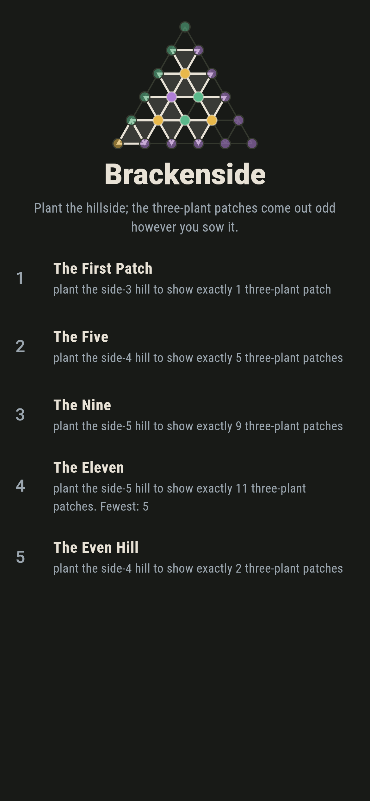
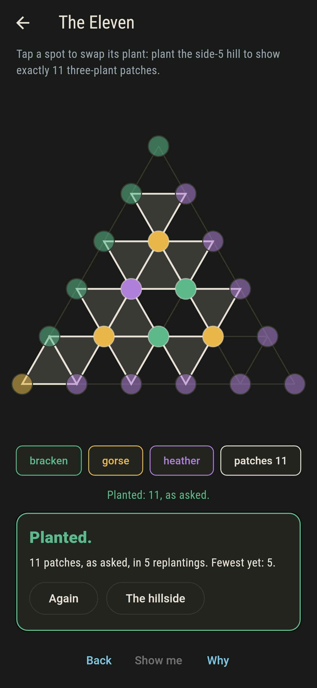
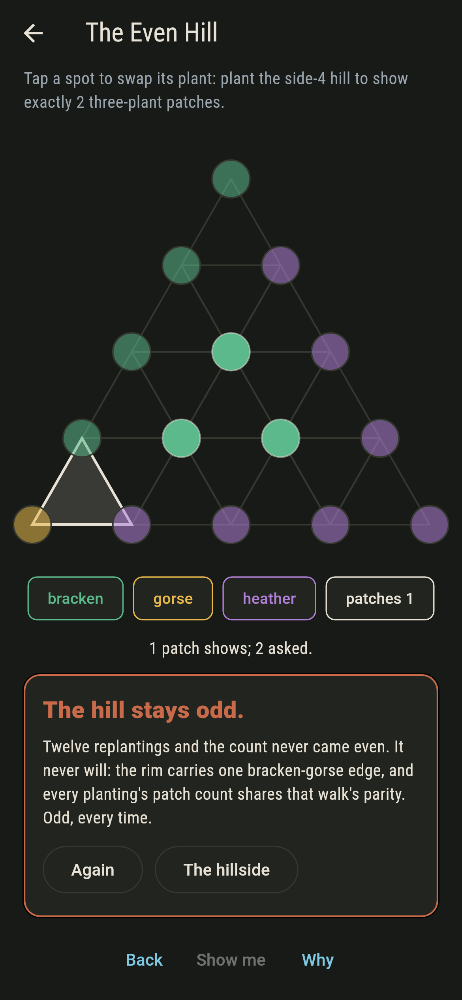
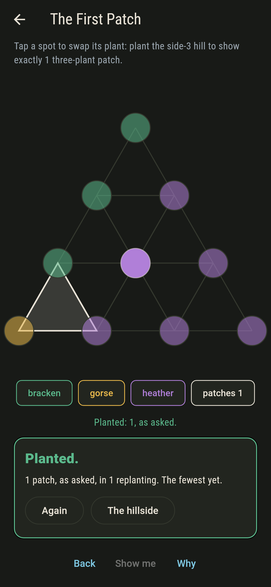
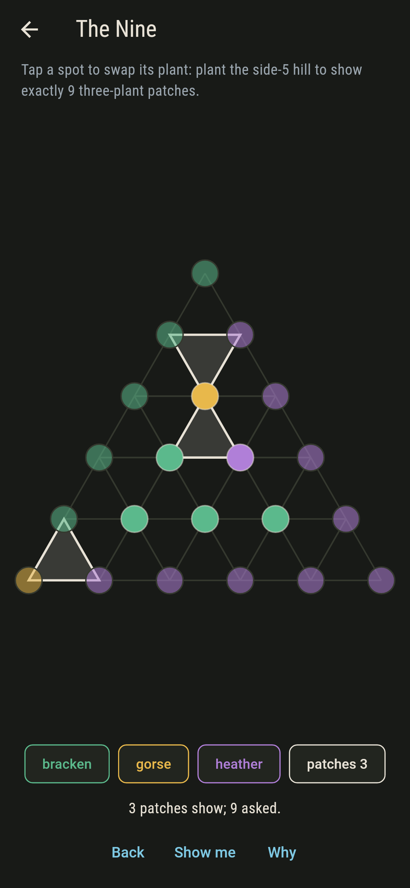
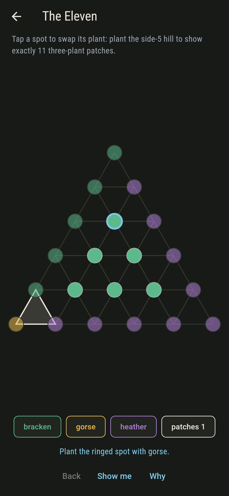
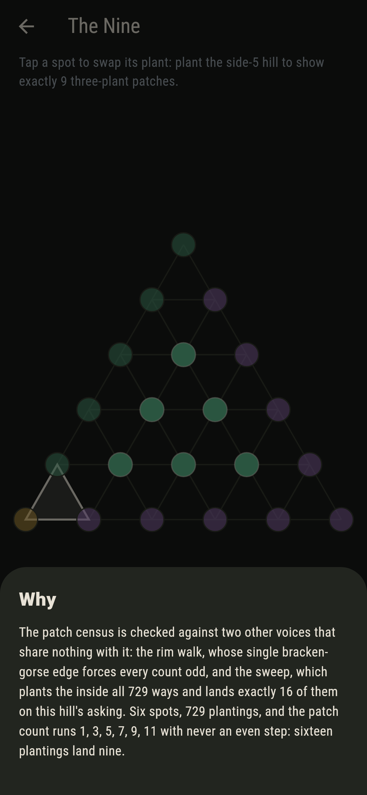

# Brackenside


A hillside is a triangle of planting spots wearing bracken, gorse
and heather. The rim is planted before you arrive and never
changes: bracken down the left, gorse along the bottom, heather up
the right. You plant the inside, and the hillside counts its
patches: the smallest triangles wearing all three plants at once.
However you sow it, the count comes out odd. That is Sperner's
lemma, and the rim of the hill says so before you start.

## The hills

1. **The First Patch** - plant the side-3 hill to show exactly 1 three-plant patch
2. **The Five** - plant the side-4 hill to show exactly 5 three-plant patches
3. **The Nine** - plant the side-5 hill to show exactly 9 three-plant patches
4. **The Eleven** - plant the side-5 hill to show exactly 11 three-plant patches
5. **The Even Hill** - plant the side-4 hill to show exactly 2 three-plant patches

The Eleven is the needle of the whole hillside: of all 729
plantings of the side-5 hill, exactly one shows eleven patches.
The Even Hill asks for two, and no planting of any hill here has
ever shown an even count: the patch census always shares the
parity of the rim walk, and the rim carries exactly one
bracken-gorse edge.

## Three voices

The game never asserts what it has not computed, and it computes
everything at least twice:

* **The census** reads the patches off the hill, triangle by
  triangle, and rings each one on the turf.
* **The rim walk** counts bracken-gorse edges round the fixed
  boundary: one, on every hill shipped, which forces every patch
  count odd.
* **The sweep** plants the inside every way there is, 3, 27 and
  729 ways by size, reads the census on each, and holds it to the
  rim walk's parity. The counts climb 1, 3, 5, 7, 9, 11 with
  never an even step.

`tool/check_hills.dart` runs all three and refuses the bake on
any disagreement.

## The checker's ledger

What `dart run tool/check_hills.dart` printed for the build this
README shipped with, word for word:

```
every planting of every hill swept, 3 and 27 and 729 of them by size: the patch census matches the rim walk's parity on every one, the counts climb 1, 3, 5, 7, 9, 11 with never an even step, and the eleven belongs to exactly one planting

 1 The First Patch  plant the side-3 hill to show exactly 1 three-plant patch: 2 plantings of the sweep land it
 2 The Five         plant the side-4 hill to show exactly 5 three-plant patches: 3 plantings of the sweep land it
 3 The Nine         plant the side-5 hill to show exactly 9 three-plant patches: 16 plantings of the sweep land it
 4 The Eleven       plant the side-5 hill to show exactly 11 three-plant patches: 1 planting of the sweep lands it
 5 The Even Hill    plant the side-4 hill to show exactly 2 three-plant patches: none, the rim walk says odd and the sweep never saw an even count
```

## Screenshots

| The hillside | The eleven planted | The even hill admitted |
| --- | --- | --- |
|  |  |  |

| The first patch | Mid-planting | Show me | The why |
| --- | --- | --- | --- |
|  |  |  |  |

Screenshots are drawn by `test/showcase_test.dart` at real phone
sizes with the app's own painter, then copied into `docs/` as they
came out; every plant in them was swapped by taps, so nothing
pictured is a hillside the game could not reach. The logo and
every launcher icon come out of `test/mark_test.dart` the same
way: the mark is the one eleven-patch planting.

## Building

```
flutter test          # 46 tests, the sweep among them
dart run tool/check_hills.dart
flutter build apk     # or: flutter build ios
```
