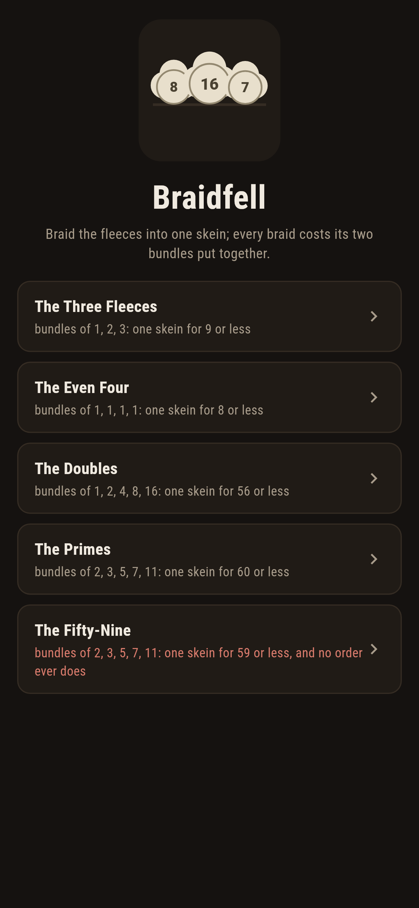
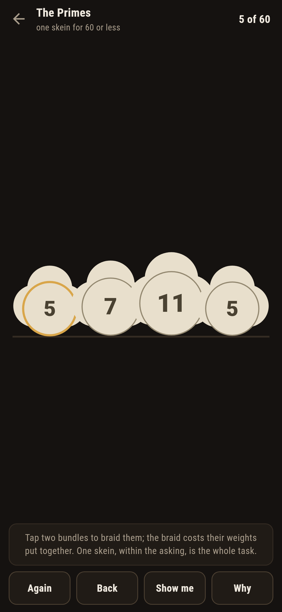
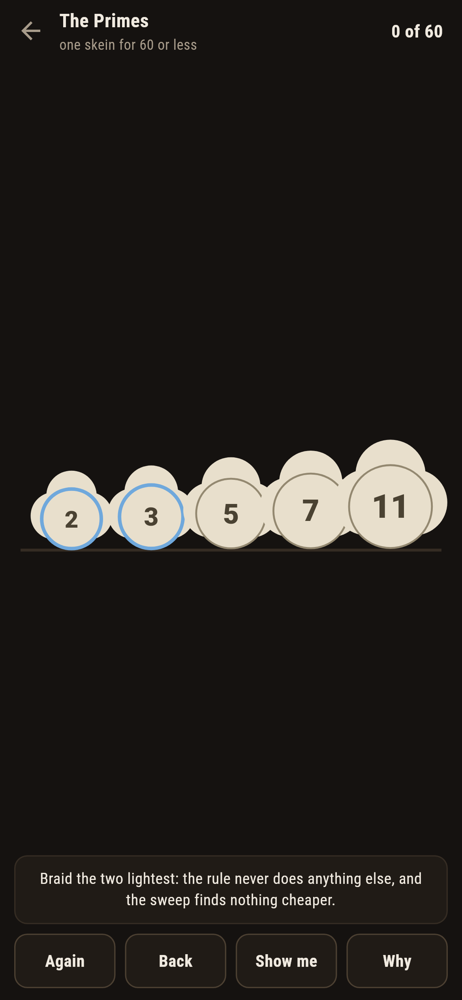
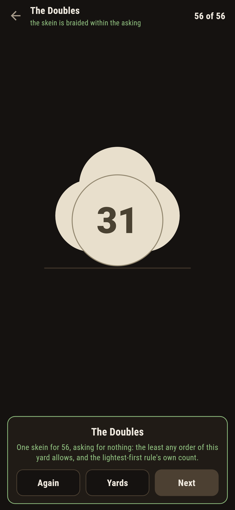
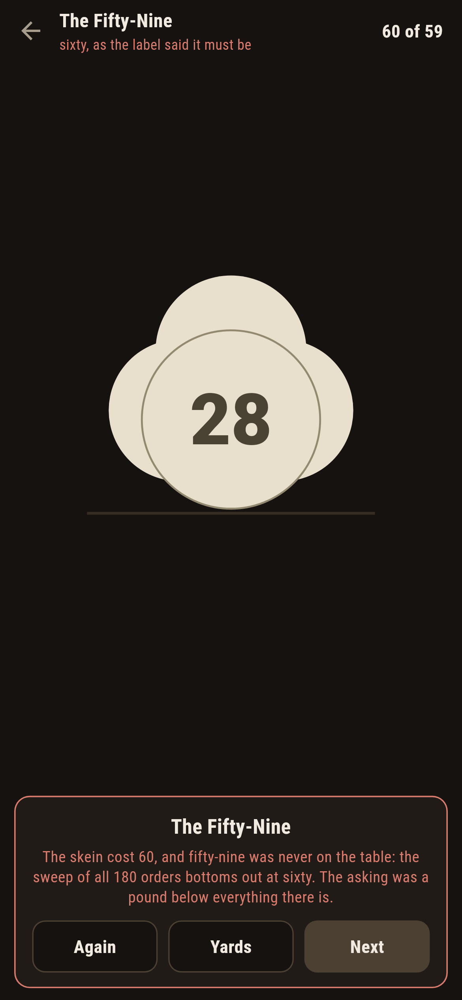
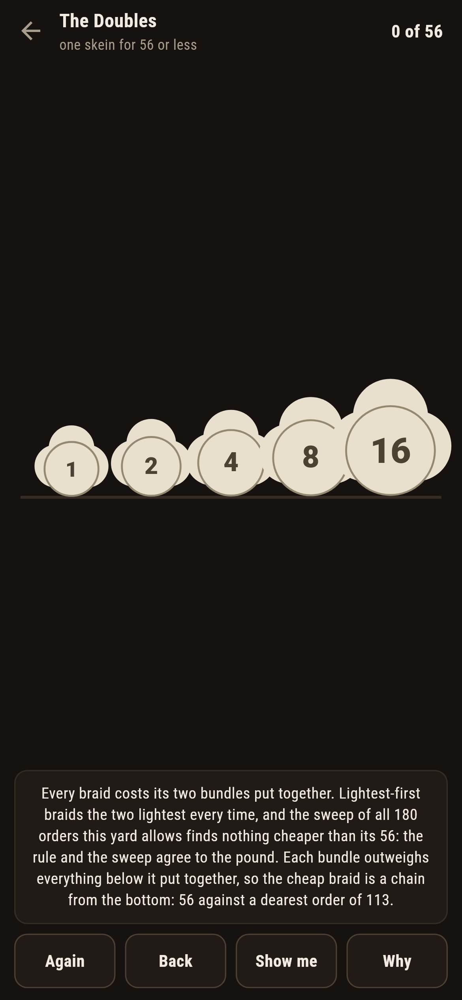

# Braidfell

A merging puzzle for phones, in Flutter, for Android and iOS.

Fleece bundles wait in the carding yard, each with its weight. Tap
two to braid them into one; the braid costs their weights put
together, and the yard is done when a single skein holds everything.
The asking on every yard is the least work any order allows, and the
lightest-first rule, braid the two lightest every time, lands it
exactly. This is the optimal merge pattern worked with wool, the
same reasoning that builds Huffman's codes, with the sweep of every
braid order standing behind each number.

| | | | |
|---|---|---|---|
|  |  |  |  |

## Two ways of knowing

The suite knows every yard two ways that share nothing. The
lightest-first rule is one sentence and never looks back; the sweep
tries every braid order there is, 3 on the small yard and 180 on
the five-bundle ones, and keeps the cheapest, knowing nothing of
rules. On every yard that ships the two agree to the pound, and the
sweep also knows the dearest order and everything between: the
doubles run from 56 up to 113 by braid order alone.

```
$ make yards
the lightest-first rule against the sweep of every braid order: they agree to the pound on every yard that ships, and the sweep knows the dearest order and everything between

 1 The Three Fleeces [1, 2, 3]  one skein for 9 or less: lightest-first lands 9 over 3 orders
 2 The Even Four     [1, 1, 1, 1]  one skein for 8 or less: lightest-first lands 8 over 18 orders
 3 The Doubles       [1, 2, 4, 8, 16]  one skein for 56 or less: lightest-first lands 56 over 180 orders
 4 The Primes        [2, 3, 5, 7, 11]  one skein for 60 or less: lightest-first lands 60 over 180 orders
 5 The Fifty-Nine    [2, 3, 5, 7, 11]  one skein for 59 or less: the sweep of all 180 orders bottoms out at 60
```

## The fifty-nine

One yard ships labelled hopeless in the house tradition of maps
nobody can win: the same five prime bundles, asked for one pound
less than everything there is. The sweep of all 180 orders bottoms
out at sixty, so fifty-nine was never on the table. The game says so
on the way in, lets you braid the cheapest order there is, and the
card holds the sixty up against the asking rather than let anyone
grind at it.



## The floor that moves

Nothing about the least is folklore here. The cheapest finish from
the standing yard is recomputed after every braid, and a braid that
pushes it past the asking is called out with the new floor named,
Back offered. **Show me** lights the two lightest bundles, which is
the whole of the rule, and **Why** counts the orders and speaks the
agreement over the yard in front of you.



## Building

```
make deps      # fetch packages
make check     # analyze + every test
make yards     # hold the rule against the sweep of every order
make shots     # render the screenshots and redraw the icons
make apk       # Android release build
make ios       # iOS release build (unsigned)
```

The logo and every app icon are drawn by the game's own painter in
`test/mark_test.dart`. There is no image in this repository that was not
produced by code in it.

## How it is put together

```
lib/braid/rules.dart      the lightest-first rule, the sweep of
                          every order, cheapest and dearest
lib/braid/yard.dart       a yard: its bundles and its asking
lib/braid/yards.dart      the five yards that ship
lib/braid/play.dart       a yard being braided: the floor,
                          take-back
lib/ui/                   the painter, the screens, the mark
tool/check_yards.dart     the reckonings and the ledger above
```

The tests work the rule by hand, hold it against the sweep on every
yard, pin the dearest orders and the order counts, braid every
winnable yard to its asking through the real taps, watch a braid
that costs the yard get called out with its floor, watch the
fifty-nine miss at its very cheapest, and hold the pictures against
the real widget tree. If any of that drifts, `make check` goes red
before anything leaves the machine.
