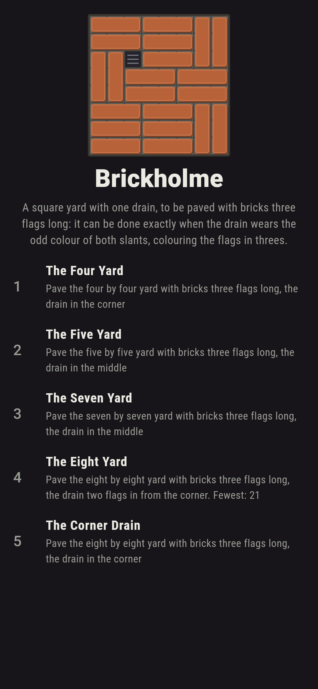
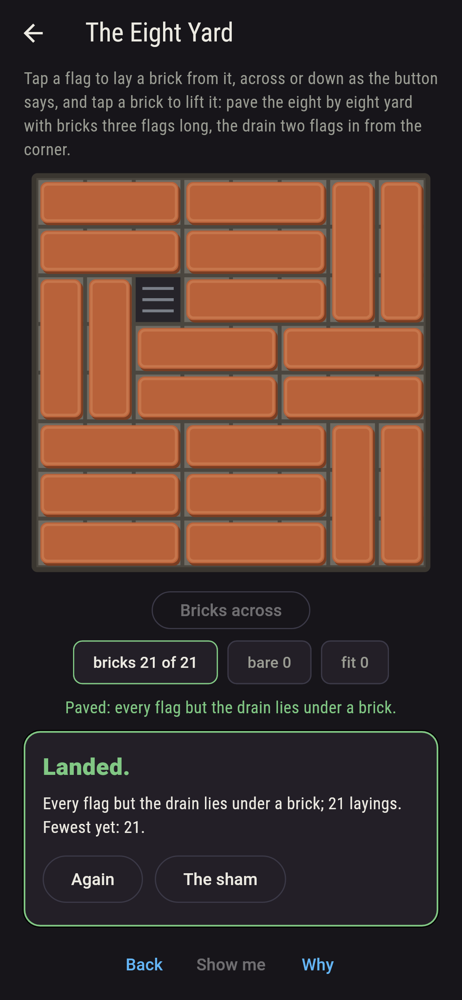
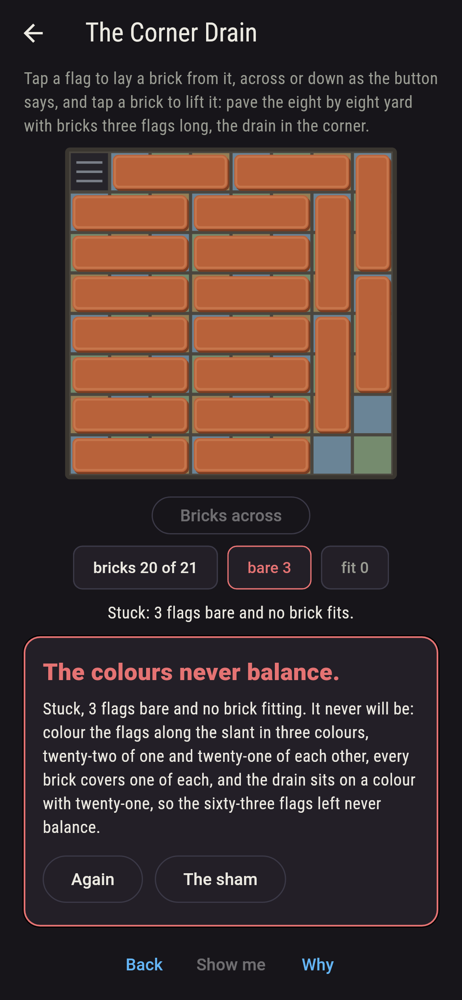
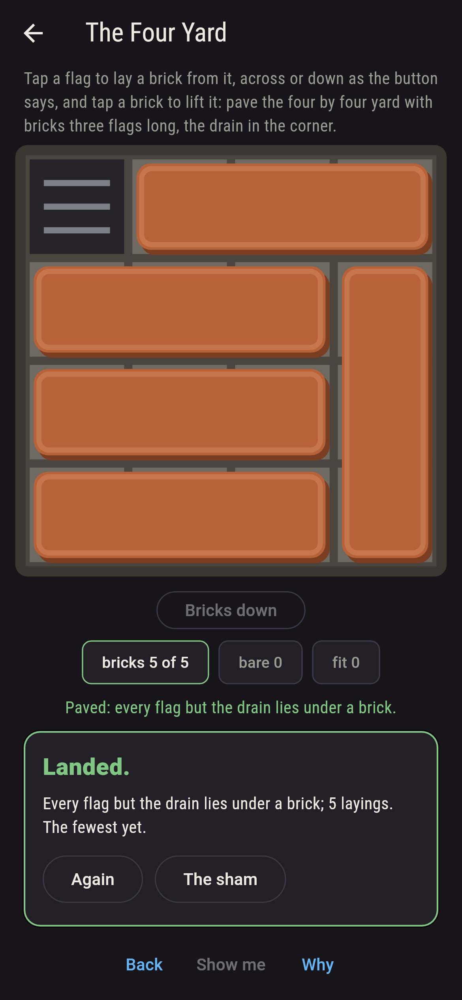
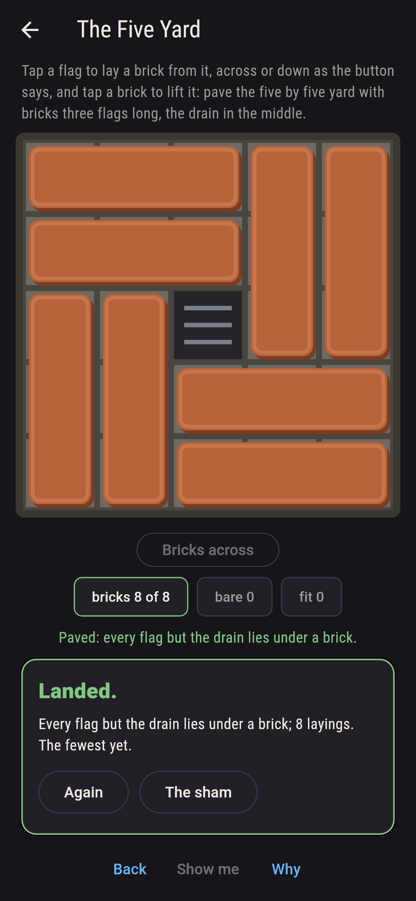
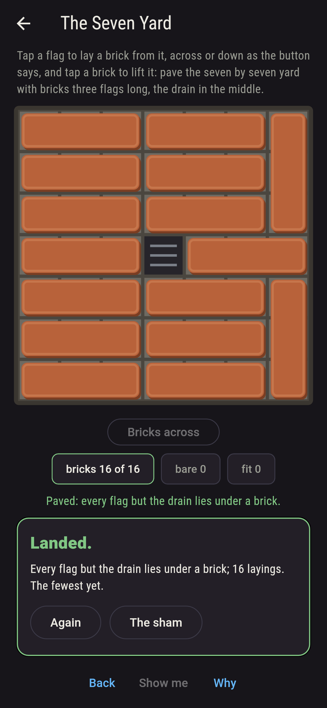
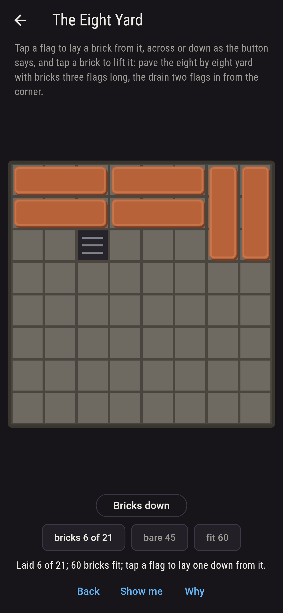
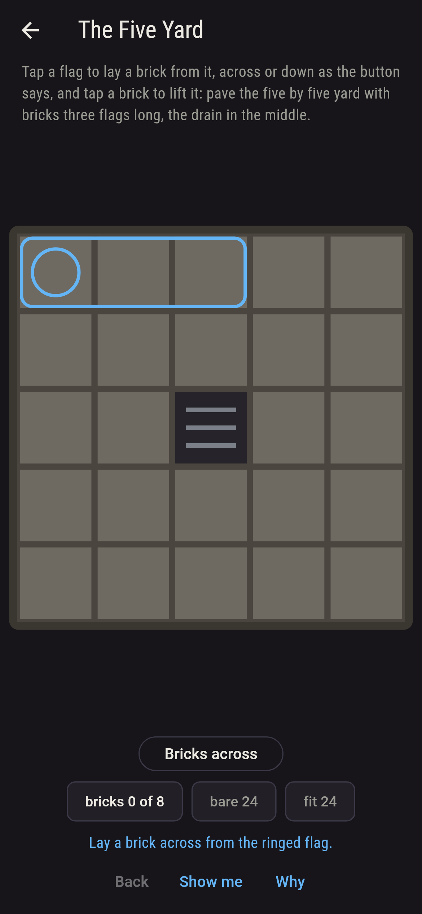
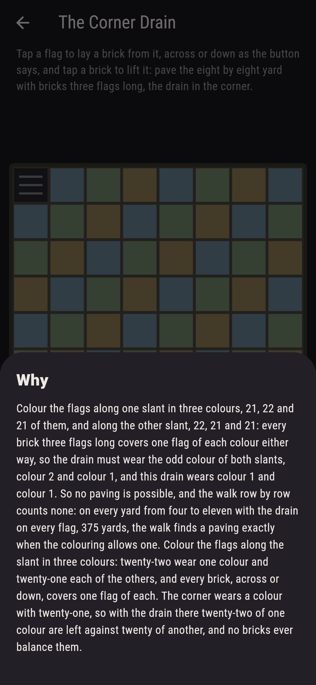

# Brickholme


A square yard of flags with one drain among them, and bricks three
flags long to pave the rest, across or down. Tap a flag to lay a
brick from it, tap a brick to lift it. Golomb asked in 1954 which
square a chessboard may lose and still be paved with straight
trominoes, and the answer is a colouring: colour the flags along
the slant in three colours, and along the other slant in three
again; every brick, across or down, covers one flag of each colour
either way, so the drain must wear the odd colour of both slants,
the one flag more than the others. On the eight yard that leaves
four flags, two in from each corner, and 356 pavings round each; on
the five yard the middle alone; on the four yard the corners. Every
yard from four to eleven is walked with the drain on every flag,
375 yards, and the walk finds a paving exactly when the colouring
allows one.

## The yards

1. **The Four Yard** - pave the four by four yard with bricks three flags long, the drain in the corner
2. **The Five Yard** - pave the five by five yard with bricks three flags long, the drain in the middle
3. **The Seven Yard** - pave the seven by seven yard with bricks three flags long, the drain in the middle
4. **The Eight Yard** - pave the eight by eight yard with bricks three flags long, the drain two flags in from the corner
5. **The Corner Drain** - pave the eight by eight yard with bricks three flags long, the drain in the corner

The four yard paves round a corner four ways and round no other
flag; the five yard round its middle two ways and round nothing
else; the seven yard round nine flags, 258 ways round the middle;
the eight yard round four flags, 356 ways each. The Corner Drain is
labeled hopeless on its tile, its flags wear the three colours of
the slant, and when the yard sticks the flags left bare are never
one of each.

## Two voices

The game never asserts what it has not computed, and it computes
everything at least twice:

* **The walk** counts the pavings row by row, each column carrying
  how many more rows the brick standing in it reaches down, every
  row filled left to right with a brick across or a brick down from
  every open flag; and a paving is found flag by flag, first bare
  flag first, to drive the show-me. Every count on the sham is that
  walk's.
* **The colouring** needs no walk: the flags counted by colour along
  each slant, the odd colour of each found, the drain's colours
  read, and every brick that fits anywhere on the yard checked to
  cover one flag of each colour on both slants; on every yard from
  four to eleven whose flags less one divide by three, with the
  drain on every flag, the colouring allows a paving exactly when
  the walk finds one.

`tool/check_tilings.dart` runs the lot and refuses the bake on any
disagreement.

## The checker's ledger

What `dart run tool/check_tilings.dart` printed for the build this
README shipped with, word for word:

```
every yard from four to eleven whose flags less one divide by three walked with the drain on every flag, 375 yards, the pavings counted row by row: a paving is found exactly when the drain wears the odd colour of both slants, 43 yards of the 375, since a brick three flags long, across or down, always covers one flag of each colour, and the drain must take the odd one; the four yard paves round its four corners only, the five round its middle only, the seven round nine flags, the eight round four, the ten round sixteen and the eleven round nine; the four yard round a corner 4 ways, the five round the middle 2, the seven round the middle 258, the eight two in from the corner 356, and the eight round a corner never

 1 The Four Yard    pave the four by four yard with bricks three flags long, the drain in the corner: 4 pavings, 5 bricks each
 2 The Five Yard    pave the five by five yard with bricks three flags long, the drain in the middle: 2 pavings, 8 bricks each
 3 The Seven Yard   pave the seven by seven yard with bricks three flags long, the drain in the middle: 258 pavings, 16 bricks each
 4 The Eight Yard   pave the eight by eight yard with bricks three flags long, the drain two flags in from the corner: 356 pavings, 21 bricks each
 5 The Corner Drain pave the eight by eight yard with bricks three flags long, the drain in the corner: none, and the colouring said so first
```

## Screenshots

| The sham | The eight yard paved | The corner drain stuck |
| --- | --- | --- |
|  |  |  |

| The four yard | The five yard | The seven yard | Mid-paving | Show me | The why |
| --- | --- | --- | --- | --- | --- |
|  |  |  |  |  |  |

Screenshots are drawn by `test/showcase_test.dart` at real phone
sizes with the app's own painter, then copied into `docs/` as they
came out; every brick in them was laid by taps, so nothing pictured
is a yard the game could not reach. The logo and every launcher
icon come out of `test/mark_test.dart` the same way: the mark is
the eight yard paved round its drain, twenty-one bricks.

## Building

```
flutter test          # 45 tests, the walk among them
dart run tool/check_tilings.dart
flutter build apk     # or: flutter build ios
```
