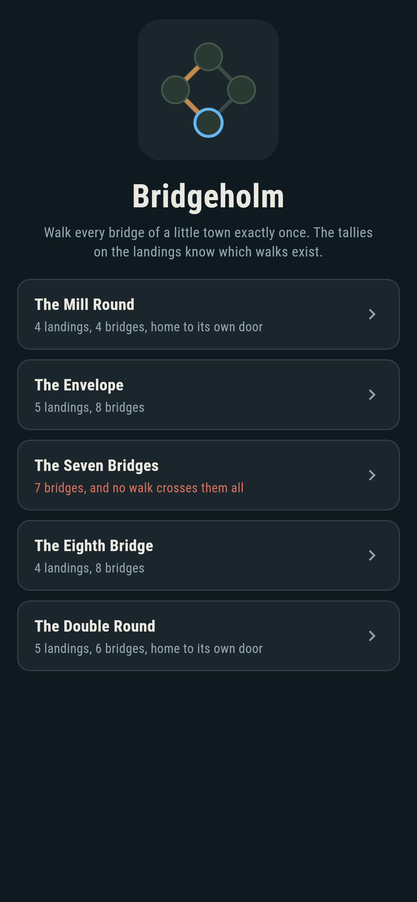
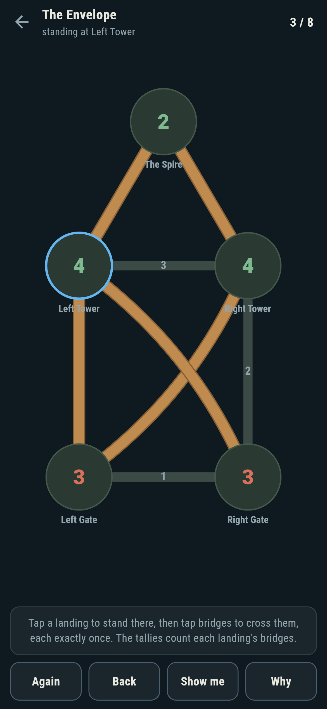
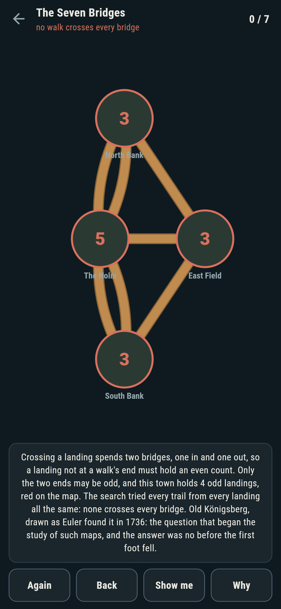
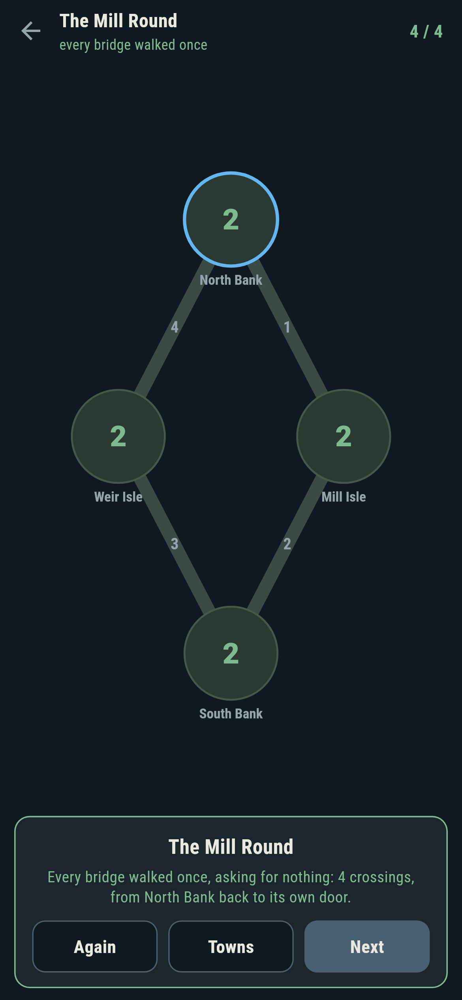
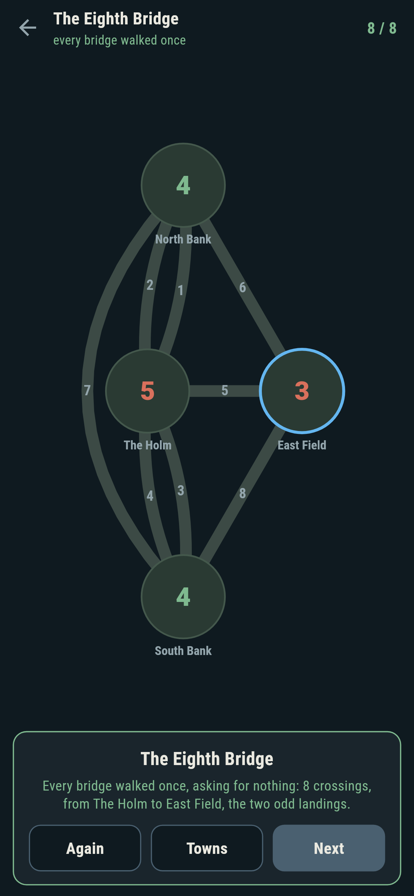
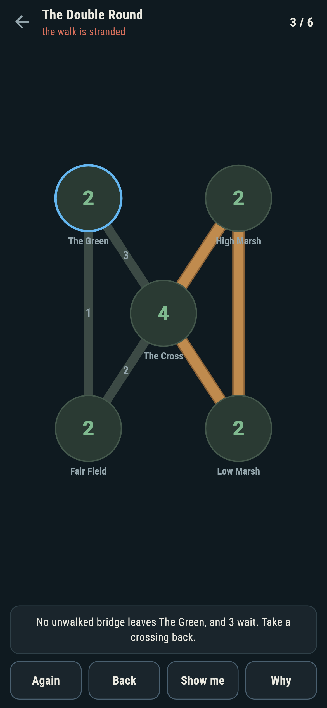

# Bridgeholm

A bridge-walking puzzle for phones, in Flutter, for Android and iOS.

A little town of landings and bridges. Stand somewhere, then cross
bridges one after another, each exactly once. Some towns walk; some
walk only from the right doorstep; one famous town does not walk at
all, and the game says so on the way in and proves it when asked.

| | | | |
|---|---|---|---|
|  |  |  |  |

## Two ways of knowing

The suite knows each town two ways that share nothing. The tallies on
the landings count bridges: crossing a landing spends two, one in and
one out, so only a walk's two ends may hold an odd count. The search
knows nothing of that: it tries every trail from every landing and
counts the complete ones. On every town that ships the two agree, walk
by walk, and the checker refuses the bake on the first disagreement.

```
$ make towns
 1 The Mill Round    4 landings, 4 bridges  walkable, from every landing  walks 2/2/2/2
 2 The Envelope      5 landings, 8 bridges  walkable, from its two odd landings only  walks 44/44/0/0/0
 3 The Seven Bridges 4 landings, 7 bridges  no walk at all, 4 odd landings  walks 0/0/0/0
 4 The Eighth Bridge 4 landings, 8 bridges  walkable, from its two odd landings only  walks 0/208/208/0
 5 The Double Round  5 landings, 6 bridges  walkable, from every landing  walks 4/4/8/4/4
```

## The seven bridges

Old Königsberg, drawn as Euler found it in 1736: two banks, the Holm,
the east field, and seven bridges, every landing odd. It ships in the
house tradition of maps nobody can win, the founding member of the
tradition, because this is the map the study of maps began on. **Why**
rims the four odd landings red and speaks the argument; the search
tried every trail from every landing all the same, and found none.


## The eighth bridge

History mended the town, and the game ships the mend: one more bridge
between the banks turns two landings even, and every complete walk
now runs between the Holm and the east field. The search counts 208
walks from each end and none from anywhere else.



## The live walk

The game refuses nothing it can explain: a bridge that does not touch
where you stand, or one already walked, is refused in words. A
crossing that strands the walk is called out the moment it lands, with
**Back** waiting; standing somewhere with unwalked bridges elsewhere
is called out too. **Show me** points first at a doorstep complete
walks leave from, then at a crossing the search has finished behind.



## Building

```
make deps    # fetch packages
make check   # analyze + every test
make towns   # count the odd landings, search every trail, print the ledger
make shots   # render the screenshots and redraw the icons
make apk     # Android release build
make ios     # iOS release build (unsigned)
```

The logo and every app icon are drawn by the game's own painter in
`test/mark_test.dart`. There is no image in this repository that was not
produced by code in it.

## How it is put together

```
lib/walk/town.dart      a town: landings, bridges, where they stand
lib/walk/towns.dart     the five towns that ship
lib/walk/rules.dart     degrees, the trail search, the live
                        can-still-finish check
lib/walk/play.dart      a walk being walked: standing, crossing,
                        take-back
lib/ui/                 the painter, the screens, the mark
tool/check_towns.dart   the sweeps and the ledger above
```

The tests cross bridges by hand at the walls, meet the parity and the
search on every town, pin the walk counts, strand a walk on purpose
and watch the live check catch a dooming crossing, walk every walkable
town by following the game's own pointer, and hold the pictures
against the real widget tree. If any of that drifts, `make check` goes
red before anything leaves the machine.
