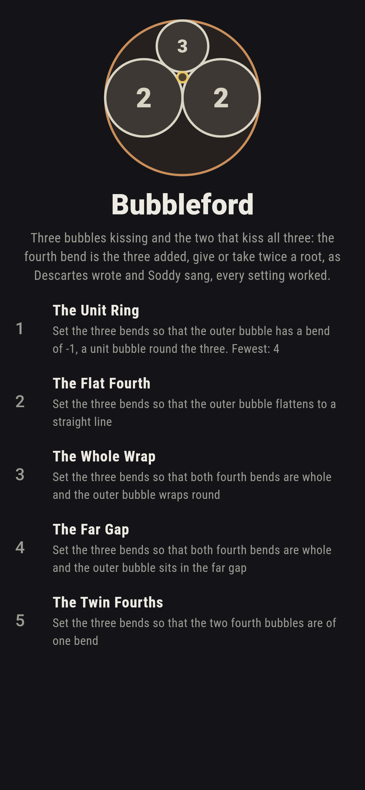
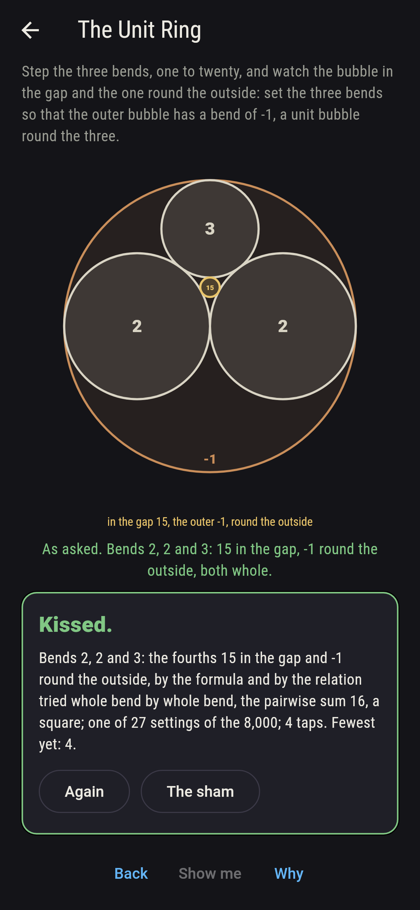
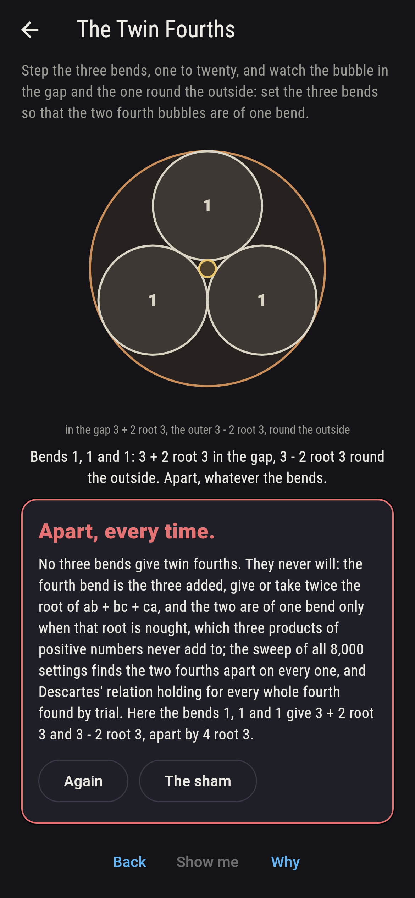
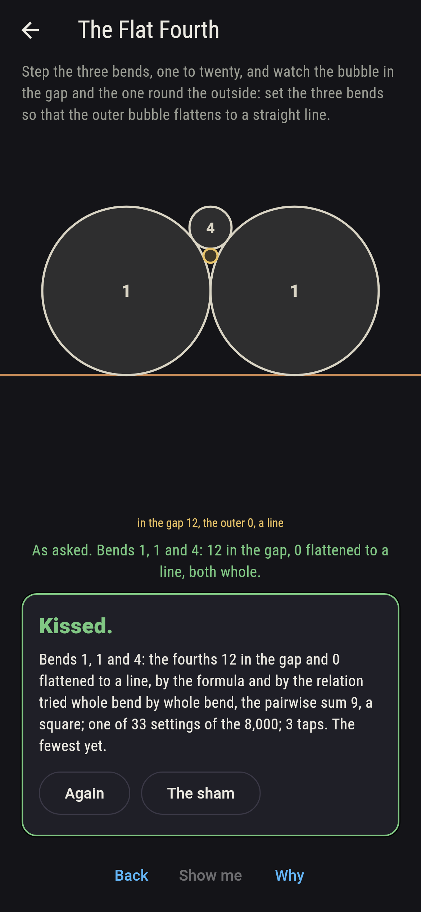
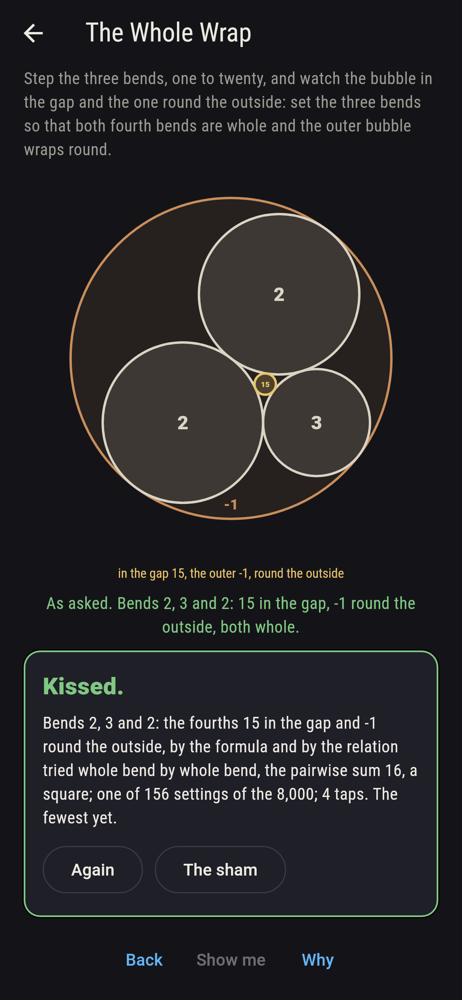
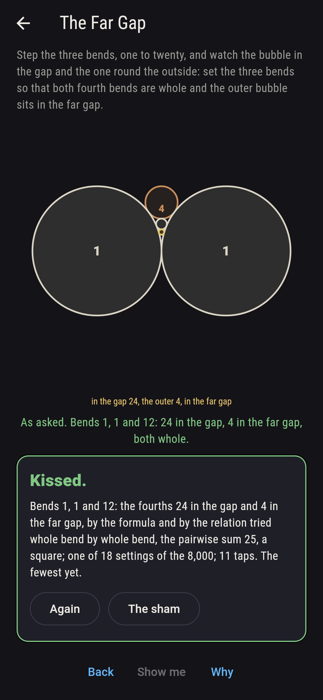
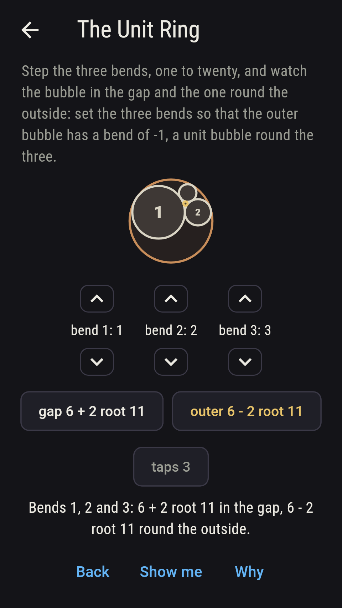
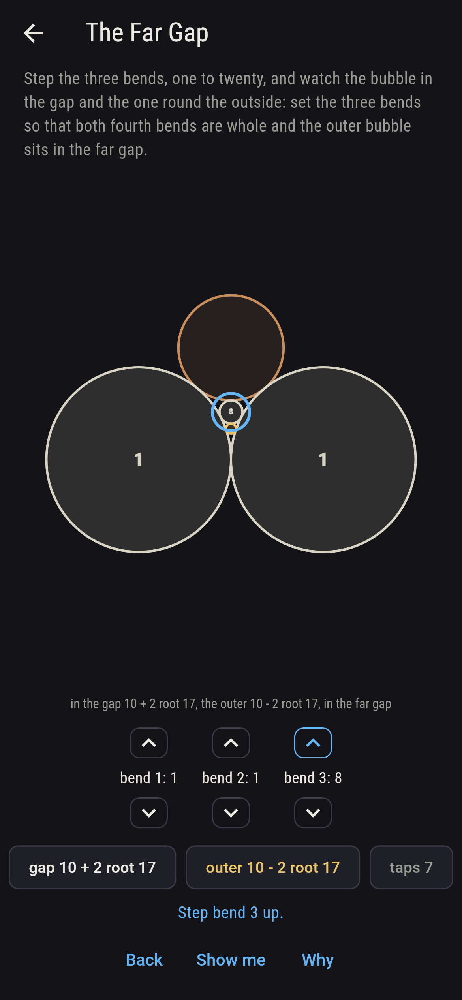
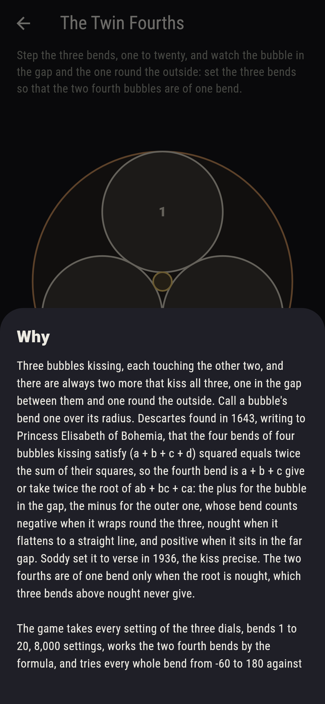

# Bubbleford


Three bubbles kissing, each touching the other two, and there are
always two more that kiss all three, one in the gap between them and
one round the outside. Call a bubble's bend one over its radius.
Descartes found in 1643, writing to Princess Elisabeth of Bohemia,
that the four bends of four bubbles kissing satisfy (a + b + c + d)
squared equals twice the sum of their squares, so the fourth bend is
a + b + c give or take twice the root of ab + bc + ca: the plus for
the bubble in the gap, the minus for the outer one, whose bend counts
negative when it wraps round the three, nought when it flattens to a
straight line, and positive when it sits in the far gap. Soddy set
it to verse in 1936, the kiss precise. Step the three bends on their
dials and watch the two fourths drawn. The game takes every setting
of the three dials, bends 1 to 20, 8,000 settings, works the two
fourth bends by the formula, and tries every whole bend from -60 to
180 against Descartes' relation itself: the whole fourths the trial
finds are exactly the formula's on all 8,000, both whole on 207
settings, the outer wrapping round on 7,001, flat on 33 and in the
far gap on 966, and the two fourths apart on every one.

## The asks

1. **The Unit Ring** - set the three bends so that the outer bubble has a bend of -1, a unit bubble round the three
2. **The Flat Fourth** - set the three bends so that the outer bubble flattens to a straight line
3. **The Whole Wrap** - set the three bends so that both fourth bends are whole and the outer bubble wraps round
4. **The Far Gap** - set the three bends so that both fourth bends are whole and the outer bubble sits in the far gap
5. **The Twin Fourths** - set the three bends so that the two fourth bubbles are of one bend

Bends 2, 2 and 3 give fourths of 15 and -1, a bubble in the gap
fifteen times as bent as a unit bubble and a unit bubble round the
outside, the gasket Descartes and Soddy both drew; 27 settings ring
the three with a unit bubble, 2, 3 and 6 among them, with 23 in the
gap. The outer bubble flattens to a straight line when the three
bends added are exactly twice the root of the pairwise sum: 33
settings do it, 1, 1 and 4 the first, two unit bubbles and a
quarter-bubble in the notch, all resting on a line, with a bubble of
bend 12 in the gap; k, k and 4k does it for every k. Both fourths
are whole exactly when ab + bc + ca is a square, 207 settings, and
156 of those wrap the outer bubble round the three, the classic
gaskets. When the three bends added outrun twice the root, the outer
bubble is no ring at all but a bubble in the far gap: 966 settings
put it there, 18 with both fourths whole, 1, 1 and 12 first, with
24 and 4. The Twin Fourths is labeled hopeless on its tile: the root
said so first, and the sweep finds the two fourths apart on every
setting; the sham admits it after three settings with whole fourths
have shown theirs, or after twelve taps.

## Two voices

The game never asserts what it has not computed, and it computes
everything at least twice:

* **The formula** gives the two fourth bends as the three added,
  give or take twice the root of ab + bc + ca, whole when that sum
  is a square; every bend on the sham is the formula's, and it tells
  the outer bubble's place by the sign of the three added against
  twice the root, worked in squares so that nothing is rounded.
* **The trial** knows no formula: it takes every whole bend from -60
  to 180 and asks Descartes' relation itself whether the four bends
  satisfy it, and the whole fourths it finds are exactly the formula's
  on all 8,000 settings, none where the formula gives none and the
  formula's two where it gives two; and it checks the algebra behind
  the formula, the three added squared being their squares added and
  twice the pairwise sum, on every setting.

`tool/check_kisses.dart` runs the lot and refuses the bake on any
disagreement.

## The checker's ledger

What `dart run tool/check_kisses.dart` printed for the build this
README shipped with, word for word:

```
every setting of the three dials taken, bends 1 to 20, 8,000 settings, the two fourth bends worked by the formula, the three added give or take twice the root of the pairwise sum, and every whole bend from -60 to 180 tried against Descartes' relation itself, the two agreeing on all 8,000, the sum of the three squared being their squares added and twice the pairwise sum on every one: both fourths are whole on 207 settings, the pairwise sum a square, and never of one bend; the outer bubble wraps round the three on 7,001 settings, flattens to a line on 33, k, k and 4k among them for every k, and sits in the far gap on 966; a unit bubble rings the three on 27, 2, 2 and 3 with 15 in the gap and 2, 3 and 6 with 23; both fourths whole and the outer wrapping on 156, both whole and the outer in the far gap on 18, 1, 1 and 12 with 24 and 4 among them; and equal bends give a fourth of three times the bend give or take twice the bend times root three, never whole

 1 The Unit Ring    set the three bends so that the outer bubble has a bend of -1, a unit bubble round the three: 27 of the 8,000 settings land it
 2 The Flat Fourth  set the three bends so that the outer bubble flattens to a straight line: 33 of the 8,000 settings land it
 3 The Whole Wrap   set the three bends so that both fourth bends are whole and the outer bubble wraps round: 156 of the 8,000 settings land it
 4 The Far Gap      set the three bends so that both fourth bends are whole and the outer bubble sits in the far gap: 18 of the 8,000 settings land it
 5 The Twin Fourths set the three bends so that the two fourth bubbles are of one bend: none of the 8,000, and the root said so first
```

## Screenshots

| The sham | The unit ring | The twin fourths admitted |
| --- | --- | --- |
|  |  |  |

| The flat fourth | The whole wrap | The far gap | Midway, on the small phone | Show me | The why |
| --- | --- | --- | --- | --- | --- |
|  |  |  |  |  |  |

Screenshots are drawn by `test/showcase_test.dart` at real phone
sizes with the app's own painter, then copied into `docs/` as they
came out; every setting in them was reached by the dials, so nothing
pictured is a setting the game could not reach. The logo and every
launcher icon come out of `test/mark_test.dart` the same way: the
mark is the bends 2, 2 and 3, the bubble of bend 15 in the gap and
the unit bubble round the outside.

## Building

```
flutter test          # 44 tests, the sweep among them
dart run tool/check_kisses.dart
flutter build apk     # or: flutter build ios
```
