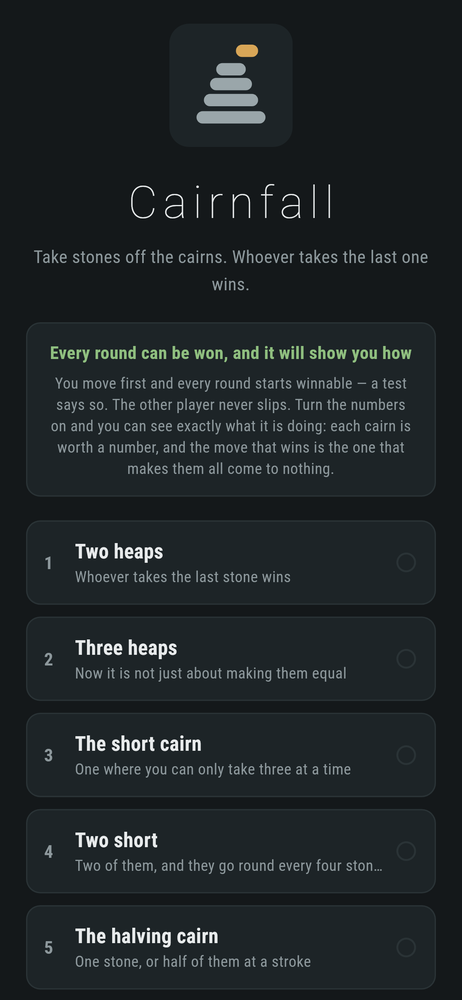
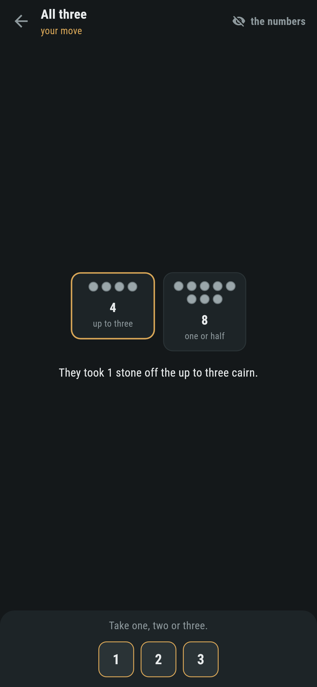
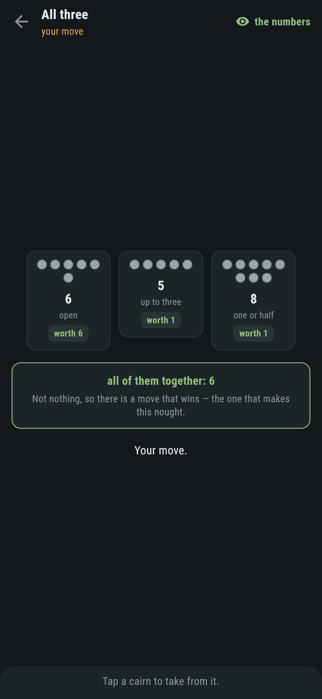
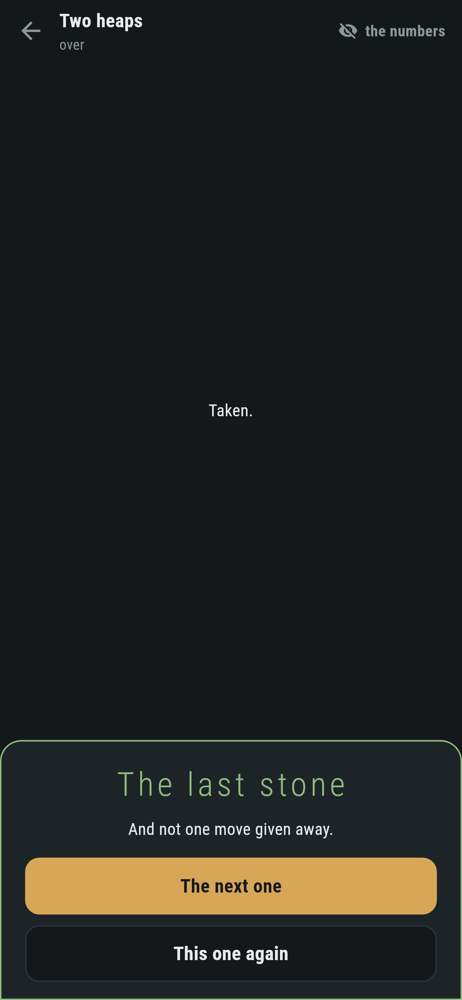
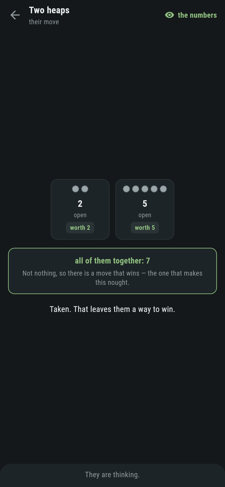

# Cairnfall

A stone-taking game for phones, in Flutter, for Android and iOS.

Take stones off the cairns, one cairn a turn. Whoever takes the last stone
wins. The cairns do not all give up stones the same way, and the other player
has already worked the whole thing out.

| | | | |
|---|---|---|---|
|  |  |  |  |

## Three rules, one arithmetic

- **Open.** Take as many as you like, down to the last stone.
- **Up to three.** Take one, two or three.
- **One or half.** Take one stone, or exactly half of them when there is an
  even number.

A row of open cairns is Nim, and Nim is a game people either know the trick to
or do not. Mix three rules and the position is one nobody has seen, and the
game shows that *the same arithmetic still settles it*.

Every cairn is worth a number: the size of the plain heap it could be swapped
for without changing who wins. That is a fact about the cairn rather than a
judgement of it, and it is worked out the only way it can be. The value of a
cairn is the smallest number that is not the value of anything it can turn
into. Every cairn is smaller than the one it came from, so the table fills in
from nothing upwards and never asks about itself.

Then the row is settled by exclusive-or. Nothing means the player to move
loses; anything else means they win, and the move that wins is the one that
makes it nothing.

## The theorem is a test, not a footnote

Everything above rests on Sprague and Grundy's result, and this repository
does not take it on trust. `test/stones_test.dart` works out who wins by
walking the entire game tree, a search that knows nothing about values, and
checks it against the arithmetic:

```dart
expect(winsByBruteForce(play, seen), worth.ofAll(cairns) != 0,
    reason: 'the arithmetic and the search disagree about $cairns');
```

Four hundred random positions, and then every position of three cairns of up
to six stones, one of each rule, exhaustively rather than sampled. If the theorem
did not hold for these rules, that test would say so before a player ever did.

## It will show you what it is doing


Turn the numbers on and every cairn carries its value, with the row's total
underneath and what that total means. It is not a hint and not a difficulty
setting: it is the same table the other player is using, put where you can see
it.

The other player never slips. From a position that can be won it wins; from
one that cannot it takes one stone and waits. There is nothing to tune,
because there is nothing to tune: this is what the game looks like played
correctly.

## Every round starts winnable

You move first, and each of the eight rounds is worth something other than
nothing, and a test says so. That is not a courtesy. A round worth nothing is one
where nothing the player does matters, and this game is only about what they
do.

```
$ make rounds
 1 Two heaps          2 cairns    8 stones  worth  6  1 of 8 moves win
 2 Three heaps        3 cairns    7 stones  worth  7  1 of 7 moves win
 4 Two short          2 cairns   15 stones  worth  3  2 of 6 moves win
 8 The yard           5 cairns   59 stones  worth 14  1 of 23 moves win
```

So the game counts something more useful than wins: how many times you handed
back a round you were winning. Losing a round means it happened at least once,
and winning one without it happening is what the list marks.



## Running it

```
make deps    # flutter pub get
make test    # everything
make analyze
make shots   # render the screens into build/showcase, redraw the logo
make rounds  # what every round is worth, and how many moves win
make apk     # release APK
make ios     # release iOS build, unsigned
```

## Tests

`flutter test` runs the rules (what each kind of cairn gives up, including
that half of two is one and that seven has no half), the values (nought for an
empty cairn whatever its rule; an open cairn worth its own size, which is Nim
and the one row that can be checked against something known; a short cairn
going round every four; and every value checked against the definition from
the outside), the theorem twice over, and a game (taking, refusing a take the
rule does not allow, the last stone, and that perfect play wins every game
that can be won).

Then the game through the screen: picking a cairn, the takes each rule offers,
the other player's reply, the numbers going on and off, and every round
played out by the arithmetic, which has to win all eight without once giving
one away.

Screenshots come from `test/showcase_test.dart`, and every stone that has come
off a cairn in them came off by tapping the cairn and then the number.
`test/mark_test.dart` draws the logo and the app icon; there is no image in
this repository that was not produced by it.
