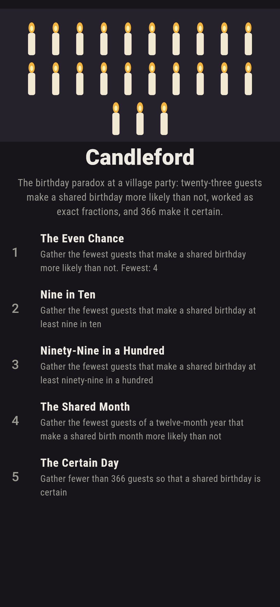
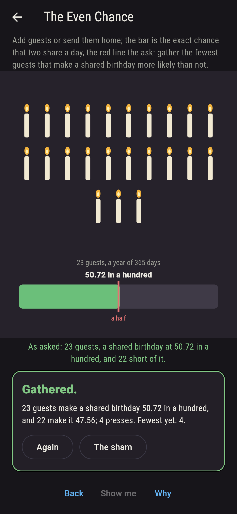
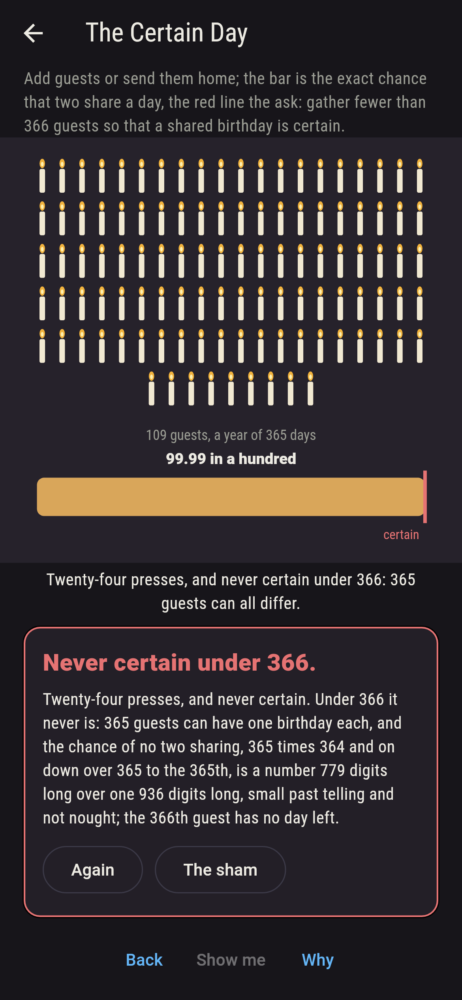
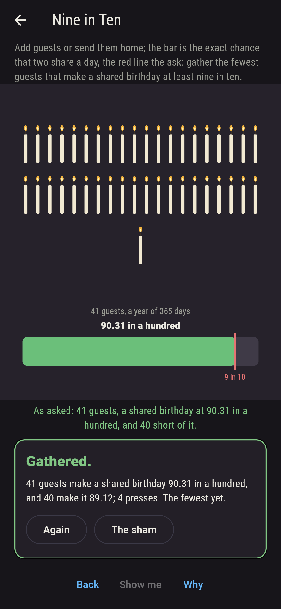
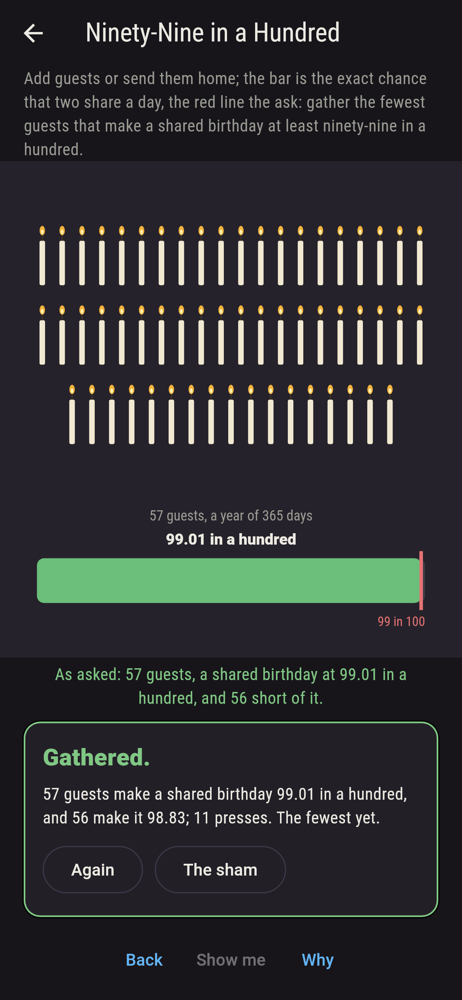
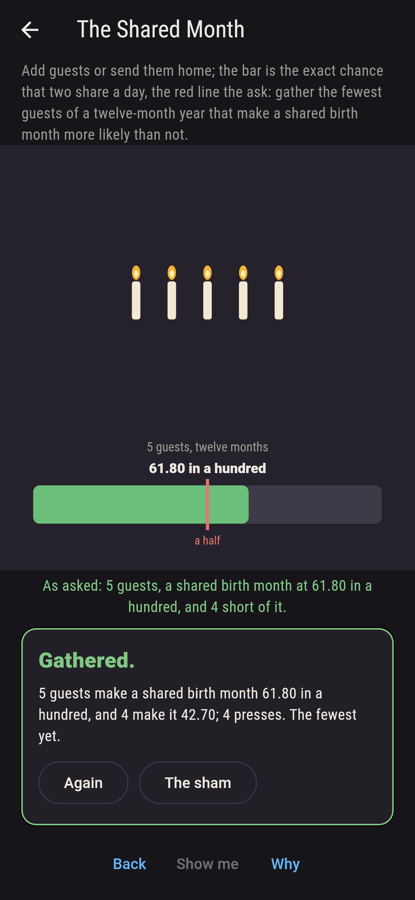
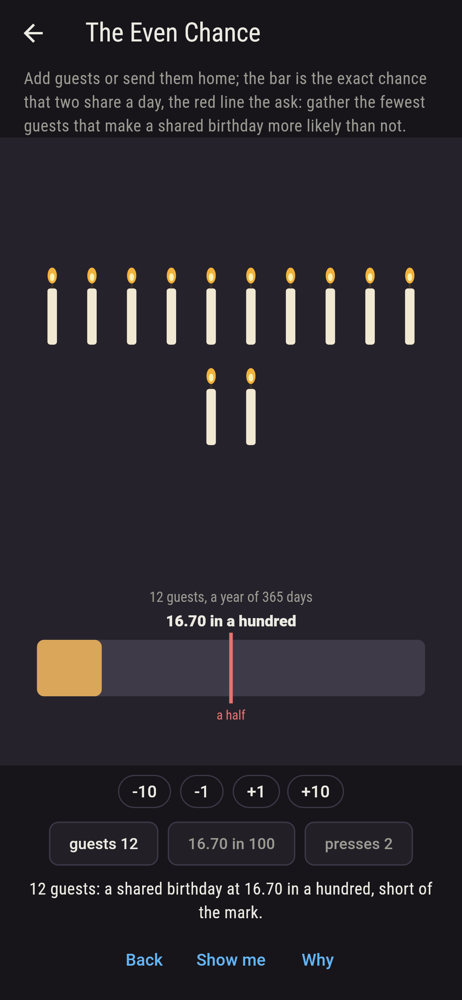
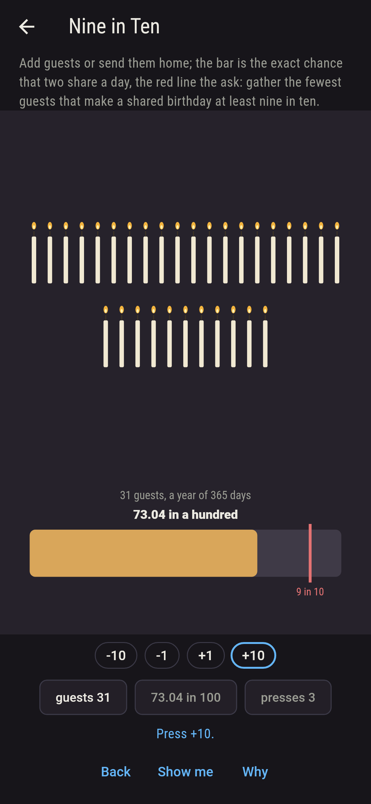
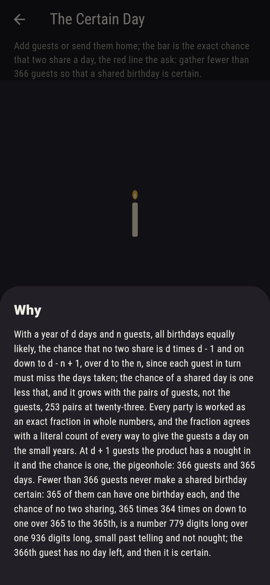

# Candleford


The birthday paradox at a village party. Add guests or send them
home, and the bar shows the exact chance that two of them share a
birthday, the red line the ask. With a year of d days and n
guests, all birthdays equally likely, the chance that no two share
is d times d - 1 and on down to d - n + 1, over d to the n, since
each guest in turn must miss the days taken, and the chance of a
shared day is one less that; it grows with the pairs of guests, not
the guests, 253 pairs at twenty-three, and twenty-three is where it
passes a half, 50.7297 in a hundred. Forty-one make nine in ten,
fifty-seven ninety-nine in a hundred, and 366 make it certain,
since 365 days cannot hold 366 guests apart, while 365 guests can
all differ, the fraction short of one by a hair 779 digits long
over 936. Every party is worked as an exact fraction in whole
numbers, and the fraction agrees with a literal count of every way
to give the guests a day on the small years.

## The parties

1. **The Even Chance** - gather the fewest guests that make a shared birthday more likely than not
2. **Nine in Ten** - gather the fewest guests that make a shared birthday at least nine in ten
3. **Ninety-Nine in a Hundred** - gather the fewest guests that make a shared birthday at least ninety-nine in a hundred
4. **The Shared Month** - gather the fewest guests of a twelve-month year that make a shared birth month more likely than not
5. **The Certain Day** - gather fewer than 366 guests so that a shared birthday is certain

Twenty-three guests, 50.7297 in a hundred, and twenty-two fall
short at 47.5695; forty-one, 90.3151, and forty stop at 89.1231;
fifty-seven, 99.0122, and fifty-six stop at 98.8332; five guests
of a twelve-month year, 61.8055, and four stop at 42.7083, while
twelve reach 99.9946 and thirteen make it certain. The Certain Day
is labeled hopeless on its tile, and the why is the pigeonhole the
other way about: 365 guests can have one birthday each.

## Two voices

The game never asserts what it has not computed, and it computes
everything at least twice:

* **The fraction** works every party as no two sharing over all
  the ways, exact in big whole numbers, and cuts it to a hundredth
  for the sham without rounding; every number on the sham is that
  fraction's, and it says the 365th guest leaves the chance short of
  one and the 366th makes it one.
* **The walk** counts every way to give the guests a day, one by
  one, and how many of those ways share a day, on the small years
  where that can be done, a week of seven days and a year of twelve
  months and a week of five, and agrees with the fraction on every
  one, 16,807 and 5,764,801 and 2,985,984 and 78,125 ways.

`tool/check_parties.dart` runs the lot and refuses the bake on any
disagreement.

## The checker's ledger

What `dart run tool/check_parties.dart` printed for the build this
README shipped with, word for word:

```
every party of one to 366 guests of a 365-day year worked as an exact fraction, no two sharing being 365 down to 365 - n + 1 over 365 to the n: a shared birthday is more likely than not from 23 guests, 50.7297 in a hundred, 22 having 47.5695; nine in ten from 41, 90.3151, 40 having 89.1231; ninety-nine in a hundred from 57, 99.0122, 56 having 98.8332; certain from 366, and short of certain at 365 by a hair, 365 factorial over 365 to the 365th, a number of 779 digits over one of 936; a shared birth month is more likely than not from 5 guests of a twelve-month year, 61.8055, and certain from 13; and the fraction agrees with a literal count of every way to give the guests a day, 16,807 ways for five guests of a seven-day week, 5,764,801 for eight, 2,985,984 for six guests of twelve months and 78,125 for seven guests of a five-day week

 1 The Even Chance          gather the fewest guests that make a shared birthday more likely than not: 1 of the 366 settings lands it
 2 Nine in Ten              gather the fewest guests that make a shared birthday at least nine in ten: 1 of the 366 settings lands it
 3 Ninety-Nine in a Hundred gather the fewest guests that make a shared birthday at least ninety-nine in a hundred: 1 of the 366 settings lands it
 4 The Shared Month         gather the fewest guests of a twelve-month year that make a shared birth month more likely than not: 1 of the 13 settings lands it
 5 The Certain Day          gather fewer than 366 guests so that a shared birthday is certain: none of the 365, and the fraction said so first
```

## Screenshots

| The sham | The even chance | The certain day admitted |
| --- | --- | --- |
|  |  |  |

| Nine in ten | Ninety-nine in a hundred | The shared month | Mid-gathering | Show me | The why |
| --- | --- | --- | --- | --- | --- |
|  |  |  |  |  |  |

Screenshots are drawn by `test/showcase_test.dart` at real phone
sizes with the app's own painter, then copied into `docs/` as they
came out; every guest in them was added by a press, so nothing
pictured is a party the game could not reach. The logo and every
launcher icon come out of `test/mark_test.dart` the same way: the
mark is twenty-three candles, the party where a shared birthday
first turns more likely than not.

## Building

```
flutter test          # 47 tests, the fraction among them
dart run tool/check_parties.dart
flutter build apk     # or: flutter build ios
```
