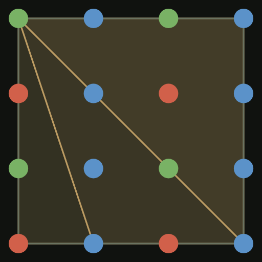
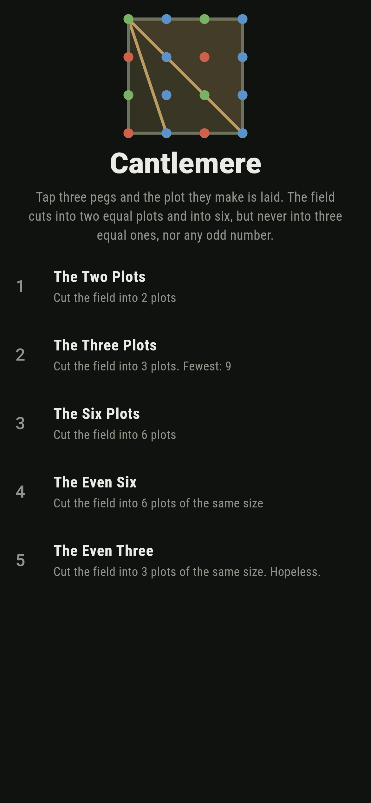
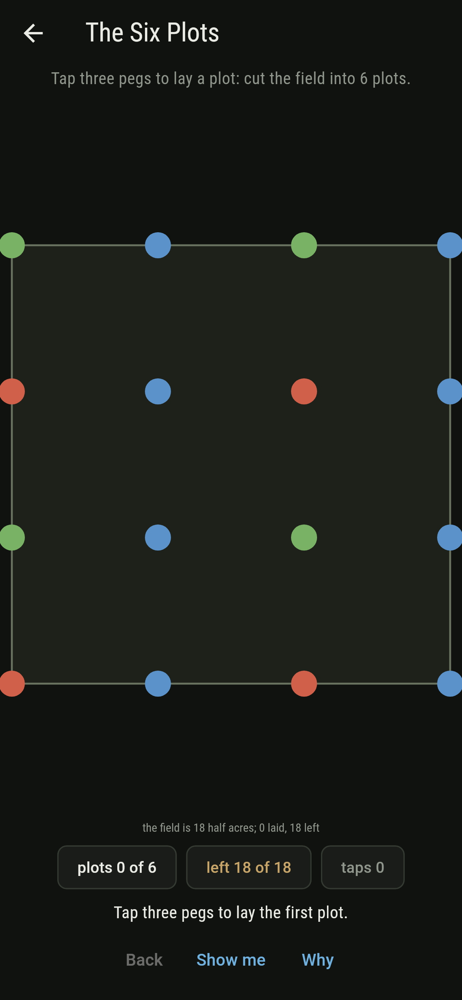
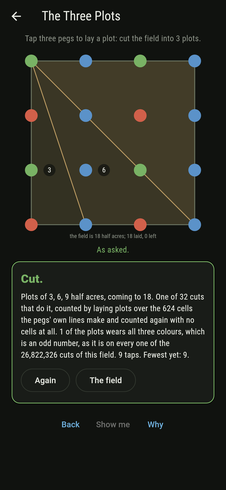
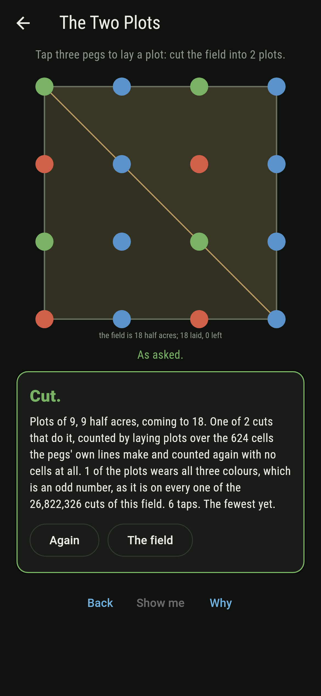
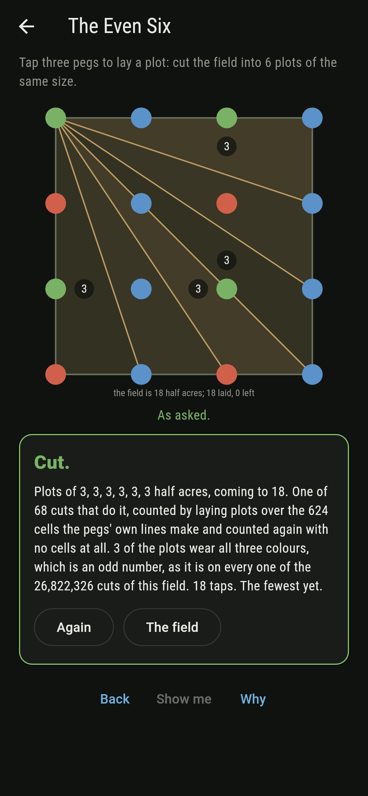
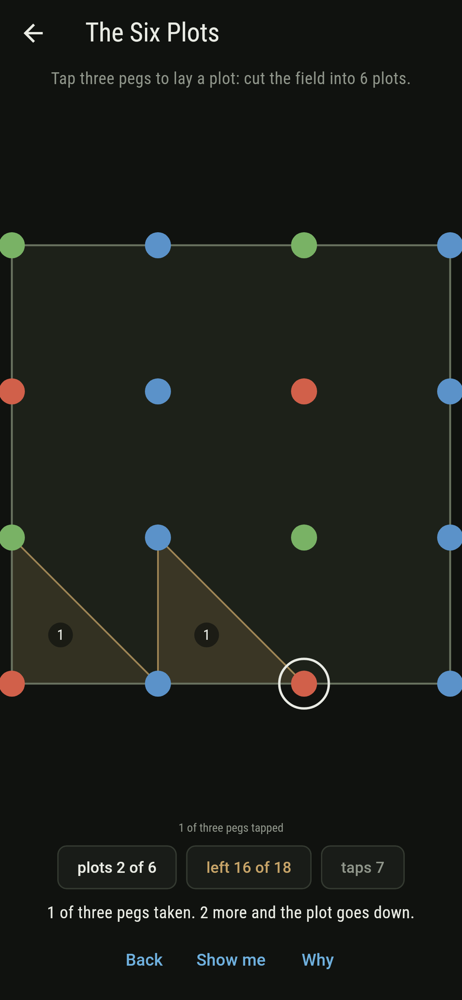
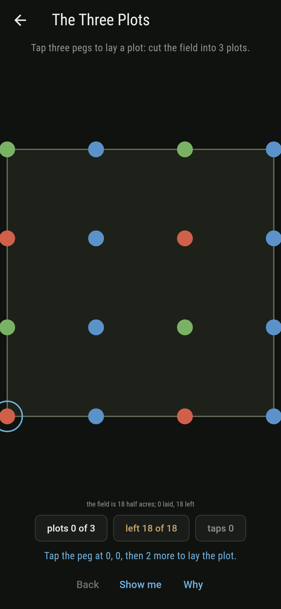
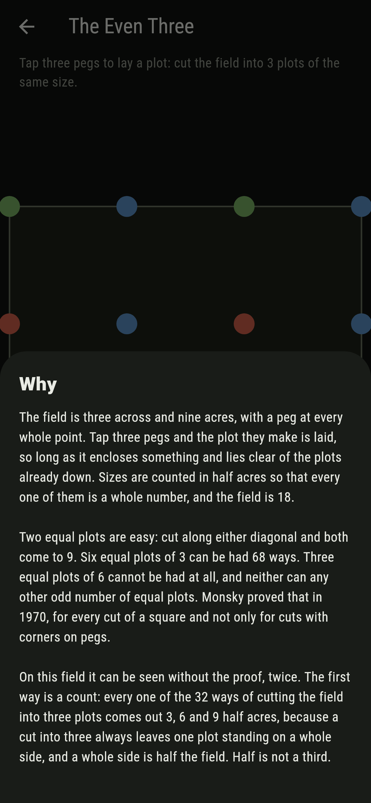
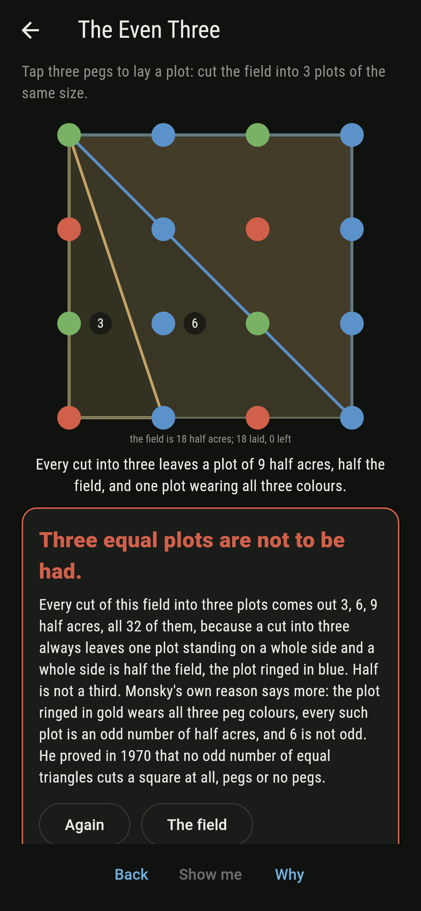

# Cantlemere



A square field of nine acres with a peg at every whole point of its
three by three grid. Tap three pegs and the plot they make is laid,
so long as it encloses something and lies clear of whatever is
already down. Sizes are counted in half acres so that every one is a
whole number, and the field is 18. Two equal plots are easy: cut
along either diagonal and both come to 9. Six equal plots of 3 can
be had 68 ways. Three equal plots of 6 cannot be had at all, and
neither can any other odd number of equal plots. Monsky proved that
in 1970, for every cut of a square and not only for cuts with their
corners on pegs, which makes it the one thing in this game that the
sweep does not settle and the reasoning does. On this field the
reason can be seen twice over without the proof, and the game draws
both. Every way of cutting the field into plots is walked before the
bake, all 26,822,326 of them, and the cuts are counted two ways that
share nothing.

## The asks

1. **The Two Plots** - cut the field into 2 plots
2. **The Three Plots** - cut the field into 3 plots
3. **The Six Plots** - cut the field into 6 plots
4. **The Even Six** - cut the field into 6 plots of the same size
5. **The Even Three** - cut the field into 3 plots of the same size

They land 2, 32, 8,836, 68 and none of the cuts, and each wants three
taps a plot, so 6, 9, 18 and 18. The two plots are the two diagonals
and both come out 9 and 9, so at two the sizes are equal whether you
ask for it or not. At six they can be made equal 68 ways of the
8,836. At three they never can. Every one of the 32 three-plot cuts
comes out 3, 6 and 9 half acres, because a cut into three always
leaves one plot standing on a whole side of the field, and a whole
side is half of it. Half is not a third. The Even Three is labeled
hopeless on its tile, and the field draws that reason and Monsky's
own alongside it.

## The colouring, which is the second reason

Give every peg a colour taken from its own two numbers: red where
both are even, blue where the across number is odd, green where the
across number is even and the up number odd. Four pegs come out red,
eight blue and four green, and no line through two pegs carries all
three colours. Walk the rim counting the steps between red and blue
and there are three of them, an odd number, so somewhere inside the
field a plot has to wear all three. Call it motley. Work out the size
of a motley plot and it always comes out an odd number of half acres,
on every one of the 128 the pegs allow. Three equal plots would each
be 6, and 6 is not odd.

That is Monsky's argument with the 2-adic valuation taken out of it.
Scaling the unit square by three leaves every valuation alone,
because three is odd, so the three colours here are his three classes
written in whole numbers. The colouring also shows itself on the asks
that can be done: cut the field into six equal plots and an odd
number of them come out motley, three or one, never two.

## Two voices

The game never asserts what it has not computed, and it computes
everything at least twice:

* **The cells** are what the walk counts over. The 62 lines through
  two or more pegs cut the field into 624 pieces, and the game works
  those out for itself in exact fractions rather than being handed
  them. A plot is then a set of cells, a cut is an exact cover, and
  the walk takes the lowest cell not yet covered and tries every plot
  that covers it.
* **The fitting** knows nothing about cells. It asks only that no two
  plots overlap, which it settles by looking for a line along an edge
  of one of them that separates the two, and that the half acres come
  to 18. That is enough, since plots that do not overlap and come to
  the whole area can leave nothing uncovered. It agrees with the cells
  on every one of the 10,830 cuts into six plots or fewer.

`tool/check_plots.dart` runs the lot and refuses the bake on any
disagreement. It also holds the colouring to the sweep: not one of
the 26,822,326 cuts has an even number of motley plots.

## The checker's ledger

What `dart run tool/check_plots.dart` printed for the build this
README shipped with, word for word:

```
every way of cutting the field into plots with their corners on the pegs walked, all 26,822,326 of them, from the 2 cuts into two plots to the 46,456 into eighteen; the walk lays plots over the 624 cells that the 62 lines through the pegs cut the field into, and it works those cells out for itself in exact fractions rather than being told them; a second voice, which knows nothing of cells and asks only that no two plots overlap and that the half acres come to 18, agrees with it on every one of the 10,830 cuts into six plots or fewer; each of the 16 pegs takes a colour from its own two numbers, 4 red, 8 blue and 4 green, and no line through two pegs carries all three; of the 516 plots the pegs allow, 128 wear all three colours and every last one of those is an odd number of half acres; the rim steps between red and blue 3 times, an odd number, and not one of the 26,822,326 cuts has an even number of motley plots; every one of the 32 cuts into three plots comes out 3, 6 and 9 half acres with exactly one motley plot, so three plots of 6 are not to be had, though six of 3 are, 68 ways, and two of 9 are, 2 ways

 1 The Two Plots   cut the field into 2 plots: 2 cuts do it, 6 taps of a peg apiece
 2 The Three Plots cut the field into 3 plots: 32 cuts do it, 9 taps of a peg apiece
 3 The Six Plots   cut the field into 6 plots: 8,836 cuts do it, 18 taps of a peg apiece
 4 The Even Six    cut the field into 6 plots of the same size: 68 cuts do it, 18 taps of a peg apiece
 5 The Even Three  cut the field into 3 plots of the same size: none at all, and the field says why twice over
```

## Screenshots

| The field | An ask as it opens | The three plots |
| --- | --- | --- |
|  |  |  |

| The two plots | The even six | Mid-cut | Show me | The why | Not to be had |
| --- | --- | --- | --- | --- | --- |
|  |  |  |  |  |  |

Screenshots are drawn by `test/showcase_test.dart` at real phone
sizes with the app's own painter, then copied into `docs/` as they
came out; every plot in them was laid by tapping its three pegs, so
nothing pictured is a cut the game could not reach. The logo and
every launcher icon come out of `test/mark_test.dart` the same way:
the mark is a cut of the field into three plots, 3, 6 and 9 half
acres, one of them motley.

## Building

```
flutter test          # 64 tests, both voices among them
dart run tool/check_plots.dart
flutter build apk     # or: flutter build ios
```
