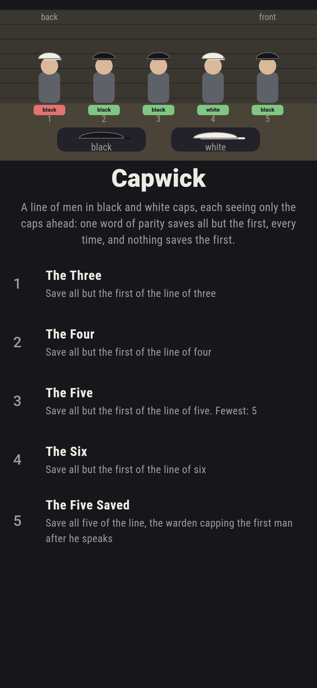
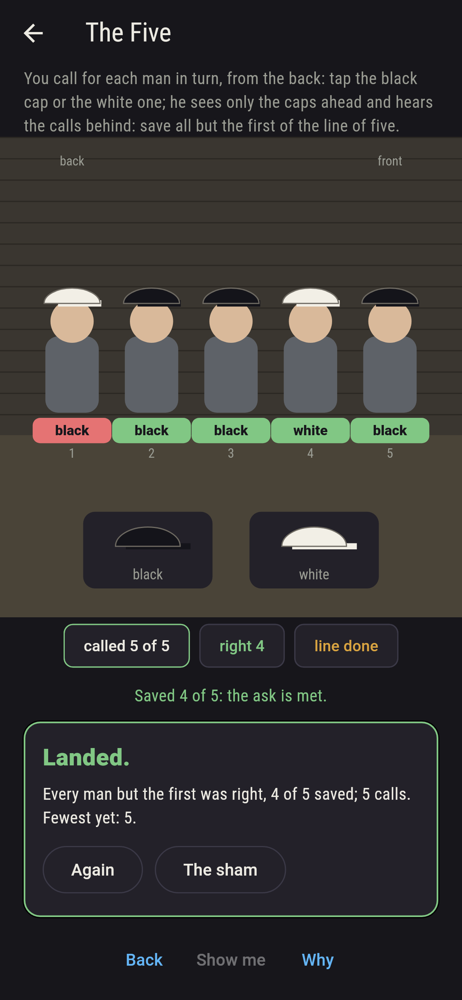
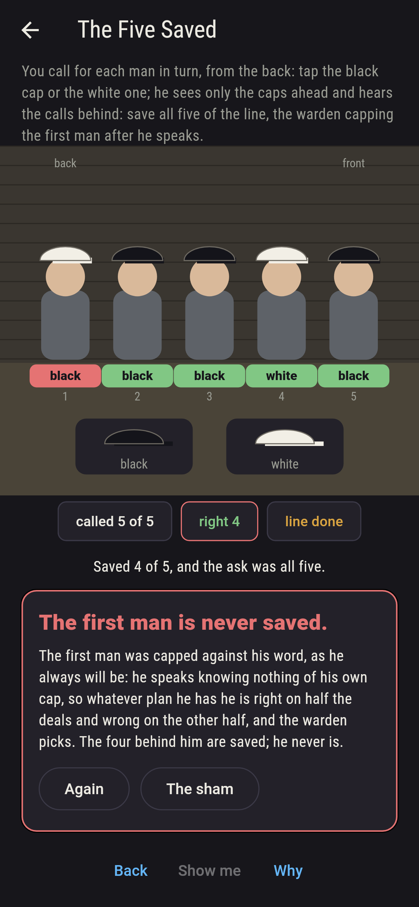
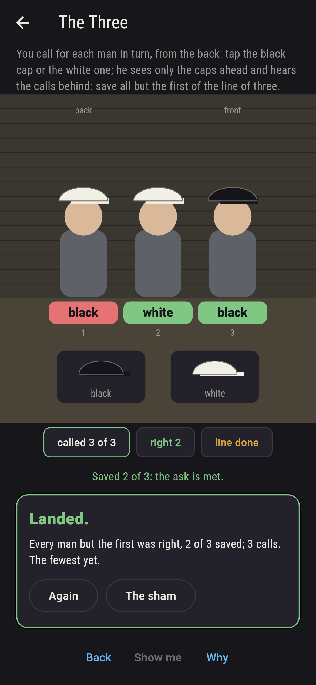
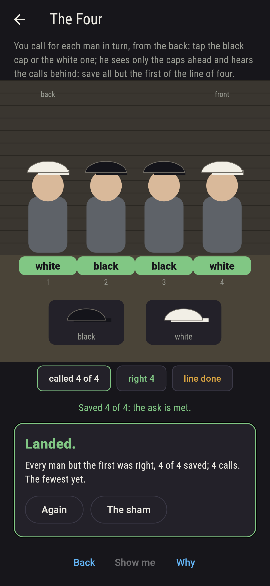
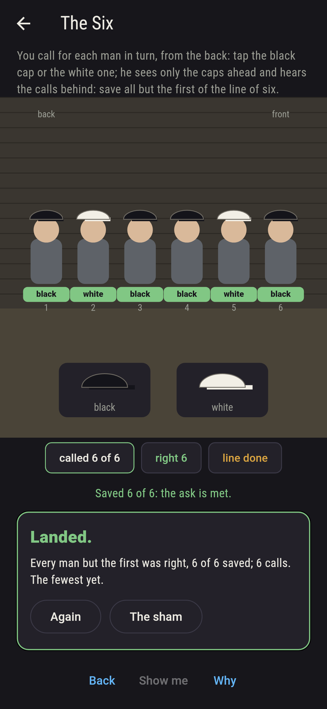
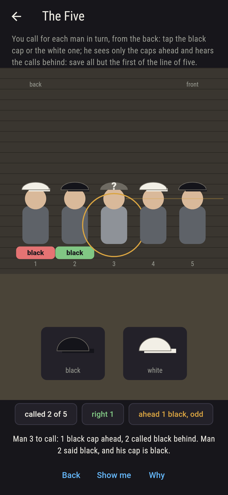
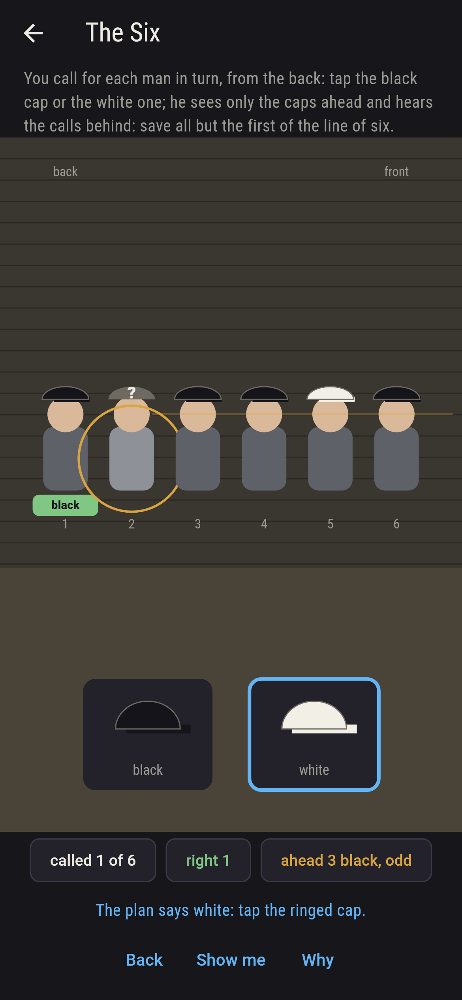
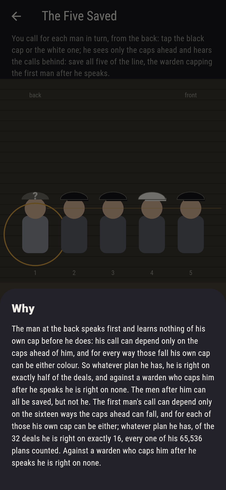

# Capwick


A line of men in the yard, a black or white cap on each, and each
man sees only the caps ahead of him. From the back, one at a
time, each calls the colour of his own cap; every man hears the
calls behind him. There is a plan that saves every man but the
first, whatever the caps: the man at the back calls black if he
sees an odd number of black caps ahead and white if even, and each
man after him counts the black caps he sees ahead and the black
caps called behind, and calls the colour that brings the line to
the parity the first man told. You make the calls. The first man
can never be saved by any plan, since he speaks knowing nothing of
his own cap, and the last level puts a warden behind him who caps
him against his word.

## The lines

1. **The Three** - save all but the first of the line of three
2. **The Four** - save all but the first of the line of four
3. **The Five** - save all but the first of the line of five
4. **The Six** - save all but the first of the line of six
5. **The Five Saved** - save all five of the line, the warden capping the first man after he speaks

The plan is run down every deal of every line, 8 and 16 and 32
and 64 of them, and saves every man but the first on every one;
the first man is right on exactly half, which is luck. The Five
Saved is labeled hopeless on its tile: every plan the first man
could have is counted, 65,536 of them for a line of five, and each
is right on exactly 16 of the 32 deals, no plan more.

## Two voices

The game never asserts what it has not computed, and it computes
everything at least twice:

* **The plan, run down every deal** of every line of two to eight
  men, every call checked against the cap it names: all but the
  first right on every deal, the first right on half, and the
  right calls over all deals coming to (n - 1) times 2^n plus
  2^(n - 1) at every length.
* **Every plan of the first man**, for lines of two to five: his
  call can depend only on the caps ahead of him, so a plan is a
  call for each way those can fall, and every such plan is walked
  and counted right on exactly half the deals; no plan does
  better, and against the warden none does anything.

`tool/check_calls.dart` runs the lot and refuses the bake on any
disagreement.

## The checker's ledger

What `dart run tool/check_calls.dart` printed for the build this
README shipped with, word for word:

```
the plan run down every deal of every line of two to eight men, 4 through 256 deals, and it saves every man but the first on every deal and the first on exactly half; every plan the first man could have counted for lines of two to five, 4 and 16 and 256 and 65,536 plans, and each is right on exactly half the deals, no plan more; the right calls over all deals come to (n - 1) times 2^n plus 2^(n - 1) at every length, and on the dealt five, caps white, black, black, white, black from the back, the plan calls black, black, black, white, black and the first man alone is wrong

 1 The Three      save all but the first of the line of three: the plan lands it on 8 of the 8 deals
 2 The Four       save all but the first of the line of four: the plan lands it on 16 of the 16 deals
 3 The Five       save all but the first of the line of five: the plan lands it on 32 of the 32 deals
 4 The Six        save all but the first of the line of six: the plan lands it on 64 of the 64 deals
 5 The Five Saved save all five of the line, the warden capping the first man after he speaks: none of the 32, and the first man's plans said so first
```

## Screenshots

| The sham | The five called down | The five saved admitted |
| --- | --- | --- |
|  |  |  |

| The three | The four | The six | Mid-call | Show me | The why |
| --- | --- | --- | --- | --- | --- |
|  |  |  |  |  |  |

Screenshots are drawn by `test/showcase_test.dart` at real phone
sizes with the app's own painter, then copied into `docs/` as they
came out; every call in them was made by a tap, so nothing
pictured is a line the game could not reach. The logo and every
launcher icon come out of `test/mark_test.dart` the same way: the
mark is the five called down by the plan, four saved and the first
man alone wrong.

## Building

```
flutter test          # 43 tests, the plan on every deal among them
dart run tool/check_calls.dart
flutter build apk     # or: flutter build ios
```
