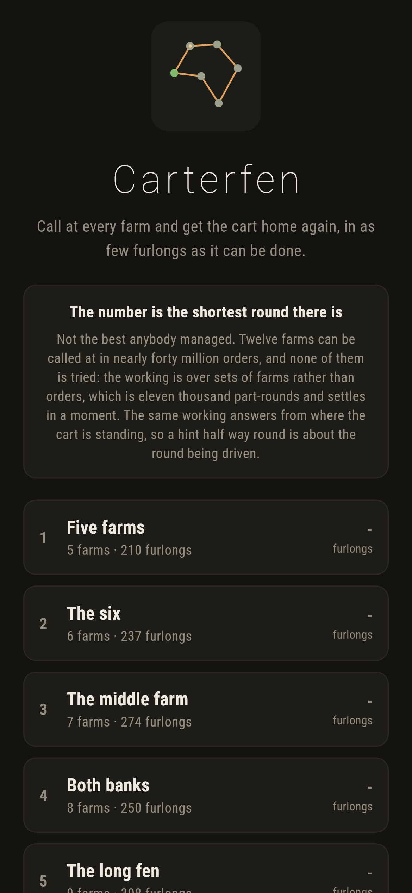
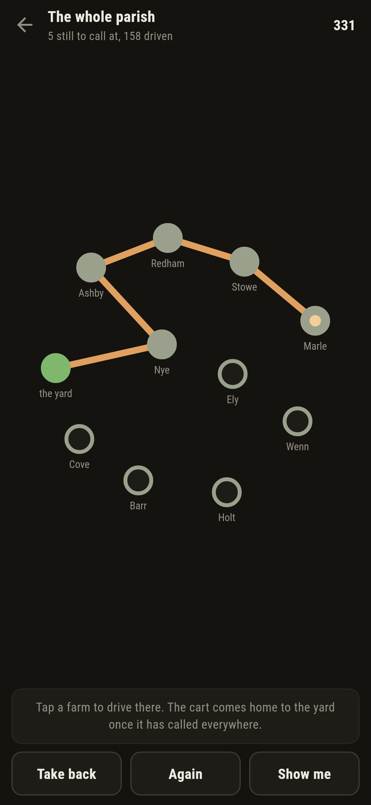
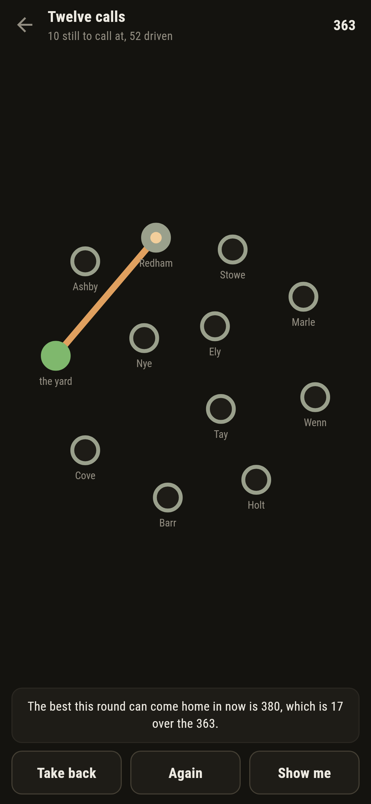
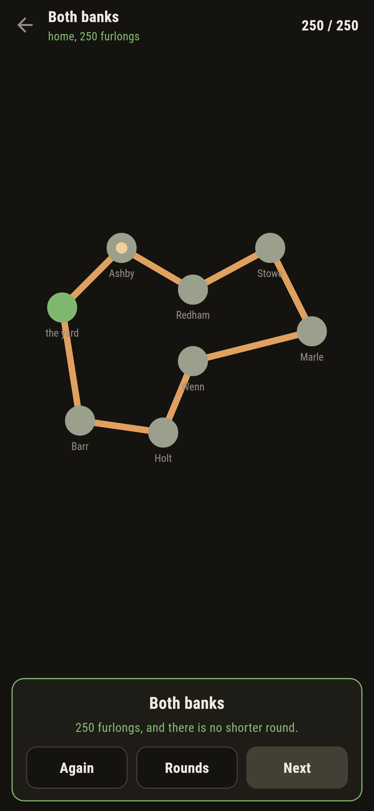

# Carterfen

A round-planning puzzle for phones, in Flutter, for Android and iOS.

A carter has to call at every farm on the fen and get home to the yard. Tap
them in the order you would drive them. The number on each round is the
shortest it can possibly be done in.

| | | | |
|---|---|---|---|
|  |  |  |  |

## Twelve farms is forty million orders, and none of them is tried

Calling at twelve farms can be done in 39,916,800 orders. The shortest is not
found by measuring them.

Instead: for every **set** of farms and every farm in it, work out the
shortest way to leave the yard, call at exactly that set, and finish standing
at that one. Each of those is one call longer than a shorter one already
worked out, so the whole thing is filled in from the smallest sets upwards.
Twelve farms comes to eleven thousand part-rounds and settles in four
milliseconds.

Nothing is lost by grouping them that way. Two orders that call at the same
farms and finish at the same one are competing for exactly the same remaining
journey, so only the shorter of them can be part of any answer. Held and Karp,
1962.

`test/round_test.dart` holds that against the other way round: twenty five
maps of four to eight farms, each solved both by the working and by measuring
every order there is, and the two agree every time.

## The hint is about the round being driven


> The best this round can come home in now is 344, which is 36 over the 308.

The same working answers from wherever the cart is standing: shortest way from
here, calling at what is left, ending at the yard. So a bad call is noticed
the moment it is made, and **Show me** is honest about the round you are
driving rather than the one that was on offer at the start.

## None of them is solved by driving to the nearest farm

The obvious way to plan a round is to go to the nearest farm you have not
called at yet. It is a good way and it is not the answer, so every round here
was checked against it:

```
$ make rounds
 3 The middle farm   7 places  shortest 274  nearest-first 310  (13% over)
 5 The long fen      9 places  shortest 308  nearest-first 383  (24% over)
 8 Twelve calls      12 places  shortest 363  nearest-first 439  (21% over)
```

A test insists on that for every round but the first, which is there to show
what the buttons do.

## Running it

```
make deps    # flutter pub get
make test    # everything
make analyze
make shots   # render the screens into build/showcase, redraw the logo and icons
make rounds  # the shortest round on each map, against driving to the nearest
make apk     # release APK
make ios     # release iOS build, unsigned
```

## Tests

`flutter test` runs the map (that it measures both ways round the same and
adds a round up the whole way round), the working (against measuring every
order on twenty five random maps, that the order it gives back calls at
everything once, and that twelve farms takes far fewer part-rounds than there
are orders), every shipped round (as short as it says, not solved by driving
to the nearest farm every time, and getting bigger), the driving (calling,
refusing a farm twice, taking a call back, and finishing), and the hint (that
it is about the round being driven, that following it from the start drives
the shortest round, and that it has nothing to say once the cart is home).

Then the game through the screen: tapping a farm, being told the cart has
already called there, the yard coming home on its own, the warning when a call
costs something, **Take back**, **Show me**, and every round driven home in
the fewest furlongs there are.

Screenshots come from `test/showcase_test.dart`, and every call in them was
made by tapping a farm. `test/mark_test.dart` draws the logo, the launcher
icons at every density Android asks for and every size the iOS icon set asks
for; there is no image in this repository that was not produced by it.
