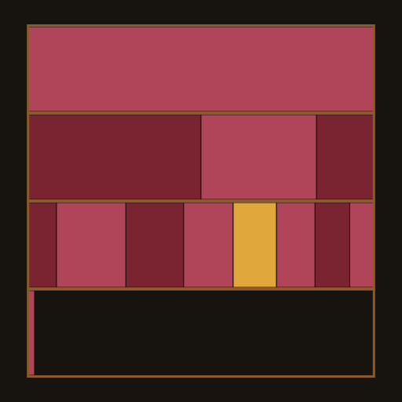
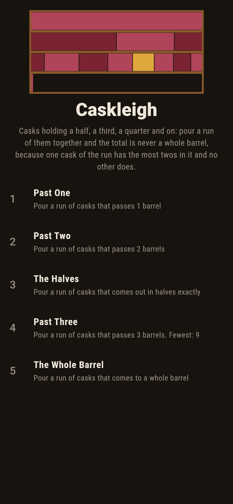
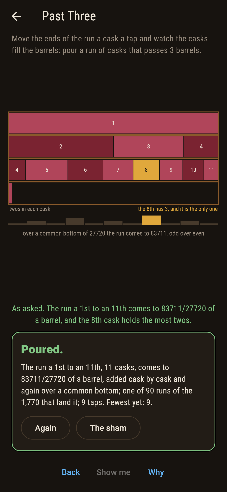
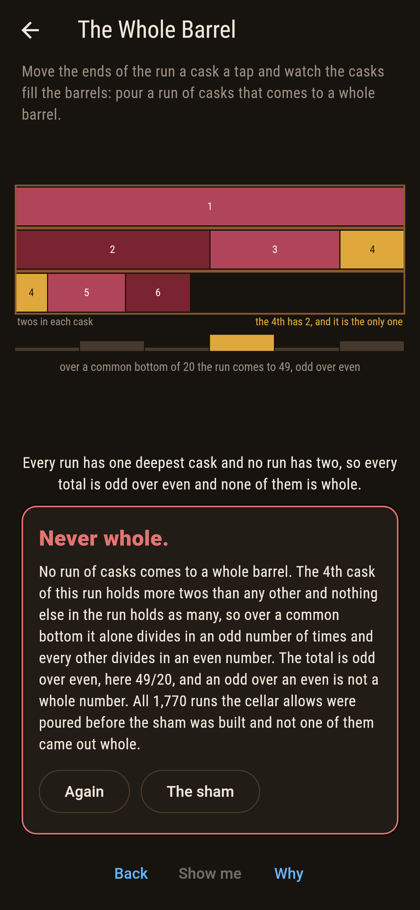
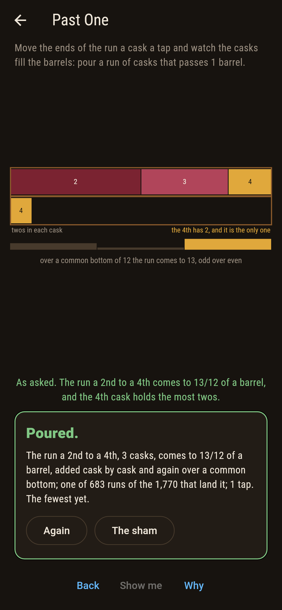
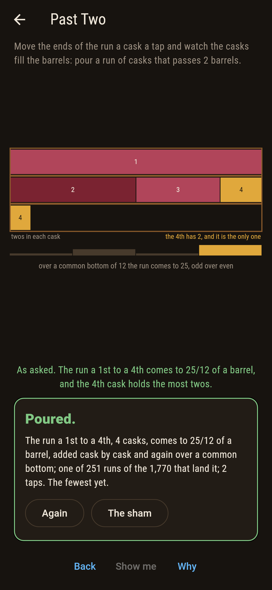
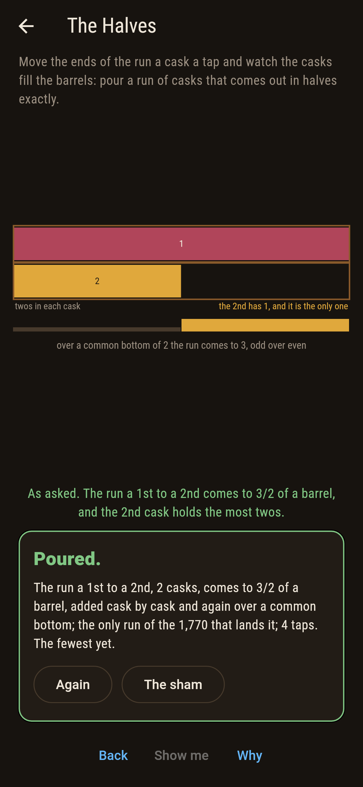
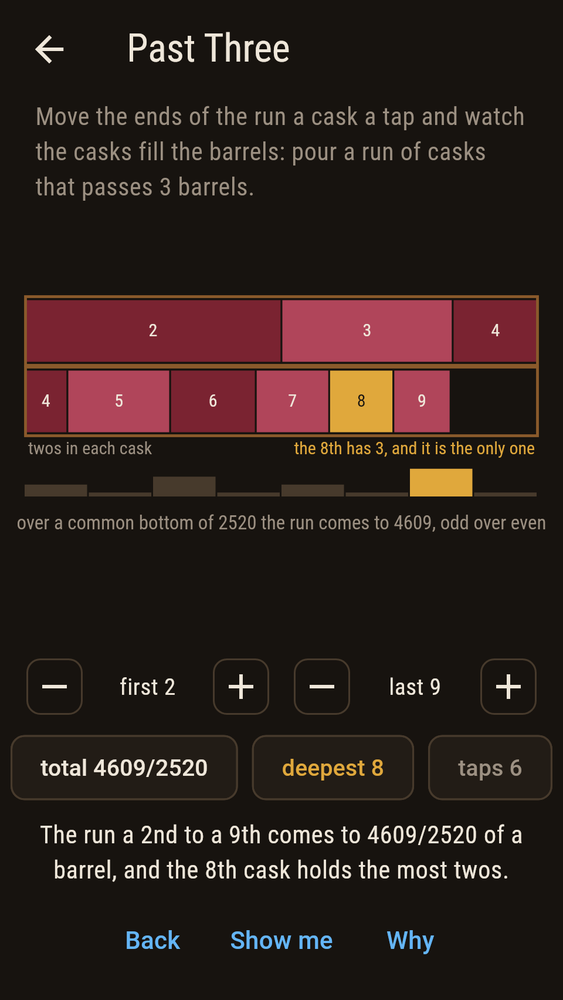
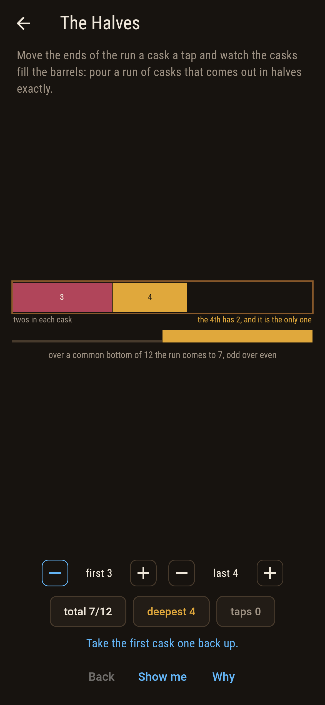
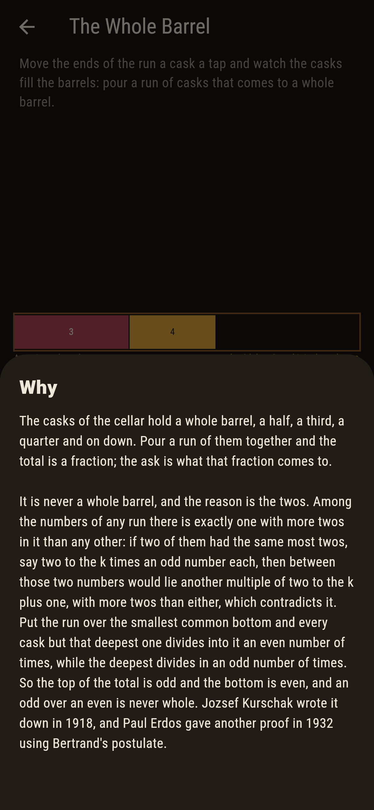

# Caskleigh



A cellar of casks. The first holds a whole barrel, the second a half,
the third a third, and on down to the sixtieth. Pour a run of them
together, the third and the fourth say, and you get 7/12 of a barrel.
Pour a longer run and you get more. What you never get is a whole
barrel. Move the two ends of the run a cask a tap and watch the casks
fill the barrels: the game adds the run twice, once cask by cask in
exact fractions and once over the smallest common bottom in whole
numbers, and marks the one cask of the run that holds the most twos.
There is always exactly one, and that is the whole reason the total is
never whole.

## The asks

1. **Past One** - pour a run of casks that passes 1 barrel
2. **Past Two** - pour a run of casks that passes 2 barrels
3. **The Halves** - pour a run of casks that comes out in halves exactly
4. **Past Three** - pour a run of casks that passes 3 barrels
5. **The Whole Barrel** - pour a run of casks that comes to a whole barrel

683 of the 1,770 runs the cellar allows pass a barrel, the shortest of
them the first two casks at 3/2. 251 pass two, the shortest being the
first four at 25/12, and leaving the first cask out costs ten casks
instead of four. 90 pass three, the shortest the first eleven at
83711/27720. The total grows like the logarithm, so each barrel costs
nearly three times what the one before it did: from the first cask a
run has to reach the 2nd to pass a barrel, the 4th to pass two, the
11th to pass three and the 31st to pass four. One run alone comes out
in halves exactly, the first two casks at 3/2. The Whole Barrel is
labeled hopeless on its tile, and the card at the end of the ask says
why on a finger.

## Why it is never whole

Take any run of whole numbers. Among them there is exactly one with
more twos in it than any other: if two of them had the same most twos,
each being two to the k times an odd number, then somewhere between
those two numbers would sit another multiple of two to the k plus one,
which has more twos than either, and that cannot be. Now put the run
of fractions over the smallest common bottom. That bottom carries as
many twos as the deepest cask does, so the deepest cask divides into
it an odd number of times and every other cask divides in an even
number of times. Add them up: odd plus even is odd, so the top is odd
while the bottom is even, and an odd over an even is not a whole
number.

Jozsef Kurschak published this in 1918. Paul Erdos gave another proof
in 1932, in his first paper, using Bertrand's postulate: the run
contains a prime that appears in no other cask, which does the same
work the twos do here.

## Two voices

The game never asserts what it has not computed, and it computes
everything at least twice:

* **Cask by cask** adds the run in exact fractions, a whole barrel
  over the first cask, a half over the second and on, reducing as it
  goes.
* **Over a common bottom** never divides until the end: it takes the
  smallest number every cask of the run divides into, adds up how many
  times each one goes in, and only then makes a fraction of it.

The two are compared on all 1,770 runs the cellar allows, along with
the count of twos in each cask, whether any run comes to a whole
barrel, and whether the deepest cask is ever anything but one cask.

`tool/check_runs.dart` runs the lot and refuses the bake on any
disagreement.

## The checker's ledger

What `dart run tool/check_runs.dart` printed for the build this README
shipped with, word for word:

```
every run of casks the cellar allows taken, from a first cask to a last with at least two of them, 1,770 runs over the 60 casks, and each added twice, once cask by cask in exact fractions and once over the smallest common bottom in whole numbers alone: the two agree on every run; not one of the 1,770 comes to a whole barrel, and the reason is on the board: every run has exactly one cask with more twos in its number than any other, 1,770 runs out of 1,770, and every total lands over an even bottom, 1,770 out of 1,770; the shortest runs past the marks are a 1st to a 2nd for 1, coming to 3/2, a 1st to a 4th for 2, coming to 25/12, a 1st to an 11th for 3, coming to 83711/27720; a run from the first cask has to reach the 2nd to pass a barrel, the 4th to pass two, the 11th to pass three and the 31st to pass four, and one starting at the second cask has to reach the 4th and the 11th; and one run alone comes out in halves exactly, the first two casks at 3/2

 1 Past One         pour a run of casks that passes 1 barrel: 683 of the 1,770 runs land it, the cheapest in 1 tap
 2 Past Two         pour a run of casks that passes 2 barrels: 251 of the 1,770 runs land it, the cheapest in 2 taps
 3 The Halves       pour a run of casks that comes out in halves exactly: 1 of the 1,770 runs lands it, the cheapest in 4 taps
 4 Past Three       pour a run of casks that passes 3 barrels: 90 of the 1,770 runs land it, the cheapest in 9 taps
 5 The Whole Barrel pour a run of casks that comes to a whole barrel: none of the 1,770, and the twos say why
```

## Screenshots

| The sham | Past three | The whole barrel |
| --- | --- | --- |
|  |  |  |

| Past one | Past two | The halves | Midway, on the small phone | Show me | The why |
| --- | --- | --- | --- | --- | --- |
|  |  |  |  |  |  |

Screenshots are drawn by `test/showcase_test.dart` at real phone sizes
with the app's own painter, then copied into `docs/` as they came out;
every run in them was set by taps, so nothing pictured is a pouring
the game could not reach. The logo and every launcher icon come out of
`test/mark_test.dart` the same way: the mark is the first eleven
casks, three barrels full and a sliver over, with the eighth cask lit
because it holds three twos and nothing else in the run holds as many.

## Building

```
flutter test          # 55 tests, the sweep among them
dart run tool/check_runs.dart
flutter build apk     # or: flutter build ios
```
