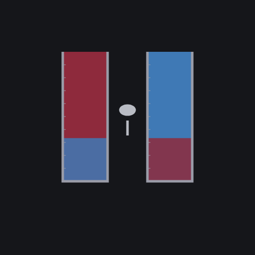
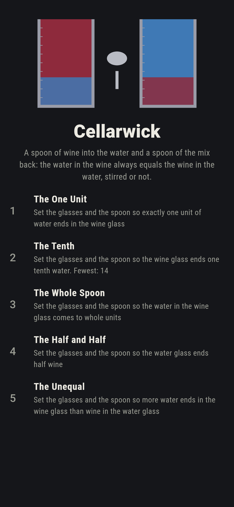
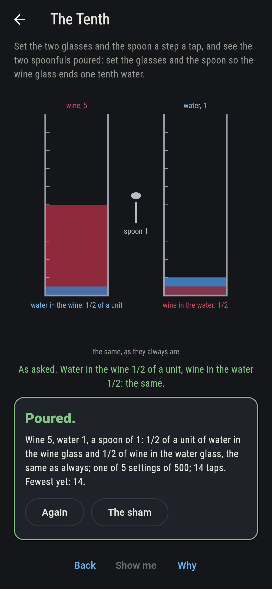
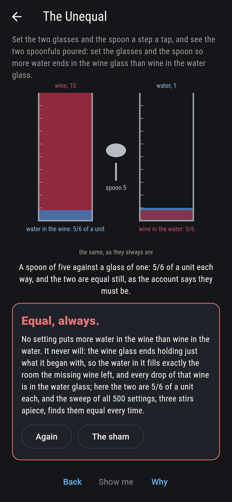
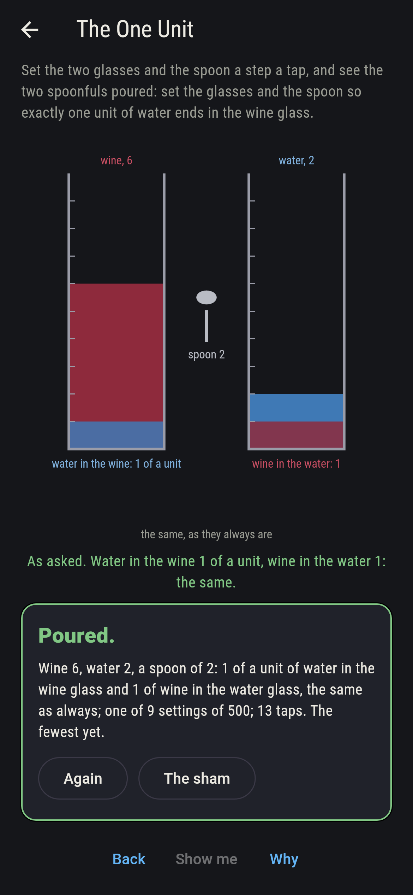
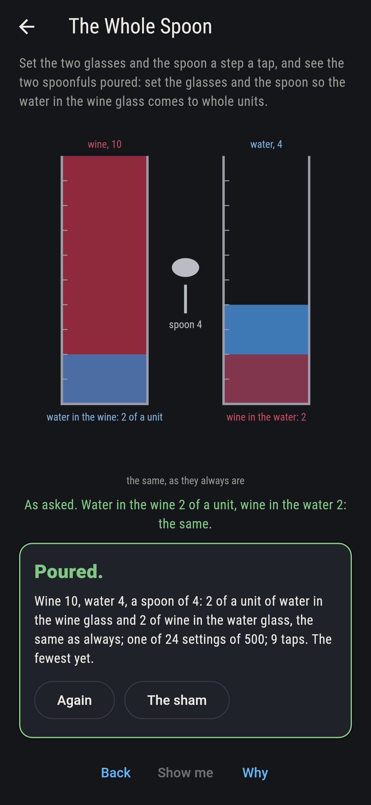
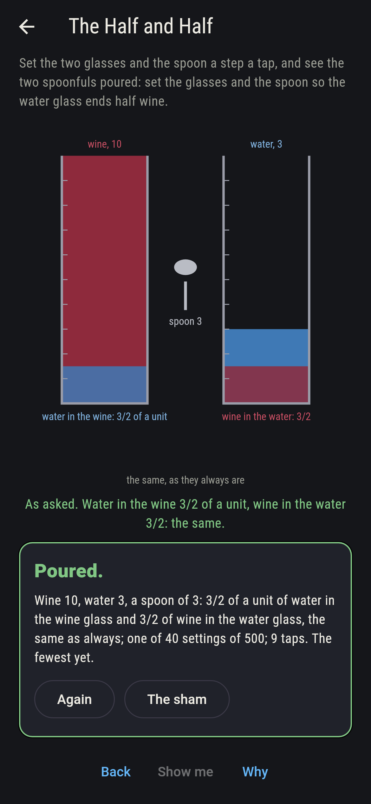
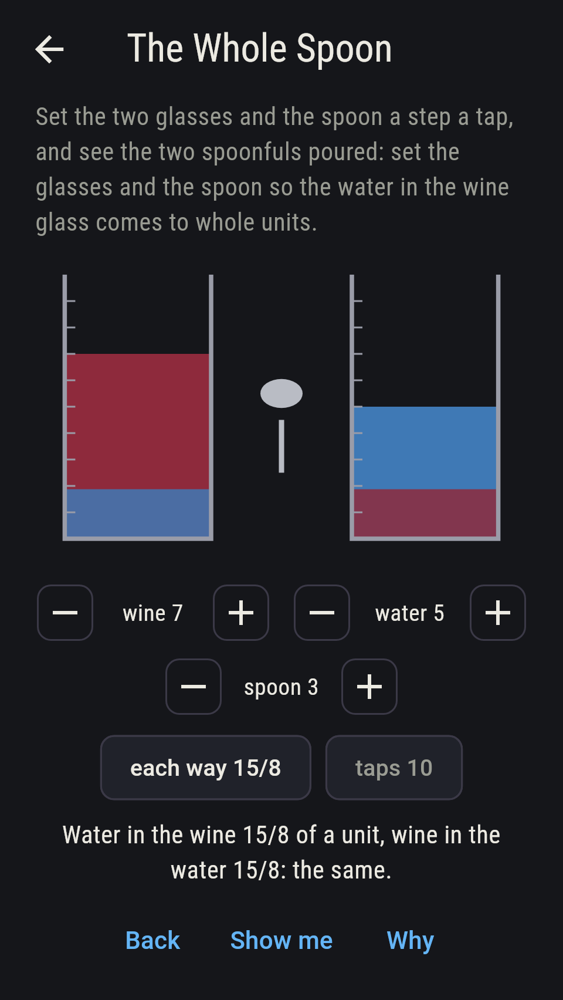
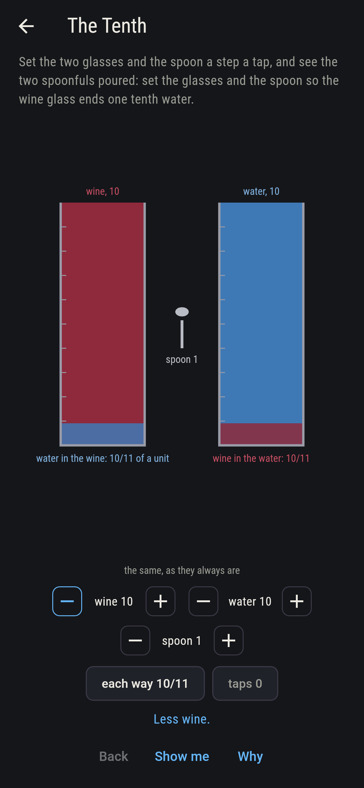
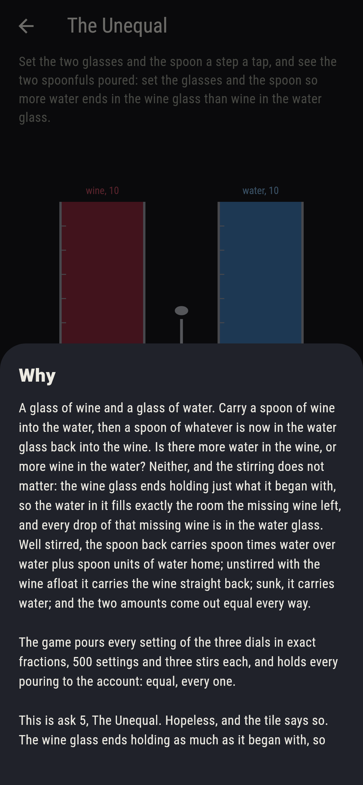

# Cellarwick



A glass of wine and a glass of water. Carry a spoon of wine into the
water, then a spoon of whatever is now in the water glass back into
the wine. Is there more water in the wine, or more wine in the water?
Neither, and the stirring does not matter: the wine glass ends
holding just what it began with, so the water in it fills exactly
the room the missing wine left, and every drop of that missing wine
is in the water glass. Set the two glasses and the spoon a step a tap
and see the two spoonfuls poured in exact fractions: well stirred,
the spoon back carries spoon times water over water plus spoon units
of water home. The game pours every setting of the three dials, 500
of them and three stirs each, and holds every pouring to the
account: equal, every one.

## The asks

1. **The One Unit** - set the glasses and the spoon so exactly one unit of water ends in the wine glass
2. **The Tenth** - set the glasses and the spoon so the wine glass ends one tenth water
3. **The Whole Spoon** - set the glasses and the spoon so the water in the wine glass comes to whole units
4. **The Half and Half** - set the glasses and the spoon so the water glass ends half wine
5. **The Unequal** - set the glasses and the spoon so more water ends in the wine glass than wine in the water glass

One unit of water comes back with two of water and a spoon of two,
whatever the wine glass holds from two up, nine settings of the 500;
the wine glass ends one tenth water five ways, five of wine, one of
water and a spoon of one among them; whole units come back 24 ways,
two of water and a spoon of two, four and four, or six and three;
and the water glass ends half wine exactly when the spoon holds as
much as the water did, 40 ways. The Unequal is labeled hopeless on
its tile: the account never lets the two differ, and the sham admits
it at the wildest pouring there is, a spoon of five against a glass
of one.

## Two voices

The game never asserts what it has not computed, and it computes
everything at least twice:

* **The pouring** is done in exact fractions for every setting of the
  three dials, one to ten units in each glass and one to five in the
  spoon, three ways each: well stirred, unstirred with the wine afloat
  so the spoon back carries wine, and unstirred with the wine sunk so
  it carries water; every count on the sham is that sweep's, and the
  well-stirred water back is checked against spoon times water over
  water plus spoon on every setting.
* **The account** pours nothing: the wine glass ends at its old
  volume, so its water is exactly the wine it lost, and that wine is
  in the water glass; every one of the 1,200 pourings is held to it,
  and the two amounts come out equal every time.

`tool/check_spoons.dart` runs the lot and refuses the bake on any
disagreement.

## The checker's ledger

What `dart run tool/check_spoons.dart` printed for the build this
README shipped with, word for word:

```
every setting of the wine glass, the water glass and the spoon poured in exact fractions, one to ten units in each glass and one to five in the spoon, 500 settings, the spoon too big for the wine in 100 of them and the other 400 poured three ways, well stirred, unstirred with the wine afloat and unstirred with the wine sunk, 1,200 pourings, and in every one the water in the wine glass equals the wine in the water glass exactly; well stirred the water back is spoon times water over water plus spoon on every setting, 10/11 of a unit for ten, ten and one and 10/3 at the most; one unit comes back 9 ways of 500, all with two of water and a spoon of two, the wine glass ends one tenth water 5 ways, whole units come back 24 ways, the water glass ends half wine 40 ways, when the spoon holds as much as the water did, and more water in the wine than wine in the water never

 1 The One Unit      set the glasses and the spoon so exactly one unit of water ends in the wine glass: 9 of the 500 settings land it
 2 The Tenth         set the glasses and the spoon so the wine glass ends one tenth water: 5 of the 500 settings land it
 3 The Whole Spoon   set the glasses and the spoon so the water in the wine glass comes to whole units: 24 of the 500 settings land it
 4 The Half and Half set the glasses and the spoon so the water glass ends half wine: 40 of the 500 settings land it
 5 The Unequal       set the glasses and the spoon so more water ends in the wine glass than wine in the water glass: none of the 500, and the account said so first
```

## Screenshots

| The sham | The tenth | The unequal admitted |
| --- | --- | --- |
|  |  |  |

| The one unit | The whole spoon | The half and half | Midway, on the small phone | Show me | The why |
| --- | --- | --- | --- | --- | --- |
|  |  |  |  |  |  |

Screenshots are drawn by `test/showcase_test.dart` at real phone
sizes with the app's own painter, then copied into `docs/` as they
came out; every glass in them was set by taps, so nothing pictured
is a pouring the game could not reach. The logo and every launcher
icon come out of `test/mark_test.dart` the same way: the mark is the
two glasses after the pouring, a band of each in the other.

## Building

```
flutter test          # 42 tests, the sweep among them
dart run tool/check_spoons.dart
flutter build apk     # or: flutter build ios
```
