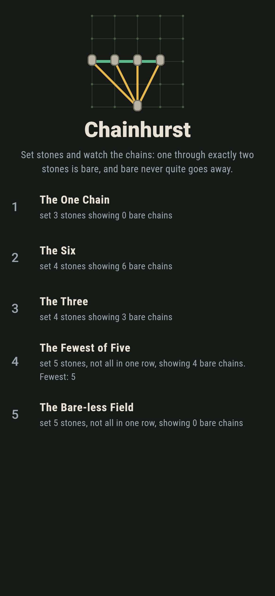
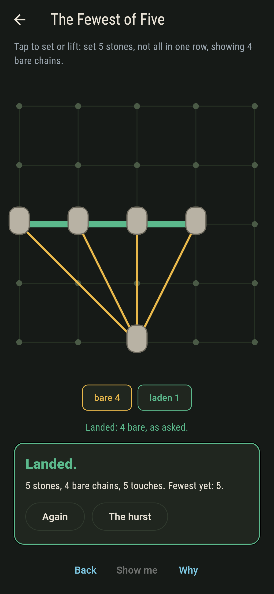
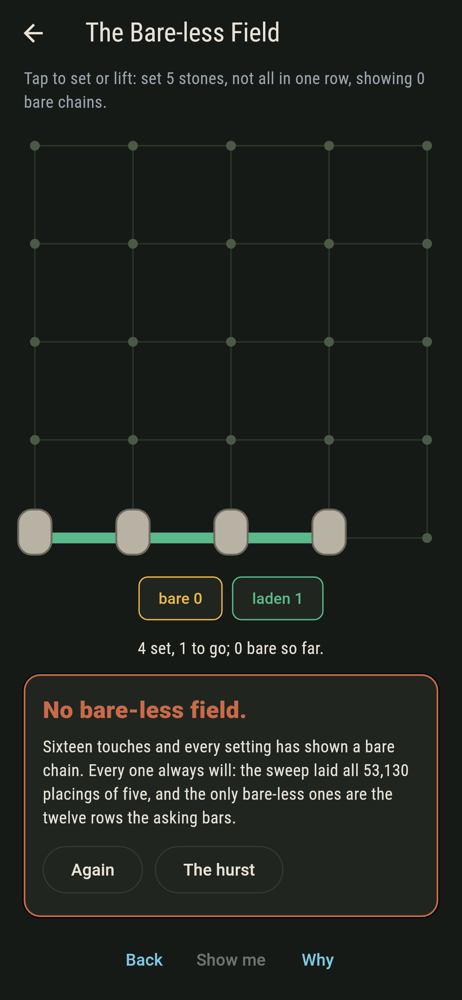
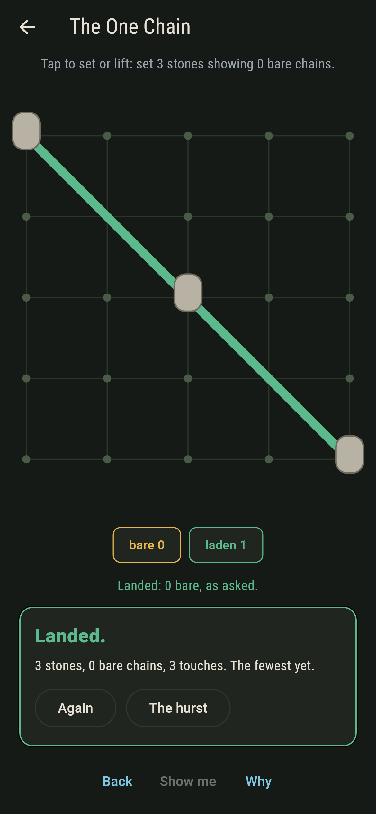
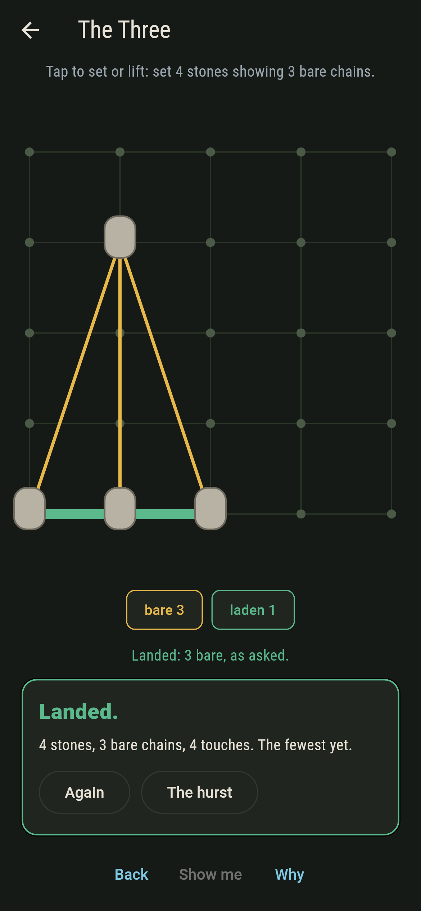
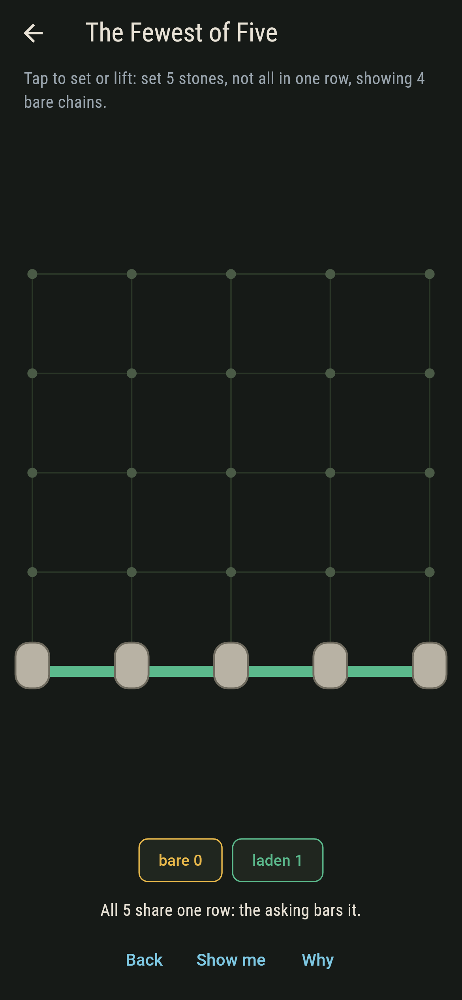
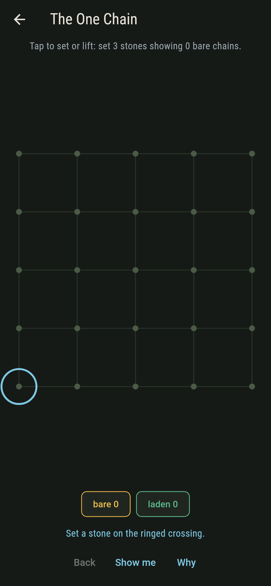
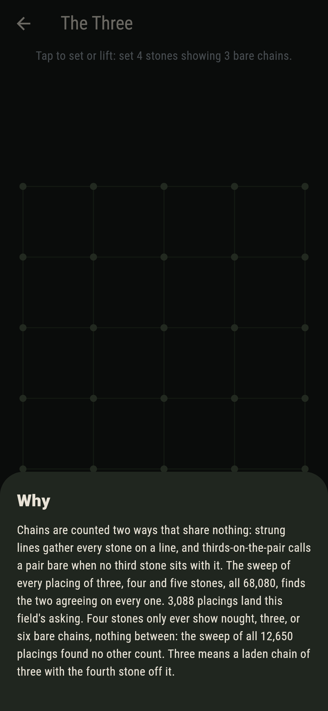

# Chainhurst


Set stones on the crossings of a field and watch the surveyor's
chains string themselves: a chain is the line through every stone
that shares it, bare when it holds exactly two, laden when it
holds more. The game is landing the asked number of bare chains,
and the law underneath is Sylvester and Gallai's: stones not all
in one row always show a bare chain, however they are set.

## The fields

1. **The One Chain** - set 3 stones showing 0 bare chains
2. **The Six** - set 4 stones showing 6 bare chains
3. **The Three** - set 4 stones showing 3 bare chains
4. **The Fewest of Five** - set 5 stones, not all in one row, showing 4 bare chains
5. **The Bare-less Field** - set 5 stones, not all in one row, showing 0 bare chains

The first field teaches the one escape: no bare chain means one
laden chain, all stones in a single row. The third carries a
quantisation the sweep found on its own: four stones only ever
show nought, three, or six bare chains, never anything between.
The fourth sits on the floor: four bare is the fewest five
off-row stones can show on this field. The fifth asks for what
the law forbids, and says so after sixteen touches.

## Two voices

The game never asserts what it has not computed, and it computes
everything twice:

* **Strung lines** gather every stone sharing an exact rational
  line into one chain and count the chains holding two.
* **Thirds-on-the-pair** never builds a line at all: a pair is
  bare when no third stone sits with it, by integer cross product
  alone.

The sweep lays every placing of three, four and five stones on
the five-by-five field, all 68,080 of them, holds the two counts
together on each, and checks Sylvester and Gallai on every
placing off one row. `tool/check_chains.dart` runs the lot and
refuses the bake on any disagreement.

## The checker's ledger

What `dart run tool/check_chains.dart` printed for the build this
README shipped with, word for word:

```
every placing of three, four and five stones on the five-by-five field, all 68,080 of them: chains strung by line and counted by thirds agree on every one, and no placing off one row ever lacks a bare chain

 1 The One Chain        set 3 stones showing 0 bare chains: 152 placings of the sweep land it
 2 The Six              set 4 stones showing 6 bare chains: 9,498 placings of the sweep land it
 3 The Three            set 4 stones showing 3 bare chains: 3,088 placings of the sweep land it
 4 The Fewest of Five   set 5 stones, not all in one row, showing 4 bare chains: 4,358 placings of the sweep land it
 5 The Bare-less Field  set 5 stones, not all in one row, showing 0 bare chains: no placing does, and only the twelve rows of five ever go bare-less
```

## Screenshots

| The hurst | The fewest of five | The bare-less field |
| --- | --- | --- |
|  |  |  |

| The one chain | The three | The row bar | Show me | The why |
| --- | --- | --- | --- | --- |
|  |  |  |  |  |

Screenshots are drawn by `test/showcase_test.dart` at real phone
sizes with the app's own painter, then copied into `docs/` as they
came out; every stone in them was tapped, so nothing pictured is a
field the game could not reach. The logo and every launcher icon
come out of `test/mark_test.dart` the same way: the mark is the
fewest of five landed.

## Building

```
flutter test          # 49 tests, the sweep among them
dart run tool/check_chains.dart
flutter build apk     # or: flutter build ios
```
