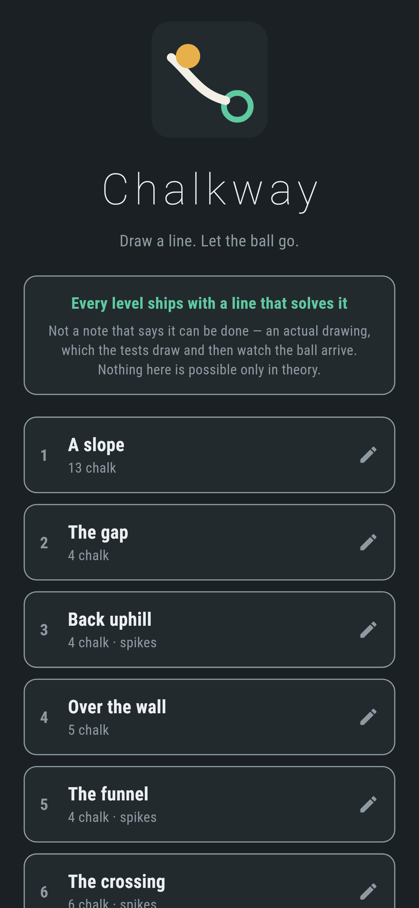
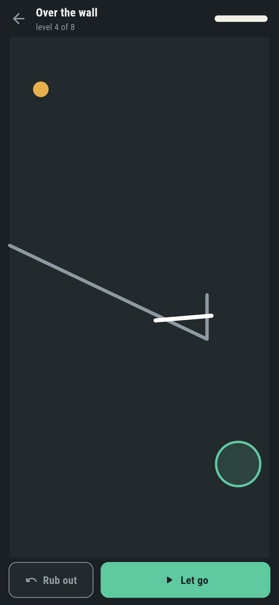
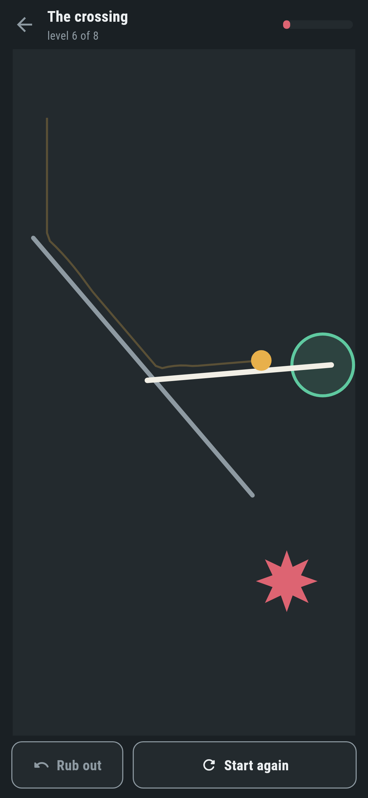
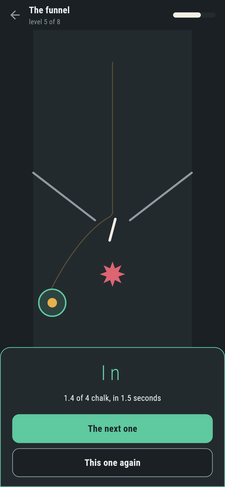
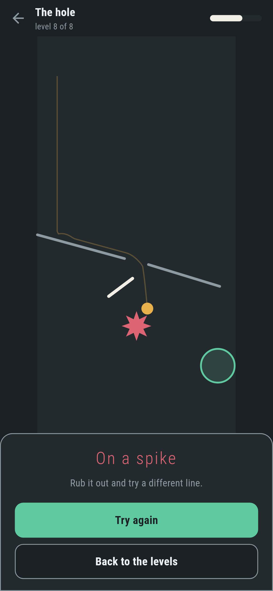
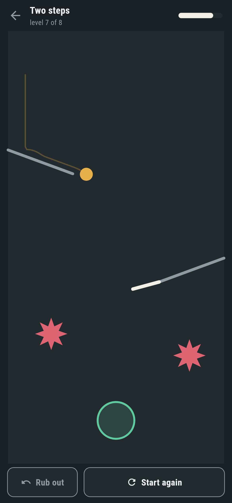

# Chalkway

A puzzle game for phones, in Flutter, for Android and iOS.

A ball, a ring, and a stick of chalk. Draw a line on the slate, let go, and
watch where gravity takes it. Eight levels, and never quite enough chalk.

| | | | |
|---|---|---|---|
|  |  |  |  |

## Every level ships with a line that solves it

Not a note saying it can be done. An actual drawing — a list of points, in
`lib/sim/levels.dart`, next to the level it belongs to:

```dart
Level(
  name: 'Over the wall',
  solid: [
    Line(Spot(0, 8), Spot(7.6, 11.6)),
    Line(Spot(7.6, 11.6), Spot(7.6, 9.9)),
  ],
  start: Spot(1.2, 2),
  goal: Blob(Spot(8.8, 16.4), 0.85),
  ink: 5,
  solution: [
    [Spot(4.10, 10.20), Spot(7.60, 9.90)],
  ],
),
```

`test/sim_test.dart` draws each one and watches the ball arrive. Another test
plays every level with the chalk rubbed out and checks that none of them
solves itself, because a level that needs no line is not a level. A third
draws the shipped answer with a finger, on the real screen, through the real
gesture handling, and watches the ring catch it.

**And the answer has to survive being moved.** Every shipped drawing is
replayed four times with both ends nudged six hundredths of a unit each way,
and at least three of the four have to still work. That is not a nicety. The
first set of answers was written out rounded to a tenth of a unit and two of
the eight stopped working — they were knife-edge, and a line that only works
at one exact position is not an answer, it is a coincidence. A player would
have found those two levels impossible.

## The simulation is the game

`lib/sim/` knows nothing about screens, frames or phones. A `World` is a ball,
a list of lines, a ring, some spikes and gravity, and it advances one fixed
step at a time. Nothing in it is random, so the same drawing gives the same
run every time and on every phone — which is the whole reason a level can ship
with a drawing that solves it and a test can check that it does.

The step is a two hundred and fortieth of a second, and that is not fussiness.
Collision here is the plain kind: move, then look for overlaps. That is only
safe while the ball cannot cross something thin in a single step, so the speed
is capped at fourteen units a second, and at that step the ball moves a sixth
of its own radius at a time. There is nothing for it to pass through. The
alternative is sweeping every move against every line, which is the same
answer for ten times the code — and there is a test that drops the ball the
whole height of the board onto one thin line near the bottom to say so.

Pushing the ball out of one line can push it into another, so the resolve runs
twice a step. Without the second pass a ball in the corner of a V buzzes there
for ever instead of settling, which is the difference between a level ending
and a level not.

The board is ten units across and twenty down whatever it is drawn on. Filling
the glass on a wider phone would mean a different puzzle on every phone.

## Chalk is a budget

Each level gives a number, and a stroke costs its own length. When it runs out
mid-stroke the line is **cut where the chalk ran out**, not thrown away: a
stroke that vanishes because the finger went a millimetre too far is a stroke
the player has to draw all over again, and stopping where the chalk stopped is
the same information without the loss.

Strokes are thinned as they are drawn. A finger reports a hundred times a
second, which across a screen is several hundred points a millimetre apart —
and every one of them is a line the physics checks the ball against, every
step, for the rest of the run. A point has to be a sixth of a unit from the
last one to be kept, which is close enough that a curve still reads as a
curve.

## Finding the answers

`tool/find_answer.dart` is the designer's assistant, and never runs on a
phone. Given a level it plays it with no chalk to see where the ball goes,
then tries three shapes against that path: a long line from beside the ball to
the middle of the ring, a ramp from beside the ball to the end of something
already on the board, and a short piece laid across the path at twelve angles
and four lengths. It reports the cheapest thing that works and survives the
nudging, printed to two decimals, ready to paste into the level.

```
$ make answer LEVEL=4
4 Over the wall:
     [Spot(4.10, 10.20), Spot(7.60, 9.90)]
     ink 3.5/5.0  3.0s
```

`make levels` prints how every level ends, with its own drawing and with none:

```
1 A slope         answer=home     1.4s  chalk 1.4/13  bare=lost
2 The gap         answer=home     1.7s  chalk 1.4/4   bare=lost
...
```

Both columns matter. A level nobody can solve is broken, and so is one that
solves itself — three of the first eight did, and had to be redrawn.

## What the ball does when it wins

A run ends the instant the middle of the ball is inside the ring. Grazing the
rim is not in: the ball is 0.3 across and the ring 0.85, so the two circles
overlap well before the ball is anywhere near going in, and ending a run there
would look like a bad call. There are tests either side of that line.

One presentational liberty follows from it. Since the run stops the moment the
ball crosses in, the ball would otherwise be drawn perched on the rim — a
picture of a near miss at the end of the one run that was not one. So a won
ball is drawn in the middle of the ring. The trail behind it still ends where
the ball actually was.

| | |
|---|---|
|  |  |

## Running it

```
make deps    # flutter pub get
make test    # everything
make analyze
make shots   # render the screens into build/showcase, redraw the logo
make levels  # how every level ends, with its drawing and without
make answer LEVEL=4   # look for a line that solves level 4
make apk     # release APK
make ios     # release iOS build, unsigned
```

## Tests

`flutter test` runs the shapes, the ball (that it lands, slides, settles in a
corner, never tunnels, never exceeds the cap, and runs the same way twice),
the ring, the chalk (thinning, the budget, cutting, undo), every level against
its own answer and against no answer at all, and then the game through the
screen: opening a level, drawing with a finger, rubbing out, running out of
chalk, letting go, winning, losing, and the record of what has been solved.

Screenshots come from `test/showcase_test.dart`, which draws the lines by
dragging across the real board at three phone sizes and photographs whatever
the simulation actually did. `test/mark_test.dart` draws the logo and the app
icon; there is no image in this repository that was not produced by it.

`integration_test/screenshot_test.dart` does the same on a real emulator and a
real simulator, with the strokes delivered as device pointer events so they go
in the way a thumb does. There is no CI here, so it is driven by hand
on a machine with a phone or a simulator attached — `.github/scripts/` holds
the two scripts that do it.
