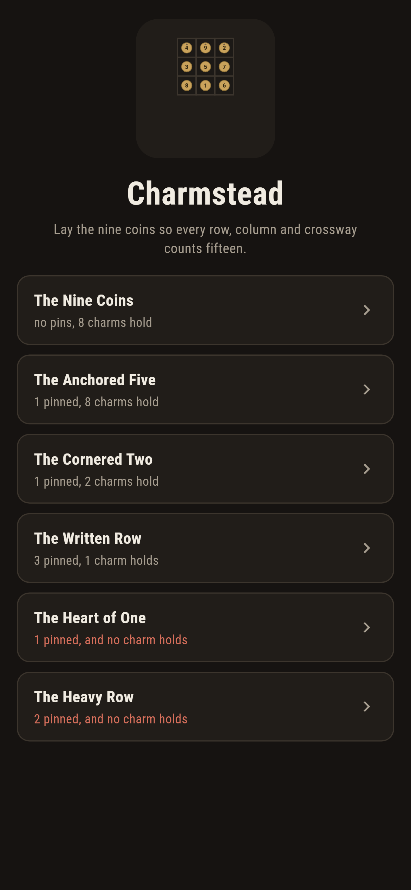
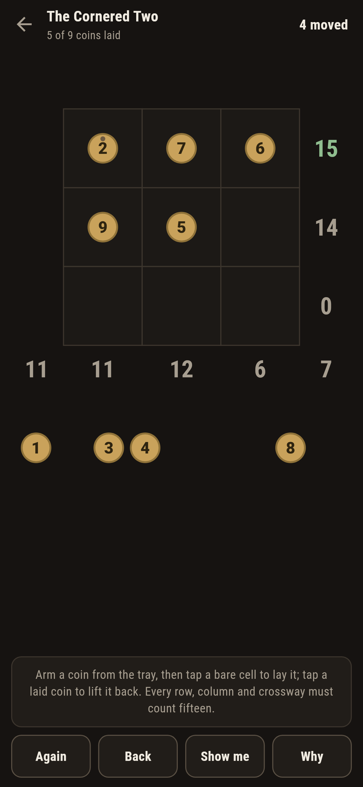
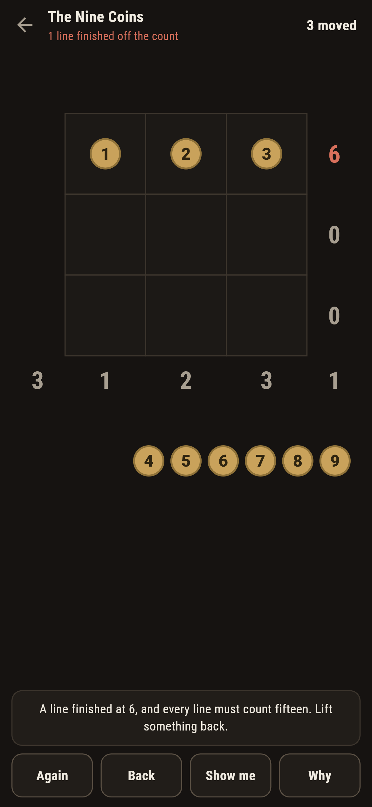
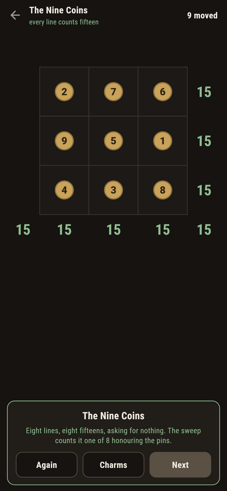
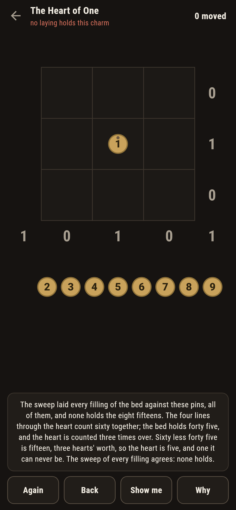
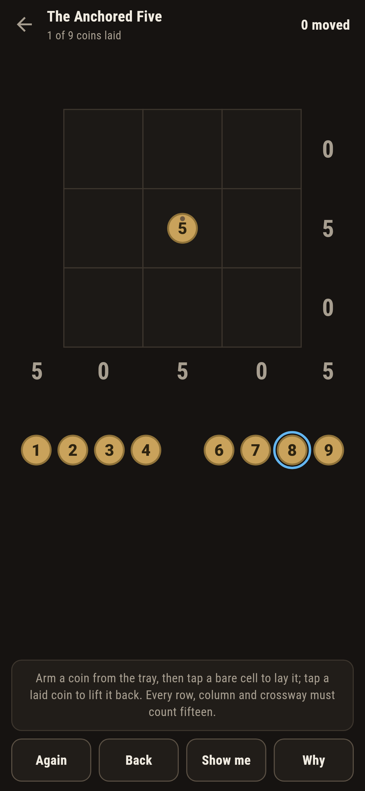

# Charmstead

A coin-laying puzzle for phones, in Flutter, for Android and iOS.

Nine brass coins, one to nine, and a three-by-three bed. Lay them so
every row, every column and both crossways count fifteen: eight
lines, one answer each. The oldest charm in the book, and the game
treats it the house way: what must be is proved, and what is counted
is counted.

| | | | |
|---|---|---|---|
|  |  |  |  |

## Two ways of knowing

The counting says what has to happen: the three rows share the nine
coins, and one to nine count forty five, so each row carries fifteen
and the columns and crossways follow; the four lines through the
heart count sixty together, which is the whole bed and two more
hearts, so the heart is five, always. The sweep knows none of that:
it lays every filling of the bed, all 362,880, and finds exactly
eight charms, every heart a five, and all eight one square eight
ways round. The checker refuses the bake if the two ever part.

```
$ make charms
the sweep of all 362,880 fillings finds 8 charms, every heart a five, and all eight one square eight ways round

 1 The Nine Coins   0 pinned  8 charms honour the pins
 2 The Anchored Five 1 pinned  8 charms honour the pins
 3 The Cornered Two 1 pinned  2 charms honour the pins
 4 The Written Row  3 pinned  1 charm honours the pins
 5 The Heart of One 1 pinned  no charm honours the pins
 6 The Heavy Row    2 pinned  no charm honours the pins
```

## The dead charms

Two charms ship that cannot be set, in the house tradition of maps
nobody can win, each with its own counting on the label. The Heart of
One pins a one where only a five can live: the four lines through
the heart give it away in three sentences. The Heavy Row pins a nine
and an eight side by side, and their row would need a coin worth
less than nothing. The sweep stands behind both: no filling holds.



## The live lines

Every line's count is written at its end, greying while it waits,
green at fifteen, red the moment it finishes at anything else, with
the words under the bed saying which line and by how much. **Show
me** mends toward the nearest charm the sweep counted, lifting wrong
coins before laying new ones.



## Building

```
make deps    # fetch packages
make check   # analyze + every test
make charms  # sweep every filling against every claim, print the ledger
make shots   # render the screenshots and redraw the icons
make apk     # Android release build
make ios     # iOS release build (unsigned)
```

The logo and every app icon are drawn by the game's own painter in
`test/mark_test.dart`. There is no image in this repository that was not
produced by code in it.

## How it is put together

```
lib/charm/rules.dart     the lines, the sweep, the turnings
lib/charm/charm.dart     a charm: pins, its count
lib/charm/charms.dart    the six charms that ship
lib/charm/play.dart      a bed being laid: coins, lifts, take-back,
                         the mend
lib/ui/                  the painter, the screens, the mark
tool/check_charms.dart   the sweeps and the ledger above
```

The tests hold the classic square against the lines, sweep all
fillings to the eight charms and their orbit, pin every shipped count,
watch a line break the moment it finishes wrong, set every winnable
charm by following the game's own mend, fill the dead beds and watch
them never hold, and hold the pictures against the real widget tree.
If any of that drifts, `make check` goes red before anything leaves
the machine.
