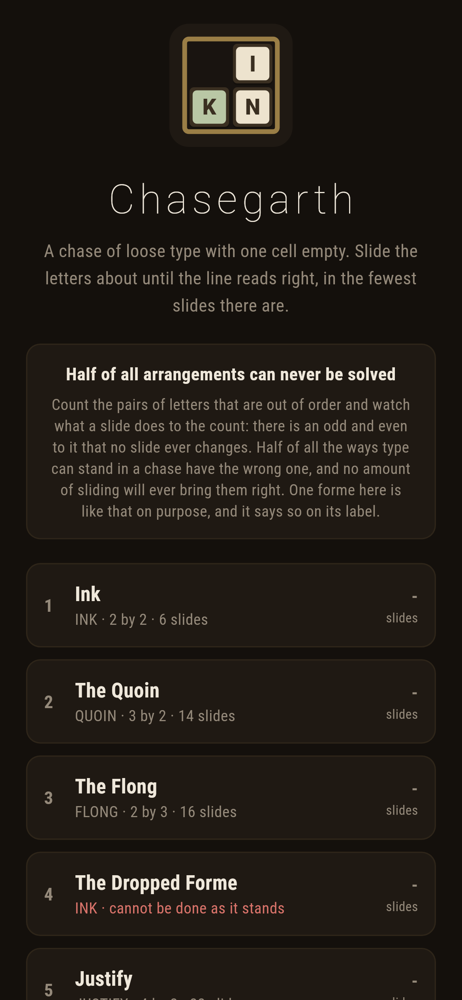
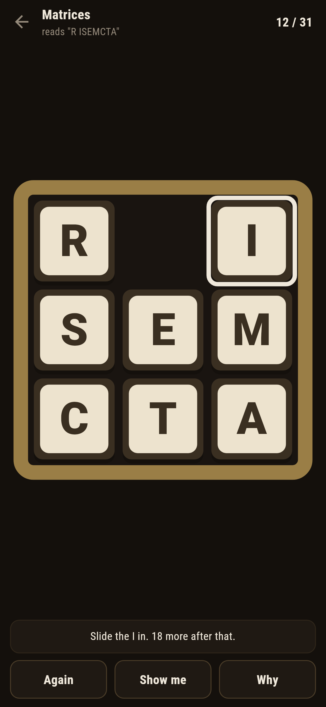
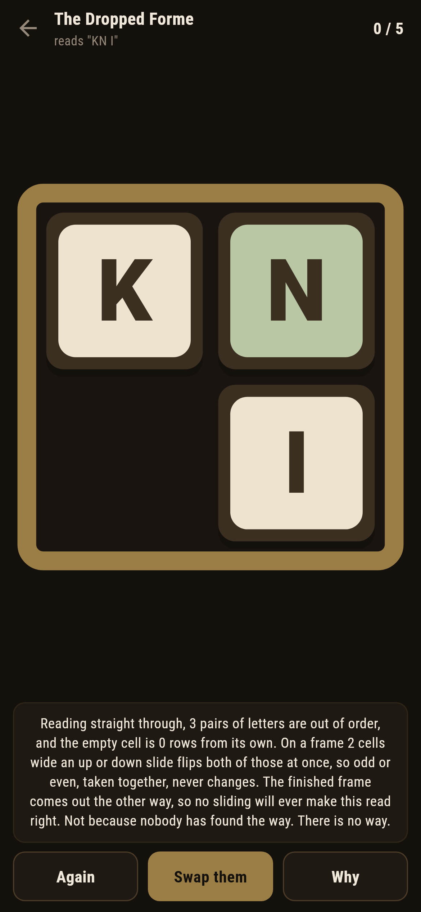
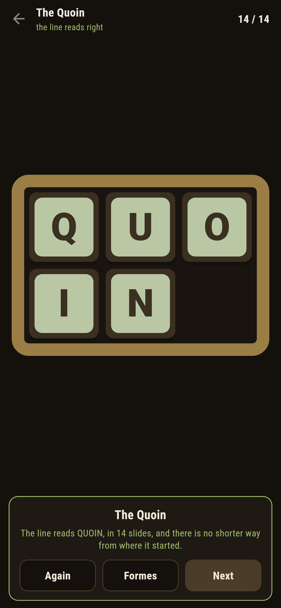
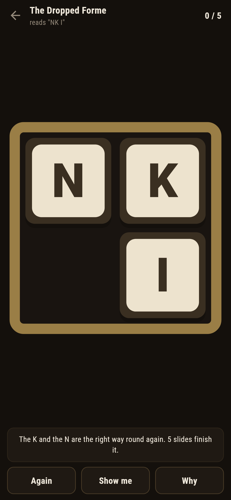

# Chasegarth

A sliding type puzzle for phones, in Flutter, for Android and iOS.

A chase is the iron frame a page of loose type is locked into, and this one has
been handed over in a mess. One cell is empty, a letter beside the empty cell
can be slid into it, and the line has to end up reading right: QUOIN, FLONG,
MATRICES, the words of the trade. The number on each forme is the fewest
slides from where it starts.

| | | | |
|---|---|---|---|
|  |  |  |  |

## Half of everything is impossible

Count the pairs of letters that are out of order when the frame is read
straight through. A sideways slide changes nothing about that count. An up or
down slide carries one letter past a whole row's worth of others, and what that
does depends on the width of the frame: on an odd width the count keeps its odd
or even for good, and on an even width it flips exactly when the empty cell
changes row, so the two together keep theirs.

Either way something is fixed before anybody touches the frame, and exactly
half of all the ways type can stand in a chase have the wrong one. Those can
never be made to read right. Not because nobody has found the way. There is no
way.

One forme ships like that on purpose, and says so on its label. The apprentice
has put two sorts back swapped, **Why** walks through the count on screen, and
the only mend is the one the frame does not allow: lifting the pair out and
swapping them. The game lets you do it, once, and five slides finish what is
left.



## Every arrangement, walked

```
$ make chases
 1 Ink                2x2  "INK"  starts 6  written down 6  12 of 24 reachable  furthest 6  parity: 24 agree, 0 disagree  6ms
 2 The Quoin          3x2  "QUOIN"  starts 14  written down 14  360 of 720 reachable  furthest 21  parity: 720 agree, 0 disagree  4ms
 3 The Flong          2x3  "FLONG"  starts 16  written down 16  360 of 720 reachable  furthest 21  parity: 720 agree, 0 disagree  1ms
 4 The Dropped Forme  2x2  "INK"  starts IMPOSSIBLE  written down 5  12 of 24 reachable  furthest 6  parity: 24 agree, 0 disagree  0ms
    the mend swaps K and N, leaving 5 slides
 5 Justify            4x2  "JUSTIFY"  starts 22  written down 22  20160 of 40320 reachable  furthest 36  parity: 40320 agree, 0 disagree  30ms
 6 The Foundry        4x2  "FOUNDRY"  starts 30  written down 30  20160 of 40320 reachable  furthest 36  parity: 40320 agree, 0 disagree  22ms
 7 Matrices           3x3  "MATRICES"  starts 31  written down 31  181440 of 362880 reachable  furthest 31  parity: 362880 agree, 0 disagree  161ms
```

Each chase is small enough to walk whole: outwards from the finished frame,
every arrangement that sliding can reach, 181,440 of them on the three by
three. So the distance the game quotes is the fewest there is rather than one
somebody found, **Show me** reads the next slide off the table from wherever
the type actually stands, and the moment a slide has cost two the game says so,
because any slide that does not bring the distance down by one has to be
undone.

The walk also holds the parity to account. The parity is arithmetic and says
which arrangements are impossible without looking at anything; the walk looks
at everything. A test checks they agree on all 362,880 arrangements of the
three by three and every arrangement of the smaller shapes besides. That test
caught a real mistake: the first version of the parity counted the empty cell's
row on every frame, and it only belongs in the count on frames an even number
of cells wide.

Matrices starts at the worst arrangement its frame has. Thirty one slides, and
a test asserts nothing on the whole frame is further.

## Running it

```
make deps    # flutter pub get
make test    # everything
make analyze
make shots   # render the screens into build/showcase, redraw the logo and icons
make chases  # walk every shipped forme and check the parity on every arrangement
make apk     # release APK
make ios     # release iOS build, unsigned
```

## Tests

`flutter test` runs the chase (reading, neighbours, locked), the parity (a
sideways slide changing no pairs, the invariant surviving three hundred random
slides on every shape, agreement with the full walk on every arrangement, and
exactly half of everything reachable), the table of distances (every distance a
real shortest way, checked over every arrangement of the three by two), every
forme that ships, and a forme on the bench.

Then the game through the screen: sliding a letter, tapping one that is not
beside the empty cell, a wrong slide called out at once, **Again**, **Show
me**, **Why**, the dropped forme refusing politely and being mended, and every
solvable forme locked in the fewest slides there are.

Screenshots come from `test/showcase_test.dart`, and every slide in them was
made by tapping a letter. `test/mark_test.dart` draws the logo, the launcher
icons at every density Android asks for and every size the iOS icon set asks
for; there is no image in this repository that was not produced by it.
