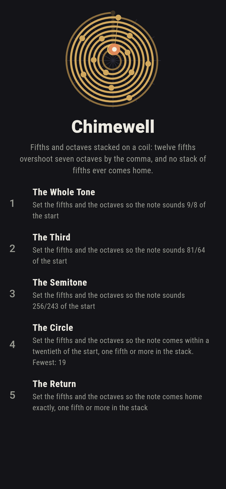
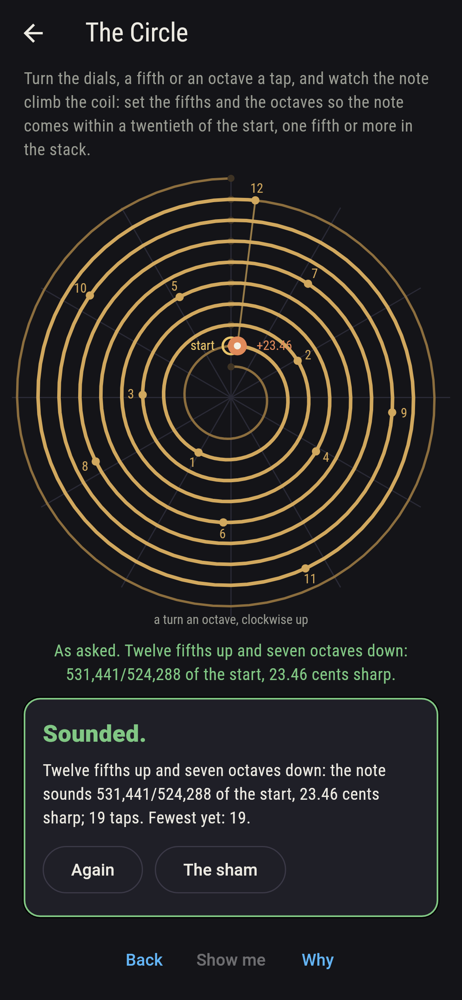
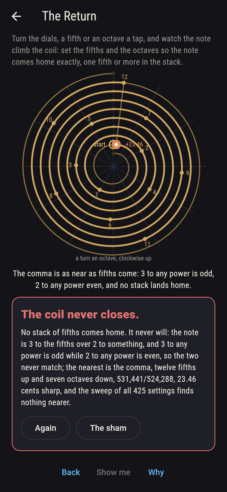
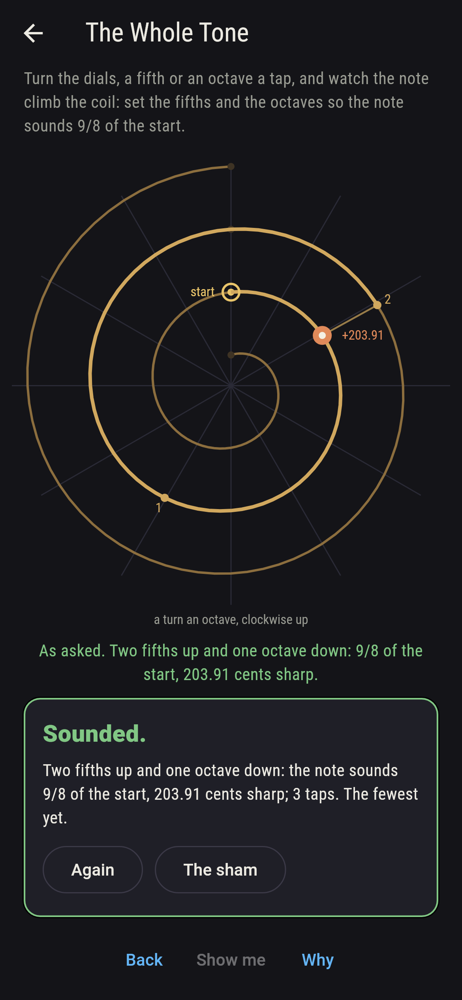
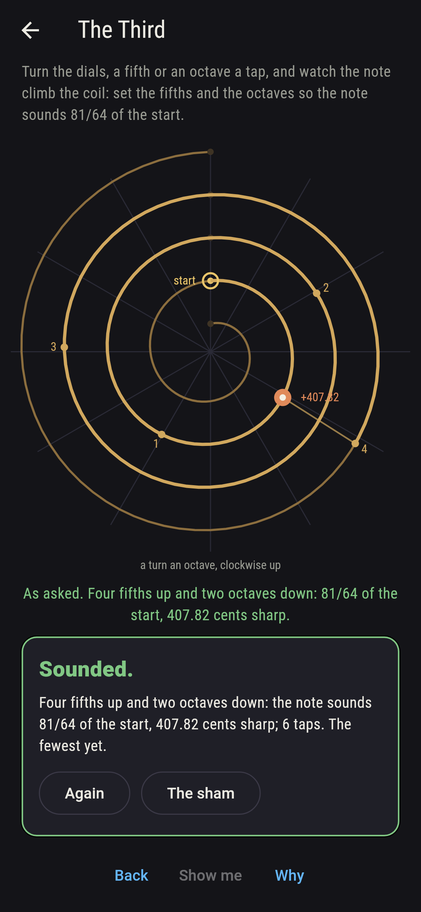
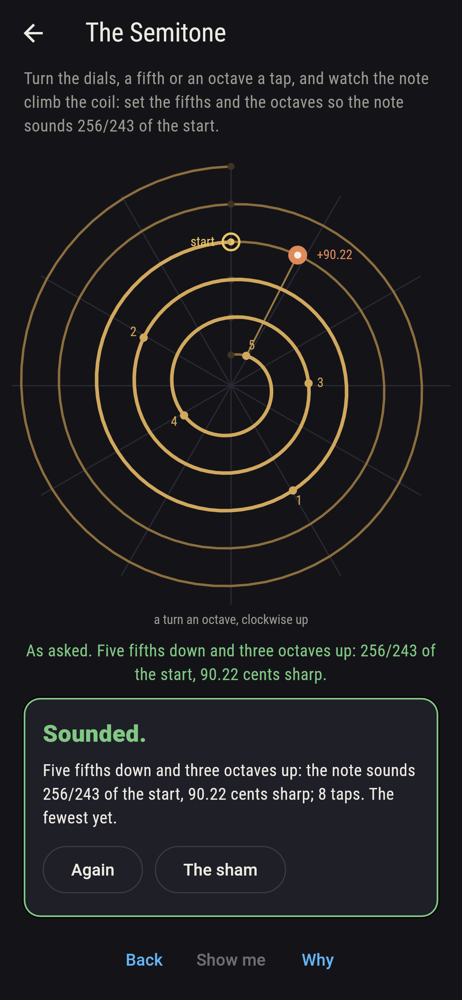
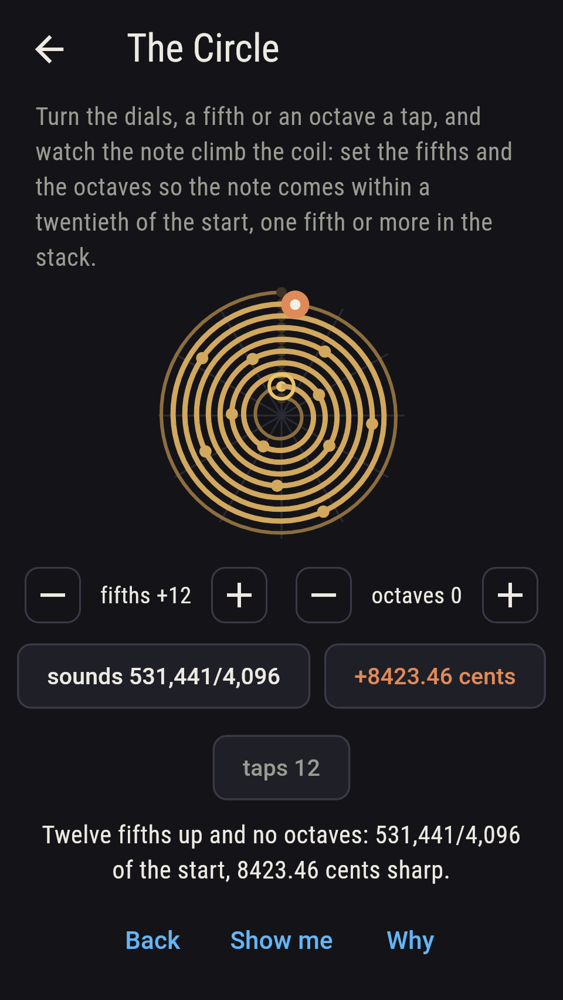
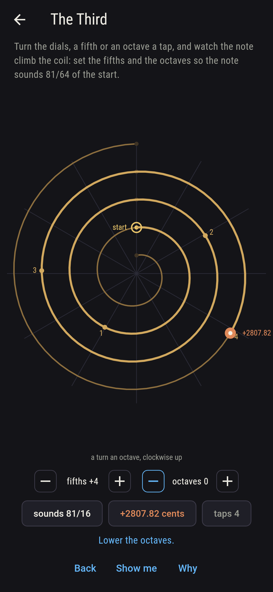
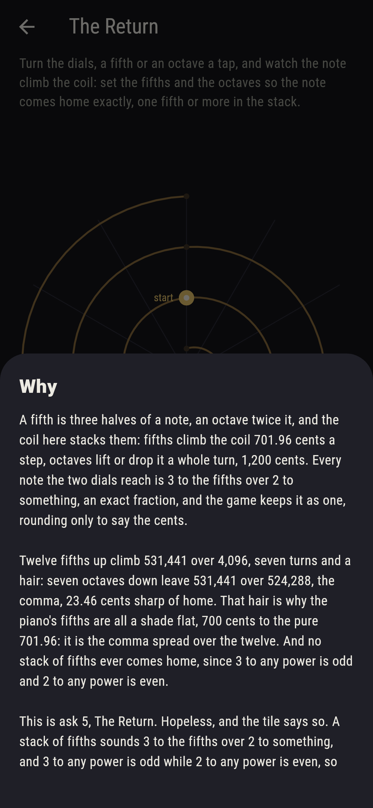

# Chimewell


Fifths and octaves stacked on a coil. A fifth is three halves of a
note and an octave twice it, and the coil here is a turn an octave,
the start at the top, rising pitch running clockwise and outward:
turn the dials, a fifth or an octave a tap, and the note climbs it.
Every note the two dials reach is 3 to the fifths over 2 to
something, and the game keeps it as that exact fraction, rounding
only to say the cents. Twelve fifths up climb 531,441/4,096, seven
turns of the coil and a hair, and seven octaves down leave
531,441/524,288, the comma, 23.46 cents sharp of the start; that
hair is why the piano's fifths are all a shade flat, 700 cents to
the pure 701.96, the comma spread over the twelve. And no stack of
fifths ever comes home, since 3 to any power is odd and 2 to any
power even. Every setting of the two dials is swept as fractions
and held against the cents, and only twelve fifths, up or down,
come within a twentieth of home.

## The asks

1. **The Whole Tone** - set the fifths and the octaves so the note sounds 9/8 of the start
2. **The Third** - set the fifths and the octaves so the note sounds 81/64 of the start
3. **The Semitone** - set the fifths and the octaves so the note sounds 256/243 of the start
4. **The Circle** - set the fifths and the octaves so the note comes within a twentieth of the start, one fifth or more in the stack
5. **The Return** - set the fifths and the octaves so the note comes home exactly, one fifth or more in the stack

Two fifths up and an octave down sound the whole tone, 9/8, 203.91
cents, one setting of 425, since 3 and 2 share no factor and a
fraction of them is stacked one way only; four fifths up and two
octaves down sound the third of the fifths, 81/64, sharp of the
sweet third 5/4 by 81/80, the other comma, 21.51 cents; five fifths
down and three octaves up sound the semitone of the fifths, 256/243,
90.22 cents, smaller than the piano's hundred. Twelve fifths up and
seven octaves down land within a twentieth of home, and so do
twelve down and seven up, two settings of 425 and no others: five
fifths get to 243/256, 13 in 256 short, and seven to 2,187/2,048,
139 in 2,048 over, both past the twentieth. The Return is labeled
hopeless on its tile: the note is 3 to the fifths over 2 to
something, odd over even, and never the start; the sham admits it
the moment the player reaches the comma, as near as fifths come.

## Two voices

The game never asserts what it has not computed, and it computes
everything at least twice:

* **The fractions** sweep every setting of the two dials, fifths
  from twelve down to twelve up and octaves from eight down to eight
  up, 425 settings, each note an exact fraction, 3 to the fifths and
  2 to the rest, compared by cross-multiplying and never rounded;
  every count on the sham is the sweep's, and the twentieth, the
  side of home and the named notes are all decided in fractions.
* **The cents** are the second voice: twelve hundred a turn of the
  coil, the fifth being twelve hundred times the log of three
  halves, and on every one of the 425 settings the cents by the
  dials agree with the cents by the fraction, the sign agrees with
  the fraction's side of home, and the twentieth by cents agrees
  with the twentieth by fractions; the parity, 3 to any power odd
  and 2 to any power even, is checked power by power across the
  dials' range, and it is why The Return ships hopeless.

`tool/check_coils.dart` runs the lot and refuses the bake on any
disagreement.

## The checker's ledger

What `dart run tool/check_coils.dart` printed for the build this
README shipped with, word for word:

```
every setting of the two dials swept with exact fractions, fifths from twelve down to twelve up and octaves from eight down to eight up, 425 settings, and every one held against the cents: the fifth sounds 3/2 of the start, 701.96 cents; twelve fifths up climb 531,441/4,096, and seven octaves down leave 531,441/524,288, the comma, 23.46 cents sharp of home, the piano's fifth of 700.00 cents being the pure fifth less a twelfth of it; five fifths up and three octaves down sound 243/256, 13 in 256 short of home, and seven fifths up and four down 2,187/2,048, 139 in 2,048 over, both past a twentieth, and only twelve fifths, up or down, come within one, 2 settings of 425; the third of the fifths, 81/64, is 81/80 sharp of 5/4, 21.51 cents; and no setting with a fifth in it comes home, since 3 to any power is odd and 2 to any power even

 1 The Whole Tone  set the fifths and the octaves so the note sounds 9/8 of the start: 1 of the 425 settings land it
 2 The Third       set the fifths and the octaves so the note sounds 81/64 of the start: 1 of the 425 settings land it
 3 The Semitone    set the fifths and the octaves so the note sounds 256/243 of the start: 1 of the 425 settings land it
 4 The Circle      set the fifths and the octaves so the note comes within a twentieth of the start, one fifth or more in the stack: 2 of the 425 settings land it
 5 The Return      set the fifths and the octaves so the note comes home exactly, one fifth or more in the stack: none of the 425, and the parity said so first
```

## Screenshots

| The sham | The circle | The return admitted |
| --- | --- | --- |
|  |  |  |

| The whole tone | The third | The semitone | Midway, on the small phone | Show me | The why |
| --- | --- | --- | --- | --- | --- |
|  |  |  |  |  |  |

Screenshots are drawn by `test/showcase_test.dart` at real phone
sizes with the app's own painter, then copied into `docs/` as they
came out; every note in them was sounded by taps on the dials, so
nothing pictured is a setting the game could not reach. The logo and
every launcher icon come out of `test/mark_test.dart` the same way:
the mark is the coil with the twelve fifths stacked and dropped to
the comma.

## Building

```
flutter test          # 47 tests, the sweep among them
dart run tool/check_coils.dart
flutter build apk     # or: flutter build ios
```
