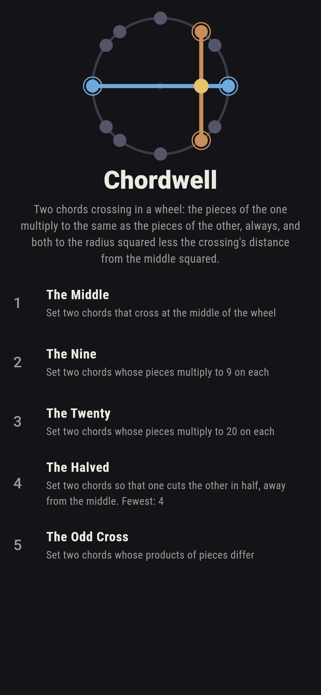
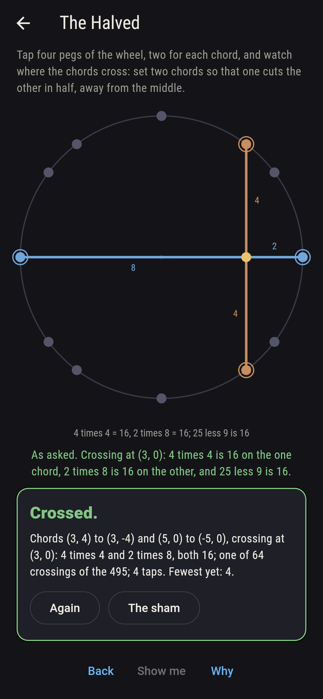
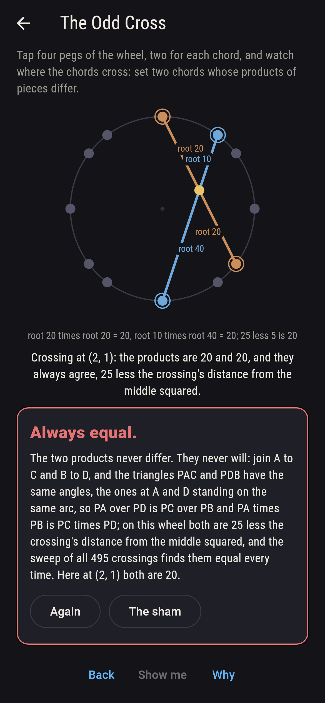
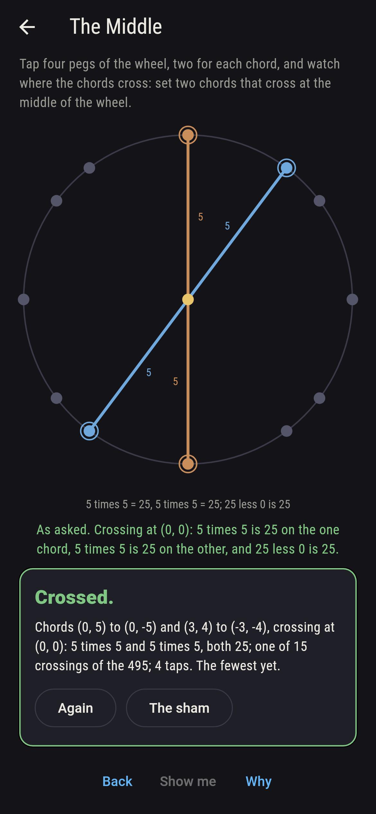
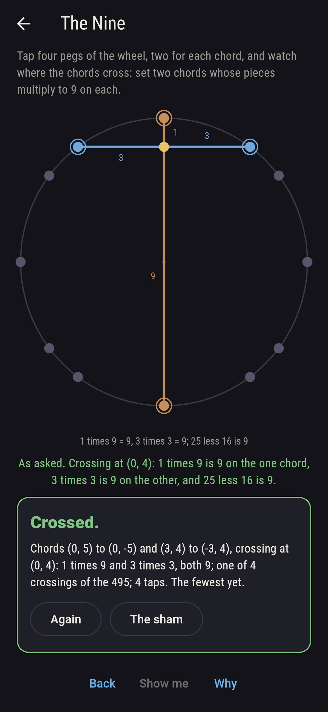
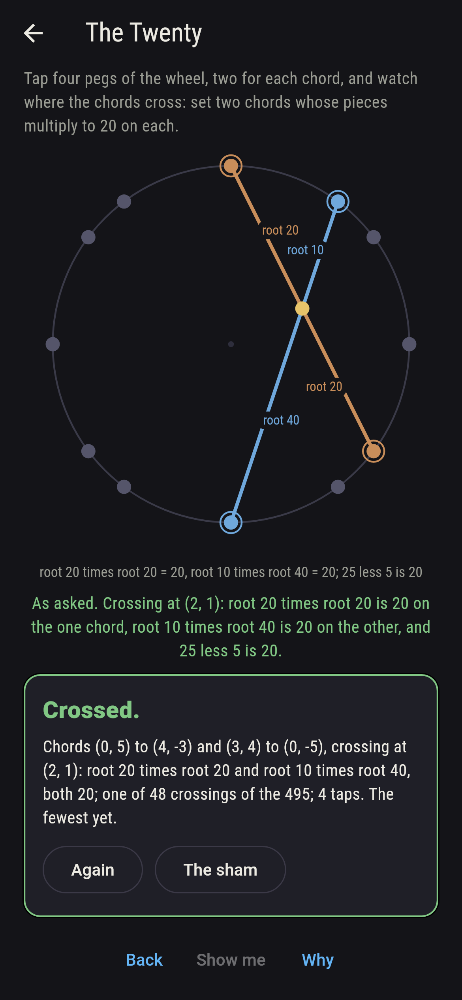
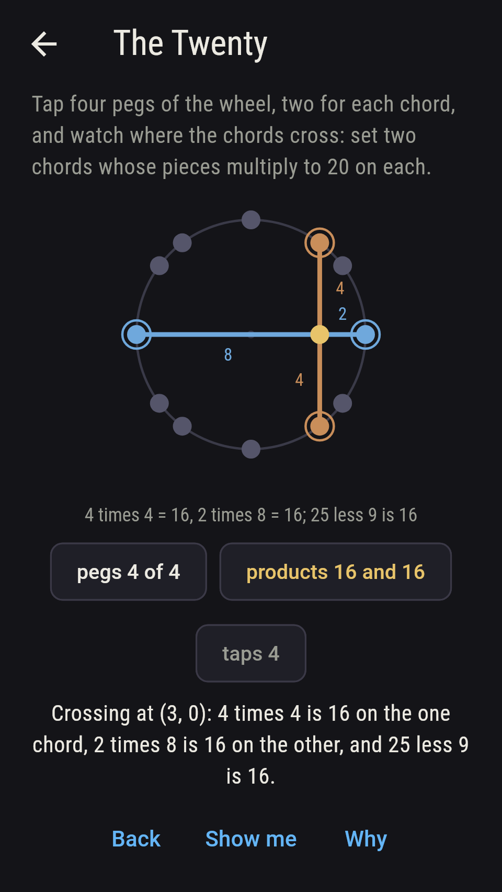
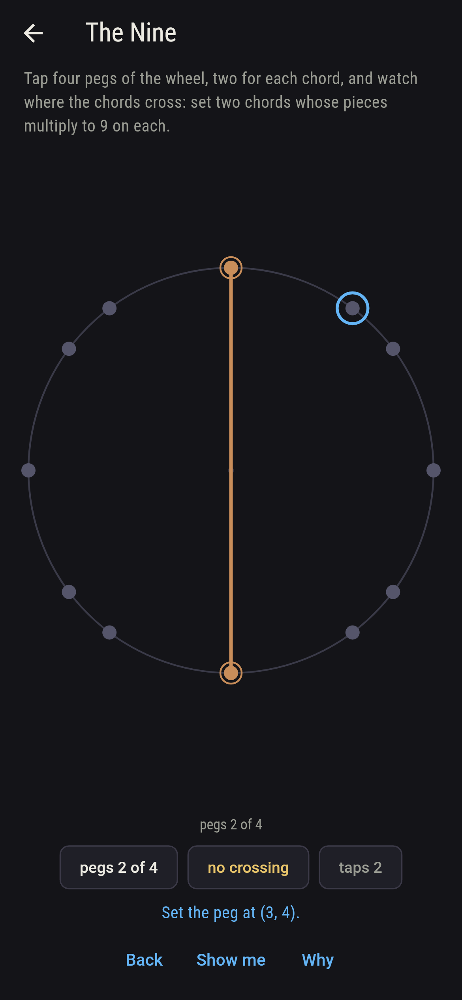
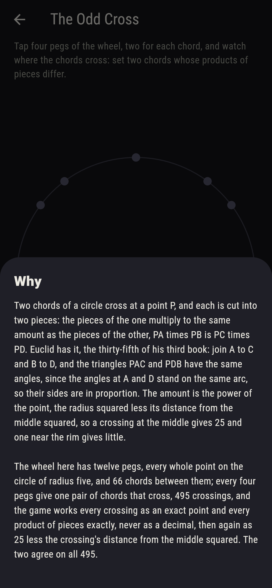

# Chordwell


Two chords of a circle cross at a point P, and each is cut into two
pieces: the pieces of the one multiply to the same amount as the
pieces of the other, PA times PB is PC times PD. Euclid has it, the
thirty-fifth of his third book: join A to C and B to D, and the
triangles PAC and PDB have the same angles, since the angles at A
and D stand on the same arc, so their sides are in proportion. The
amount is the power of the point, the radius squared less its
distance from the middle squared, so a crossing at the middle gives
25 and one near the rim gives little. Tap four pegs of the wheel,
two for each chord, and watch where the chords cross and what the
pieces multiply to. The wheel has twelve pegs, every whole point on
the circle of radius five, and 66 chords between them; every four
pegs give one pair of chords that cross, 495 crossings, and the game
works every crossing as an exact point and every product exactly,
never as a decimal, then again as 25 less the crossing's distance
from the middle squared. The two agree on all 495.

## The asks

1. **The Middle** - set two chords that cross at the middle of the wheel
2. **The Nine** - set two chords whose pieces multiply to 9 on each
3. **The Twenty** - set two chords whose pieces multiply to 20 on each
4. **The Halved** - set two chords so that one cuts the other in half, away from the middle
5. **The Odd Cross** - set two chords whose products of pieces differ

Two chords cross at the middle only when both are diameters, and the
wheel has six, so fifteen crossings land it, every piece 5 and every
product 25. The pieces multiply to 9 when the crossing lies 4 from
the middle, and only four crossings do, at (0, 4), (0, -4), (4, 0)
and (-4, 0), a diameter cut 1 and 9 across a chord of two 3s. Twenty
is the commonest product, 48 crossings, all at the eight points (2,
1), (1, 2) and their turnings, root five from the middle; the first,
(0, 5) to (4, -3) across (3, 4) to (0, -5), has pieces root 20 and
root 20 against root 10 and root 40. Sixty-four crossings cut one
chord in half away from the middle, and in every one the line from
the middle to the crossing stands square to the halved chord. The
Odd Cross is labeled hopeless on its tile: the two products never
differ, by Euclid's two triangles, and the sham admits it the moment
two chords cross, or after twenty taps.

## Two voices

The game never asserts what it has not computed, and it computes
everything at least twice:

* **The pieces** are worked from the crossing itself: the point
  where the two chords meet, found as an exact fraction from the
  turns of each chord's ends about the other, and each chord's two
  arms from it multiplied; the arms lie in a line, so the lengths
  multiply to minus the dot of the arms, exact and never a root, and
  every count on the sham is the sweep of this over all 495
  crossings.
* **The power** reads no chord: 25 less the crossing's distance from
  the middle squared, and it agrees with both products on all 495;
  the sweep also finds every four pegs giving exactly one crossing
  pair, 15 crossings at the middle, 43 at right angles, 79 halving a
  chord, 151 on whole points, 44 different products with 20 the
  commonest and 9 the rarest, and the halved chord's perpendicular
  from the middle every time.

`tool/check_chords.dart` runs the lot and refuses the bake on any
disagreement.

## The checker's ledger

What `dart run tool/check_chords.dart` printed for the build this
README shipped with, word for word:

```
the twelve whole points on the circle of radius five taken as pegs, 66 chords between them, and every four pegs found to give exactly one pair of chords that cross inside, 495 crossings; on every crossing the point was worked exactly and the pieces of each chord multiplied, the two products agreeing with each other and with 25 less the crossing's distance from the middle squared on all 495; 15 crossings fall at the middle, two diameters each with every piece 5, 43 cross at right angles, 40 of them away from the middle, 79 cut a chord in half, 64 of them away from the middle with the middle's line to the crossing square to the halved chord every time, and 151 fall on whole points; the products take 44 different values, 20 the commonest on 48 crossings, all at the eight points root five from the middle, and 9 comes four times only, at (0, 4), (0, -4), (4, 0) and (-4, 0)

 1 The Middle    set two chords that cross at the middle of the wheel: 15 of the 495 crossings land it
 2 The Nine      set two chords whose pieces multiply to 9 on each: 4 of the 495 crossings land it
 3 The Twenty    set two chords whose pieces multiply to 20 on each: 48 of the 495 crossings land it
 4 The Halved    set two chords so that one cuts the other in half, away from the middle: 64 of the 495 crossings land it
 5 The Odd Cross set two chords whose products of pieces differ: none of the 495, and the two triangles said so first
```

## Screenshots

| The sham | The halved | The odd cross admitted |
| --- | --- | --- |
|  |  |  |

| The middle | The nine | The twenty | Midway, on the small phone | Show me | The why |
| --- | --- | --- | --- | --- | --- |
|  |  |  |  |  |  |

Screenshots are drawn by `test/showcase_test.dart` at real phone
sizes with the app's own painter, then copied into `docs/` as they
came out; every crossing in them was set by taps on the pegs, so
nothing pictured is a crossing the game could not reach. The logo
and every launcher icon come out of `test/mark_test.dart` the same
way: the mark is the chord from (3, 4) to (3, -4) crossed by the
horizontal diameter at (3, 0), four times four and two times eight.

## Building

```
flutter test          # 47 tests, the sweep among them
dart run tool/check_chords.dart
flutter build apk     # or: flutter build ios
```
