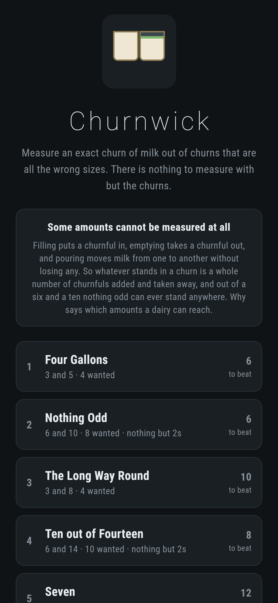
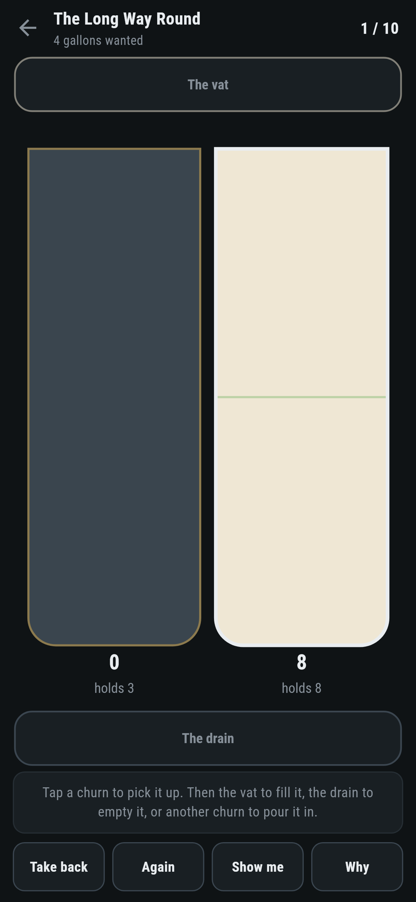
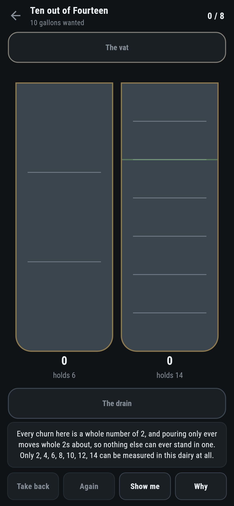
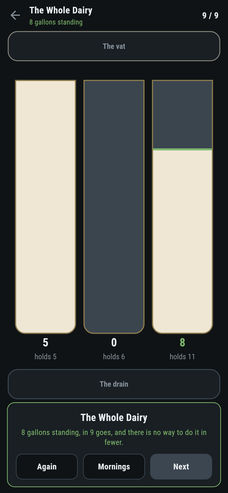
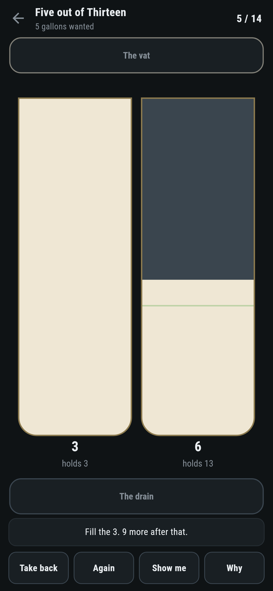

# Churnwick

A measuring puzzle for phones, in Flutter, for Android and iOS.

Get an exact number of gallons standing in a churn, out of churns that are all
the wrong sizes. Fill one from the vat, empty one down the drain, or pour one
into another until the first is empty or the second is full. There is nothing
to measure with but the churns.

| | | | |
|---|---|---|---|
|  |  |  |  |

## Some amounts cannot be measured at all

Filling puts a whole churnful in. Emptying takes a whole churnful out. Pouring
moves milk from one churn to another and loses none of it. So whatever is
standing anywhere is a whole number of churnfuls added and taken away, and out
of a six and a fourteen nothing odd can ever stand in a churn. Not because
nobody has found a way: because there is no way.

The number that settles it is the biggest whole number every churn is a whole
number of. **Why** works it out and says which amounts the dairy can reach:


That is arithmetic rather than a search, and it is worth having a test on
precisely because it is so cheap to believe. A hundred and twenty dairies made
up at random are asked the question both ways: once by that number, and once by
walking every arrangement of milk the churns can be in and writing down every
amount that ever stands anywhere. The two lists are always the same list.

## The fewest goes, two ways

```
$ make dairies
 1 Four Gallons          churns 3 and 5      want  4  fewest  6  written down  6  by tipping  6  step 1  can stand [1, 2, 3, 4, 5]  12 arrangements looked at
 2 Nothing Odd           churns 6 and 10     want  8  fewest  6  written down  6  by tipping  6  step 2  can stand [2, 4, 6, 8, 10]  12 arrangements looked at
 3 The Long Way Round    churns 3 and 8      want  4  fewest 10  written down 10  by tipping 10  step 1  can stand [1, 2, 3, 4, 5, 6, 7, 8]  19 arrangements looked at
 4 Ten out of Fourteen   churns 6 and 14     want 10  fewest  8  written down  8  by tipping  8  step 2  can stand [2, 4, 6, 8, 10, 12, 14]  16 arrangements looked at
 5 Seven                 churns 3 and 11     want  7  fewest 12  written down 12  by tipping 12  step 1  can stand [1, 2, 3, 4, 5, 6, 7, 8, 9, 10, 11]  24 arrangements looked at
 6 Five out of Thirteen  churns 3 and 13     want  5  fewest 14  written down 14  by tipping 14  step 1  can stand [1, 2, 3, 4, 5, 6, 7, 8, 9, 10, 11, 12, 13]  27 arrangements looked at
 7 The Whole Dairy       churns 5 and 6 and 11 want  8  fewest  9  written down  9  by tipping three churns  step 1  can stand [1, 2, 3, 4, 5, 6, 7, 8, 9, 10, 11]  127 arrangements looked at
```

The game walks it. A dairy has few enough arrangements of milk to look at all
of them, nearest first, so the answer is the fewest because nothing shorter was
left unwalked. Three churns holding five, six and eleven come to a hundred and
twenty seven arrangements, which is nothing.

Two churns can be settled without looking at anything at all. There are only
two things worth doing with two churns: keep filling the first and tipping it
into the second, emptying the second whenever it fills, or do the same the
other way round. One of those two is always the fewest there is. A test runs
both methods over every pair of churns up to thirteen gallons and every amount
that can be wanted out of them, and they never disagree.

## What the game says



After every pour it walks the dairy again from where the milk stands now, which
is a different question from the one it answered when the morning opened and
costs the same. So it can say the moment a morning has stopped being as short
as it might have been, rather than letting somebody find out at the end.

**Show me** does the next thing on the shortest way from where the milk
actually is, so it is still right after a wrong turn. A test takes a wrong turn
on purpose and then finishes by asking, and the goes come out at exactly what
the game said they would.

## Running it

```
make deps      # flutter pub get
make test      # everything
make analyze
make shots     # render the screens into build/showcase, redraw the logo and icons
make dairies   # the fewest goes for each morning, two ways, and what can stand
make find      # walk through dairies and print the ones with a long answer
make apk       # release APK
make ios       # release iOS build, unsigned
```

## Tests

`flutter test` runs the dairy (filling, emptying, pouring until one is empty or
the other is full, and what does not count as a pour at all), the step (what it
is, what can stand, and a hundred and twenty random dairies where the
arithmetic and a walk of every arrangement have to agree), the fewest goes
(three and five in six, the way it hands back being a way that really works,
and every two churn dairy up to thirteen settled twice), every morning that
ships, and a morning at the churns.

Then the game through the screen: picking a churn up, the vat, the drain,
pouring, a pour that would change nothing, **Take back**, **Again**, **Show
me**, **Why**, and every morning measured out in the fewest goes there are.
The last of them is done twice over, once by asking and once by hand.

Screenshots come from `test/showcase_test.dart`, and every drop of milk in them
was poured by tapping churns. `test/mark_test.dart` draws the logo, the
launcher icons at every density Android asks for and every size the iOS icon
set asks for; there is no image in this repository that was not produced by it.
