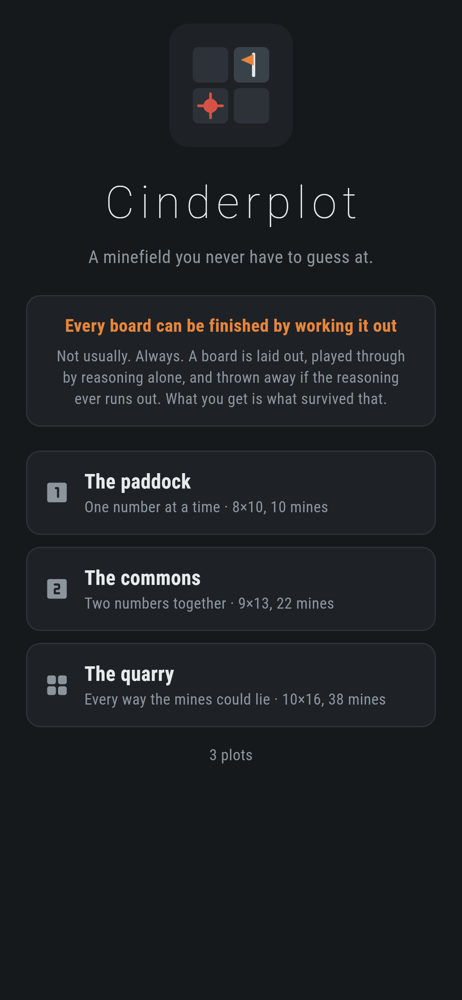
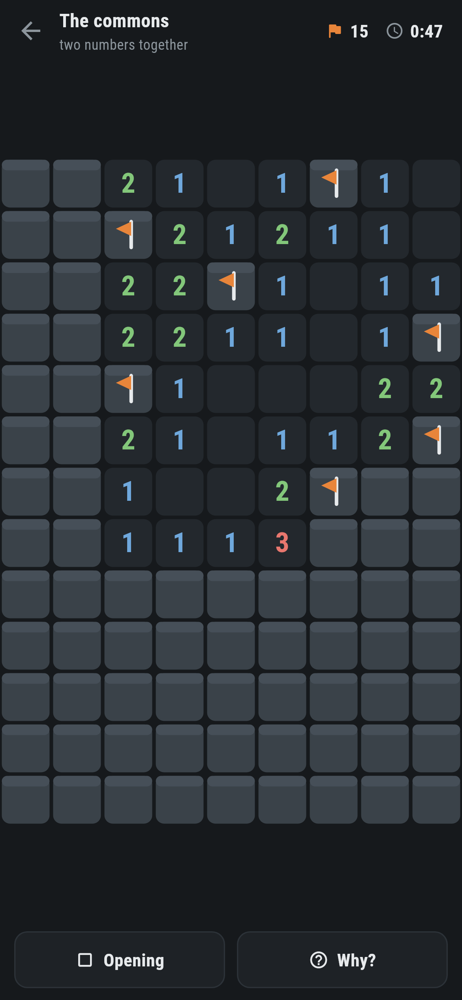
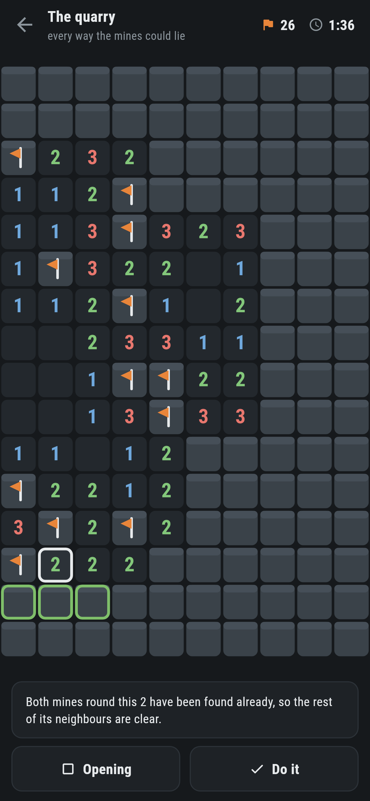
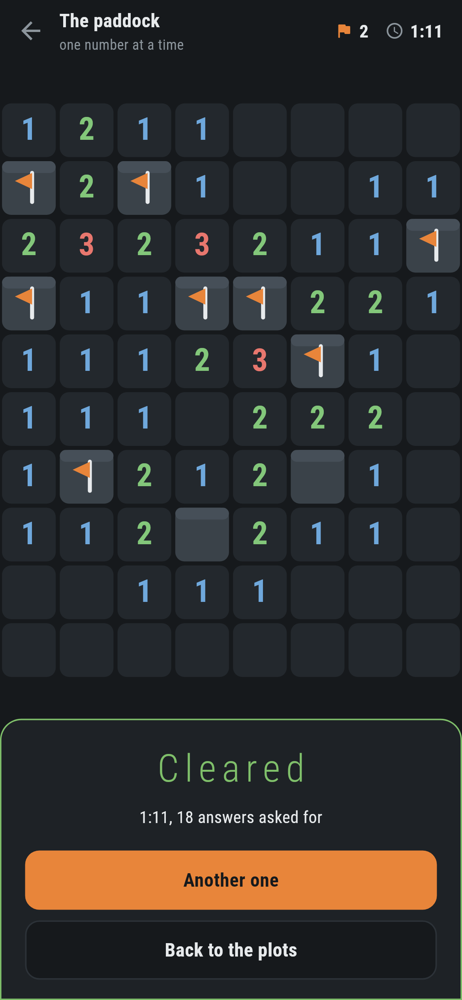
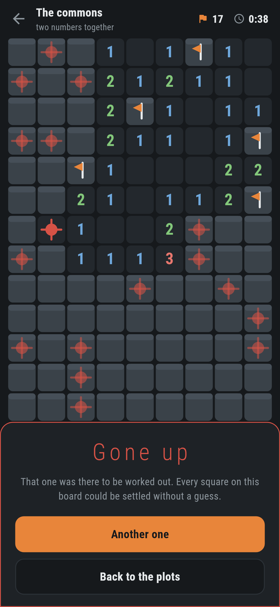

# Cinderplot

A minesweeper for phones, in Flutter, for Android and iOS.

Numbers, flags, and squares you have not turned over yet. What is different is
the promise: **no board here ever needs a guess.** Not usually, but always,
and the game can show you why.

| | | | |
|---|---|---|---|
|  |  |  |  |

## Never a guess, and that is not a claim about the odds

The thing that ruins minesweeper is the position where two squares are left,
one of them is a mine, and nothing on the board says which. You lose a board
you played perfectly. Every version has that position and most of them shrug
at it.

Here a board is not laid out and handed over. It is laid out, played all the
way through by a solver that only reasons, and thrown away if the reasoning
ever runs out. What reaches the screen is what survived that. Most do not:

```
The paddock   8x10 10 mines (13%)  kept 100 of 181   1ms a board  20 steps  {counted: 100}
The commons   9x13 22 mines (19%)  kept 100 of 498   2ms a board  47 steps  {subset: 100}
The quarry    10x16 38 mines (24%)  kept 100 of 1950 11ms a board  69 steps  {whole: 100}
```

That is `make audit`. Nineteen boards in twenty are thrown away for the
quarry, and a kept one still costs eleven milliseconds, so boards are laid out
on the phone as they are needed rather than shipped in a book. Nothing is
pre-baked and nothing needs to be: the maker cannot hand back a board it did
not finish.

**And the first square is on the house.** The board arrives with one region
already open, the one the proof starts from. A first tap that can hit a mine
is a coin toss, and moving the mines out of the way after the tap is a
different board from the one that was tested.

## Difficulty is which reasoning it takes, not how many mines

Three rules, and a plot is named for the one it needs:

1. **One number on its own.** It has as many mines round it as it says; once
   they are found the rest of its neighbours are clear, and when it has only
   that many squares left they are all mines.
2. **Two numbers against each other.** Everything one of them can see, the
   other can see too, so the difference between what they want goes in the
   squares only the second one can see.
3. **Every way the mines could lie.** The unknown squares along the numbers
   are split into groups that share no number, each group is walked through by
   backtracking, and a square that comes out the same way every time is
   proved. The mines left over are counted against the squares no number can
   see, which settles the rest of the board.

A plot needs its rule *and no more*: the quarry is kept only if the third rule
was actually needed, the paddock only if counting was enough. So the label on
the plot is measured, not guessed at. `{whole: 100}` above is a hundred
quarries out of a hundred that really did need the third rule.

## Being told why


Ask, and the game finds the next thing that follows, points at the numbers it
read it off, and says it in a sentence:

> Both mines round this 2 have been found already, so the rest of its
> neighbours are clear.

Ask again and it does it. It only ever uses the rules the plot promised.
Being shown reasoning the plot said it would not ask for is not help, it is a
different game.

The hint does take your flags at face value, and the solver never does. That
is the one place they differ, and it is on purpose: a flag is an opinion, and
a solver that reasoned from one could prove anything, while a hint that
ignored them would keep answering the question you have already answered.

## The solver cannot be wrong

Being an incomplete solver is safe, because it decides which boards exist, so
the boards it cannot finish are the boards that never get made. Being an
*unsound* one is not, and that is what `test/game_test.dart` checks. It plays
three hundred boards and holds every single deduction up against where the
mines actually are:

```dart
for (final square in step.safe) {
  expect(field.holdsMine(square), isFalse,
      reason: 'the reasoner called a mine clear');
}
```

A rule that is merely usually right shows up there as a board that says clear
over a mine. Over a thousand deductions have to pass for the test to count.

The same claim is made again through the screen, which is a different thing:
`test/ui/plot_test.dart` opens each of the three plots and presses **Why?**
and **Do it** until there is nothing left, knowing nothing about where the
mines are. A board that ever needed a guess would leave the button with
nothing to say.

## Running it

```
make deps    # flutter pub get
make test    # everything
make analyze
make shots   # render the screens into build/showcase, redraw the logo
make audit   # lay out a hundred boards of each plot and say what it cost
make apk     # release APK
make ios     # release iOS build, unsigned
```

## Tests

`flutter test` runs the field (what touches what, what the numbers say), a
game (regions spreading and stopping, flags standing where they were put even
under a spreading region, the count going negative when a flag is wrong,
sweeping, winning, losing), the three rules and the soundness of all of them,
the maker (only boards reasoning can finish, only boards that need what the
plot promises, the same board from the same seed), and then the game through
the screen on three phone sizes.

Screenshots come from `test/showcase_test.dart`, which plays the boards it
photographs by asking the game why, which is the only way to open squares
without knowing where the mines are. `test/mark_test.dart` draws the logo and the app
icon; there is no image in this repository that was not produced by it.

`integration_test/screenshot_test.dart` does it again on a real emulator and
a real simulator, laying the boards out on the device and tapping with device
pointer events. There is no CI here, so it is driven by hand
on a machine with a phone or a simulator attached. `.github/scripts/` holds
the two scripts that do it.

| | |
|---|---|
|  |  |
