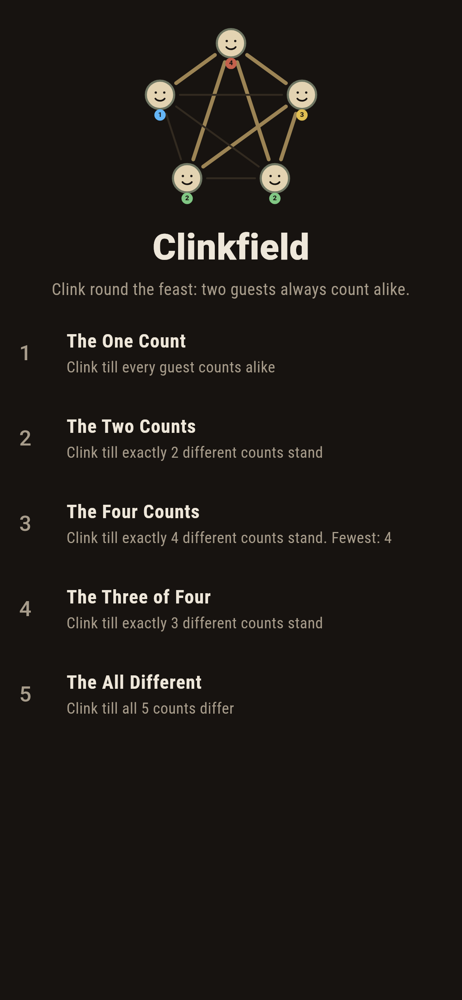
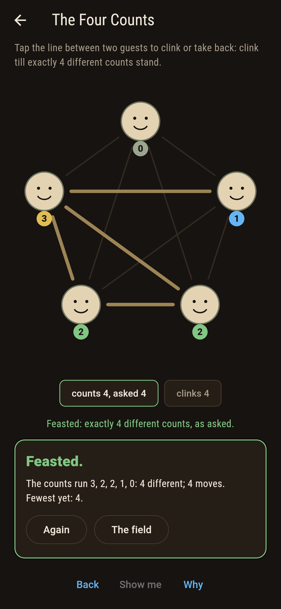
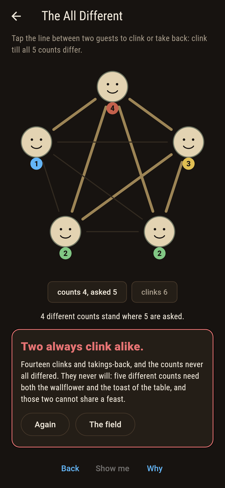
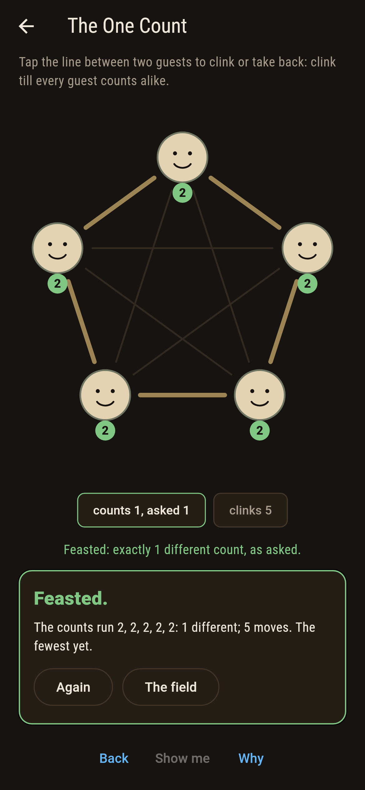
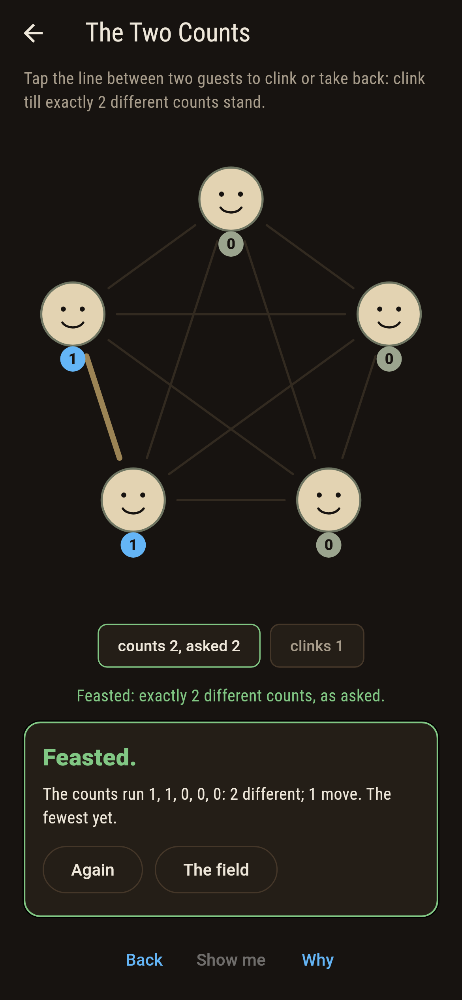
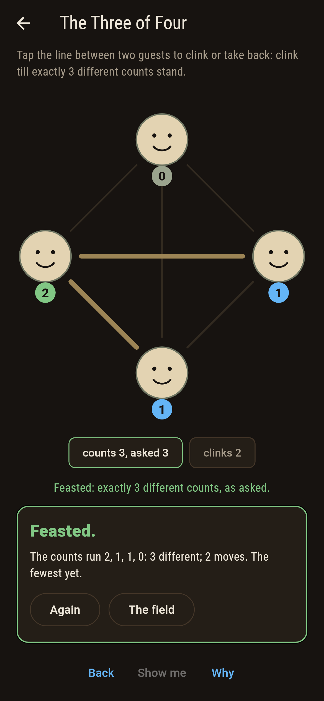
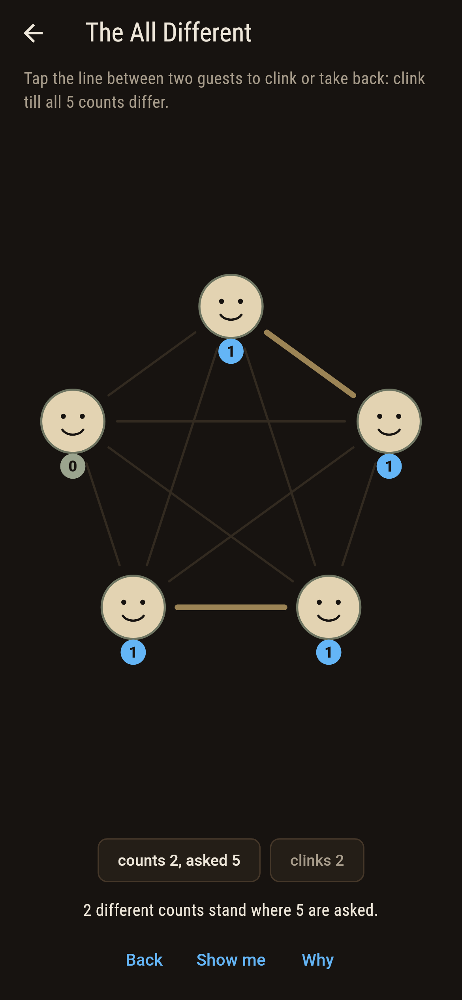
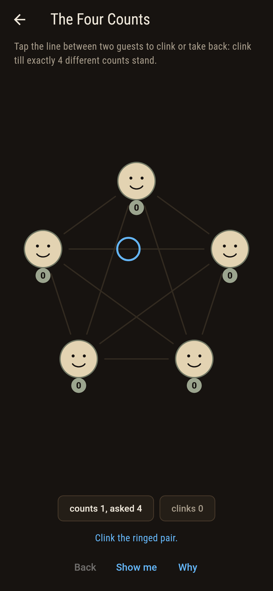
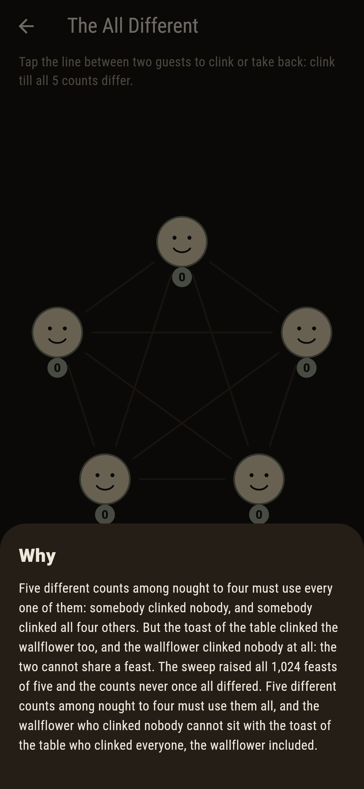

# Clinkfield


Guests round a feast, clinking in pairs, each wearing the count
of glasses they touched. The pigeonhole law says the counts can
never all differ: n different counts among nought to n less one
must use them all, and the wallflower who clinked nobody cannot
share a feast with the toast of the table who clinked everyone,
the wallflower included.

## The feasts

1. **The One Count** - clink till every guest counts alike
2. **The Two Counts** - clink till exactly 2 different counts stand
3. **The Four Counts** - clink till exactly 4 different counts stand
4. **The Three of Four** - four guests, exactly 3 different counts
5. **The All Different** - clink till all 5 counts differ

Fourteen feasts level the table of five: the silent one, the
full one, and the twelve rings. Four different counts is the
ceiling at five guests, reached a hundred and twenty ways, and
four guests cap at three. The All Different is labeled hopeless
on its tile, and the why names the wallflower.

## Two voices

The game never asserts what it has not computed, and it computes
everything at least twice:

* **The census** tallies each guest wire by wire, and the
  badges wear one tint per count, so alike counts look alike
  across the table.
* **The sweep** raises all 64 feasts of four guests and all
  1,024 of five, holds the wallflower law on every one, and
  pins the spreads whole, the fourteen level feasts included.

`tool/check_clinks.dart` runs the lot and refuses the bake on
any disagreement.

## The checker's ledger

What `dart run tool/check_clinks.dart` printed for the build
this README shipped with, word for word:

```
every feast raised, the 64 of four guests and the 1,024 of five: the counts never all differ at either table, the wallflower and the toast of the table never share a feast, and the fourteen level feasts of five are the silent one, the full one and the twelve rings

 1 The One Count      clink till every guest counts alike: 14 feasts of the sweep land it
 2 The Two Counts     clink till exactly 2 different counts stand: 310 feasts of the sweep land it
 3 The Four Counts    clink till exactly 4 different counts stand: 120 feasts of the sweep land it
 4 The Three of Four  clink till exactly 3 different counts stand: 24 feasts of the sweep land it
 5 The All Different  clink till all 5 counts differ: none of the 1,024, and the wallflower said so first
```

## Screenshots

| The field | The four counts | The all different admitted |
| --- | --- | --- |
|  |  |  |

| The one count | The two counts | The three of four | Mid-clink | Show me | The why |
| --- | --- | --- | --- | --- | --- |
|  |  |  |  |  |  |

Screenshots are drawn by `test/showcase_test.dart` at real phone
sizes with the app's own painter, then copied into `docs/` as
they came out; every clink in them was tapped, so nothing
pictured is a feast the game could not reach. The logo and
every launcher icon come out of `test/mark_test.dart` the same
way: the mark is the four counts standing, one shy of all
different.

## Building

```
flutter test          # 44 tests, the sweep among them
dart run tool/check_clinks.dart
flutter build apk     # or: flutter build ios
```
