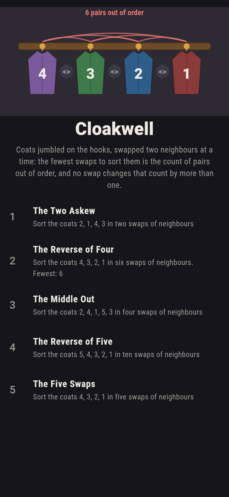
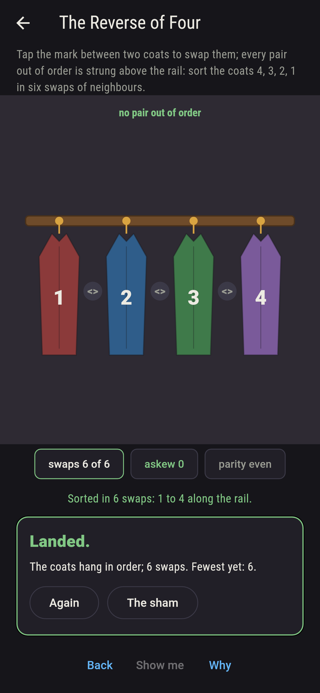
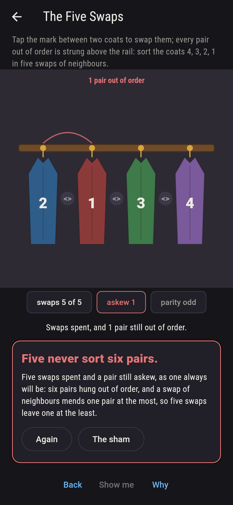
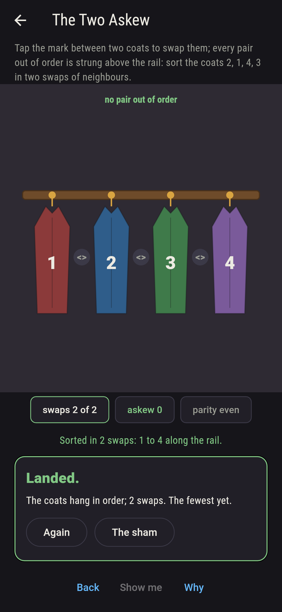
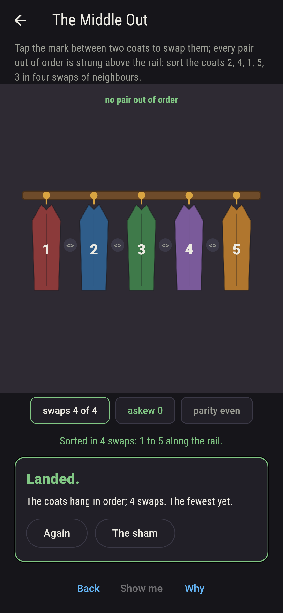
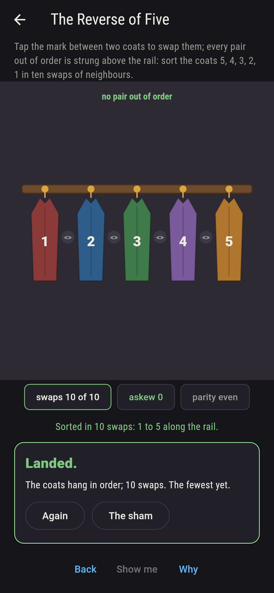
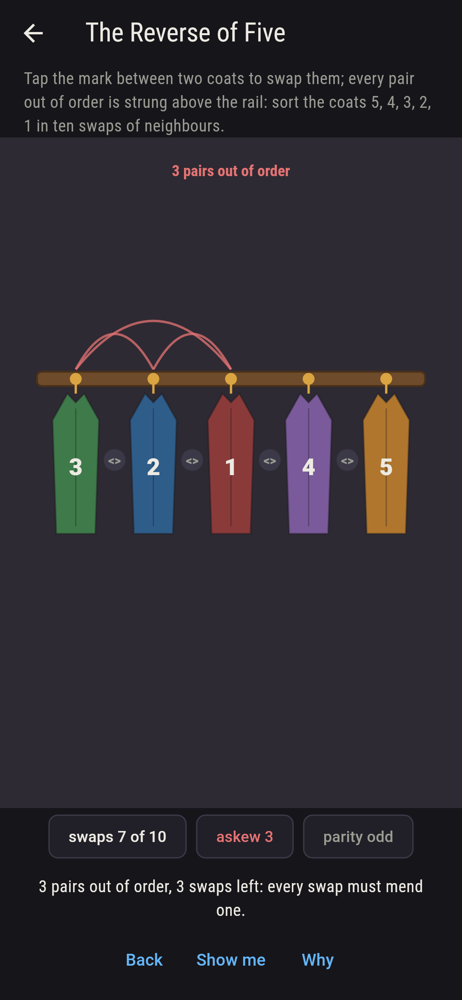
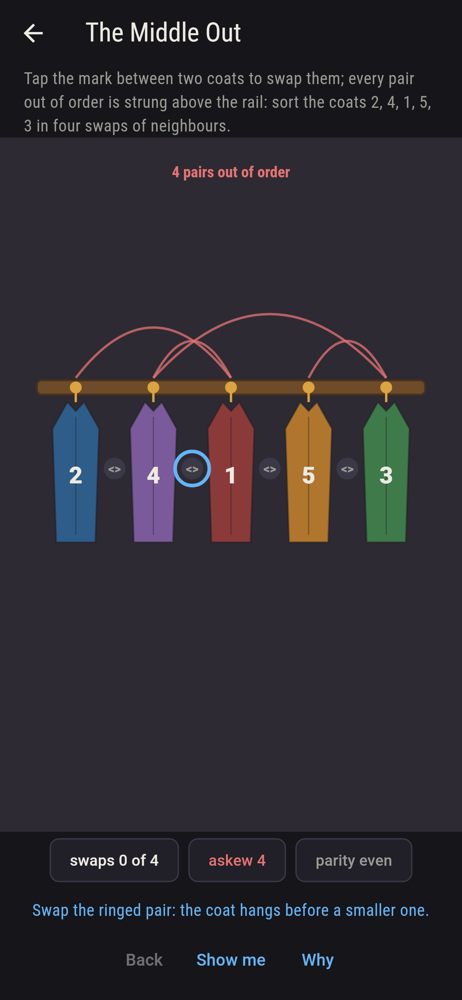
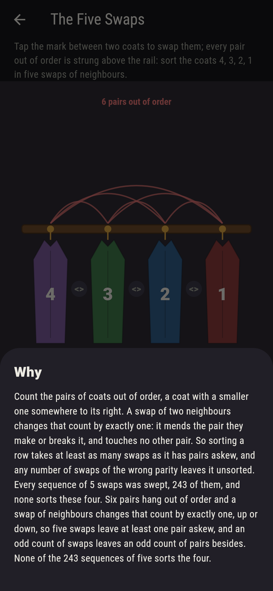

# Cloakwell


Coats numbered on a row of hooks, hung out of order, and the only
move is to swap two neighbours. How few swaps sort them? Count the
pairs out of order, a coat with a smaller one somewhere to its
right: that many and no fewer, because a swap of neighbours mends
the pair they make or breaks it and touches no other pair, so the
count moves by exactly one each swap. Every pair out of order is
strung above the rail as you go. Every row of up to six coats is
searched for its fewest swaps and it is the count of pairs every
time; every sequence of swaps for every rail here is swept; and
five swaps never sort a row with six pairs askew, nor any odd
number, since the count's parity flips with every swap.

## The rails

1. **The Two Askew** - sort the coats 2, 1, 4, 3 in two swaps of neighbours
2. **The Reverse of Four** - sort the coats 4, 3, 2, 1 in six swaps of neighbours
3. **The Middle Out** - sort the coats 2, 4, 1, 5, 3 in four swaps of neighbours
4. **The Reverse of Five** - sort the coats 5, 4, 3, 2, 1 in ten swaps of neighbours
5. **The Five Swaps** - sort the coats 4, 3, 2, 1 in five swaps of neighbours

Two pairs askew sort in two swaps, either first, 2 of the 9
sequences; the reverse of four in six, 16 of 729; the middle out
in four, 5 of 256; the reverse of five in ten, 768 of 1,048,576.
The Five Swaps is labeled hopeless on its tile: six pairs hang
askew, and one swap mends one pair at the most.

## Two voices

The game never asserts what it has not computed, and it computes
everything at least twice:

* **The sweep** tries every sequence of the swaps allowed on each
  rail and counts those that sort it; and every row of up to six
  coats, 873 rows, is searched for its fewest swaps by walking
  every row a swap can reach, nearest first.
* **The pairs out of order** are counted with no search, and the
  count is the fewest on every one of the 873 rows; the sign of
  each row by its cycles is the parity of that count on every one;
  and every swap of every row of five is checked to move the
  count by exactly one, which is the whole of the why.

`tool/check_swaps.dart` runs the lot and refuses the bake on any
disagreement.

## The checker's ledger

What `dart run tool/check_swaps.dart` printed for the build this
README shipped with, word for word:

```
every sequence of swaps swept for every rail, and every row of up to six coats searched, 873 rows: the fewest swaps of neighbours that sort a row is its count of pairs out of order in every case, the sign by cycles is the parity of that count in every case, and every swap of every row of five changes the count by exactly one; the reverse of four sorts in six swaps 16 ways of 729, in five never and in seven never, and in eight it does, the middle out sorting in four 5 ways of 256 and in six besides

 1 The Two Askew       sort the coats 2, 1, 4, 3 in two swaps of neighbours: 2 of the 9 sequences land it
 2 The Reverse of Four sort the coats 4, 3, 2, 1 in six swaps of neighbours: 16 of the 729 sequences land it
 3 The Middle Out      sort the coats 2, 4, 1, 5, 3 in four swaps of neighbours: 5 of the 256 sequences land it
 4 The Reverse of Five sort the coats 5, 4, 3, 2, 1 in ten swaps of neighbours: 768 of the 1,048,576 sequences land it
 5 The Five Swaps      sort the coats 4, 3, 2, 1 in five swaps of neighbours: none of the 243, and one pair a swap said so first
```

## Screenshots

| The sham | The reverse of four sorted | The five swaps admitted |
| --- | --- | --- |
|  |  |  |

| The two askew | The middle out | The reverse of five | Mid-sort | Show me | The why |
| --- | --- | --- | --- | --- | --- |
|  |  |  |  |  |  |

Screenshots are drawn by `test/showcase_test.dart` at real phone
sizes with the app's own painter, then copied into `docs/` as they
came out; every swap in them was made by a tap, so nothing
pictured is a row the game could not reach. The logo and every
launcher icon come out of `test/mark_test.dart` the same way: the
mark is the reverse of four as it hangs, every pair strung askew.

## Building

```
flutter test          # 44 tests, the search among them
dart run tool/check_swaps.dart
flutter build apk     # or: flutter build ios
```
