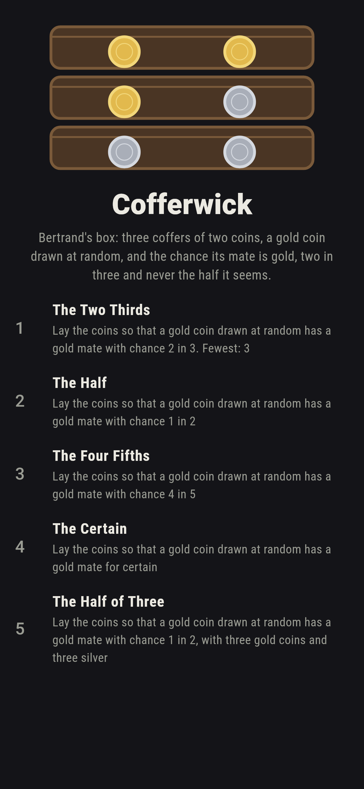
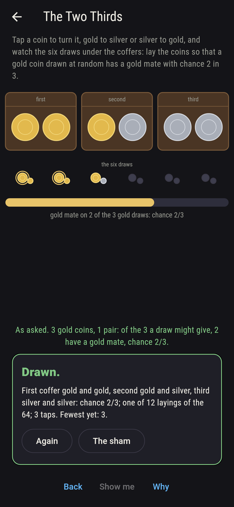
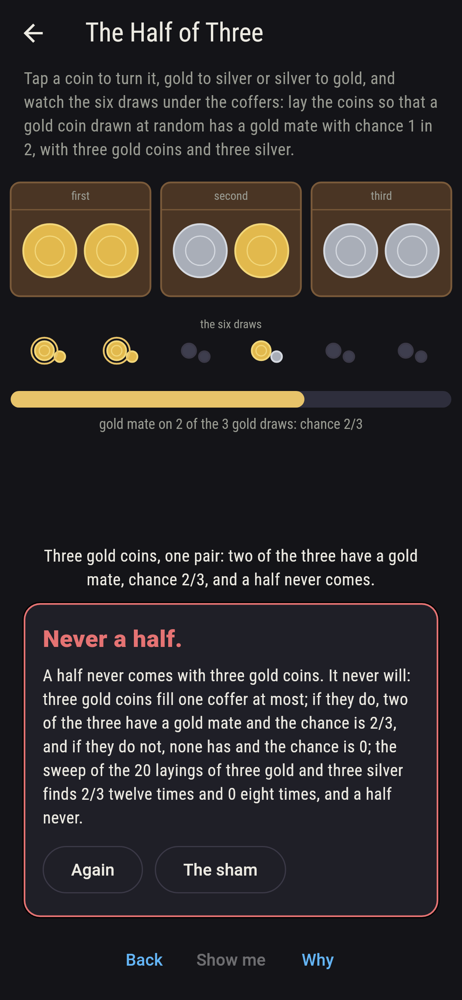
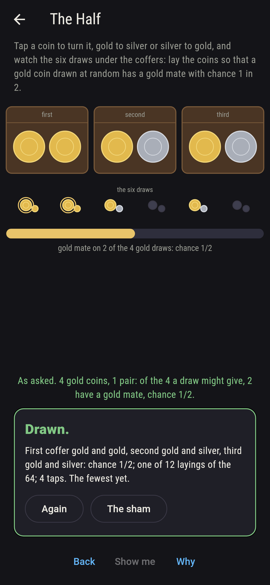
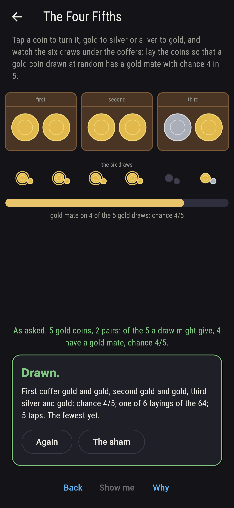
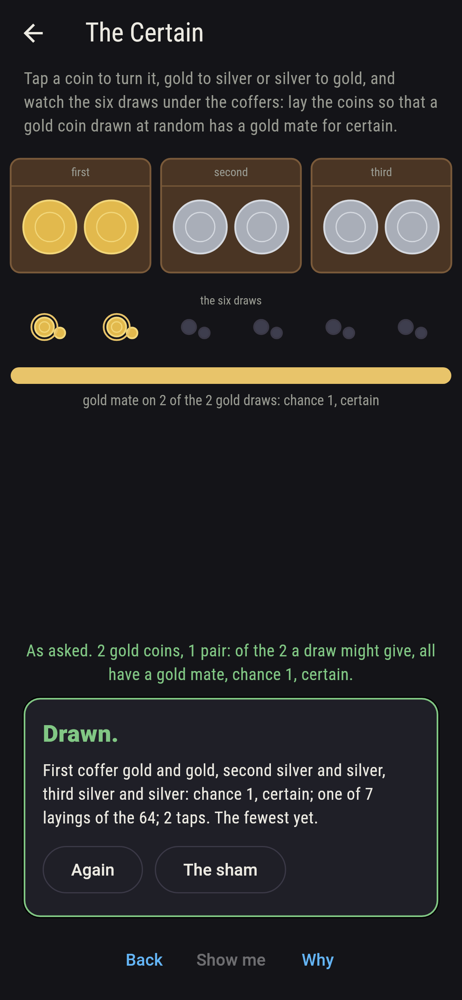
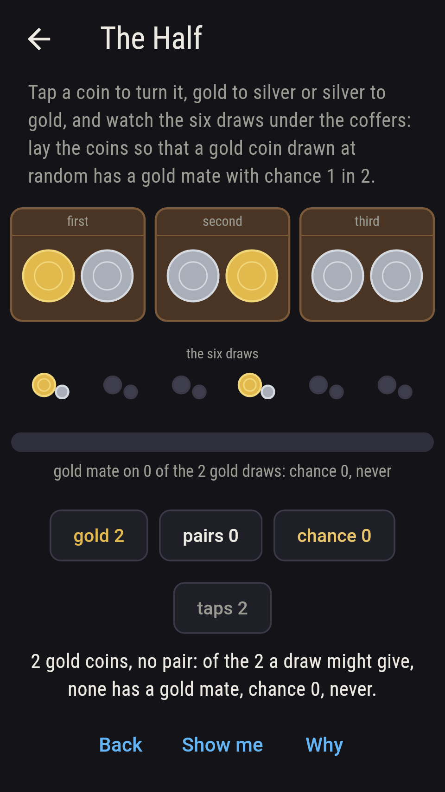
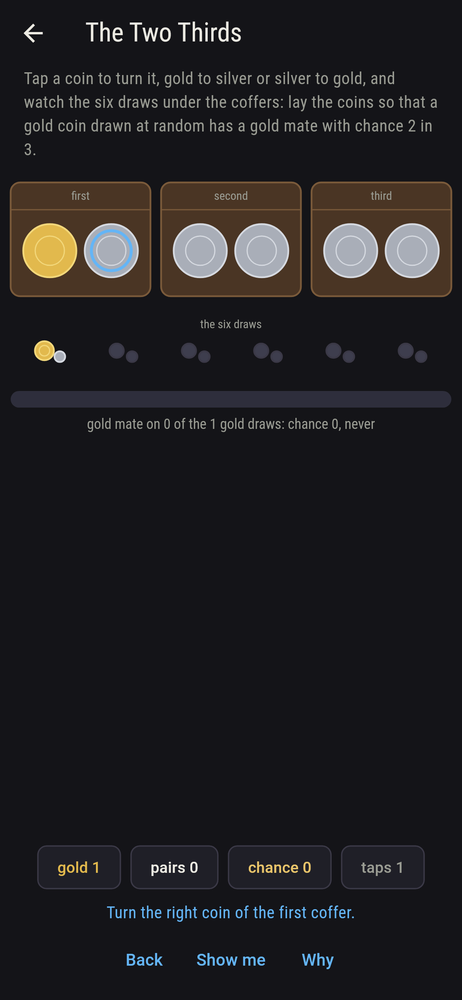
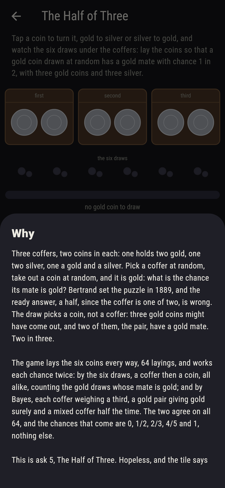

# Cofferwick


Three coffers, two coins in each: one holds two gold, one two silver,
one a gold and a silver. Pick a coffer at random, take out a coin at
random, and it is gold: what is the chance its mate is gold? Bertrand
set the puzzle in 1889, and the ready answer, a half, since the coffer
is one of two, is wrong. The draw picks a coin, not a coffer: three
gold coins might have come out, and two of them, the pair, have a
gold mate. Two in three. Tap a coin to turn it, gold to silver or
silver to gold, and watch the six draws under the coffers and the
chance they add up to. The game lays the six coins every way, 64
layings, and works each chance twice, by the six draws and by Bayes;
the two agree on all 64, and the chances that come are 0, 1/2, 2/3,
4/5 and 1, nothing else, which is why a half never comes with three
gold coins.

## The asks

1. **The Two Thirds** - lay the coins so that a gold coin drawn at random has a gold mate with chance 2 in 3
2. **The Half** - lay the coins so that a gold coin drawn at random has a gold mate with chance 1 in 2
3. **The Four Fifths** - lay the coins so that a gold coin drawn at random has a gold mate with chance 4 in 5
4. **The Certain** - lay the coins so that a gold coin drawn at random has a gold mate for certain
5. **The Half of Three** - lay the coins so that a gold coin drawn at random has a gold mate with chance 1 in 2, with three gold coins and three silver

Bertrand's own laying gives 2 in 3, and so does every laying with one
gold pair and one mixed coffer, twelve of the 64. A half wants twice
as many mixed coffers as gold pairs, one pair and two mixed, four
gold coins with two of them mated gold, twelve layings again. Two
gold pairs and a mixed coffer give 4 in 5, six layings; no mixed
coffer and a pair at least gives certainty, seven layings, one pair
three ways, two pairs three ways, three pairs one way; and 26 layings
give 0, the one all-silver laying no gold coin to draw. The Half of
Three is labeled hopeless on its tile: three gold coins fill one
coffer at most, and if they do, two of the three have a gold mate,
2 in 3, and if they do not, none has, 0; the sham admits it the
moment three gold coins are laid, or after twelve taps.

## Two voices

The game never asserts what it has not computed, and it computes
everything at least twice:

* **The draws** are six and alike, a coffer then one of its two
  coins; the chance is the share of the gold draws whose mate is
  gold, counted out on every laying, and every count on the sham is
  that sweep's: 26 layings give 0, 12 a half, 12 two thirds, 6 four
  fifths and 7 certainty.
* **Bayes** weighs the coffers instead: each a third, a gold pair
  giving gold surely with a gold mate, a mixed coffer giving gold
  half the time and never a gold mate, so the chance is the gold-pair
  weight over the whole gold weight; it agrees with the draws on all
  64 layings, and on the 20 layings of three gold coins finds 2 in 3
  twelve times and 0 eight times, a half never.

`tool/check_coffers.dart` runs the lot and refuses the bake on any
disagreement.

## The checker's ledger

What `dart run tool/check_coffers.dart` printed for the build this
README shipped with, word for word:

```
every laying of the six coins in the three coffers swept, 64 of them, and on each the chance that a gold coin drawn at random has a gold mate was worked by the six draws, a coffer then a coin, and again by Bayes with each coffer a third, the two agreeing on all 64; the chances that come are 0 on 26 layings, a half on 12, two thirds on 12, four fifths on 6 and certainty on 7, with the all-silver laying giving no gold coin to draw; Bertrand's own laying, gold and gold, gold and silver, silver and silver, gives 2 in 3; and of the 20 layings of three gold coins and three silver, 12 give 2 in 3 and 8 give 0, and none a half

 1 The Two Thirds    lay the coins so that a gold coin drawn at random has a gold mate with chance 2 in 3: 12 of the 64 layings land it
 2 The Half          lay the coins so that a gold coin drawn at random has a gold mate with chance 1 in 2: 12 of the 64 layings land it
 3 The Four Fifths   lay the coins so that a gold coin drawn at random has a gold mate with chance 4 in 5: 6 of the 64 layings land it
 4 The Certain       lay the coins so that a gold coin drawn at random has a gold mate for certain: 7 of the 64 layings land it
 5 The Half of Three lay the coins so that a gold coin drawn at random has a gold mate with chance 1 in 2, with three gold coins and three silver: none of its 20 layings, and the one gold pair said so first
```

## Screenshots

| The sham | The two thirds | The half of three admitted |
| --- | --- | --- |
|  |  |  |

| The half | The four fifths | The certain | Midway, on the small phone | Show me | The why |
| --- | --- | --- | --- | --- | --- |
|  |  |  |  |  |  |

Screenshots are drawn by `test/showcase_test.dart` at real phone
sizes with the app's own painter, then copied into `docs/` as they
came out; every laying in them was set by taps on the coins, so
nothing pictured is a laying the game could not reach. The logo and
every launcher icon come out of `test/mark_test.dart` the same way:
the mark is Bertrand's three coffers, gold and gold, gold and silver,
silver and silver.

## Building

```
flutter test          # 42 tests, the sweep among them
dart run tool/check_coffers.dart
flutter build apk     # or: flutter build ios
```
