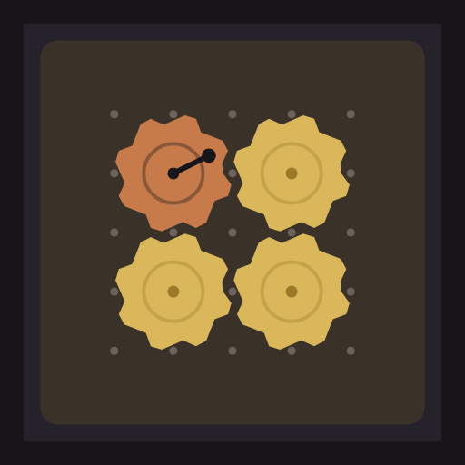
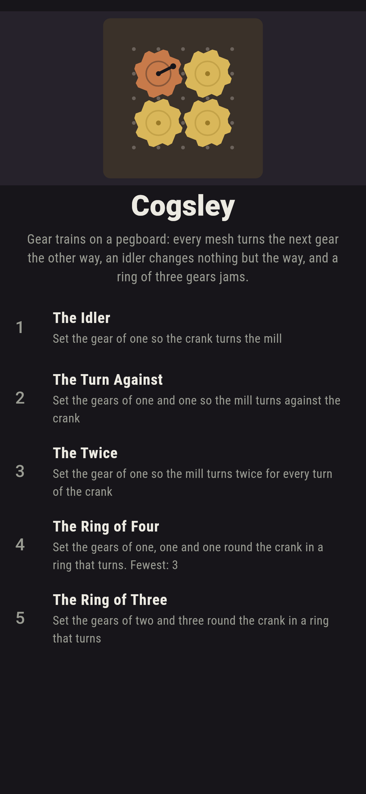
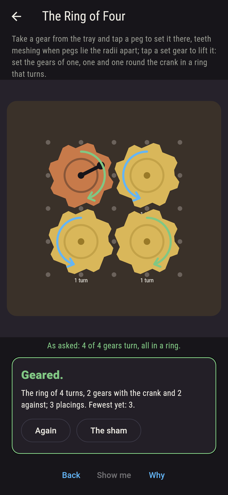
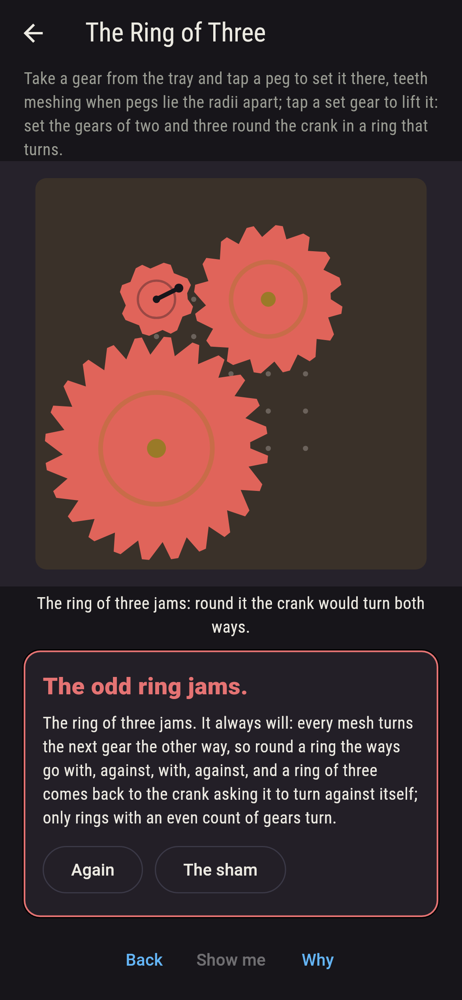
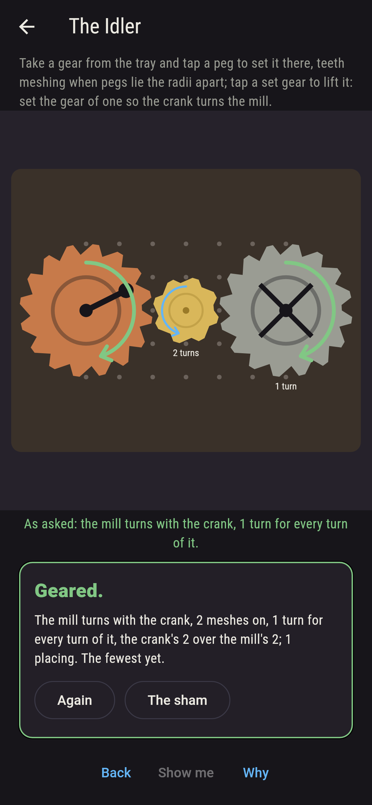
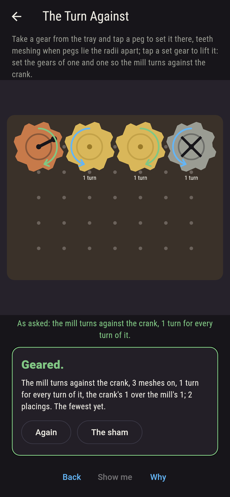
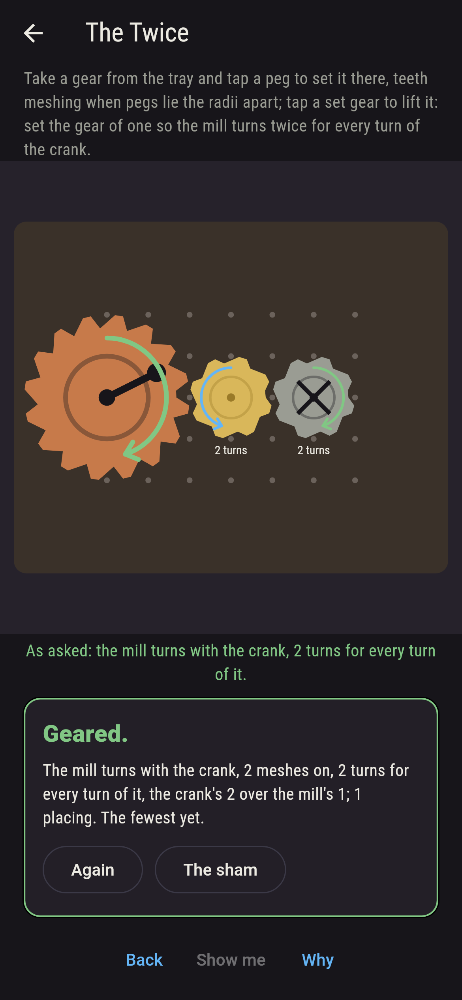
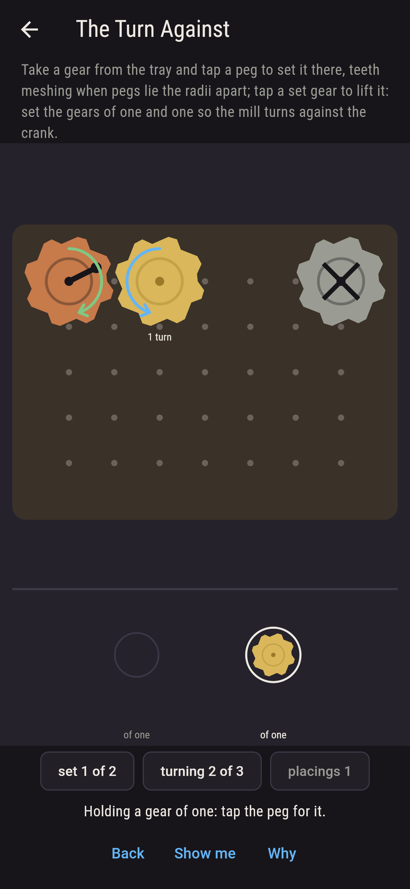
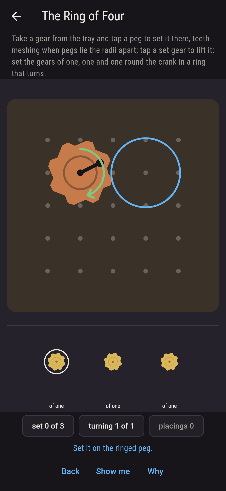
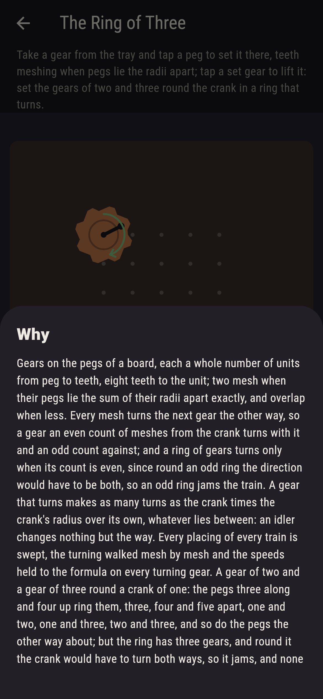

# Cogsley



Gear trains on a pegboard. Gears sit on the pegs, each a whole
number of units from peg to teeth, eight teeth to the unit; two
mesh when their pegs lie the sum of their radii apart exactly, and
overlap when less, which is not allowed. Take a gear from the tray
and tap a peg to set it there; tap a set gear to lift it. Every
mesh turns the next gear the other way, so a gear an even count of
meshes from the crank turns with it and an odd count against; and a
ring of gears turns only when its count is even, since round an odd
ring the direction would have to be both, so an odd ring jams the
train. A gear that turns makes as many turns as the crank times the
crank's radius over its own, whatever lies between: an idler
changes nothing but the way. Every placing of every train is swept,
the turning walked mesh by mesh and the speeds held to the formula
on every turning gear; a gear of two and a gear of three ring a
crank of one three, four and five apart, a right triangle of pegs,
and jam.

## The trains

1. **The Idler** - set the gear of one so the crank turns the mill
2. **The Turn Against** - set the gears of one and one so the mill turns against the crank
3. **The Twice** - set the gear of one so the mill turns twice for every turn of the crank
4. **The Ring of Four** - set the gears of one, one and one round the crank in a ring that turns
5. **The Ring of Three** - set the gears of two and three round the crank in a ring that turns

The idler between a crank and a mill of two turns the mill the same
way and once a turn, one placing of five; two gears of one on the
pegs two and four along turn the mill against the crank, one
placing of 275; a gear of one three pegs along turns a mill of one
twice for a crank of two, one placing of eleven; three gears of one
round a crank of one make a turning ring one way of 159, the
square, two gears with the crank and two against. The Ring of Three
is labeled hopeless on its tile: the two placings that ring the
crank both jam, and on the nine-by-nine every ring of three gears
of one to three round the crank jams, sixteen rings, while every
ring of four gears of one turns, four rings.

## Two voices

The game never asserts what it has not computed, and it computes
everything at least twice:

* **The sweep** sets the tray's gears on the free pegs every way,
  gears of a radius alike, none overlapping, and walks the turning
  from the crank mesh by mesh, each mesh reversing the way and a
  gear asked to turn both ways a jam; every count on the sham is
  the sweep's, and every jam it finds is a ring.
* **The formula** walks nothing: a turning gear's speed is the
  crank's radius over its own, and it agrees with the speed walked
  mesh by mesh, each mesh passing the teeth speed along, on every
  turning gear of every placing of every train; and a ring turns
  exactly when its count is even, checked on every ring the sweep
  finds and on the rings of three and four round a crank on the
  nine-by-nine.

`tool/check_trains.dart` runs the lot and refuses the bake on any
disagreement.

## The checker's ledger

What `dart run tool/check_trains.dart` printed for the build this
README shipped with, word for word:

```
every placing of every train swept on its pegboard, gears meshing when their pegs lie the sum of their radii apart exactly and overlapping when less, the turning walked mesh by mesh from the crank, each mesh reversing the way, and the speeds walked held to the crank's radius over the gear's own on every turning gear of every placing: a gear of one on the peg between a crank and a mill of two, six pegs apart, turns the mill the same way and once a turn, 1 placing of 5; two gears of one on the pegs two and four along turn a mill of one six pegs off against the crank, 1 placing of 275; a gear of one three pegs along turns a mill of one twice for a crank of two five pegs off, 1 placing of 11; three gears of one round a crank of one make a turning ring in 1 placing of 159, the square, two gears with the crank and two against; a gear of two and a gear of three ring a crank of one in 2 placings of 8, three, four and five apart, and both jam, and on the nine-by-nine every ring of three gears of one to three round a crank of one at the middle jams, 16 rings, and every ring of four gears of one round it turns, 4 rings

 1 The Idler          set the gear of one so the crank turns the mill: 1 of the 5 placings lands it
 2 The Turn Against   set the gears of one and one so the mill turns against the crank: 1 of the 275 placings lands it
 3 The Twice          set the gear of one so the mill turns twice for every turn of the crank: 1 of the 11 placings lands it
 4 The Ring of Four   set the gears of one, one and one round the crank in a ring that turns: 1 of the 159 placings lands it
 5 The Ring of Three  set the gears of two and three round the crank in a ring that turns: none of the 8, and the odd ring said so first
```

## Screenshots

| The sham | The ring of four | The ring of three admitted |
| --- | --- | --- |
|  |  |  |

| The idler | The turn against | The twice | Mid-gearing | Show me | The why |
| --- | --- | --- | --- | --- | --- |
|  |  |  |  |  |  |

Screenshots are drawn by `test/showcase_test.dart` at real phone
sizes with the app's own painter, then copied into `docs/` as they
came out; every gear in them was set by a tap, so nothing pictured
is a train the game could not reach. The logo and every launcher
icon come out of `test/mark_test.dart` the same way: the mark is
the ring of four, turning.

## Building

```
flutter test          # 46 tests, the sweep among them
dart run tool/check_trains.dart
flutter build apk     # or: flutter build ios
```
