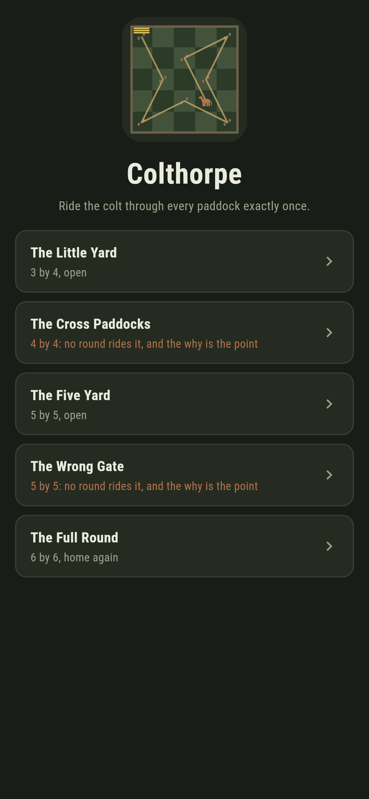
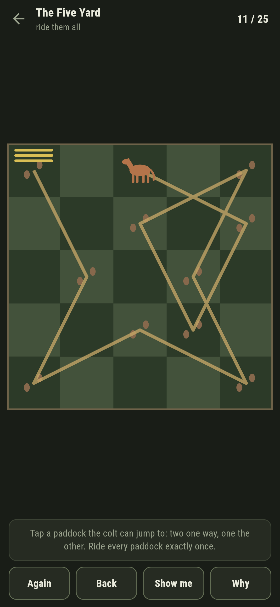
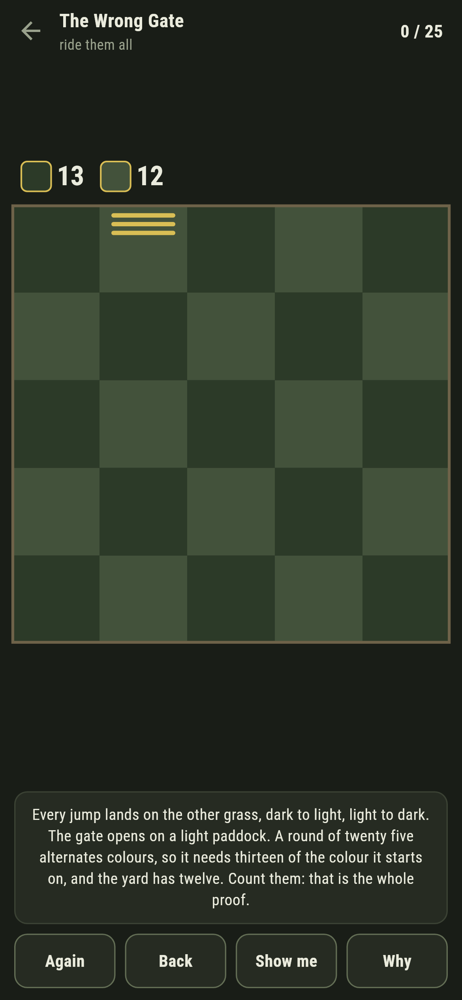
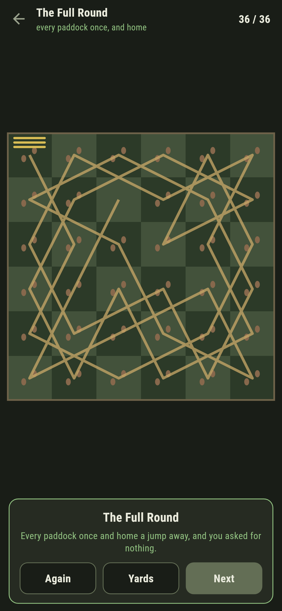
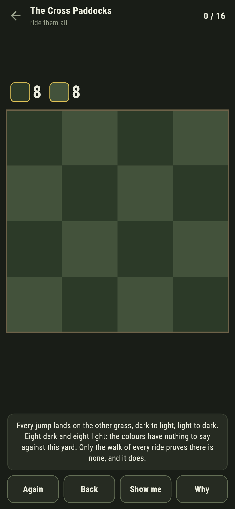

# Colthorpe

A knight's tour game for phones, in Flutter, for Android and iOS.

The colt jumps the way a knight moves, two paddocks one way and one the
other, and the round asks him through every paddock exactly once. On one
yard he must come home at the end, a single jump from the gate he started
at. Two of the yards cannot be ridden at all, and they are impossible in
two different ways, which is what the game is for.

| | | | |
|---|---|---|---|
|  |  |  |  |

## The two grasses

Every paddock is dark or light like a chessboard square, and every jump
the colt can make lands on the other colour: the suite sweeps every jump
of every yard to say so. That one fact is a certificate you can read off
the grass.

The Wrong Gate is a five-by-five yard whose gate opens on a light
paddock. A round of twenty five alternates colours, so it has thirteen of
whatever colour it starts on, and the yard has thirteen dark and twelve
light. Count them, and you have proved no round rides it: **Why** tallies
the two grasses in front of you, and the walk of every ride, which knows
nothing of colours, agrees.

```
$ make yards
 1 The Little Yard     3x4  open    dark 6  light 6  a round exists  written down possible
 2 The Cross Paddocks  4x4  open    dark 8  light 8  no round at all  written down impossible
 3 The Five Yard       5x5  open    dark 13  light 12  a round exists  written down possible
 4 The Wrong Gate      5x5  open    dark 13  light 12  no round at all  written down impossible
 5 The Full Round      6x6  closed  dark 18  light 18  a round exists  written down possible
```


## The Cross Paddocks fall to nothing but the walk

Four by four: eight dark, eight light, and the colours have nothing to
say against it. There is still no round, and the only proof anyone has is
the walk of every ride there is, which the game runs and the suite
re-runs. Set beside the Wrong Gate, it is the same pairing Rindhope
carries from the other side: some impossibilities have a reason you can
hold, and some have only a search that came back empty-handed.



## The round is watched as it is ridden

The Five Yard's gate stands at a dark corner, because a full round there
must start and end on the majority colour, and the suite checks every
light paddock to prove no round starts on any of them. As you ride, the
game keeps a live answer to whether the round can still be finished, and
the moment a jump strands a patch of grass, the ledger goes red and the
words under the yard say so, with Back to unride it. **Show me** points
at a jump the walk has checked all the way home.

The Full Round is six by six and closed: every paddock once and home a
jump from the gate, the whole thing found live by the same walk that
watches your riding.

## Building

```
make deps    # fetch packages
make check   # analyze + every test
make yards   # walk the shipped yards against what is written down
make shots   # render the screenshots and redraw the icons
make apk     # Android release build
make ios     # iOS release build (unsigned)
```

The logo and every app icon are drawn by the game's own painter in
`test/mark_test.dart`. There is no image in this repository that was not
produced by code in it.

## How it is put together

```
lib/tour/yard.dart      a yard: paddocks, the gate, open or closed
lib/tour/fewest.dart    the jumps, the colours, and the pruned walk
lib/tour/yards.dart     the five yards that ship
lib/tour/play.dart      a round in the riding: the path, the live answer
lib/ui/                 the painter, the screens, the mark
tool/check_yards.dart   the ledger above
```

The tests sweep every jump of every yard for the colour flip, prove the
wrong gate by counting and by search both, prove the cross paddocks by
search where counting is silent, ride every possible yard home by
following the game's own pointer, and hold the pictures against the real
widget tree. If any of that drifts, `make check` goes red before anything
leaves the machine.
