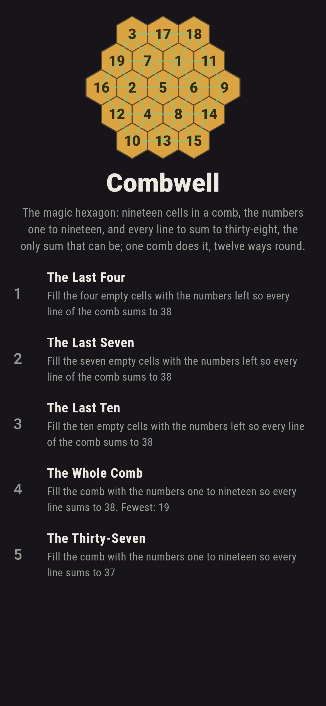
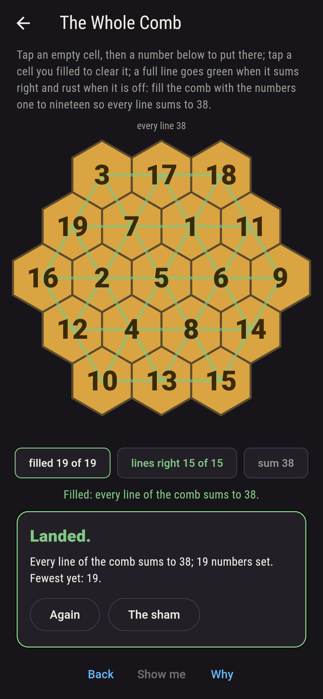
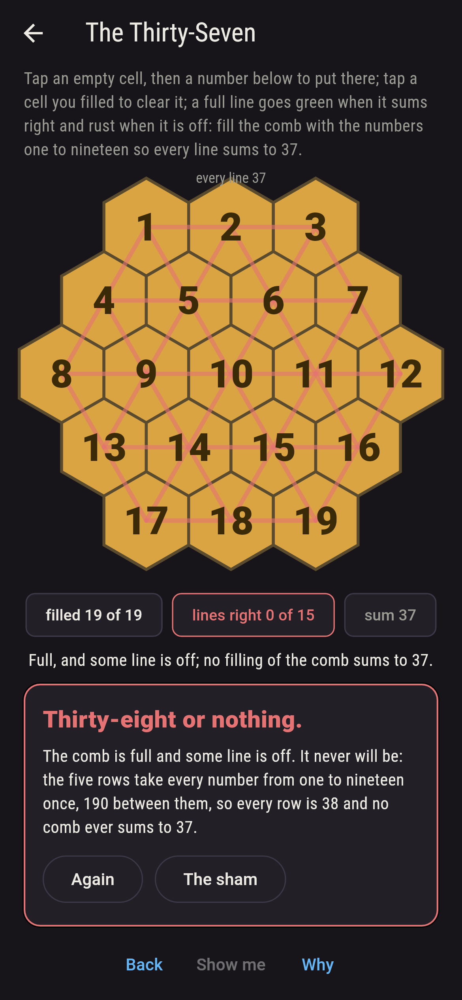
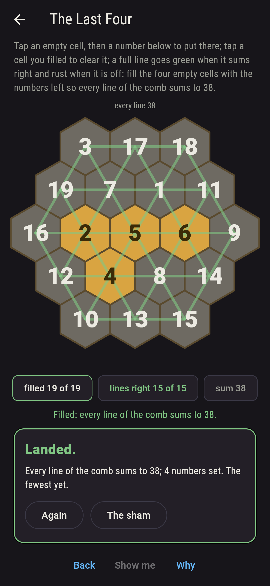
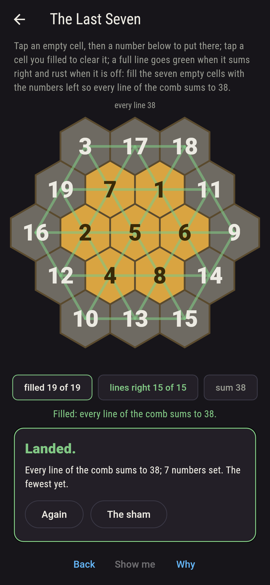
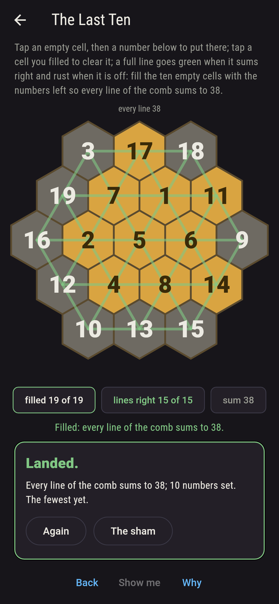
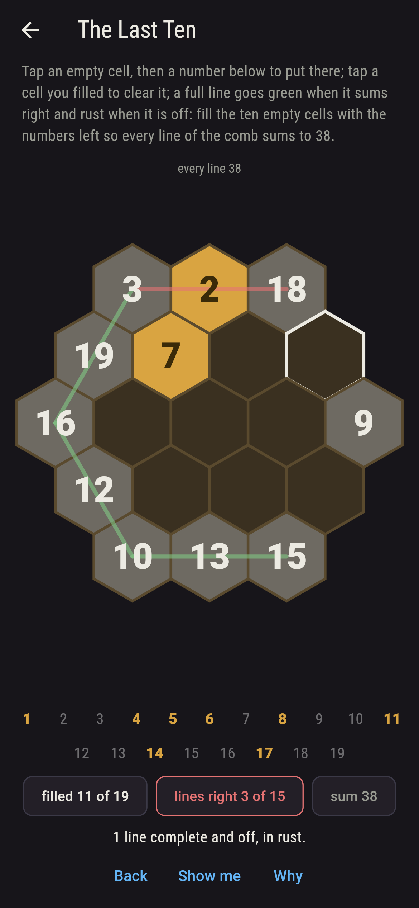
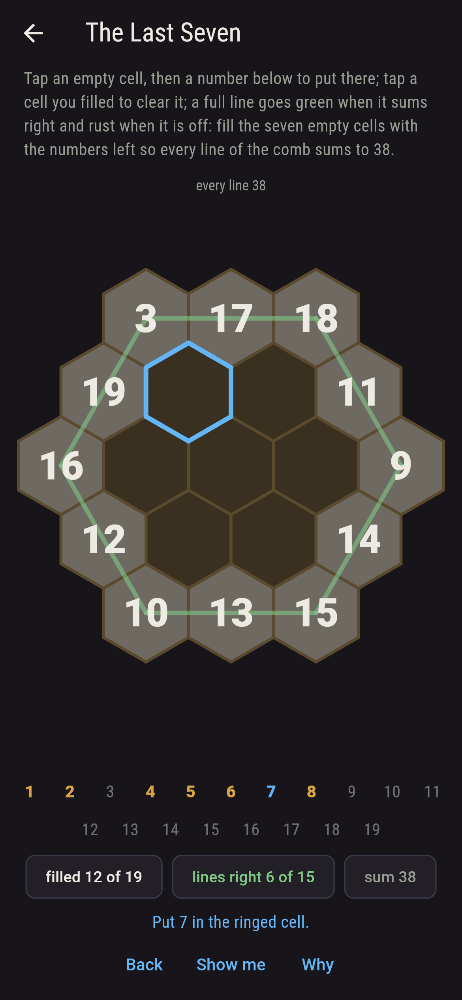
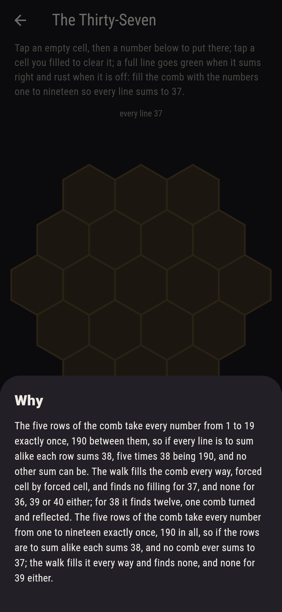

# Combwell


The magic hexagon. Nineteen cells in a comb, rows of three, four,
five, four and three, the numbers one to nineteen to go in them,
and every line of the comb, five each way, fifteen in all, to sum
alike. Tap an empty cell, then a number; a full line goes green
when it sums right and rust when it is off. The sum can only be
thirty-eight, since the five rows take every number once and 190
is five 38s, and there is exactly one comb that does it, the one
Clifford Adams found in 1957 after forty-seven years of trying, in
its six turnings and six reflections. The game fills the comb every
way, forced cell by forced cell, and finds those twelve and no
more, and none at all for thirty-seven.

## The combs

1. **The Last Four** - fill the four empty cells with the numbers left so every line of the comb sums to 38
2. **The Last Seven** - fill the seven empty cells with the numbers left so every line of the comb sums to 38
3. **The Last Ten** - fill the ten empty cells with the numbers left so every line of the comb sums to 38
4. **The Whole Comb** - fill the comb with the numbers one to nineteen so every line sums to 38
5. **The Thirty-Seven** - fill the comb with the numbers one to nineteen so every line sums to 37

The last four cells fill one way, and so do the last seven and the
last ten; the whole comb fills twelve ways, one comb turned and
reflected: 3, 17, 18 across the top, 19, 7, 1, 11 below, 16, 2, 5,
6, 9 through the middle, 12, 4, 8, 14, and 10, 13, 15 along the
bottom. The Thirty-Seven is labeled hopeless on its tile, and the
why counts the rows.

## Two voices

The game never asserts what it has not computed, and it computes
everything at least twice:

* **The walk** fills the empty cells in a fixed order, and whenever
  a line has one cell empty that cell is forced by the sum, so the
  walk branches on seven cells and the rest follow; it counts every
  filling for the sums 36 to 40 with nothing given and for every
  comb on the sham as given, and every count on the sham is that
  walk's.
* **The rows** need no walk: five rows take every number from 1 to
  19 once, 190 between them, so every row is 38 if the rows are to
  agree; and the twelve fillings the walk finds are held to be
  Adams' comb carried by the twelve turnings and reflections of the
  hexagon, each of which is computed and each of which is checked
  to keep every line a line.

`tool/check_fillings.dart` runs the lot and refuses the bake on any
disagreement.

## The checker's ledger

What `dart run tool/check_fillings.dart` printed for the build this
README shipped with, word for word:

```
every filling of the comb walked, forced cell by forced cell, for the sums 36 to 40 with nothing given and for every comb on the sham as given: the whole comb sums to 38 twelve ways and to 36, 37, 39 or 40 never, since the five rows take every number from 1 to 19 once, 190 between them, which is five 38s; the twelve fillings are one comb carried by the six turnings and six reflections of the hexagon, the comb Adams found in 1957, 3, 17, 18 across the top, and each of the fifteen lines, five each way, sums to 38 in it; the last four cells fill 1 way, the last seven 1, the last ten 1, the whole comb 12, and the thirty-seven never

 1 The Last Four    fill the four empty cells with the numbers left so every line of the comb sums to 38: 1 filling lands it
 2 The Last Seven   fill the seven empty cells with the numbers left so every line of the comb sums to 38: 1 filling lands it
 3 The Last Ten     fill the ten empty cells with the numbers left so every line of the comb sums to 38: 1 filling lands it
 4 The Whole Comb   fill the comb with the numbers one to nineteen so every line sums to 38: 12 fillings land it
 5 The Thirty-Seven fill the comb with the numbers one to nineteen so every line sums to 37: none, and the rows said so first
```

## Screenshots

| The sham | The whole comb filled | The thirty-seven admitted |
| --- | --- | --- |
|  |  |  |

| The last four | The last seven | The last ten | Mid-filling | Show me | The why |
| --- | --- | --- | --- | --- | --- |
|  |  |  |  |  |  |

Screenshots are drawn by `test/showcase_test.dart` at real phone
sizes with the app's own painter, then copied into `docs/` as they
came out; every number in them was put by taps, so nothing pictured
is a comb the game could not reach. The logo and every launcher
icon come out of `test/mark_test.dart` the same way: the mark is
Adams' comb filled, every line thirty-eight.

## Building

```
flutter test          # 47 tests, the walk among them
dart run tool/check_fillings.dart
flutter build apk     # or: flutter build ios
```
