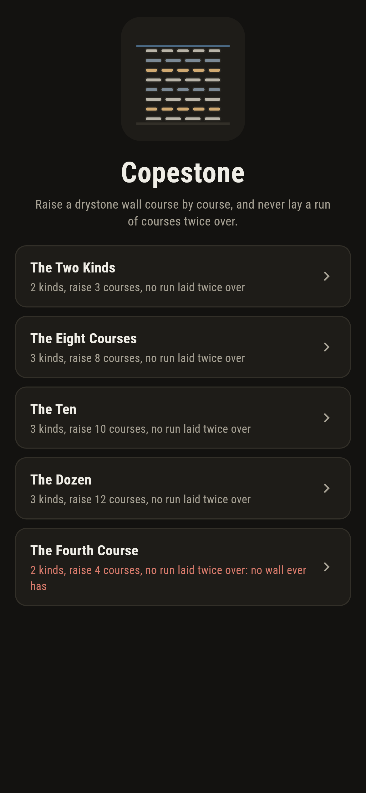
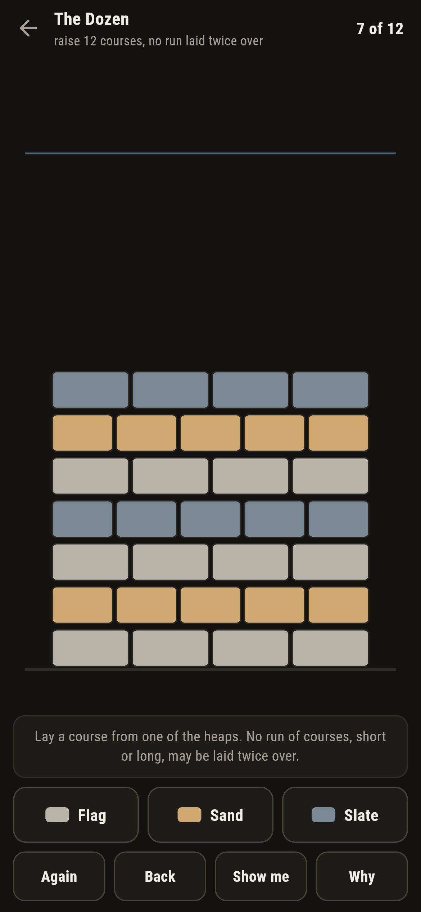
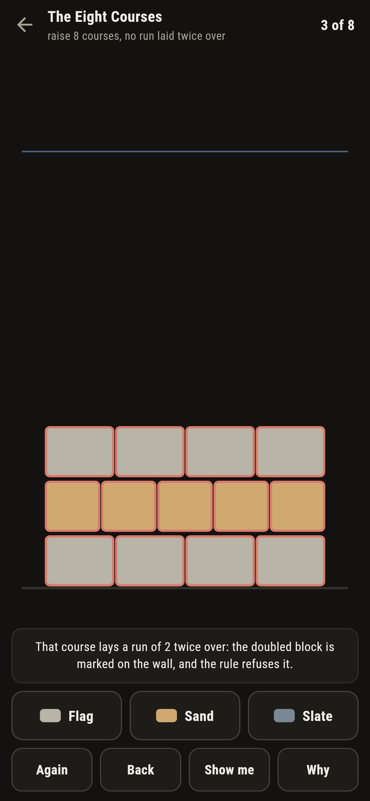
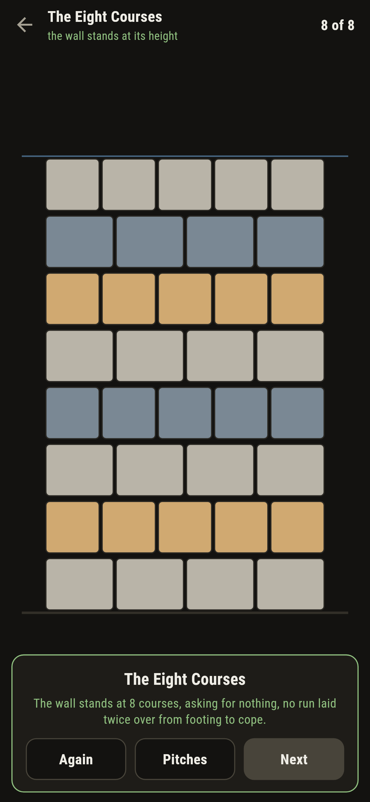
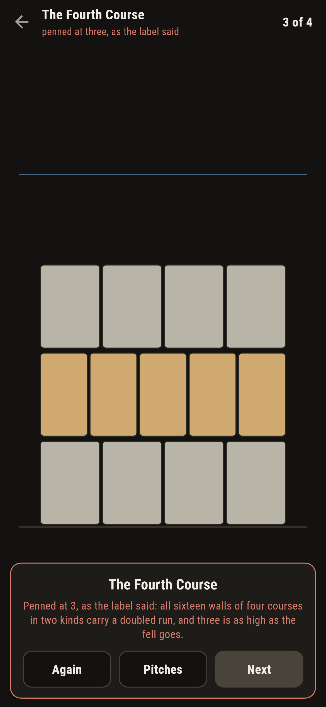
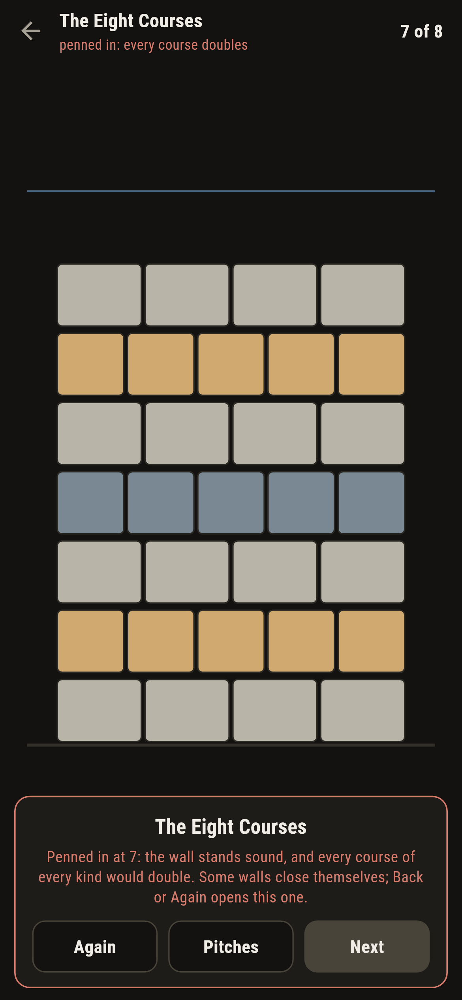

# Copestone

A walling puzzle for phones, in Flutter, for Android and iOS.

Raise a drystone wall course by course from heaps of flag, sand and
slate, under the waller's one rule: no run of courses may be laid
twice over, back to back. One course doubled or a block of five
doubled, all the same. This is the study of square-free words laid
in stone: two kinds die at the third course, three kinds climb past
any height a fell could ask, and a wall can pen itself in with
every course of it sound.

| | | | |
|---|---|---|---|
|  |  |  |  |

## Two ways of knowing

The suite knows every pitch two ways that share nothing. The sweep
lays every wall there is and counts what stands at every height,
two ways of three courses in two kinds and none at all of four; the
walk grows the one standing wall every way it can go, and knows
whether the asked height is still in reach before a course is ever
laid. The sweep also proved something the walk then leaned on:
short of its height, a sound wall of these fells either still
climbs or is penned outright, with not one that limps.

```
$ make pitches
no run of courses laid twice over: the sweep lays every wall there is, two kinds of stone die at the third course, three kinds climb past every height asked, and the palindrome a-b-a-c-a-b-a stands sound yet pens itself in

 1 The Two Kinds      2 kinds  raise 3 courses, no run laid twice over: 2 sound walls stand that high
 2 The Eight Courses  3 kinds  raise 8 courses, no run laid twice over: 78 sound walls stand that high
 3 The Ten            3 kinds  raise 10 courses, no run laid twice over: 144 sound walls stand that high
 4 The Dozen          3 kinds  raise 12 courses, no run laid twice over: 264 sound walls stand that high
 5 The Fourth Course  2 kinds  raise 4 courses, no run laid twice over: all 16 walls of four carry a doubled run, and three is the roof
```

## The fourth course

One pitch ships labelled hopeless in the house tradition of maps
nobody can win: four courses asked of two kinds of stone. The sweep
lays all sixteen walls of four and every one carries a doubled run;
three is the roof, and there are exactly two ways to stand there,
each the other's mirror. The game lets you lay the three that
stand, watches both heaps refuse the fourth, and the card says what
the label promised.



## The wall that pens itself

The strangest stone on the fell is the palindrome: lay
flag-sand-flag-slate-flag-sand-flag and the wall stands sound at
seven, yet no eighth course of any kind survives the rule. The game
plays it straight: a doubling course is refused with the doubled
block marked in place on the wall, a penned wall gets its honest
card, and **Show me** lights a heap the walk has grown every wall
from, the height still in reach. **Why** speaks the sweep's counts
over the pitch in front of you.



## Building

```
make deps      # fetch packages
make check     # analyze + every test
make pitches   # lay every wall and prove the claims
make shots     # render the screenshots and redraw the icons
make apk       # Android release build
make ios       # iOS release build (unsigned)
```

The logo and every app icon are drawn by the game's own painter in
`test/mark_test.dart`. There is no image in this repository that was not
produced by code in it.

## How it is put together

```
lib/wall/rules.dart      the doubled-run test, the sweep, the walk,
                         the never-limps proof
lib/wall/pitch.dart      a pitch: its kinds and its height
lib/wall/pitches.dart    the five pitches that ship
lib/wall/play.dart       a wall being raised: courses, take-back
lib/ui/                  the painter, the screens, the mark
tool/check_pitches.dart  the sweeps and the ledger above
```

The tests find doubled runs by hand, sweep the sound-wall counts at
every asked height, stand the palindrome and watch it pen itself
in, prove that no sound wall of any pitch limps, raise every
winnable pitch by following the walk through the real heaps, watch
a doubling course get refused with its block marked, and hold the
pictures against the real widget tree. If any of that drifts,
`make check` goes red before anything leaves the machine.
