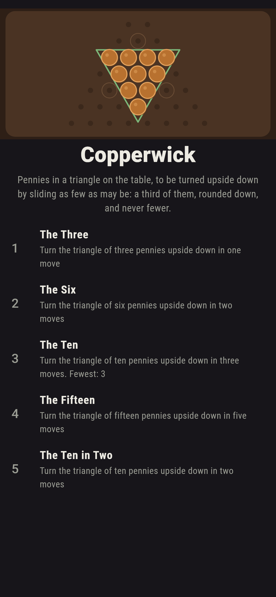
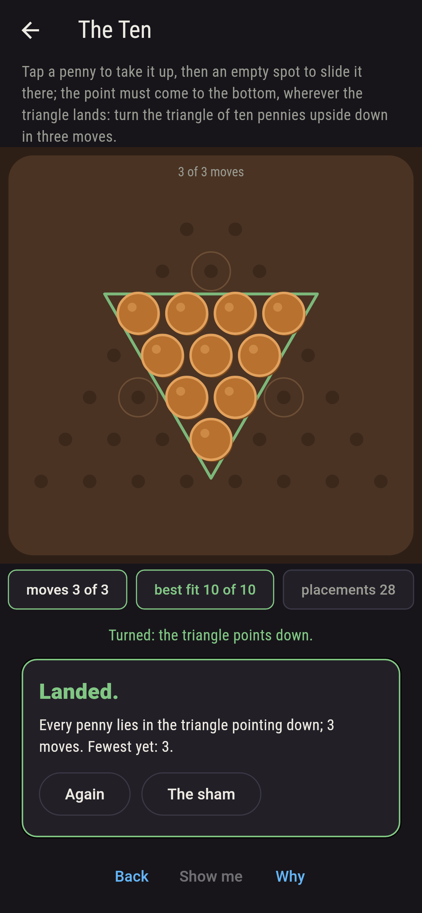
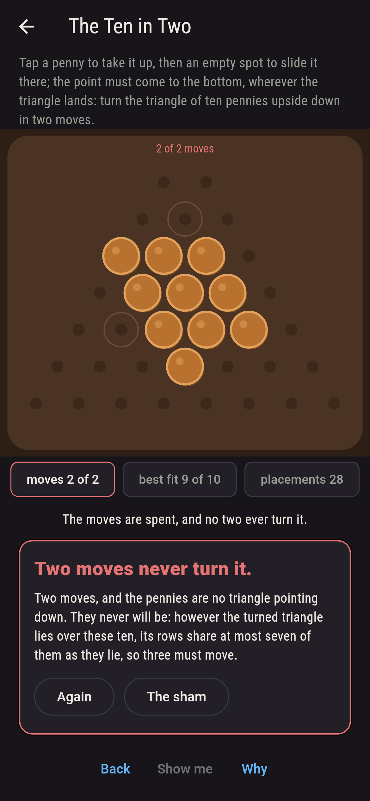
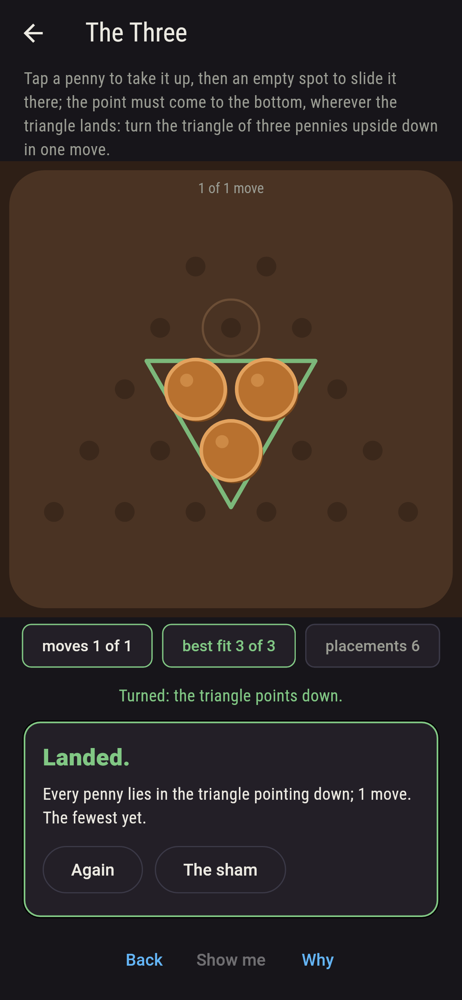
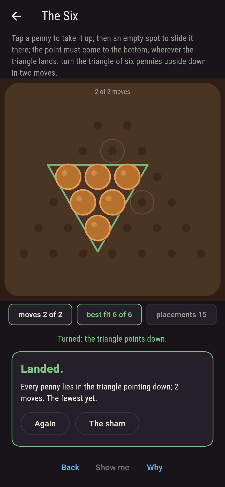
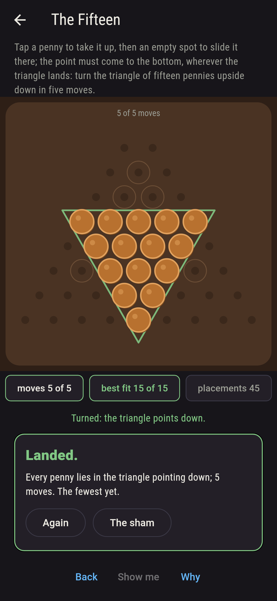
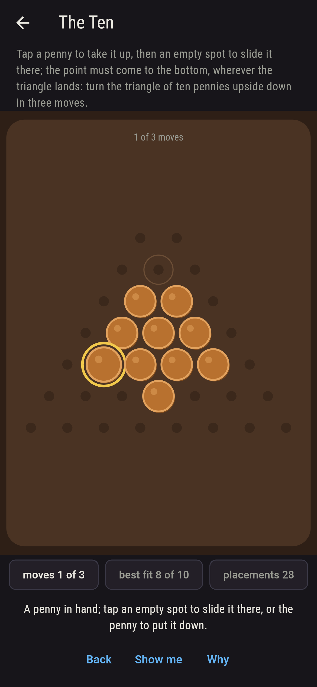
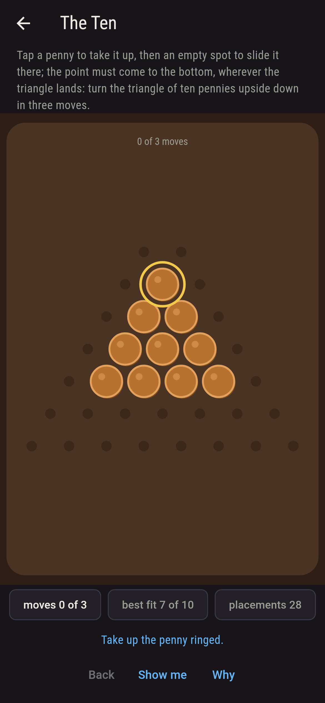
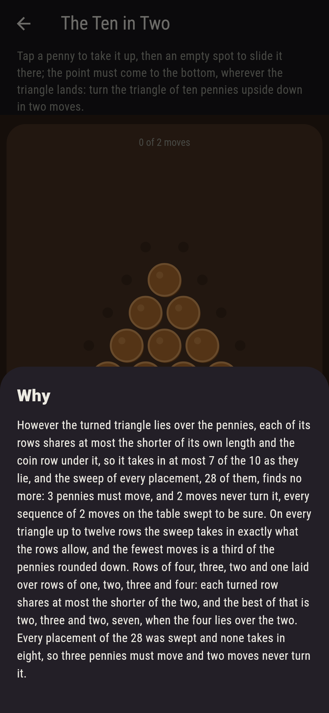

# Copperwick


Pennies laid in a triangle on the table, one atop two atop three
atop four, and the puzzle is the old one: turn the triangle upside
down by sliding as few pennies as may be, to any empty spot on the
table. Tap a penny to take it up, tap a spot to slide it there; the
triangle may land anywhere so long as its point comes to the
bottom. Ten pennies turn in three moves, the top penny down under
the bottom row and the two bottom corners up beside the second, and
never in two: however the turned triangle lies over the pennies,
each of its rows shares at most the shorter of its own length and
the coin row under it, so it takes in at most seven of the ten as
they lie, and three must move. In general the fewest is a third of
the pennies rounded down; the sweep here tries every placement of
the turned triangle over every triangle up to twelve rows, and on
the small tables every sequence of moves as well.

## The triangles

1. **The Three** - turn the triangle of three pennies upside down in one move
2. **The Six** - turn the triangle of six pennies upside down in two moves
3. **The Ten** - turn the triangle of ten pennies upside down in three moves
4. **The Fifteen** - turn the triangle of fifteen pennies upside down in five moves
5. **The Ten in Two** - turn the triangle of ten pennies upside down in two moves

The three turn by three placements of six, one for each penny that
could be the one to move; the six by three of fifteen, one for each
corner left where it lies; the ten by one placement alone of 28,
the turned triangle whose middle is the upright's own; the fifteen
by three of 45, the turned triangle two rows lower. The Ten in Two
is labeled hopeless on its tile, and the why counts the rows.

## Two voices

The game never asserts what it has not computed, and it computes
everything at least twice:

* **The sweep** lays the turned triangle over the pennies every way
  it can lie and counts how many it takes in as they lie, the rest
  being the pennies that must move; on the three, the six and the
  ten it also plays every sequence of moves on the table, a penny
  to an empty spot each, and counts the sequences that end on a
  turned triangle, which come to the placements times the moved
  pennies and their spots in every order, and one move fewer never
  lands.
* **The rows** need no sweep: each row of the turned triangle shares
  at most the shorter of its own length and the coin row under it,
  and the best of that over the row it points at is what the sweep
  finds, on every triangle up to twelve rows; and the fewest moves
  that leaves is a third of the pennies rounded down every time.

`tool/check_turnings.dart` runs the lot and refuses the bake on any
disagreement.

## The checker's ledger

What `dart run tool/check_turnings.dart` printed for the build this
README shipped with, word for word:

```
every placement of the turned triangle over the pennies swept for every triangle up to twelve rows, 1,222 placements: the most any takes in as they lie is exactly what the rows allow, the shorter of each turned row and the coin row under it, so the fewest moves is a third of the pennies rounded down, on all twelve; every sequence of moves on the table swept for the three, the six and the ten, 3 of 51 sequences of one move landing, 12 of 15,876 of two and 36 of 15,625,000 of three, the moved pennies and their spots in every order, and one move fewer landing none; the three turn in one move by 3 placements of 6, the six in two by 3 of 15, the ten in three by 1 of 28, the fifteen in five by 3 of 45, and the ten in two by none of 28

 1 The Three      turn the triangle of three pennies upside down in one move: 3 of the 6 placements are within reach
 2 The Six        turn the triangle of six pennies upside down in two moves: 3 of the 15 placements are within reach
 3 The Ten        turn the triangle of ten pennies upside down in three moves: 1 of the 28 placements is within reach
 4 The Fifteen    turn the triangle of fifteen pennies upside down in five moves: 3 of the 45 placements are within reach
 5 The Ten in Two turn the triangle of ten pennies upside down in two moves: none of the 28, and the rows said so first
```

## Screenshots

| The sham | The ten turned | The ten in two admitted |
| --- | --- | --- |
|  |  |  |

| The three | The six | The fifteen | Mid-turn | Show me | The why |
| --- | --- | --- | --- | --- | --- |
|  |  |  |  |  |  |

Screenshots are drawn by `test/showcase_test.dart` at real phone
sizes with the app's own painter, then copied into `docs/` as they
came out; every penny in them was slid by taps, so nothing pictured
is a table the game could not reach. The logo and every launcher
icon come out of `test/mark_test.dart` the same way: the mark is
the ten turned in three, the point at the bottom and the ghost of
the upright behind.

## Building

```
flutter test          # 46 tests, the sweep among them
dart run tool/check_turnings.dart
flutter build apk     # or: flutter build ios
```
