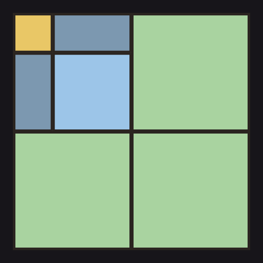
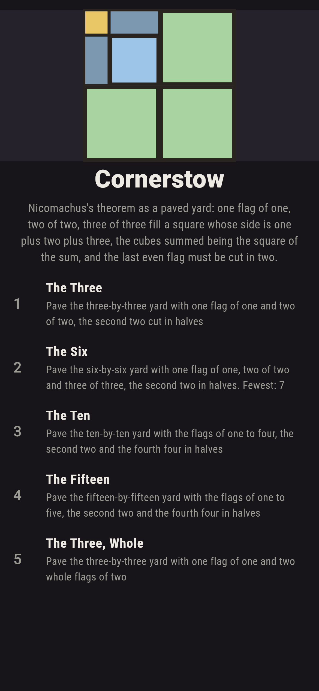
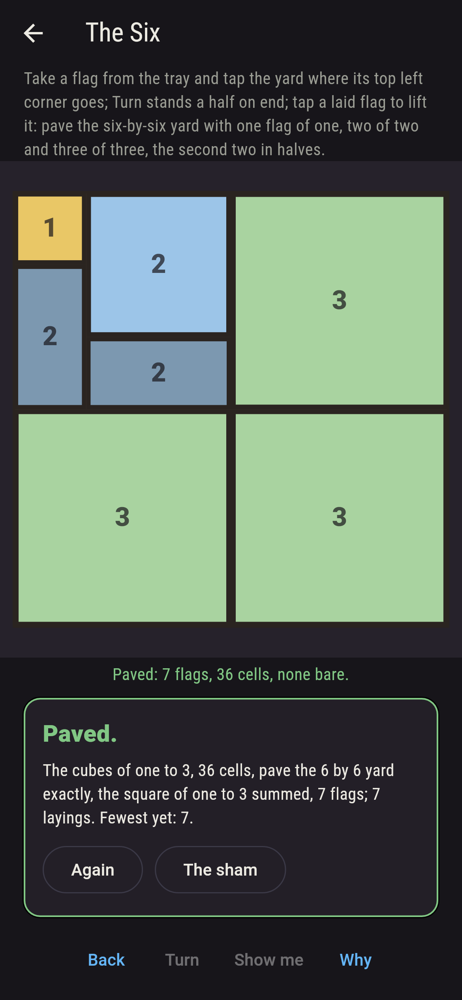
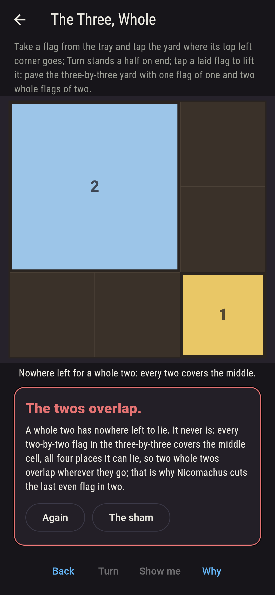
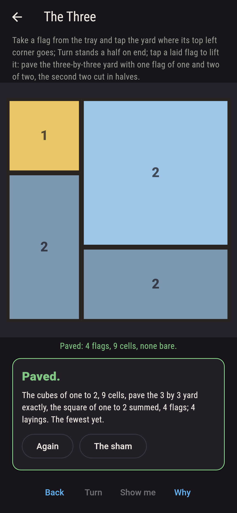
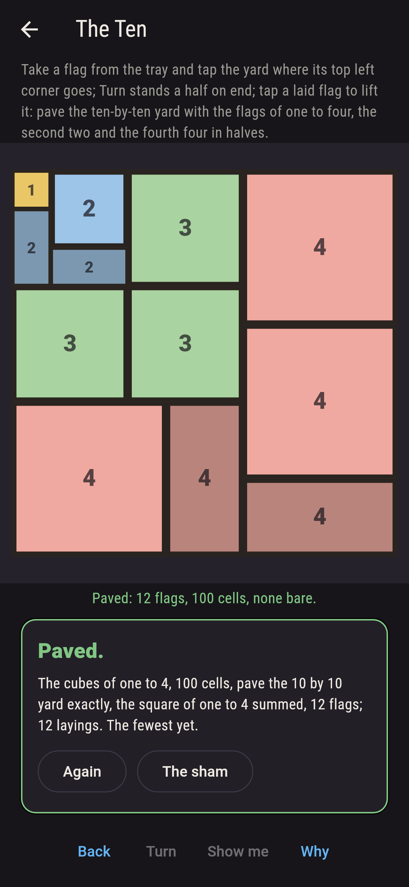
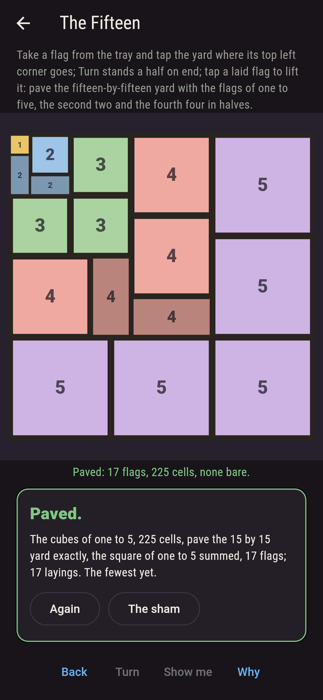
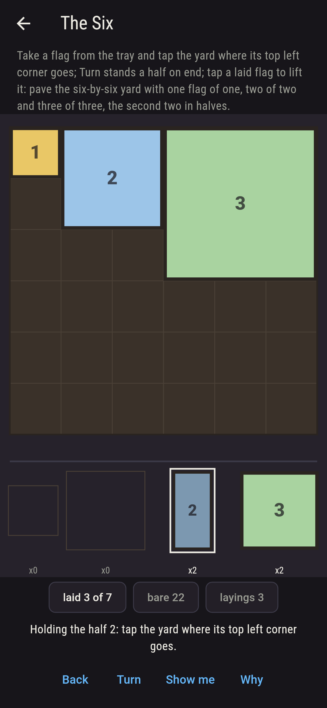
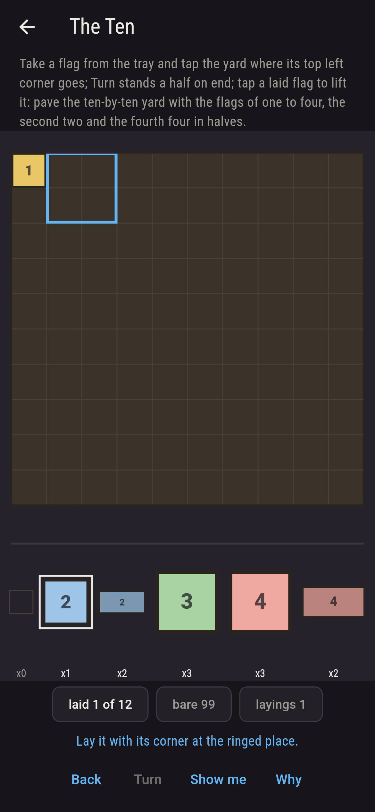
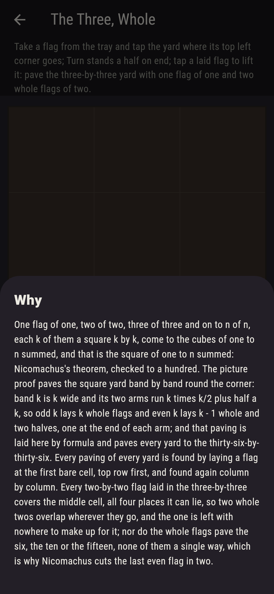

# Cornerstow



Nicomachus's theorem as a paved yard. One flag of one, two of two,
three of three and on to n of n, each k of them a square k by k,
come to the cubes of one to n summed, and that is the square of
one to n summed, which is why they pave a square yard whose side is
one plus two plus three and on. The picture proof lays them band
by band round the corner: band k is k wide, and its two arms run k
times k/2 plus half a k, so odd k lays k whole flags and even k
lays k - 1 whole and two halves, one at the end of each arm; the
last even flag must be cut, and the whole flags never pave. Take a
flag from the tray and tap the yard where its top left corner goes,
Turn stands a half on end, and a tap on a laid flag lifts it. Every
paving of every yard is found by laying a flag at the first bare
cell, top row first, and found again column by column, and
Nicomachus's own paving is laid by formula and paves every yard to
the thirty-six-by-thirty-six.

## The yards

1. **The Three** - pave the three-by-three yard with one flag of one and two of two, the second two cut in halves
2. **The Six** - pave the six-by-six yard with one flag of one, two of two and three of three, the second two in halves
3. **The Ten** - pave the ten-by-ten yard with the flags of one to four, the second two and the fourth four in halves
4. **The Fifteen** - pave the fifteen-by-fifteen yard with the flags of one to five, the second two and the fourth four in halves
5. **The Three, Whole** - pave the three-by-three yard with one flag of one and two whole flags of two

The three-by-three is paved twelve ways, the six-by-six eighty,
the ten-by-ten 6,892 and the fifteen-by-fifteen 51,536, seventeen
flags; the whole flags, no halves, pave none of the four yards a
single way. The Three, Whole is labeled hopeless on its tile, and
the why fits in a line: every two-by-two flag in the three-by-three
covers the middle cell, all four places it can lie, so two whole
twos overlap wherever they go.

## Two voices

The game never asserts what it has not computed, and it computes
everything at least twice:

* **The search** lays a flag at the first bare cell, top row first
  and left to right, the halves either way up, and finds every
  paving of every yard once; then it does it all again column by
  column, and the two agree, yard by yard. Every count on the sham
  is the search's, and it finds the whole flags paving nothing.
* **Nicomachus's paving and the sum** search nothing: the cubes of
  one to n are summed and held to the square of the sum, to a
  hundred; the flags of every yard are counted in cells and held to
  the yard's; and the paving band by band round the corner, with the
  halves at the ends of the even bands, is laid by formula for every
  yard to eight and checked to pave, every cell once, with exactly
  the flags.

`tool/check_yards.dart` runs the lot and refuses the bake on any
disagreement.

## The checker's ledger

What `dart run tool/check_yards.dart` printed for the build this
README shipped with, word for word:

```
the cubes of one to n summed against the square of one to n summed, equal to a hundred; every paving of every yard found by laying a flag at the first bare cell, top row first, and found again column by column, the flags one of one, two of two, three of three and on, the last even flag cut in halves: the three-by-three is paved 12 ways, the six-by-six 80, the ten-by-ten 6,892 and the fifteen-by-fifteen 51,536; Nicomachus's own paving, band by band round the corner with the halves at the ends of the even bands, laid by formula and paving every yard to the thirty-six-by-thirty-six with exactly the flags; and the whole flags, no halves, paving none of the four yards a single way, the three-by-three plainly, since every two-by-two in it covers the middle cell, all 4 places it can lie

 1 The Three        pave the three-by-three yard with one flag of one and two of two, the second two cut in halves: 12 pavings do it
 2 The Six          pave the six-by-six yard with one flag of one, two of two and three of three, the second two in halves: 80 pavings do it
 3 The Ten          pave the ten-by-ten yard with the flags of one to four, the second two and the fourth four in halves: 6,892 pavings do it
 4 The Fifteen      pave the fifteen-by-fifteen yard with the flags of one to five, the second two and the fourth four in halves: 51,536 pavings do it
 5 The Three, Whole pave the three-by-three yard with one flag of one and two whole flags of two: none, and the middle cell said so first
```

## Screenshots

| The sham | The six | The whole twos admitted |
| --- | --- | --- |
|  |  |  |

| The three | The ten | The fifteen | Mid-paving | Show me | The why |
| --- | --- | --- | --- | --- | --- |
|  |  |  |  |  |  |

Screenshots are drawn by `test/showcase_test.dart` at real phone
sizes with the app's own painter, then copied into `docs/` as they
came out; every flag in them was laid by a tap, so nothing pictured
is a yard the game could not reach. The logo and every launcher
icon come out of `test/mark_test.dart` the same way: the mark is
Nicomachus's own paving of the six-by-six, band by band round the
corner.

## Building

```
flutter test          # 50 tests, the search among them
dart run tool/check_yards.dart
flutter build apk     # or: flutter build ios
```
