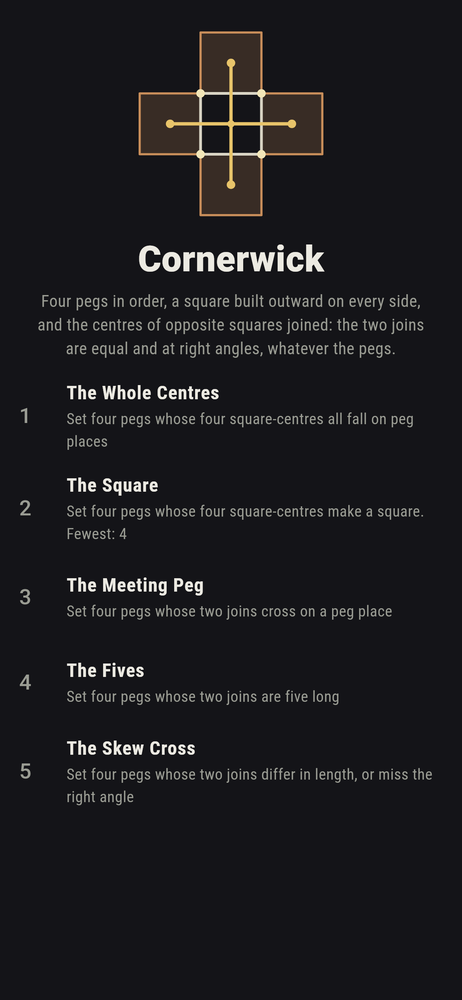
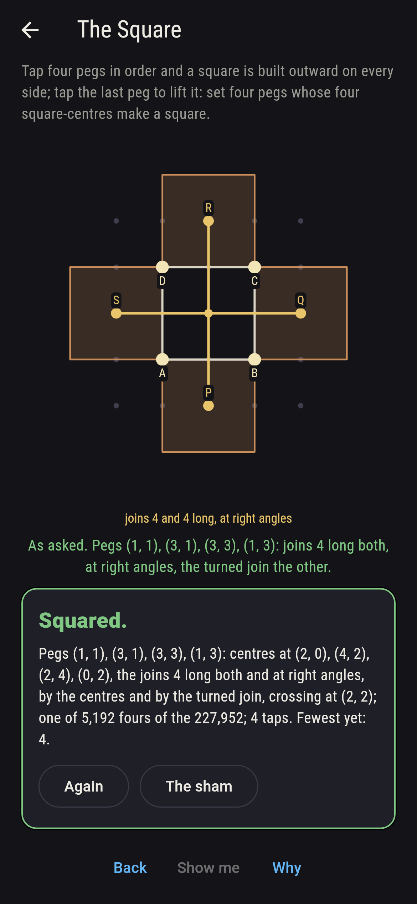
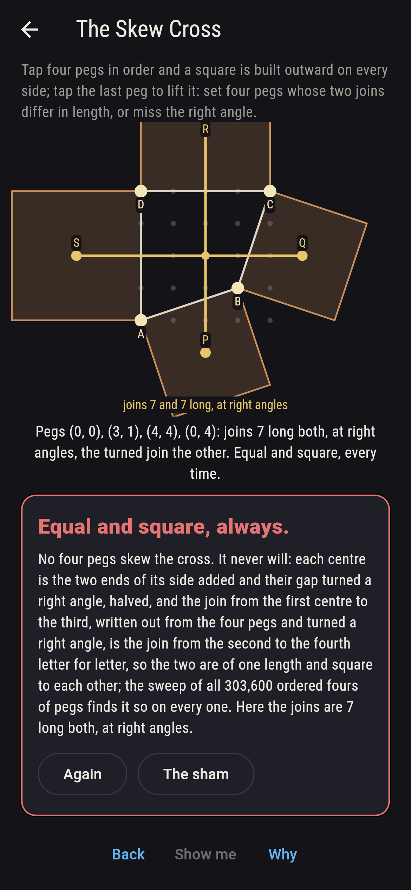
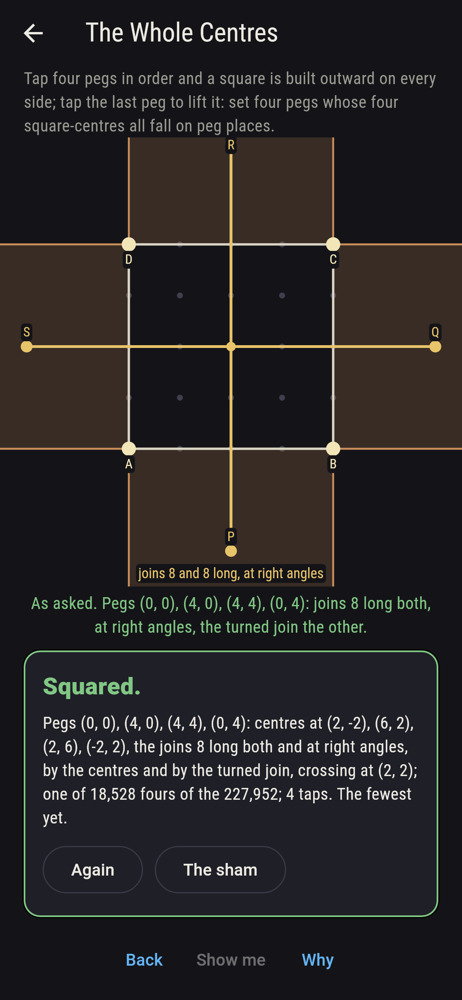
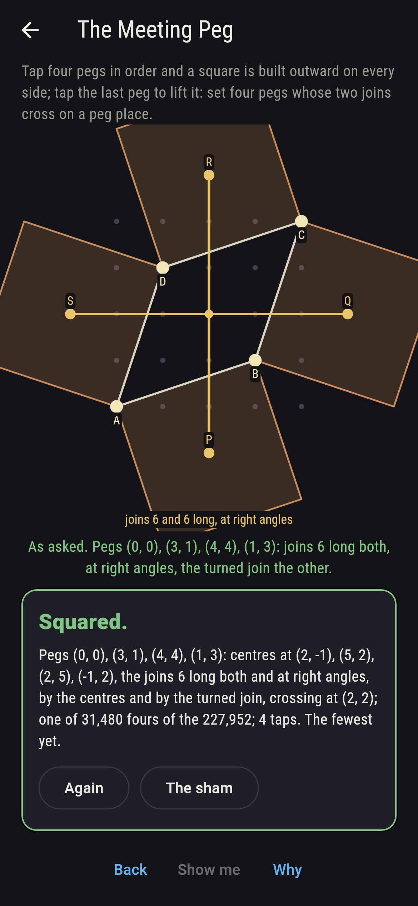
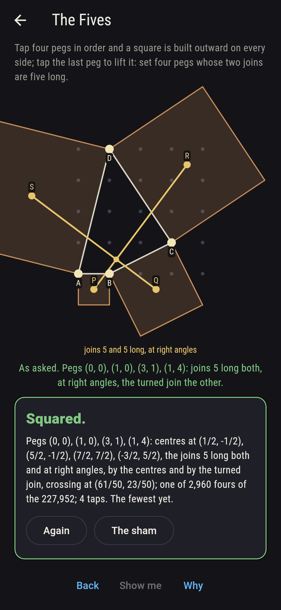
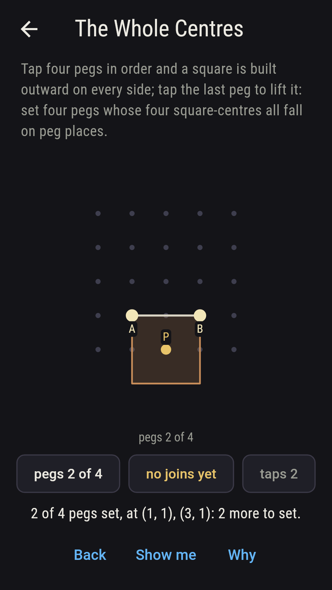
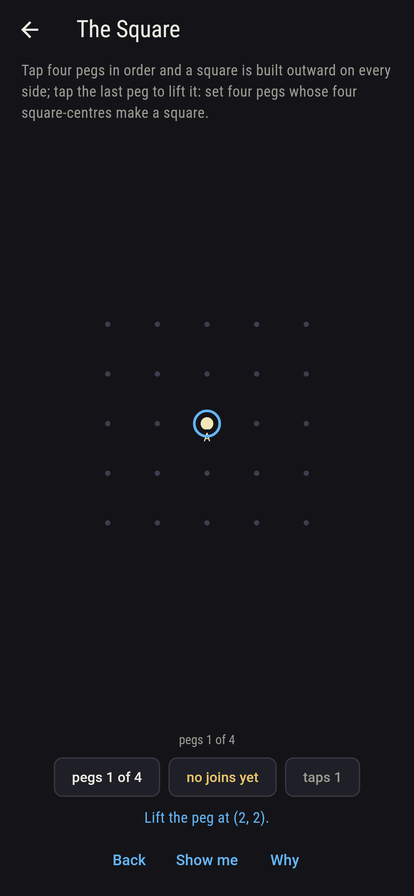
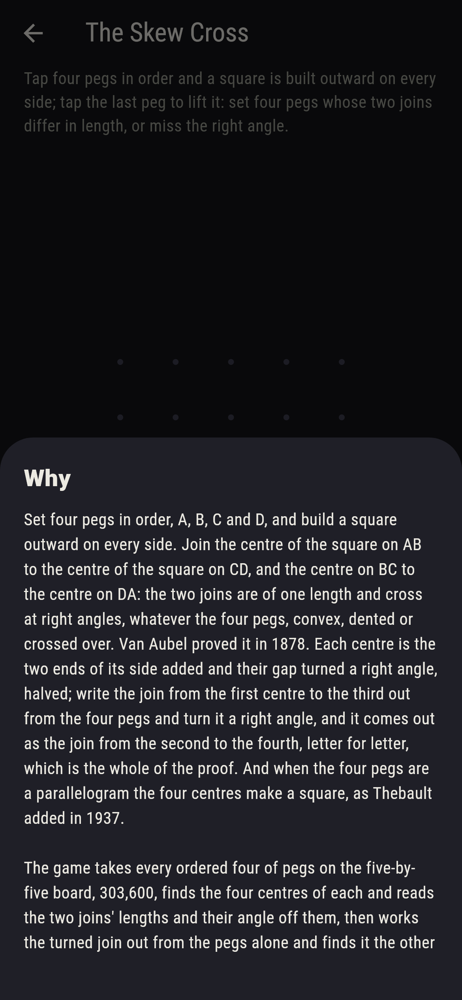

# Cornerwick


Set four pegs in order, A, B, C and D, and build a square outward on
every side. Join the centre of the square on AB to the centre of the
square on CD, and the centre on BC to the centre on DA: the two
joins are of one length and cross at right angles, whatever the four
pegs, convex, dented or crossed over. Van Aubel proved it in 1878.
Each centre is the two ends of its side added and their gap turned a
right angle, halved; write the join from the first centre to the
third out from the four pegs and turn it a right angle, and it comes
out as the join from the second to the fourth, letter for letter,
which is the whole of the proof. And when the four pegs are a
parallelogram the four centres make a square, as Thebault added in
1937. Tap four pegs in order and the squares are built; tap the last
peg to lift it. The game takes every ordered four of pegs on the
five-by-five board, 303,600, finds the four centres of each and
reads the two joins' lengths and their angle off them, then works
the turned join out from the pegs alone and finds it the other join
on every four; on the 227,952 fours with no three pegs in a line it
counts the asks, and the joins are equal and square on every one of
the 303,600.

## The asks

1. **The Whole Centres** - set four pegs whose four square-centres all fall on peg places
2. **The Square** - set four pegs whose four square-centres make a square
3. **The Meeting Peg** - set four pegs whose two joins cross on a peg place
4. **The Fives** - set four pegs whose two joins are five long
5. **The Skew Cross** - set four pegs whose two joins differ in length, or miss the right angle

A square's centre sits half a side along and half a side out from
the side's middle, so it falls on a peg place exactly when the side
runs an even count across and an even count up, or an odd and an
odd; 18,528 of the 227,952 fours put all four centres on peg places,
and the pegs (1, 1), (3, 1), (3, 3), (1, 3) put them at (2, 0), (4,
2), (2, 4) and (0, 2), the joins four long and crossing at (2, 2).
The four centres make a square exactly when the four pegs are a
parallelogram: 5,192 fours do it, and a square walked the wrong way
round, clockwise, folds its four squares inward and drops all four
centres in one place, 200 fours of the 303,600. The joins cross on a
peg place for 31,480 fours, the parallelogram (0, 0), (3, 1), (4, 4),
(1, 3) among them, its joins six long crossing at (2, 2). The joins
are five long on 2,960 fours; the commonest length is the root of
two and a half, on 24,320, and 42 lengths come in all, from nought,
on 3,832 fours whose opposite centres fall together, up to eight on
the square of the whole board. The Skew Cross is labeled hopeless on
its tile: the turned join said so first, and the sweep finds the two
joins equal and square on every four; the sham admits it after three
fours have shown their joins, or after twenty taps.

## Two voices

The game never asserts what it has not computed, and it computes
everything at least twice:

* **The centres** are found one square at a time, the two ends of a
  side added and their gap turned a right angle, halved, and the two
  joins read off them for length and angle; every length and every
  crossing on the sham is that reading's, and it counts the centres
  on peg places, the squares of centres and the crossings on peg
  places.
* **The turned join** finds no centre and reads no length: it works
  the join from the first centre to the third out from the four pegs
  as one sum, turns it a right angle, and finds it the join from the
  second centre to the fourth exactly, letter for letter, on every
  one of the 303,600 fours, which is why the joins are equal and
  square; and every crossing the centres find is checked to lie on
  both joins.

`tool/check_squares.dart` runs the lot and refuses the bake on any
disagreement.

## The checker's ledger

What `dart run tool/check_squares.dart` printed for the build this
README shipped with, word for word:

```
every ordered four of pegs on the five-by-five board taken, 303,600, the four centres of the squares on its sides found and the two joins of opposite centres read for length and angle, and the first join turned a right angle worked out from the four pegs alone and found to be the second join, on all 303,600: the two joins are of one length and at right angles on every four, and their crossing lies on both wherever they cross; 227,952 fours have no three pegs in a line, and of those 18,528 put all four centres on peg places, 5,192 make a square of the centres, every one a parallelogram and every parallelogram among them making one, 31,480 cross the joins on a peg place and 2,960 have joins five long, the joins taking 42 lengths in all, root 5/2 the commonest on 24,320, from nought, on 3,832 fours whose opposite centres fall together, up to eight on the boardwide square; the pegs (1, 1), (3, 1), (3, 3), (1, 3) put the centres at (2, 0), (4, 2), (2, 4) and (0, 2), joins four long crossing at (2, 2), and a square walked clockwise drops all four centres in one place, 200 fours

 1 The Whole Centres set four pegs whose four square-centres all fall on peg places: 18,528 of the 227,952 fours land it
 2 The Square        set four pegs whose four square-centres make a square: 5,192 of the 227,952 fours land it
 3 The Meeting Peg   set four pegs whose two joins cross on a peg place: 31,480 of the 227,952 fours land it
 4 The Fives         set four pegs whose two joins are five long: 2,960 of the 227,952 fours land it
 5 The Skew Cross    set four pegs whose two joins differ in length, or miss the right angle: none of the 227,952, and the turned join said so first
```

## Screenshots

| The sham | The square | The skew cross admitted |
| --- | --- | --- |
|  |  |  |

| The whole centres | The meeting peg | The fives | Midway, on the small phone | Show me | The why |
| --- | --- | --- | --- | --- | --- |
|  |  |  |  |  |  |

Screenshots are drawn by `test/showcase_test.dart` at real phone
sizes with the app's own painter, then copied into `docs/` as they
came out; every peg in them was set by a tap, so nothing pictured is
a four the game could not reach. The logo and every launcher icon
come out of `test/mark_test.dart` the same way: the mark is the
square of pegs (1, 1), (3, 1), (3, 3), (1, 3), its four squares
built outward, and the two joins crossing at the middle.

## Building

```
flutter test          # 44 tests, the sweep among them
dart run tool/check_squares.dart
flutter build apk     # or: flutter build ios
```
