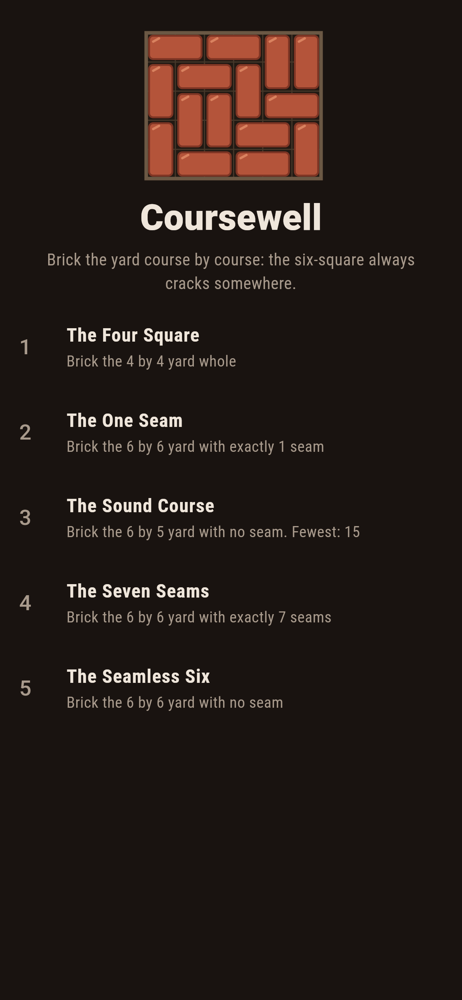
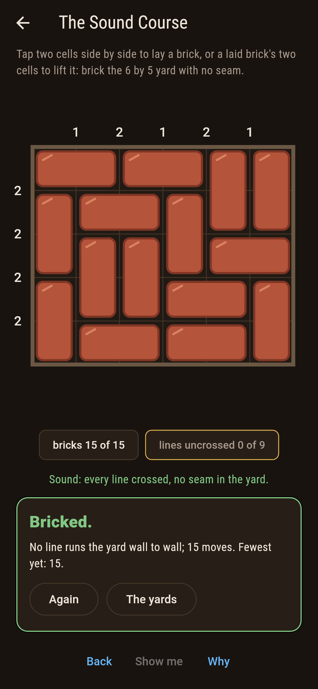
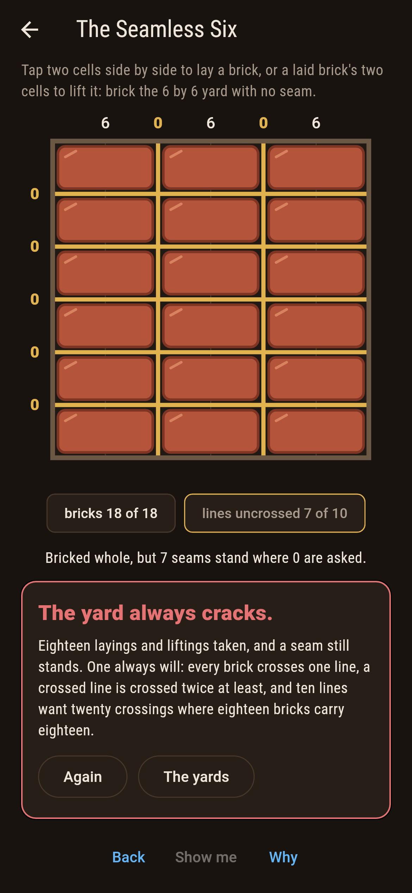
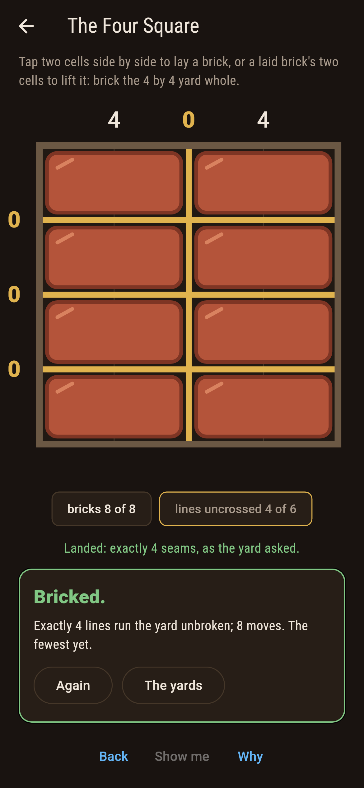
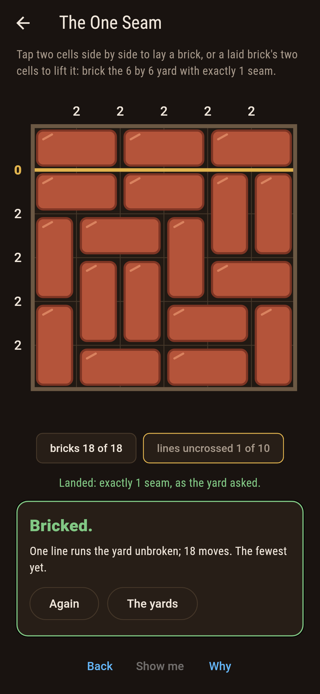
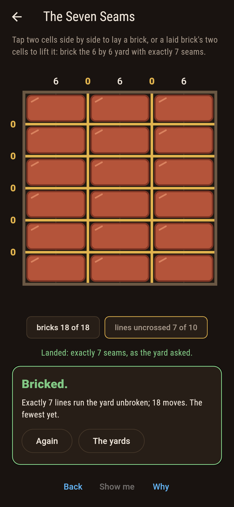
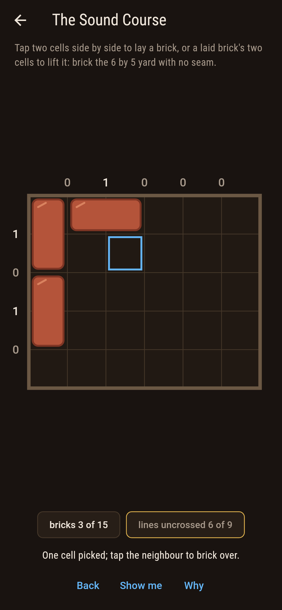
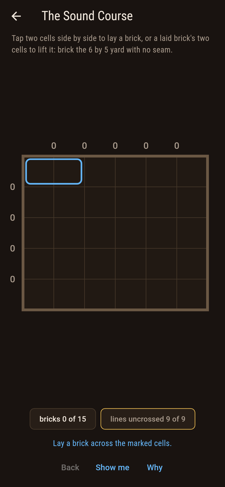
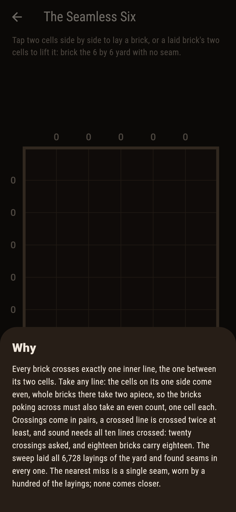

# Coursewell


A yard of cells, bricked two at a time. A seam is an inner line
no brick crosses, running wall to wall; a laying with none is
sound. Five by six lays sound exactly six ways. The six-by-six
never does, and the reason fits on a thumb: every brick crosses
exactly one line, every line needs crossing twice, and ten lines
times two is more than eighteen bricks.

## The yards

1. **The Four Square** - brick the 4 by 4 yard whole, any laying at all
2. **The One Seam** - brick the 6 by 6 yard with exactly 1 seam
3. **The Sound Course** - brick the 6 by 5 yard with no seam
4. **The Seven Seams** - brick the 6 by 6 yard with exactly 7 seams
5. **The Seamless Six** - brick the 6 by 6 yard with no seam

The Four Square bricks 36 ways and every one of them carries at
least two seams. The One Seam is as close to sound as the
six-square comes, a hundred of its 6,728 layings. The Sound
Course is the smallest yard two cells wide both ways that lays
sound at all, and the two layings of The Seven Seams are the
plain stacks, every brick lying one way. The Seamless Six is
labeled hopeless on its tile, and the why hands over the
counting.

## Two voices

The game never asserts what it has not computed, and it computes
everything at least twice:

* **The census** reads seams straight off a laying, inner line
  by inner line, and the screen wears it live: every line's
  crossing count sits on the wall, and nought is a seam.
* **The sweep** lays every laying of every yard, 36 and 1,183
  and 6,728 of them, counts each one's seams, and holds every
  crossing count even, since bricks on one side of a line must
  pair off.

`tool/check_courses.dart` runs both, sweeps every smaller yard
for the smallest-sound claim, and refuses the bake on any
disagreement.

## The checker's ledger

What `dart run tool/check_courses.dart` printed for the build
this README shipped with, word for word:

```
every laying of every yard swept, 36 and 1,183 and 6,728 of them: every inner line of the six-square is crossed by an even count of bricks, so a sound laying would need twenty crossings from eighteen bricks and gets none, while five by six lays sound exactly six ways, no smaller yard two cells wide both ways lays sound at all, and the two plain stacks alone wear seven seams

 1 The Four Square    brick the 4 by 4 yard whole: 36 layings of the sweep land it
 2 The One Seam       brick the 6 by 6 yard with exactly 1 seam: 100 layings of the sweep land it
 3 The Sound Course   brick the 6 by 5 yard with no seam: 6 layings of the sweep land it
 4 The Seven Seams    brick the 6 by 6 yard with exactly 7 seams: 2 layings of the sweep land it
 5 The Seamless Six   brick the 6 by 6 yard with no seam: none of the 6,728, and the crossing count said so first
```

## Screenshots

| The yardland | The sound course | The six-square cracked |
| --- | --- | --- |
|  |  |  |

| The four square | The one seam | The seven seams | Mid-course | Show me | The why |
| --- | --- | --- | --- | --- | --- |
|  |  |  |  |  |  |

Screenshots are drawn by `test/showcase_test.dart` at real phone
sizes with the app's own painter, then copied into `docs/` as
they came out; every brick in them was tapped, so nothing
pictured is a laying the game could not reach. The logo and
every launcher icon come out of `test/mark_test.dart` the same
way: the mark is the sound course itself.

## Building

```
flutter test          # 51 tests, the sweep among them
dart run tool/check_courses.dart
flutter build apk     # or: flutter build ios
```
