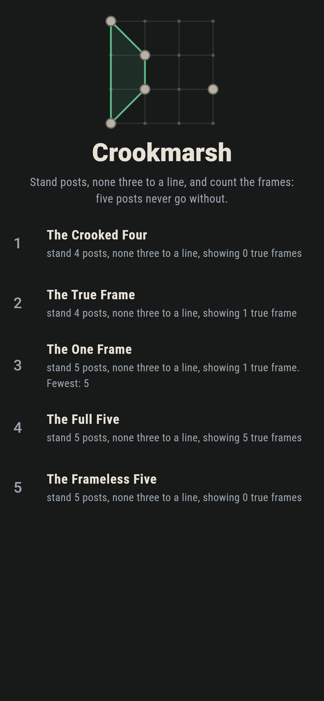
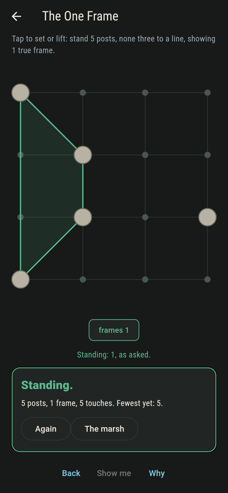
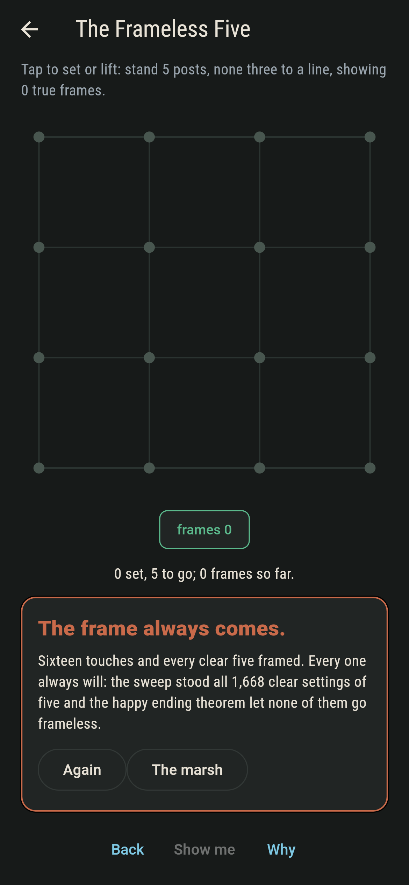
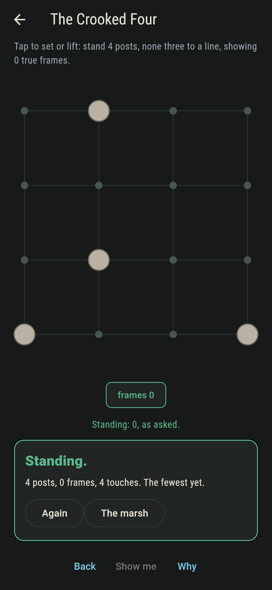
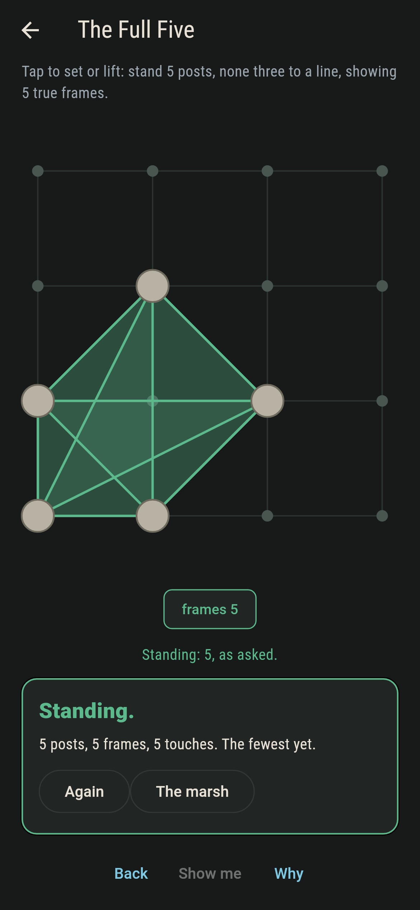
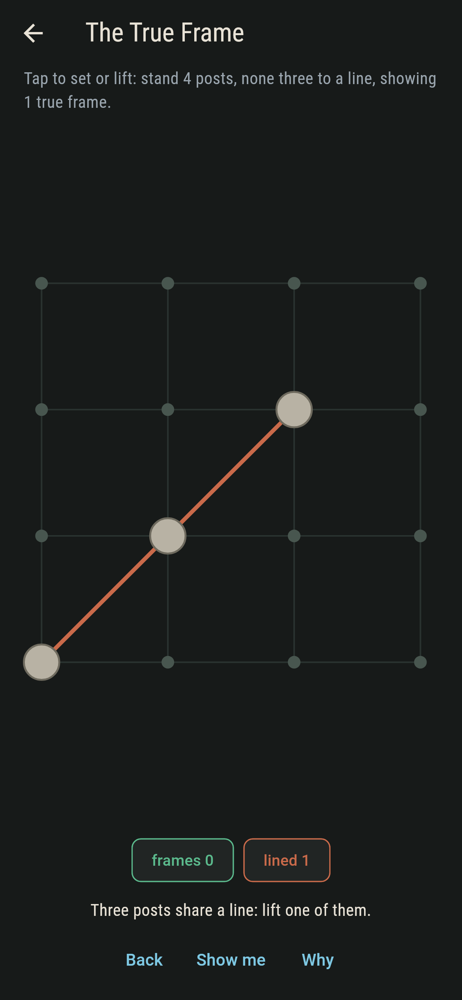
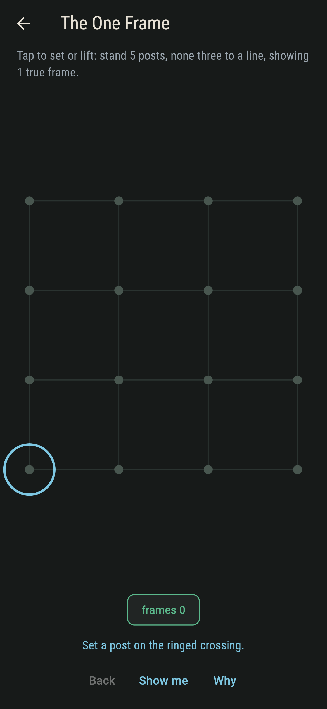
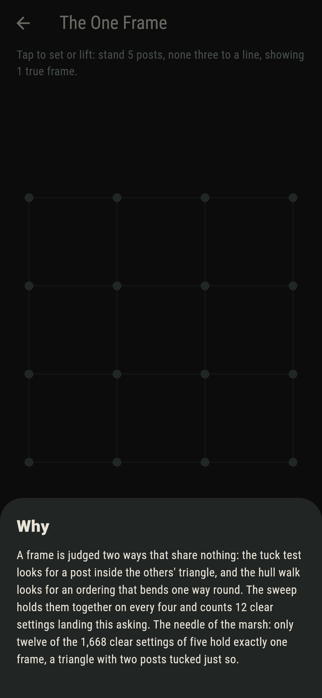

# Crookmarsh


Posts stand on the crossings of a marsh, never three to a line. A
frame is four posts standing true: each outside the others'
triangle, cornering a quadrilateral with nothing tucked inside.
Set the asked number of frames, and mind the law underneath: five
posts, none three to a line, always hold a frame. That is the
happy ending theorem, and the marsh never forgets it.

## The marshes

1. **The Crooked Four** - stand 4 posts, none three to a line, showing 0 true frames
2. **The True Frame** - stand 4 posts, none three to a line, showing 1 true frame
3. **The One Frame** - stand 5 posts, none three to a line, showing 1 true frame
4. **The Full Five** - stand 5 posts, none three to a line, showing 5 true frames
5. **The Frameless Five** - stand 5 posts, none three to a line, showing 0 true frames

The One Frame is the needle: twelve of the 1,668 clear settings
of five. The sweep also found something it was not asked for:
frames from five posts come one, three, or five, never an even
count. The Frameless Five asks for none, and no clear five has
ever gone without.

## Two voices

The game never asserts what it has not computed, and it computes
everything twice:

* **The tuck test** asks whether some post sits inside the
  others' triangle, by integer cross products.
* **The hull walk** asks whether the four can be ordered so every
  turn bends the same way round.

The sweep stands every setting of the marsh, 1,278 clear fours
and 1,668 clear fives, holds the two tests together on every
four, and checks the happy ending on every five.
`tool/check_marshes.dart` runs the lot and refuses the bake on
any disagreement.

## The checker's ledger

What `dart run tool/check_marshes.dart` printed for the build
this README shipped with, word for word:

```
every setting of the marsh swept, 1,278 clear fours and 1,668 clear fives: the tuck test and the hull walk agree on every four there is, every clear five holds one, three or five frames and never none, and the counts split 240 crooked to 1,038 true, then 12, 808 and 848

 1 The Crooked Four     stand 4 posts, none three to a line, showing 0 true frames: 240 settings of the sweep land it
 2 The True Frame       stand 4 posts, none three to a line, showing 1 true frame: 1,038 settings of the sweep land it
 3 The One Frame        stand 5 posts, none three to a line, showing 1 true frame: 12 settings of the sweep land it
 4 The Full Five        stand 5 posts, none three to a line, showing 5 true frames: 848 settings of the sweep land it
 5 The Frameless Five   stand 5 posts, none three to a line, showing 0 true frames: none of the 1,668, which is the happy ending theorem doing its work
```

## Screenshots

| The marshland | The one frame | The frameless five admitted |
| --- | --- | --- |
|  |  |  |

| The crooked four | The full five | A shared line | Show me | The why |
| --- | --- | --- | --- | --- |
|  |  |  |  |  |

Screenshots are drawn by `test/showcase_test.dart` at real phone
sizes with the app's own painter, then copied into `docs/` as
they came out; every post in them was tapped, so nothing pictured
is a marsh the game could not reach. The logo and every launcher
icon come out of `test/mark_test.dart` the same way: the mark is
the one frame standing.

## Building

```
flutter test          # 46 tests, the sweep among them
dart run tool/check_marshes.dart
flutter build apk     # or: flutter build ios
```
