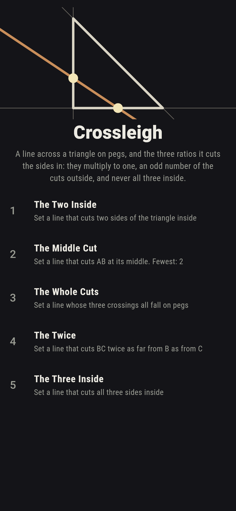
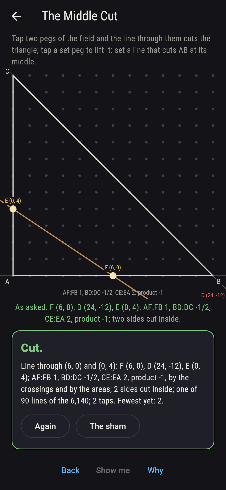
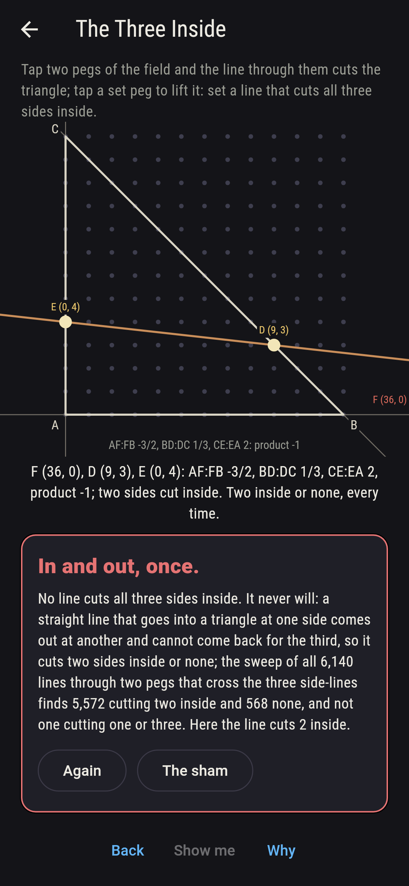
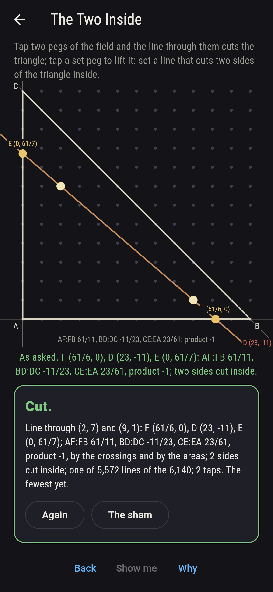
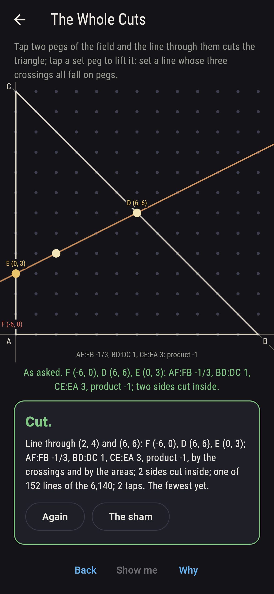
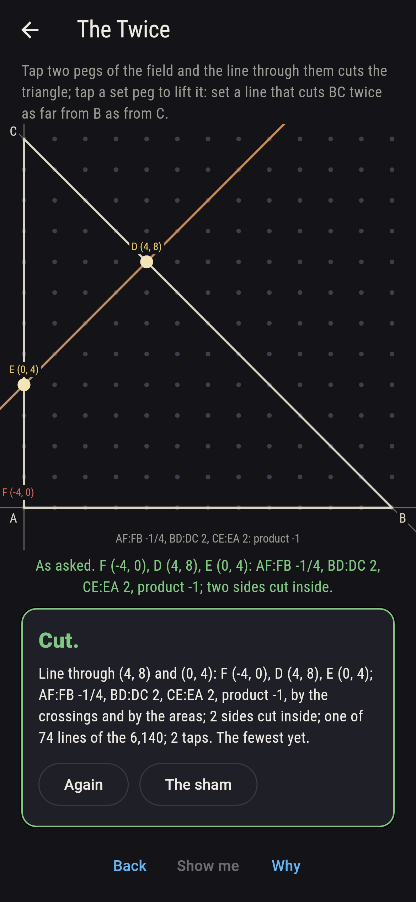
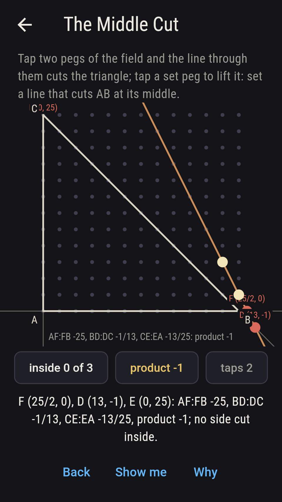
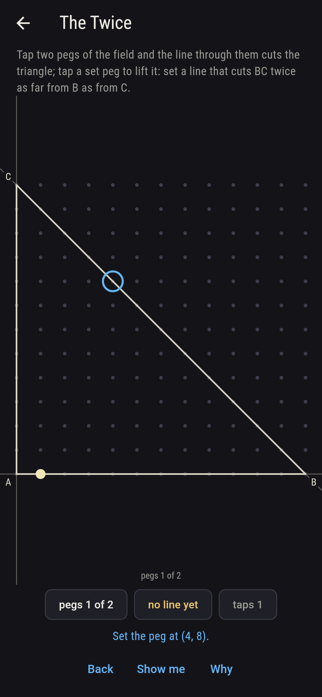
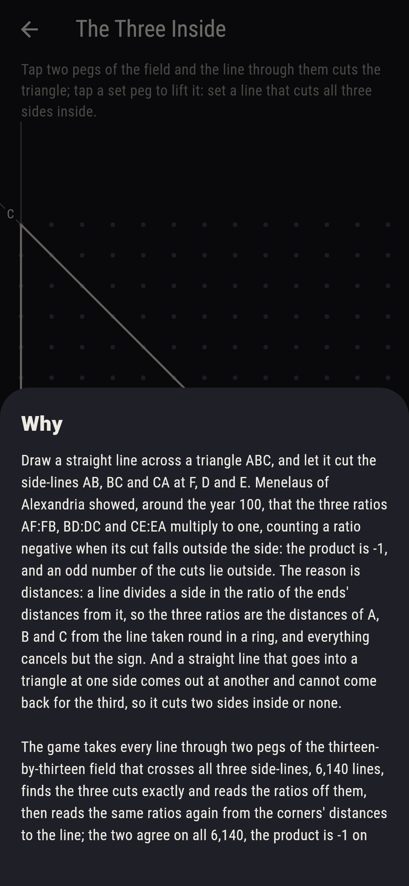

# Crossleigh


Draw a straight line across a triangle ABC, and let it cut the
side-lines AB, BC and CA at F, D and E. Menelaus of Alexandria
showed, around the year 100, that the three ratios AF:FB, BD:DC and
CE:EA multiply to one, counting a ratio negative when its cut falls
outside the side: the product is -1, and an odd number of the cuts
lie outside. The reason is distances: a line divides a side in the
ratio of the ends' distances from it, so the three ratios are the
distances of A, B and C from the line taken round in a ring, and
everything cancels but the sign. And a straight line that goes into
a triangle at one side comes out at another and cannot come back for
the third, so it cuts two sides inside or none. Tap two pegs of the
field and the line through them cuts the triangle. The game takes
every line through two pegs of the thirteen-by-thirteen field that
crosses all three side-lines, 6,140 lines, finds the three cuts
exactly and reads the ratios off them, then reads the same ratios
again from the corners' distances to the line; the two agree on all
6,140, the product is -1 on every one, and every line cuts two sides
inside or none.

## The asks

1. **The Two Inside** - set a line that cuts two sides of the triangle inside
2. **The Middle Cut** - set a line that cuts AB at its middle
3. **The Whole Cuts** - set a line whose three crossings all fall on pegs
4. **The Twice** - set a line that cuts BC twice as far from B as from C
5. **The Three Inside** - set a line that cuts all three sides inside

Of the 6,460 lines through two pegs, 6,140 cross all three
side-lines, and 5,572 of those cut two sides inside and 568 none;
the first, through (1, 0) and (2, 1), has ratios 1/11, 11/13 and
-13. Ninety lines cut AB at its middle, all with one more side cut
inside, so that BD:DC and CE:EA are each other's negatives turned
over, -1/2 and 2 through (6, 0) and (0, 4). A hundred and fifty-two
lines cut the three side-lines at pegs, and through (2, 4) and (6, 6)
the cuts are (-6, 0), (6, 6) and (0, 3), the ratios -1/3, 1 and 3.
Seventy-four lines cut BC at (4, 8), twice as far from B as from C,
and on every one AF:FB times CE:EA is -1/2. The Three Inside is
labeled hopeless on its tile: in at one side and out at another,
once; the sham admits it after three lines have cut what they cut,
or after twelve taps.

## Two voices

The game never asserts what it has not computed, and it computes
everything at least twice:

* **The crossings** are found exactly, the line met with each
  side-line by the turns of the ends about it, and the ratios read
  off along the sides, AF over FB, BD over DC, CE over EA, negative
  when the cut falls outside; every ratio on the sham is that
  reading's, every crossing is checked to lie on its side-line and on
  the line, and every line to cut two sides inside or none.
* **The areas** meet nothing: the ratio in which a line divides a
  side is minus the ratio of the ends' turns about the line, so the
  three ratios are read off the corners' turns taken round, and they
  agree with the crossings on all 6,140 lines; the product is -1 on
  every one, with an odd count of the ratios negative, which is
  Menelaus in a line.

`tool/check_lines.dart` runs the lot and refuses the bake on any
disagreement.

## The checker's ledger

What `dart run tool/check_lines.dart` printed for the build this
README shipped with, word for word:

```
every line through two pegs of the thirteen-by-thirteen field taken, 6,460 lines, and the 6,140 that cross all three side-lines of the triangle A (0, 0), B (12, 0), C (0, 12), neither parallel to a side nor through a corner, cut it exactly, the three crossings found on their side-lines and on the line, and the ratios AF:FB, BD:DC and CE:EA read off the crossings and again off the corners' distances from the line, the two agreeing on all 6,140, the product -1 on every one with an odd count of the ratios negative; 5,572 lines cut two sides inside and 568 none, not one cutting one or three; 152 cut all three side-lines at pegs, 126 of them two sides inside; 90 cut AB at its middle, all with two inside, 16 of them at pegs throughout; and 74 cut BC twice as far from B as from C, at (4, 8), 78 lines through that peg less the four along the sides' directions, to A and BC itself

 1 The Two Inside   set a line that cuts two sides of the triangle inside: 5,572 of the 6,140 lines land it
 2 The Middle Cut   set a line that cuts AB at its middle: 90 of the 6,140 lines land it
 3 The Whole Cuts   set a line whose three crossings all fall on pegs: 152 of the 6,140 lines land it
 4 The Twice        set a line that cuts BC twice as far from B as from C: 74 of the 6,140 lines land it
 5 The Three Inside set a line that cuts all three sides inside: none of the 6,140, and the way in and out said so first
```

## Screenshots

| The sham | The middle cut | The three inside admitted |
| --- | --- | --- |
|  |  |  |

| The two inside | The whole cuts | The twice | Midway, on the small phone | Show me | The why |
| --- | --- | --- | --- | --- | --- |
|  |  |  |  |  |  |

Screenshots are drawn by `test/showcase_test.dart` at real phone
sizes with the app's own painter, then copied into `docs/` as they
came out; every line in them was set by taps on the field, so
nothing pictured is a line the game could not reach. The logo and
every launcher icon come out of `test/mark_test.dart` the same way:
the mark is the triangle cut by the line through (6, 0) and (0, 4),
the middle of AB and two more cuts, one of them outside.

## Building

```
flutter test          # 45 tests, the sweep among them
dart run tool/check_lines.dart
flutter build apk     # or: flutter build ios
```
